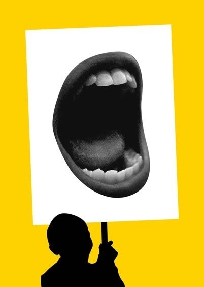
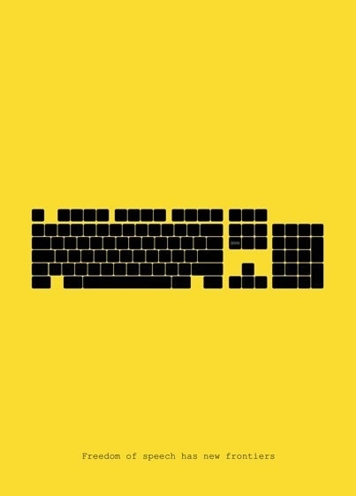
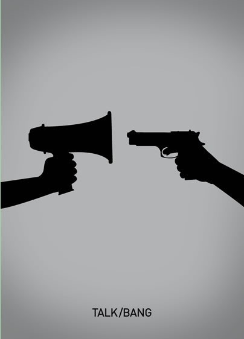
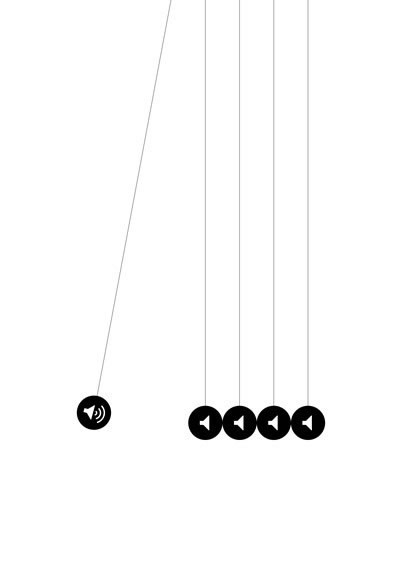

# ＜开阳＞言论自由的绝对性

**我们——多灾多难的中国人，失去自由是多么轻而易举，而失而复得又是多么的艰难不易。“我们确实负有一种伟大的责任，而且现在正是我们重新骄傲地承担起这一责任的时候了。**  

# 言论自由的绝对性

## 文/江帆（华东政法大学）

在人类的历史上，“自由”向来就是一个被阐述了无数次但至今仍是漏洞百出的概念，它似乎永远不会遇上被“过度阐释”的问题。因为它和它的对立面是如此的复杂，以至于我们有时候——甚至是绝大多数时候——难以分清何者为自由，何者为奴役。 在为自由而斗争的过程中，最令专制和极权的统治者感到心惊胆战的，莫过于“言论自由”。所谓“防民之口，甚于防川”，所谓“道路以目”，皆是由于威权阶级对言论自由的控制和限制所造成的。广义的言论自由，包括政治言论自由，商业性言论自由，艺术言论自由，学术言论自由，宗教言论自由等，但狭义的言论自由仅仅指政治言论自由，这也是言论自由的核心和灵魂，是最为重要、关系也最为重大的一种言论自由。 

本文作者认为，言论自由——尤其是政治言论自由，具有绝对性，这同时也意味着（或要求了）宪法和法律对言论自由的保护具有绝对性。 首先，从最朴素的事实层面来看，倘若没有语言，人类将会面临怎样一个黑暗的世界？据一项调查研究显示，人类日常所获取的90%以上的信息都是来自语言，来自交流，来自表达。换句话说，人，天生是一种语言的动物。没有了交流，没有了沟通，人类世界的存在价值就会大打折扣甚至会趋于消灭。 其次，从道德伦理层面来看，“言论自由”即意味着坦诚，意味着真实，意味着一种开放、阳光的社会氛围。倘若极大限制甚至摧毁言论自由，只可能产生两种后果：一、整个社会陷入一种二元分裂的状态，即人们日常所说与心里所想完全成了两个极端不同的世界，“说谎”与“奴役”成为社会的常态，更可怕的是，当这种社会的常态侵袭占据了人们的心灵世界时，这就出现了第二种结果——就像奥威尔笔下的“一九八四”，封闭、自大、盲从和落后。这样一个道德沦丧以至于无道德可言的社会，除了走向自身的灭亡以鉴后世之外，别无他途。 第三，从政治层面来看，言论自由作为一项重要——甚至可以说是最重要——的政治权利，其在政治生活中发挥的作用是无比巨大的。古希腊最伟大的学者亚里士多德在其经典著作《政治学》中曾有一句流传千古的话：“人，天生就是政治的动物。”而什么是政治呢？“政治”不是尔虞我诈，不是争权夺利，而是公民们参与公共领域内公共事务决策的行为。公共事务本身就是具有开放性的，不仅是因为其所涉及的问题都是与公民生活息息相关，更关键的在于，对这件公共事务的处理和决策的结果是需要全体公民一起承担的。世界历史上所有不好的政治和时期都是由于一个人或者一个集团决定了整个社会的事务，而其所造成的影响却永远是“民主”的——永远需要整个社会去承担。结果的这种“民主性”必然就要求过程的民主性。而民主政治得以开展并维持的前提就在于言论自由。这种必然性就在于，倘若没有言论自由，则公民和各个利益集团无法主张其权益，无法通过任一渠道去发表看法和建议，那么公共信息就不存在流动和传播，更进一步而言，公共空间就无法形成，那么其所导致的恶果就是政府无法做出公正、理性的政策和决定。另一方面，“言论自由”除了事前决策的作用外，还有“事后监督”的功能，即对政府或者政府官员的不恰当行为及时提出批评和建议，使其可以有效地纠正或者重新进入民主程序评议决定。 当然，以上的各种情况均基于一个根本的前提，即这个政府是一个民主的政府，至少是一个懂得尊重民主的政府，但事实情况是，很多国家的构成是不民主的，是不保护甚至限制言论自由的，可“言论自由”这一天赋人权真的可以被哪一个国家所真正限制吗？ 

 法国伟大的思想家托克维尔在其《论美国的民主》一书中提到，在言论自由（或者说新闻自由）领域，只存在两种情况，要么绝对自由，要么绝对奴役，而在这两个极端之间，是不存在任何中间状态的。背后的原因很简单，言论本身就是一种传播速度快，效率高，并且成本低的方式，它的这种特点第一决定了其在人类社会生活中的重要性和不可替代性，第二决定了它的不可被限性，只要留下了一丁点的空间，限制言论自由的“努力”都将付诸东流。坊间的“小道消息”，网络上的“敏感词”以及各种含义丰富的符号等现象无一不表明，限制言论自由是成本大，代价高的行为，同时，所产生的后果恰恰与其初衷相反：“维护政府形象”往往因为消息的不透明和言论的不自由导致政府在公民心中的公信力降低。第四，从法律层面来看，言论自由的法律（主要是宪法和新闻法，但后者至今仍未在大陆出台，应属重大立法缺口无疑）保护最早起源于美国的州宪和1791年制定的宪法第一修正案，从这以后，“言论自由”作为法律保护的对象便出现在了世界各国宪法和法律之中，蔚然大观。 美国于1790年批准通过宪法，1791年就通过了著名的第一修正案，足以见得对“言论自由”保护的必要性与紧迫性。但对第一修正案内容的解释，则是历来争论不断，且每次都影响深远。 美国宪法第一修正案如是规定： 国会不得制定关于下列事项的法律：确立国教或禁止宗教活动自由；限制言论自由或出版自由；或剥夺人民和平集会以及向政府情愿伸冤的权力。 而把对言论自由的保护真正不断落到实处并贯彻于社会的，除了宪法这条修正案，还有联邦最高法院的具体判决和解释。其中位于核心地位的，莫过于1964年对《纽约时报》诉沙利文案的判决：政府官员作为原告在起诉新闻界诽谤时，法院不得判其胜诉，除非他不仅能证明有关他的新闻报道的某些部分失实并损害其声誉，而且能证明新闻界的这一报道出于“实际恶意”。这个“沙利文规则”实际上给“言论自由”有了一个界定，即“清楚与现存危险”的标准。但能否以这个标准就否认了言论自由的绝对性呢？能否以此标准去对抗宪法所保护的言论自由及新闻自由呢？本文作者认为，答案是否定的。“清楚与现存危险”或者说“失实和实际恶意”已经构成了民法意义上的“恶意相对人”以及“侵犯名誉权”，这与宪法意义上的“言论自由”的保护并无冲突之处。 “言论自由”在法律层面的核心理念在于使得法律和政策的制定更靠近真理。法学和经济学作为两门最古老的学问，其相通的地方之一就在于，经济学上的自由竞争市场比垄断市场的效率高，产量高并且成本低，社会福利损失最小。同样，在一个思想的“自由市场”，真理更易被发现和找到，并且所消耗的社会资源最少。正如著名的霍姆斯法官对宪法第一修正案的精辟理解：宪法要求我们致力于基于一种假设的“检验”，这个假设便是，“对真理的最佳检验便是使真理的力量在市场竞争中被接受。” 也许有人会提出，美国的做法毕竟是美国的，那中国对“言论自由”予以或应当予以何种的保护呢？是否也应是绝对性的呢？本文作者认为，“言论自由”作为一种普世的观点和价值——这一点可以在各国宪法立法和文本中得到印证——不应当区分中西，更不能以“中国特色的国情”为理由去对抗，乃至拒绝接受。倘若照此逻辑，美国有美国的国情，英国有英国的国情，法国有法国的国情，那普世价值的意义何在呢？但同时，我们也应当看到，普世价值是一种理念，而非具体的制度和手段。比如“民主”，在美国表现为“三权分立”，在英国表现为“巴力门主权”，在中国表现为“人民代表大会制度”，具体操作难免因“国”而异，但其背后的理念却是异曲同工、殊途同归的。 《中华人民共和国宪法》第二章第三十五条明文规定：中华人民共和国公民有言论、出版、集会、结社、游行、示威的自由。 

 我国现行宪法是1982年制定的，故又称“八二宪法”，截至今日，已经出台了四个修正案，而在此之前，“七五宪法”和“七八宪法”在这一条上，均有关于“大鸣、大放、大辩论、大字报”的规定，很明显，这带有文革时期极“左”思想的深刻烙印，是十年动乱的产物，但我们在以史为鉴的时候，能否从中发掘出对我国法律法治建设的教训和经验呢？ 二十世纪伟大的自由主义知识分子以赛亚•伯林在那篇对“自由”进行了经典阐述和划分的《两种自由概念》中提出，“自由”的核心性含义有两种，一是“消极自由”，即回答“主体（一个人或人的群体）被允许或必须被允许不受别人干涉地做他有能力做的事，成为他愿意成为的人的那个领域是什么？”；一是“积极自由”，即回答“什么东西或什么人，是决定某人做这个，成为这样而不是做那个，成为那样的那种控制或干涉的根源？” 在这样一种概念的划分下，我们再回顾文革那段历史时，不难发现，文革时期的“宪法”所提到的“有运用'大鸣，大放，大辩论，大字报'的权利。”是一种极具诱导性的规定，这种权利和自由是片面的——而这种“片面”在那个条件下就是专制和极权！我们只有遵从的自由，而没有拒绝的自由；我们只有歌颂“形势一片大好”的资源，而没有保持缄默的自由，更不可能有对现实批判的自由！在这样一种“自由”之下，“言论自由”所包含的追求真理的理念早已被轻易抹杀，更不会被容忍的是“言论自由”的本质构成——“公民对政府实行批评之职责”，它就像政府官员实行行政责任一样重要（联邦最高法院布伦南大法官）。在曾经的中国，“自由”就这样被另一种“自由”戕害消灭了！而出现这种人类历史大倒退的原因就在于我们片面夸大了“积极自由”，而忽略了“消极自由”——而这正是理应被重视和加以保护的。我们只看到了“去做•••去说•••”的自由，而没有“免于•••”的自由，使得生活成为一种被规定和限制的奴役状态，并“常常成为残酷暴政的华丽伪装”。（以赛亚•伯林《自由论•两种自由概念》） 中国真正的特色国情就在于此。我们是先有党，后有国家机器；先有党，后有法律；先有党，后有“议会”（即人大）。这甚至会形成了一种“党在法外”的非正常法治生态，我们的《政党法》跟《新闻法》一样，亦是迟迟未能出台。在这样一个“党”和“国”的体制下讨论言论自由的问题，就必须先有“党外”的积极自由，即自由地建言和监督，而在党内，则至少应该有消极自由，即沉默和不说什么的自由。只有如此，我们才能真正避免像文革那样践踏法治、践踏自由的黑暗时代。 

 约翰•杰伊在那本对美国宪法起过重要影响和推动作用的《联邦党人文集》中曾说：“过去的历史表明，将正义运送到每个人家门口的益处是显而易见的，然而，如何以一种有益的方式做到这一点，就远不是那么清楚了。”我相信，“言论自由”亦是如此——我们应该以何种方式去切实保护言论自由，并将它运送到每个人家门口呢？这是中国在通往现代化法治化道路上的核心关卡。 最后，我想起美国联邦最高法院布莱克法官在坚持宪法第一下修正案给予言论自由以“绝对保护”时的铿锵陈词： “我相信，对自由的剥夺只是基于以下的恐惧；狂热者所谈论的政府形式，和这个国家所支持的任何事情格格不入；这可能使美国人民背离对我们政府形式的忠诚。我认为这种恐惧是毫无根据的，因为我相信，美国人民对我们自由生活方式的忠诚和热爱是如此根深蒂固，以致于任何屈从于专制政府的谈论或争议都不能使他们有所动摇。这种对美国人民的信任造就了第一修正案的采纳；它明确允许人民谈论他们对政府的想法，并允许持不同政见者反对政府。这个革命性的自由观念具备如下基础：宪法建立了一个如此有利于个人自由的政府，以致反对政府的言论不能对满足和快乐的公民社会造成任何伤害。” 我们——多灾多难的中国人——失去自由是多么轻而易举，而失而复得又是多么的艰难不易。“我们确实负有一种伟大的责任，而且现在正是我们重新骄傲地承担起这一责任的时候了。”（德沃金） 

 没错，是时候了。  

（采编：佛冉 责编：项栋梁）

 
