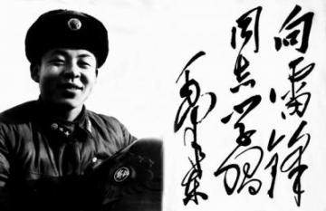
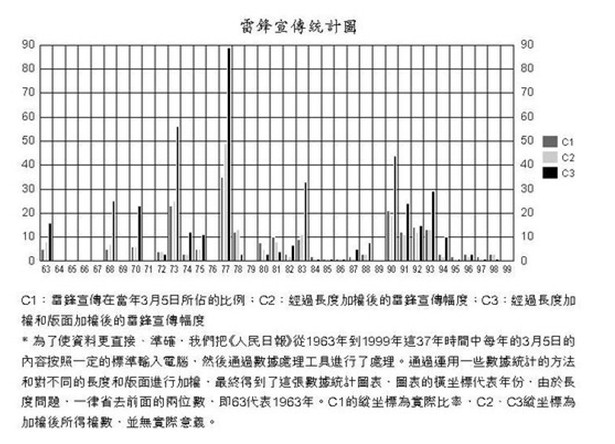
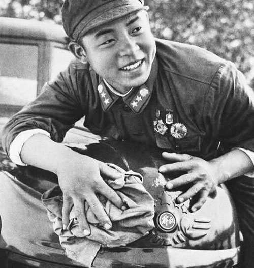
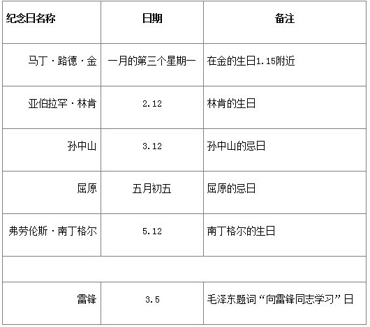

# ＜开阳＞论雷锋他的倒掉：人造雷锋50年(一)

**比如不久前还是共和国主席的刘少奇，接着就成为了“叛徒、内奸、工贼”，过了些年又成为“伟大的马克思主义者”；比如昨天还在说“敬祝伟大领袖毛主席万寿无疆！敬祝林副统帅身体健康！祝周总理身体比较健康！”，没几年林帅就成为了“叛徒”，“叛党叛国”，接着就被批判“效法孔子克己复礼，妄图复辟资本主义”；还有，就算是全国人民都曾喊得震天响的“毛主席万岁”，今天就只能在乌有乡中听到了。**  

# 论雷锋他的倒掉：人造雷锋50年(一)

## 文/吴恒(复旦大学)

 

“向雷锋同志学习”的口号于1963年由毛泽东在《人民日报》上提出，一直流传至今，延续了近50年，这在共和国的历史上不得不说是一个奇迹。毕竟，在1963年之后，中国，哦，“我们这儿”经历过1966-1976年的文革，经历过1971年林彪叛逃，经历过1979年改革开放，等等等等。在这个过程中，中国人的价值观发生过一次次翻天覆地的变化。

比如不久前还是共和国主席的刘少奇，接着就成为了“叛徒、内奸、工贼”，过了些年又成为“伟大的马克思主义者”；比如昨天还在说“敬祝伟大领袖毛主席万寿无疆！敬祝林副统帅身体健康！祝周总理身体比较健康！”，没几年林帅就成为了“叛徒”，“叛党叛国”，接着就被批判“效法孔子克己复礼，妄图复辟资本主义”；还有，就算是全国人民都曾喊得震天响的“毛主席万岁”，今天就只能在乌有乡中听到了。

在这50年的历程中，整个中国几乎没有一个人，没有一种精神能够持久的站在道德制高点上，就算是“伟大领袖”，也被“三七开”了。从这个角度来看，“雷锋”和“雷锋精神”确实是这片神奇土地上一朵长青的奇葩。因为历史学专业的缘故，我不愿意接受任何被告知结论但不告知推理过程的观点。这朵花背后，会有怎样的故事呢？

一、 被曲解的“雷锋精神”

“向雷锋同志学习”是好几代人共同的记忆，这句话的传播范围是如此之广，对我们的影响是如此之大，以至于大多数人将其视为一条不证自明的公理，甚至不愿意去多想一下，多问一句：向雷锋学习什么？什么是“雷锋精神”？

这造成的后果是，虽然从上到下都在说“雷锋精神”，但大家对“雷锋精神”的理解却千差万别。究其原因，这大概是一种文科式的思维习惯（不好意思放地图炮了），因为文科思维习惯于“一千个读者就有一千个哈姆雷特”，习惯于“不解释”，“你懂的”。而理科思维则不然，如果我们要讨论一件事情，那么要做的第一件事情就是来定义我们要讨论的事情，比如要先定义函数，定义变量。这两种思维并无优劣之分，但如果一种思维束手无策时，换另一种则说不定会有奇效。

对“雷锋精神”的定义虽见仁见智，但在总体上可以简单的分成两类。这两类定义其间的差距很大，几乎有点鸡同鸭讲的感觉了，但他们都认为自己理解的才是真正的“雷锋精神”。这两类定义，有三种表述方式。普通表述是：朝廷定义与民间定义；文艺表述是：庙堂定义与江湖定义；还有一种表述是：他们的定义与你的定义。

简言之，你所理解的“雷锋精神”其实并不是他们所宣传的“雷锋精神”；不止如此，他们今天所宣传的“雷锋精神”其实也不是他们当初宣传的“雷锋精神”。

如果不意外，你所理解的“雷锋精神”应该是且仅是：“助人为乐”，“做好事不留名”，如果你年纪稍微大点，也许还要加上“甘做革命的螺丝钉”或“钉子精神”。这一句中“是且仅是”的意思是说，你认为“雷锋精神”包括了这些，且仅包括了这些。而其他美德，比如说，“牺牲小我，实现大我”，虽然也值得“学习”，但你肯定不觉得这是“雷锋精神”，那应该是“董存瑞精神”、“黄继光精神”什么的。

但其实并非如此，“助人为乐”、“做好事不留名”虽然确实是“雷锋精神”的组成部分，但并不是其最重要的组成部分，从来不是，从1963年至今都不是。朝廷对“雷锋精神”的最新版定义如下，有4个分句，按重要程度排序。你的理解只是他们所认为“雷锋精神”的1/4弱：

“雷锋精神以坚定理想信念为根本支撑，蕴含着爱党爱国爱社会主义的赤诚真情，始终具有激发人民团结奋进的强大力量。雷锋精神以人民至上为价值取向，把关爱他人、助人为乐当作最大幸福，始终具有感动人心、温暖社会的道德温度。雷锋精神以艰苦奋斗为人生品格，崇尚勤俭节约，彰显优良传统，始终具有引领社会文明风尚的长久魅力。雷锋精神以敬业奉献为不变信条，干一行、爱一行、钻一行，始终把普通工作岗位作为实现人生价值的舞台。”（[http://news.xinhuanet.com/politics/2012-02/29/c_111585841.htm](http://news.xinhuanet.com/politics/2012-02/29/c_111585841.htm)）

上文所谓“最新版定义”是指其实朝廷在不同时期对“雷锋精神”的定义是不同的，而且波动比较大。吴海刚，一位雷锋研究者，曾对此进行过简单的分析：他以1963-1999年间每年3月5日的《人民日报》中与雷锋有关的内容为统计对象（见下图）进行分析，认为可将官方对雷锋宣传“分为六个阶段”，其中每个阶段的“雷锋精神”都不尽相同，具体可查阅该论文：《雷锋的媒体宣传与时代变革》（2001年）。

这是一件很诡异的事情：雷锋已在1962年8月死了，他做过的事情基本都在当时被报道过了，他的《雷锋日记》也出版发行过。也就是说，这个人应该是已经被“盖棺定论”了，但奇怪的是，虽然他做的事情还是那些，但在过去的50年里，他的精神却一直在变。

无需学者皓首穷经似的挖掘史料，我只要举出一个例子，你就能明白这些年来，“雷锋精神”只是名字没变，内涵早已不是当初的模样了。你还记得当年你年少时在大明湖畔学的那首歌么？对，就是那首，《学习雷锋好榜样》。这首歌就诞生于1963年3月5日当天，可以说，能够准确的反应当年第一版“雷锋精神”。

我相信，这首歌，至少80后及以上都是耳熟能详的，不知道90后在读小学时还用不用学。现在，你再仔细的一句一句读这些歌词，应该就能能够明白，所谓的“学习雷锋好榜样”中雷锋做出的“榜样”是什么了吧。稍有常识的人都能看出，这一版的“雷锋精神”与“助人为乐”没有半毛钱关系。为求其全，将其歌词全录如下：

“学习雷锋好榜样 忠于革命忠于党 爱憎分明不忘本 立场坚定斗志强 立场坚定斗志强! 学习雷锋好榜样 艰苦朴素永不忘 愿作革命的螺丝钉 集体主义思想放光芒 集体主义思想放光芒! 学习雷锋好榜样 毛主席的教导记心上 全心全意为人民 共产主义品德多高尚 共产主义品德多高尚! 学习雷锋好榜样 毛泽东思想来武装 保卫祖国握紧枪 继续（永远）革命当闯将 继续（永远）革命当闯将!” “学习雷锋好榜样 忠于革命忠于党 爱憎分明不忘本 立场坚定斗志强 立场坚定斗志强! 学习雷锋好榜样 放到哪里哪里亮 愿作革命的螺丝钉 集体主义思想放光芒 集体主义思想放光芒！ 学习雷锋好榜样 艰苦朴素永不忘 克己为人是模范 共产主义品德多高尚 共产主义品德多高尚! 学习雷锋好榜样 毛主席的教导记心上 紧紧握住手中枪 努力学习天天向上 努力学习天天向上!”

但这首歌描述的确实是最初版的“雷锋精神”，理由有二，一是据词作者回忆，歌词是受周恩来题词的影响，而周的题词为“向雷锋同志学习，爱憎分明的阶级立场，言行一致的革命精神，公而忘私的共产主义风格，奋不顾身的无产阶级斗志”，确实与这首歌的意境相似；【见《英雄传奇之雷锋：人民心中永远的“明星”》一文，[http://chn.chinamil.com.cn/xwpdxw/2011-07/11/content_4463173.htm](http://chn.chinamil.com.cn/xwpdxw/2011-07/11/content_4463173.htm)】而更重要的理由在于，当年给“雷锋精神”下的那些定义，现在还都在，与这首歌表达的思想高度一致。诸位可看，这些定义中，可曾有一个提到过“助人为乐”？

“毛泽东题词：“向雷锋同志学习”。

朱德题词：“学习雷锋，做毛主席的好战士”。

刘少奇题词：“学习雷锋同志平凡而伟大的共产主义精神”。

林彪题词：“读毛主席的书，听毛主席的话，照毛主席的指示办事，做毛主席的好战士。”

邓小平题词：“谁愿当一个真正的共产主义者，就应该向雷锋同志的品德和风格学习。”

陈云题词：“雷锋同志是中国人民的好儿子，大家向他学习。”

董必武题诗《歌咏雷锋同志》：“有众读毛选，雷锋特认真。不惟明字句，而且得精神。阶级观清楚，勤劳念朴纯。螺丝钉不锈，历史色长新。只作平凡事，皆成巨丽珍。普通一战士，生活为人民。”

（[http://zh.wikipedia.org/zh/%E9%9B%B7%E9%94%8B](http://zh.wikipedia.org/zh/%E9%9B%B7%E9%94%8B)）

插一句，现在再来看这些题词，如果你把第一个发言的人当成楼主，然后后面留言的当成顶帖的，你会发现这场景确实略有喜感。

说到歌曲，因为这一直是群众喜闻乐见的方式，因此宣传工作者也一直很重视。还有一首歌，其知名度和流行程度一点不逊于《学习雷锋好榜样》，却也是因雷锋而起。雷锋牺牲后，《前进报》在《雷锋日记》中发现了其摘抄的一首诗，于是刊登了出来，内容如下：

“唱支山歌给党听， 我把党来比母亲； 母亲只生了我的身， 党的光辉照我心。 旧社会鞭子抽我身， 母亲只会泪淋淋； 共产党号召我闹革命， 夺过鞭子揍敌人！”

上海歌舞剧院的朱践耳读到了这首诗，深受感动，决定将其谱曲成歌，以纪念雷锋。1963年2月21日的《文汇报》刊登了他的曲，取名为《雷锋的歌——摘自》。这首歌经中央人民广播电台播放后，红遍全国。这便是现在鼎鼎大名的《唱支山歌给党听》，这才是最初的“雷锋精神”。真不好意思，这种“喜当儿”的精神，我真心学不来。

不止如此，还有一点也值得一说。雷锋纪念日是3月5日，但雷锋的生日是12月18日，忌日是8月15日。那3月5日是什么日子呢？1963年3月5日，《人民日报》在第一版刊发了毛泽东的题词“向雷锋同志学习”，第二版刊登的是罗瑞卿写的向雷锋学习的文章。罗在文章中写道：

“雷锋同志值得学习的地方是很多的。但是，我觉得，最值得我们学习的，也是雷锋之所以成为一个传大战士的最根本、最突出的一条，就是他反反复复地读毛主席的书，老老实实地听毛主席的话，时时刻刻按毛主席的指示办事，一心一意做毛主席的好战士。”

（[http://news.sina.com.cn/c/144495.html](http://news.sina.com.cn/c/144495.html)）

简言之，现在之所以在3月5日纪念雷锋，是因为当天主席有题词，而为什么雷锋值得纪念呢？那是因为他“反反复复地读毛主席的书，老老实实地听毛主席的话，时时刻刻按毛主席的指示办事，一心一意做毛主席的好战士”。正本溯源，这才是原汁原味的“雷锋精神”。以后各个版本的“雷锋精神”，都是从此处演绎出来的。仔细阅读罗瑞卿的文章，你能找到“助人为乐”么？

而且，雷锋纪念日的设立，也创造了人类文明史上的一个奇迹，不止中国历史上没有，世界历史上也没有。见下表。

综上所述，你所理解的“雷锋精神”并不是真正的“雷锋精神”。“雷锋精神”的内涵虽然随着时代的变化有过多次变动，但其解释权始终在朝廷，因为这个词就是他们首创的。当然，你完全可以自欺欺人的说，我就是认为“雷锋精神”等于且仅等于“助人为乐”，然后我学习“雷锋精神”。但在我看来，这仿佛就像，一个人拿着唯冠的IPAD，然后说，我就是认为唯冠的IPAD才是IPAD，苹果的iPad是山寨的。

（未完待续）

（采编：楼杭丹；责编:应鹏华）

 
