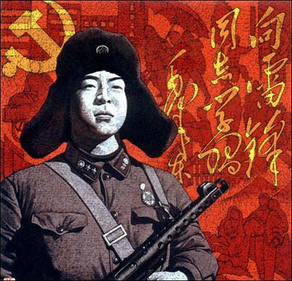
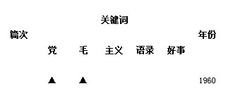
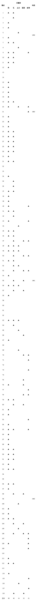
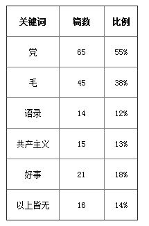

# ＜开阳＞论雷锋他的倒掉：人造雷锋50年(二)

**雷锋本来只是一个政治模范，但是，不管是朝廷还是民间，都渐渐的把他变成了一个道德模范，这是不应该的事情。另外，在整本《雷锋日记》中，没有看到一篇与爱情有关的，这是非常不正常的，毕竟当时写日记的雷锋，正是18到22岁之间。可能的几个解释，一是他真的忍得住，这是可怕的，因为这个年纪，爱女生应该是人性；一是他有想，但没有写下来，而且是刻意不写的，因为整整4年，没有一篇涉及；还有可能是写了，但是没被编辑采用，大概是因为编辑觉得这不符合“雷锋精神”吧。**  

# 论雷锋他的倒掉：人造雷锋50年（二）

## 文/吴恒(复旦大学)

 

二、被曲解的“雷锋”

真正的雷锋，是什么样子的呢。是像电影里演的那样？或者像照片上拍的那样？还是像报纸上写“雷锋精神”时说的那样？

雷锋的事情已过去50多年，还有可能复原真实的雷锋吗？答案当然是肯定的，不然历史学是用来干嘛的。但即使是历史学，也不能把历史真正的复原，毕竟没有时间机器，穿越又不靠谱。历史学的价值在于，在众说纷纭的诸多史料中，推论出一个逻辑上最自洽的解释，尽量去逼近史实，同时得出的结论要随时接受更新及更权威史料的修正。

关于雷锋的故事很多，50多年来，不止各类报纸有报道，雷锋生前所认识的人也纷纷撰文回忆，还有电视媒体的采访，有电影，还有一部23集的电视剧《雷锋》，甚至还有雷锋纪念馆。我们如何从这些近乎海量的材料中还原真实的雷锋呢？

师门前辈，顾颉刚先生，曾提出过“层累地造成的中国古史观”的论点，开创了古史辨派，他的这一创意思路简单、清晰、有力。他观察到关于中国古代的传说，尧舜禹汤之类的，“时代愈后，传说的古史期愈长”；“时代愈后，传说中的中心人物愈放愈大”。举例来讲，“如周代人心目中最古的人是禹，到孔子时有尧舜，到战国时有黄帝神农，到秦有三皇，到汉以后有盘古。”顾先生发现这是违反常识和逻辑的，因为盘古如果真的存在，那么他与周代人的时代间隔更近，周人没有道理不记下。而汉朝人并未比周代人掌握更多的资料，因此他们认为最遥远的盘古其实更可能是编造的。同理，黄帝、神农、尧、舜，都涉嫌被造假。

一样的道理，虽然现在关于雷锋的记载很多，但这些反应的并不是真实的雷锋，而只是文艺创作，因为不管是写作的记者，还是电视电影的编剧，他们与雷锋所处的时代及雷锋的生活圈的距离，其实和我们相差不多。如果要探寻真实的雷锋，我们需要做的事情是找到与雷锋同时代的人，以及与雷锋共同生活过的人所记载的雷锋。

从这个角度来看，几乎没有什么比雷锋自己写的《雷锋日记》更能反应真实的雷锋了。当然，必须要认识到的是，第一，日记可能作假，毕竟是自己写自己，难免会隐恶；第二，日记可能会被断章取义，因为出版的《雷锋日记》经过编辑的修改，内容可能有过删减，另外也只收录了雷锋在1959至1962年间的部分日记（1958年的日记收录在《雷锋全集》中，2003年才由华文出版社出版）；第三，也有可能会出现“这段话是他所写，只是他并不赞成这段话的观点”这种神一般的逻辑才能理解的情况。但无论如何，相比与其他基于道听途说，艺术加工后的文章、电影，《雷锋日记》无疑是更可靠的。

《雷锋日记》第一版发行于1963年4月，由解放军文艺出版社出版。要知道雷锋1962年8月才死，毛泽东1963年3月才题词。在那个年代，一本书居然只用了一个月的时间就能面世，足见当时宣传工作者对此的重视。可以说，我们现在所知道的雷锋的故事，主要是从《雷锋日记》中演绎出来的，如果要想了解真正的雷锋，这本书是必须要读的。另外一本书也很重要，《劳动人民的好儿子：雷锋》，有更多关于雷锋生活的细节，包括他的身世以及小时候的故事，中国少年儿童出版社出版，同样是1963年4月第一版。这两本书一本是雷锋写的，一本是写雷锋的，都不厚，都很权威，而且读来甚是有趣，网上很容易找到，强烈推荐各位找来一阅。

《雷锋日记》第一页的内容就为全书定下了基调：

“一九五九年×月×日【注：原文如此】:我的感想——毛主席啊象父亲，毛主席思想象太阳。父亲时刻关怀我，太阳培育我成长。”

这样的内容比比皆是，又如：

“一九六〇年×月×日：可以说在我的周身的每一个细胞里，都渗透了党的血液。

为了忠于党的事业，永远作党的驯服工具，今后，我一定要更好地听从党的教导，党叫我干什么，我就干什么，绝不讲价钱。……”

“一九六〇年二月八日：……从我参加革命的那天起，就时刻准备着为了党和阶级的最高利益牺牲个人的一切，直至最宝贵的生命。”

“一九六〇年三月十日：……今天，我国的领土台湾，还被美帝国主义和蒋匪霸占着。世界上还有三分之二的穷人没有得到解放。他们没有吃、穿，受压迫，受剥削。我决不能眼看着他们受欺凌，一定要将革命进行到底，解放所有受苦受难的人民。”

“一九六〇年十一月二十七日：……我决心继续努力，保持荣誉，发扬光荣，永远听党的话，听毛主席的话，读毛主席的书，做毛主席的好战士。”

“一九六一年二月二十日：……我睡入甜蜜的梦乡，见到了英明的毛主席，他象慈父般的关怀我，和我一起吃饭，同时还拿很多好菜给我吃。一面吃饭，主席一面教导我说：“要好好学习，听党的话，不断进步。”我回答主席说：“一定做到，我要永远忠于党。”……”

“一九六一年五月四日：党和毛主席救了我的命，是我慈祥的母亲。我为党做了些什么？当我想起党的恩情，恨不得立刻掏出自己的心；当我想起我所经历的一切太平凡了的时候，我就时刻准备着：当党和人民需要我的时候，我愿意献出自己的一切。”

读了这些，你应该清楚，为什么朝廷要号召向雷锋同志学习了吧。当然，任何列举都有可能失之偏颇。像这种断章取义的事情，文字狱时用得多了，一个人文章写多了，总能从中找到你想要的证据。为了避免这种误差，我将《雷锋日记》全书进行了整理。在其日记中，最多主题是赞扬共产党，赞扬毛主席，引用毛主席语录，赞扬共产主义以及记录自己做过的好事。我统计了《雷锋日记》中这些关键词出现的频率。

统计方法是这样的，比如这篇日记：

“一九六〇年十一月二十七日：

……我决心继续努力，保持荣誉，发扬光荣，永远听党的话，听毛主席的话，读毛主席的书，做毛主席的好战士。”

文中表达了对“党”，对“毛主席”的忠心，那么就在这两个关键词下加注：

对整本《雷锋日记》做统计，结果如下表所示：

《雷锋日记》一共收录了118篇日记（我查到有资料显示应该是121篇，也许是我统计有误，不过这误差应该是在可接受的范围内），这118篇日记中，歌颂党的以及向党表忠心的，有65篇，占55%；歌颂毛主席以及向毛主席表忠心的有45篇，占38%；记载自己做过的好事共有21篇，占18%（因为有时同一篇日记同时有几个关键词，既歌颂党，又歌颂毛主席，所以百分数累加会大于100%）。也有日记没有提到“党”、“毛主席”、“共产主义”或者他做过的好人好事，但这样的日记只有16篇，仅占全书的14%。

由此可见，做好事的部分只占18%，而很显然，55%>38%>18%，那么《雷锋日记》所表达的“雷锋精神”，以及雷锋的内心世界是如何的，应该是显而易见了。如果简单总结一下，我觉得整本日记的内容大致可以归纳为两点：

1：世界上只有两种人，一种是人民，一种是敌人；对人民要像春天一样温暖，对敌人要像冬天一般残酷；

2：谁是人民，谁是敌人，听党的，听毛主席的。

这便是我读《雷锋日记》感受到的“雷锋精神”。插一句，从这个定义来看，我倒是知道了当今社会中，哪些人最具有“雷锋精神”了，那显然是那些每天辛勤的在网上发帖，月底按发帖条数收取相应数额的0.5元人民币的人了。

另外，我诧异的发现，在《雷锋日记》中记载的，雷锋做过的好事，1959年至1962年4年间，只有21件，平均每年5件，每2个月一件。当然，也有一种解释是，雷锋做好事不留名，真正的不留名，连日记中也不写。但我比较怀疑，比如：

“一九六〇年十月二十一日：……劳动到十二点，大家拿着自己从连里带来的一盒饭，到达了集合地点，去吃中午饭。当时，我发现王延堂同志坐在一旁看着大家吃，我走到他面前一看，他没有带饭来，于是我拿了自己的饭给他吃，我虽然饿点，让他吃饱，这是我最大的快乐。”

这件事在我的统计表中是算在21件好事之中的。当然，把饭让给同事吃是在做好事，但这种好事……，确实是……，有些……，平凡。无意冒犯，但如果连这样的事都要花笔墨记在日记中，我是不太相信他做过更大的好事而不记载的。

雷锋本来只是一个政治模范，但是，不管是朝廷还是民间，都渐渐的把他变成了一个道德模范，这是不应该的事情。另外，在整本《雷锋日记》中，没有看到一篇与爱情有关的，这是非常不正常的，毕竟当时写日记的雷锋，正是18到22岁之间。可能的几个解释，一是他真的忍得住，这是可怕的，因为这个年纪，爱女生应该是人性；一是他有想，但没有写下来，而且是刻意不写的，因为整整4年，没有一篇涉及；还有可能是写了，但是没被编辑采用，大概是因为编辑觉得这不符合“雷锋精神”吧。

（未完待续）

 

（采编：楼杭丹；责编：应鹏华）

 
