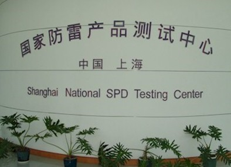

# ＜开阳＞论雷锋他的倒掉：人造雷锋50年(四)

**对于一个曾经崇拜过“英雄”的人而言，偶像的坍塌是痛苦的。那些年长一辈的人对雷锋的依恋，以及那些对揭露真实雷锋的文章的反感，我能理解，尤其是今年我也经历过一次偶像坍塌的痛苦。但觉今是而昨非，这是成长必须经历的痛。雷锋是雷锋所处时代的典型，是那个时代的榜样，但今天，应该有所不同了，毕竟，新的时间开始了。**  

# 论雷锋他的倒掉：人造雷锋50年（四）

## 文/吴恒(复旦大学)

 

**四、“雷锋”不是你想学，想学就能学**

《雷锋日记》充斥着那个时代的标准用语，陈寅恪先生说，对历史要抱有“同情之理解”。所以我本不打算对那些充满着意识形态的日记内容进行评论，但仍还是有几篇让我觉得如鲠在喉不吐不快。比如这篇：

“一九六一年四月十七日:今天连部召开了一个党、团员积极分子大会，听首长说：因近两年来我国遭到特大的自然灾害，给我们造成了一些暂时的困难。可是目前阶级敌人有所抬头，想乘机破坏我们的社会主义建设。我听了心里直发火，恨之入骨。我家里很穷，父、母、哥、弟死在民族敌人和阶级敌人的下里。这个血海深仇，使我永远铭记在心。解放后，伟大的共产党拯救厂我，党像慈父般的哺育和教育着我，从记事那天起，党和毛主席便成了我，我心上的太阳；对阶级敌人更加憎恨。由于不断受到党的教育，懂得了阶级斗争。像我这样的穷苦人，不斗争就没有出路……

现在我是斗共产党员，“一个共产党员，只有当他闭上了眼睛的时候，才有权利停止斗争。”我决心为党和阶级的最高利益斗争到底。”

这是一篇写于1961年4月17日的日记。根据雷锋的家世，他有这样的想法，似乎可以理解。但是，照这个逻辑推下去会有很尴尬的结论。他之所以仇恨旧社会，是因为他的家人都横死在旧社会，那么那些饿死在大饥荒里的人，他们的家人该去仇恨谁？要知道，就在雷锋写下这篇日记的时候，1959-1961年的大饥荒尚未结束。

雷锋是湖南人。就是在他的家乡湖南，就是在他写下这篇日记的一周前，1961年4月14日，在湖南农村调研的胡乔木，给当时同样在湖南视察的毛泽东写了一封长信，信中有这么一段：

“昨天，我和王力同志、毛华初同志，省农业厅贺炳贤同志等人去了一次湘乡县委，我们原听说临近韶山的东郊公社、现龙洞公社死人的情况(从1958年10月到1961年3月，三个大队死707人，占现有人口百分之十三点五)，拟去该处调查，结果因道路不便，临时到原东郊公社现陈庚公社的楠乡大队、七星大队、水底大队、石匠大队的几个生产队看了一下，发现这几个大队的情况也很严重。楠乡大队、石匠大队三年来死亡率都在20%左右，据县委说，全县三年约饿死三万人，去年约二万人，而以去年年底最为严重，全县病人在去年年底达七万人，现已减到万余，但我们去的地方，有些生产队的病情尚未停止……”

[http://news.ifeng.com/history/zhongguoxiandaishi/detail_2012_02/09/12396338_6.shtml](http://news.ifeng.com/history/zhongguoxiandaishi/detail_2012_02/09/12396338_6.shtml)

后来，1962年2月8日的七千人大会上，刘少奇激动的对毛说：“饿死这么多人，历史要写上你我的，人相食，要上书的！”还好他没有说给雷锋听，不然雷锋可就要“心里直发火，恨之入骨”了。

学不来的不仅是雷锋心中的这股怒火，同样学不来的还有雷锋做好事的方式。雷锋特色式的做好事：做好事不留名，但能让对方送来感谢信。在《雷锋日记》中，他做过的有一些好事，受助者都能找到他们连队，送上感谢信。事实上，前文也说到了，雷锋最初引起高层关注也是因为感谢信。细细一想，这是很诡异的一幕，在这个国家，最有名的一位助人为乐者，居然是以“做好事不留名”著称的。你们这些做宣传工作的同志们，也太违背雷锋同志的遗志了吧。

而现在号召学雷锋，而且还要考核各单位学雷锋的情况，更是透露出一种黑色幽默，在人人网上看到一位网友的吐槽：

“陆遥遥 ：你们不觉得学雷锋做好事不留名和考核学雷锋情况存在逻辑悖论吗？”

其实这没什么，毕竟我们从小就没接受过完善的逻辑训练。但有的时候学雷锋不止学出了逻辑悖论，还能学出常识悖论。比如

“20世纪80年代末90年代初，一份生活类报纸向读者这样讲述西点军校学雷锋的报道：“走进西点军校，人们首先发现校园内一尊雷锋的半身塑像，会议大厅挂着5位他们所仰慕的英雄像，排在首位的是我国伟大的战士楷模雷锋，学校还把雷锋日记中一些名言印在学员学习手册扉页上，提倡学员学习时要发扬雷锋的钉子精神，勤学苦钻，以优异成绩报效祖国。学校还经常宣扬学习雷锋等英雄涌现出来的先进典型。”

从那时起，关于西点军校与雷锋的传奇故事便愈传愈广，以致《纽约时报》在1998年的一篇报道中这样评论道：“中国人对于西点学雷锋的事情非常关心。”[http://www.nwp.cn/book/699_33602.shtml](http://www.nwp.cn/book/699_33602.shtml)

这得是多自恋，多井底之蛙，多缺乏常识，多厚脸皮才能编出这样的谎言啊。更关键的是，居然有人信，居然信的人还不少。我觉得这个谎言肯定可以和马克思在大英图书馆磨出脚印的谎言一道，入选历史上传播最广的华语谣言Top10。

如果你还记得本文的第一章，什么是“雷锋精神”，你就能理解，就算美国人嗑了药，也不会学习“雷锋精神”。如果我没有猜错的话，西点军校肯定连“华盛顿精神”都不学习，怎么会学习以“忠于党，忠于毛主席”为核心价值的“雷锋精神”？再说了，军队忠于《宪法》而不是忠于政党，更不是忠于个人的观点可是从华盛顿时代起就是“美国精神”的一部分。

还有，把雷锋的半身像排在西点人最仰慕英雄的首位？这就好象是在说哈佛大学的广场上放置的雕像不是哈佛，而是一位济南蓝翔职业技术学院的肄业生。确定说的是West Point而不是Western Cookies？西点校友人才济济，从士兵到将军，涌现出来的英雄人物不胜枚举，怎么可能将一个异国的、从未经历过战场的士兵当成最崇拜的人？如果真是这样，二战时将世界从法西斯手中解救出来的校友巴顿将军、盟军欧战区最高指挥官艾森豪威尔将军等人表示情绪稳定，尊重西点学弟学妹们自己的选择。

不过换个思路，异想天开点，也许西点军校还真的学习过雷锋。真不排除这种可能，因为我们似乎一直忽略了雷锋的另一个身份，他其实是一个军人。当时中美尚未建交，而且还在朝鲜间接交手过，解放军极有可能是美军的假想敌之一。而雷锋是解放军军中大张旗鼓学习的对象，兵法云“知己知彼”，想必西点军校为了让学员全面认识对手，是有可能要研究这一现象的。所以雷锋的照片、事迹曾出现在西点的课堂上，对这一点，我倒是觉得可信的。当然，我相信如果他们看了《雷锋日记》的英译本，如果有学员曾在二战的欧洲战区待过的话，可能会觉得其语气有几分熟悉吧。

就算是这样，假设西点军校真的在教室里教过学员学习“雷锋精神”，但并不能说西点军人在学习“雷锋精神”。这里用英语似乎更好表达一些，即：我认为不排除西点学生学习过（study）“雷锋精神”的可能，但我相信西点学生不可能学习过（learn from）“雷锋精神”。【经@沈逸老师提醒，觉得这一段不能光靠逻辑推导，需要有实证。正好这个实证@方舟子 曾经做过，请参考：《【旧作】美国西点军校何曾学雷锋(2006-03-06 19:37:02)》，[http://blog.sina.com.cn/s/blog_47406879010002y4.html](http://blog.sina.com.cn/s/blog_47406879010002y4.html) 】

雷锋在日记里记载他做好事的经过时，往往会附上细腻的心理描写。比如：

“一九五九年十一月×日:……突然下起雨来了。陈调度员说，我们建筑焦炉工地上，还散放着七千两百袋水泥。陈调度员急得一时手足无措。这时，我猛然想到了党的教导，要我们爱护国家财产，又想到了我是一个共青团员。想到这些，一种无穷的力量鼓舞着我，跑到宿舍，发动了二十多个小伙子，组织了一个抢救水泥的突击队，有的忙着找雨布，有的忙着找芦席，盖的盖，抬的抬，经过一场紧张的战斗，避免了国家的财产受到重大的损失。这时，我才松了一口气，抹掉了头上的汗，带着乐观的心情，昂首阔步回到了宿舍，回忆自己为国家、为党做的一点点工作而高兴。”

《雷锋日记》中记载了雷锋做过的20多件好事，大部分心理活动都与这篇类似。这当然没问题，雷锋在那个时代成为了榜样，可以理解，这些话语正是那个时代的特征。但这样的雷锋有必要成为今天我们的榜样么？

当今时代，我们有更值得学习的人，更值得学习的事，我们已有更高的道德标准，何必再向一个低标准学习呢。两年前，我误打误撞接触了公益圈，这几年的观察所得，尤其是通过几次公益活动与众多有公益心的普通民众的接触，我能深深的感受到，人间自有真情在。这个过程中，我觉得最感动的是，当这些人在做好事的时候，他们并没有把做好事的动力拔高到是因为受到了政治教育的感召，而只是觉得人同此心，心同此理，于心不忍，于是解囊相助。看到那些捐款的陌生人的留言，他们好像并没有把自己的善行当成是善行，而只是应该做的。把这些人和事事都拔高到讲政治的雷锋相比，是不是高下立判？

我觉得这个时代虽有诸多不是，但与雷锋那个时代相比，明显更有道德感，也更有人性。虽然我们当下的时代出现过“小悦悦”的惨剧，这当然说明社会的整体素质还未达到正常水平，但我同样观察到，惨剧发生后，社会舆论的动态，多数人是在善善恶恶，而这，远比黑白颠倒的那个时代强太多，我们不需回头看。社会风气的变好，不一定只有通过树典型这一种方式。我更倾向于认可，在文化领域，管得越少，情况会越好。美国甚至都没有文化部，没有宣传部，但这并没有导致美国人民因此生活在水深火热中。比尔•盖茨把自己富甲天下（真正字面意义上的）的财富设做公益基金，并非是在响应布什政府的号召，而他也没有因此获得过“感动美国十大人物”的奖励，他这种“深藏功与名”较之雷锋的“求名得名”境界高低如何？

雷锋也许可以作为那个时代的榜样，但这个时代，抱歉，我们应该有新的榜样了。记者王克勤，一介书生，却日日在微博上为那些“贫病交加、救援维权无门、绝望中等死的尘肺病人”争取权益。记者邓飞，为贫困山区的儿童募款做“免费午餐”。发起微博打拐的薛蛮子。以帐务透明著称的关注西部教育的[格桑花](http://www.gesanghua.org/)。提倡一边购物一边公益的[易助网](http://www.warmfund.org/wf/Main.jsp)……这个名单可以列很长，他们都是普普通通的人，他们都在做善事，但不同的是，他们并不是因为受到了平时政治教育的影响而选择做好事的，没有那么宏大叙事的动力，只是简单的做了。这种境界，在我看来，比雷锋高太多。他们对我影响，带给我的感动，也比雷锋大太多。因此，我也并不认为称呼这些人为“活雷锋”是一种恭维，那感觉，就好像在说亨利护球护的真好，简直可以称为“法国的李毅”了。

“雷锋精神”还有一个著名的内涵，那便是“螺丝钉精神”。

“一九六二年四月十七日:一个人的作用，对于革命事业来说，就如一架机器上的一颗螺丝钉。机器由于有许许多多的螺丝钉的连接和固定，才成了一个坚实的整体，才能够运转自如，发挥它巨大的工作能力。螺丝钉虽小，其作用是不可估量的。我愿永远做一个螺丝钉。螺丝钉要经常保养和清洗，才不会生绣。人的思想也是这样，要经常检查，才不会出毛病。我要不断地加强学习，提高自己的思想觉悟，坚决听党和毛主席的话，经常开展批评与自我批评，随时清除思想上的毛病，在伟大的革命事业中做一个永不生锈的螺丝钉。”

吐槽下，抱歉我对这种思维理解不能。不是说人生而自由平等么，难道童话里都是骗人的？凭什么我是螺丝钉，你是舵手？凭什么我忍饥挨饿，你能换着花样吃海鲜？凭什么我只能看样板戏，你却能看美国大片？当初是你们说，人与人之间是平等的，因此我们才加入你们赶走了他们。可现在，你们却说，人与人之间的确是平等的，只不过有的人更加平等而已。这真是毅种循环。

至于“雷锋精神”的另一内涵“毫不利己，专门利人”，且不说与雷锋的经历事实不符，稍加思考就能知道，这种处世方式明显是不可持续发展的，不符合科学发展观。不展开了。

**五、结语**

以前常在新闻里听到主持人声情并茂的说：“一个雷锋倒下了，千百个雷锋站起来了。”这话听起来不错，但我想，今天我们再喊这样的口号，应该换一个思路来理解：只有被宣传出来的，作为精神偶像的雷锋在民众心中倒下了，即雷锋不再是“精神”、不再在神坛之上以及月亮之上时，这个社会才会真正的进步，才会有千千万万个正常的雷锋出现。老子说过，“大道废，有仁义”，大概就是这个意思吧。仁义废，有大道。

顺带说一句，3月5日还是一个年轻人的忌日，他叫遇罗克。在1966年，《雷锋日记》出版3年之后，他写过《出身论》反对出身论并因此得咎。北岛曾写过一首献给他的诗，我很认同：

“我并不是英雄

在没有英雄的年代里

我只想做一个人”

对于一个曾经崇拜过“英雄”的人而言，偶像的坍塌是痛苦的。那些年长一辈的人对雷锋的依恋，以及那些对揭露真实雷锋的文章的反感，我能理解，尤其是今年我也经历过一次偶像坍塌的痛苦。但觉今是而昨非，这是成长必须经历的痛。雷锋是雷锋所处时代的典型，是那个时代的榜样，但今天，应该有所不同了，毕竟，新的时间开始了。

雷锋，你好；雷锋，再见。

You can cheat all the people sometime or cheat some people all the time，but you can't cheat all the people all the time.

——Lincoln

你可以在一些时间里欺骗所有的人，也可以在所有时间里欺骗一些人，但你不可能在所有时间欺骗所有的人。

——林肯

注：ps，这个周末没有写论文，没有看电影，没有逛街，而是窝在寝室查资料，熬夜写这篇文章，这是什么样的“为人民服务”的精神啊，我就用这篇文章向雷锋同志献礼吧。

pps，据说最近风声很紧，微博上已经灭了好几个著名ID。我写完文章后又过了一遍，用鲁迅先生的话来说，先抽了几根骨头。现在呈现的这一版中，所有引文，包括照片，均来自国内正规、合法出版物或正规新闻网站，根红苗正，而且在文中也都注明了出处。写此文的目的是试图用半学术的态度，来回顾近50年来雷锋在国人心中的意象的变化，以及尽量去复原真实的雷锋。仅此而已，没指桑骂槐，没含沙射影。明鉴。

ppps，对于那些读完此文觉得毁童年的同学说声不好意思了。另外，等论文写的差不多了，还有多的时间的话，我琢磨着搜集类似的文章，出一个毁童年专辑，那些年，我们被毁的童年。嗯。

pppps，文中也说到了，我认为“历史学的价值在于，在众说纷纭的诸多史料中，推论出一个逻辑上最自洽的解释，尽量去逼近史实，同时得出的结论要随时接受更新及更权威史料的修正。”因此，如果你发现文中有有失偏颇的地方，不管是用词还是史料，烦请不吝赐教。

wuheng.me@gmail.com weibo.com/iwuheng renren.com/iwuheng 吴忄亘 2012.3.5

原文链接：[http://blog.renren.com/blog/245473694/809958175](http://blog.renren.com/blog/245473694/809958175)

（本文完）

（采编：楼杭丹；责编：应鹏华）

 
