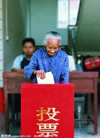
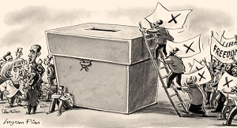

# ＜开阳＞读王天成《大转型：中国民主化战略研究框架》（上）

**如果我们想要得到民主和自由，就必须要正视一个问题：政治上的民主化必须要经历某些关键性的“翻天覆地”的改革，例如开放党禁、报禁，军队国家化，议员直接选举等。这是任何一个国家走向民主化的必由之路，渐进主义所设想的随着改革的一小步一小步的进行，民主和自由有朝一日会“从天而降”的观点在我看来是可笑的，经济上的渐进改革可能会促进民主化的进程，但是促进一个国家真正民主化的决定性力量仍然是某些关键政治架构的改革，这里面包括自由结社、直接选举、言论自由等都必须要有一个决断，我们不能通过不切实际的想象把这些关键步骤无限期延长，这不是明智的方法。**  

# 读王天成《大转型：中国民主化战略研究框架》（上）

## 文/汪根松（中国人民大学）

 

在朋友的建议下开始读《大转型：中国民主化战略研究框架》这本书，由于本身是学经济的，对于政治民主化这些问题缺乏深入的考虑，这方面的著作涉猎不多，看这本书是一个很好的思考和开端。

当然在读这本书之前，我是相信自由民主这些价值观念的，否则我没法去站在促进民主化这一角度上去评论和看待书中的观点。我坚信普世价值，并且相信只有建立一个民主的政治体制和法治、个人自由，才能保证人民的幸福、国家的强盛。

这本书的前言是关于民主转型——作者称之为大转型的概述，主要在于强调其与渐进主义改革之间的区别。以中国官方为主要赞同者的渐进主义改革发展到今天已经经历了三十多年的改革，社会的物质文化有了相当大的进步，这一点我们不能否认，但是畸形的发展模式、掠夺性的上层政治制度导致中国社会面临改革动力缺失、改革共识破裂，甚至连改革本身都可能倒退的险境。在这一背景之下，各种政治势力登上舞台，提出关于国家命运的种种学说和理论，可以说最近几年是中国知识界比较繁荣的几年，各种观点和思潮也是此起彼伏。自由主义在民众中的影响力有所上升，但是同时怀念文革、怀念毛泽东的思想和各种左派思潮有所抬头。

作者显然是高估了自由民主在人民大众中的影响力，这一点我也不愿意承认但是又不得不面对，底层民众特别是农民封建残余思想仍然非常严重，普通大众维权意识虽然有所上升，但是对于制度上的诉求在1989年政治风波之后早已荡然无存，再加上最近几年民族主义抬头，成为当代思想界一支重要的力量，自由宪政观念的影响力是否有所提升，据我看来，尚待观察。

关于渐进主义转型观念，作者将之斥为“伪渐进主义”，政治渐进主义我不太了解，但是经济上的渐进主义是中国官方标准的改革思路，并被某些经济学家称之为“北京共识”，渐进主义能否带领国家走向民主，带领人民得到法治和自由？在这一问题上，我的看法同作者是一致的。如果我们想要得到民主和自由，就必须要正视一个问题：政治上的民主化必须要经历某些关键性的“翻天覆地”的改革，例如开放党禁、报禁，军队国家化，议员直接选举等。这是任何一个国家走向民主化的必由之路，渐进主义所设想的随着改革的一小步一小步的进行，民主和自由有朝一日会“从天而降”的观点在我看来是可笑的，经济上的渐进改革可能会促进民主化的进程，但是促进一个国家真正民主化的决定性力量仍然是某些关键政治架构的改革，这里面包括自由结社、直接选举、言论自由等都必须要有一个决断，我们不能通过不切实际的想象把这些关键步骤无限期延长，这不是明智的方法。

中国网路上关于民主自由的讨论有一个非常流行的观点，认为中国如果某一天突然采用西方民主制度，国家将无可避免地陷入分裂，民族分裂也有很大的概率，中国将重回20世纪20年代军阀混战的年代。这种想象中的恐惧也是很多中共文人抵御自由派攻击的一大“法宝”，他们通常将没有中共统治的社会形容为秩序混乱、民族分裂，并认为只有加强中共的统治才有可能保持这个多民族国家的“稳定”。民主转型是否会带来国家分裂和民族矛盾的加剧，关键在于民主转型能否成功，而不是民主转型本身会带来国家分裂。上述观点的另外一个致命错误我认为是它将国家、民族这类共同体的利益看做比个人自由和尊严更加重要的价值，在本质上还是属于集体主义的观念，不管其鼓吹者是否赞同自由民主观念。

肇始于20世纪70年代的所谓“第三波民主化浪潮”迄今为止展示出了强大的能力，很多国家摆脱了君主统治和威权统治，不少国家成功转型成为真正的民主国家，例如韩国、台湾、东欧诸国，这一事实证实了民主自由的威力。但是中国能否在未来真正实现民主化依然是一个未知数，这取决于国际间民主化的大趋势，更加取决于国内各方力量的消长，只有当民主自由观念深入人心并且大众对于自己建立民主国家的能力充分信任时，中国的民主和自由才有希望。

关于民主与经济发展水平之间的相关性历来是个扯不清的话题，到底是民主会促进经济的发展还是经济的发展、中产阶级的壮大才会带来政治上的松动从而促进民主社会的成型，各方有不同的意见，在第三波民主化浪潮之前，诚如作者所言，西方主流的政治学理论还是认为经济上的发展才能促进政治的民主化，所以西方支持蒋介石、苏哈托、李光耀，这是有一定的背景的。

从葡萄牙的革命开始，一个又一个民主奇迹出现在世界上，世界上唯一能和美国竞争的对手苏联倒台了、解体了，形成了数十个类型各异的国家，其中最大的继承者俄罗斯成为了半民主化的国家，东欧苏联仆从国“变色”了，从社会主义国家易帜成为纯粹的资本主义民主国家，很多国家包括捷克、斯洛伐克、匈牙利等现在已经属于发达国家之列，同时这些国家民主政体也在不断地巩固。无怪乎福山会认为历史已经终结，自由民主的意识形态战胜了集体主义和威权。

伴随着这一重大的历史，西方学者转而反思自己的理论。转型学确实是“应运而生”，姑且不论这种方法对不对——事实上我们谁也说不清到底对不对，新的探索对于民主理论的发展和民主产生的机制有百利而无一害。转型学派最吸引我的一点是他们认为民主化的前提是统治精英内部存在分裂，这个条件在中国是否存在暂时还不得而知，但是就我的观察，中国社会的分裂倒是不争的事实。一个分裂的社会能否有足够的时间等到统治精英分裂，我对此抱悲观的态度。作者对于分裂的划分在笔者看来是妥当的，划分决策层的分裂和国家武装与决策层的分裂是有必要的，有利于我们分清到底应该采取什么样的措施来推动民主的发展。

民主转型是所有国家转向民主的必经阶段，按照作者的说法，可以划分为两个部分：自由化和民主化，我强烈赞同的一点是一个国家的民主转型自由化是先于民主化的，没有自由化的过程，没有言论自由、新闻自由、结社自由的实现，实现选举民主是毫无意义的——在某种程度上是危险的。

按照作者的说法，民主化指的就是大众自由选举产生政府。这一点上我觉得我们应该注意的是何谓“自由选举”，首先选举规则应该是明定的，并且符合普遍的民选政府的规则，这就排除了当前中国选举这一类的选举。再者每个人都有权力独立按照自己的意愿来投票，不受任何形式的强迫。

熊彼特对于选举的界定是有很深刻的意义的，在他的观念里，选举首先是一种制度性安排，候选人透过争取人民选票所期望获得的是做决定的权力，这一界定暗含这样一个意思：民主选举并不能保证直接民主制的实现，它只能保证约束政府，让它尽量讨好你，尽量代表你的意志。

关于自由化的问题，我觉得奥多纳、斯密特的界定相当精准：“自由化是指落实某些权利的过程，以保护个人和社会群体免于国家或第三人专横、非法行为的侵害“。说到底自由化只不过是我们争取上帝赋予我们权利的过程，也就是追求宪法赋予的言论、结社等自由。林茨与斯泰潘的观点是富有启发性的，他们认为自由化的最重要标志是容忍反对派——即异见群体的存在，这是一个国家走向政治和解，从而走向民主化的开端。

自由化先于民主化存在，而且需要民主化来进一步巩固，这是因为威权体系下的自由是不确定的、缺乏法治保障的。

作者认为在民主化的准备阶段，自由化的一项重要任务就是开放党禁。这一点我是很赞同的，如果没有独立政党的出现，民主化所要求的自由选举就没有实现的基础，自由选举也将名不副实。

 （未完待续）  

（采编自投稿邮箱；责编：麦静）

