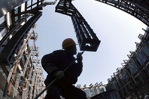

# ＜开阳＞读王天成《大转型：中国民主化战略研究框架》（下）

**最后我用作者的一段话结束我的评论：“我并不认为共产党是不可改造的。共产党一党专制的终结既是共产党的死亡，也是其新生的机会。对于它而言，明智的选择是像前东欧国家共产党那样转变成社会民主党，在新的政治光谱中找到自己的位置；而对于年纪仍然较轻、思想开明的共产党官员而言，一党专制的终结也是其新的机会的开端——他们从此有了可能成为民选的议员和政府领导人。”我相信这一天不会遥远，因为人类追求正义和自由的步伐从未停止，我们中国人也是人，“自由是传统的，专制和独裁才是近代的。”**  

# 读王天成《大转型：中国民主化战略研究框架》（下）

## 文/汪根松（中国人民大学）

 

关于改革顺序这一章，对中共最近20年来推行的政治领域的伪改革现象作者进行了批判，这种批判是中肯的，至少在我看来是的。咱们党干什么都不行，但是隔一段时间就推出一个“制度创新”来“完善中国特色社会主义民主政治”的能力绝对超强。我搞不清楚这些所谓的制度创新有何意义，比如热炒的政务公开、公开竞聘干部、官员财产公开等等，在我看来，制度不发生根本性的改变，都只能流于形式，比如我所在的农村政务公开十年都几乎没变过，不知道这种公开有什么作用。更不知道这和政治体制的改革有什么关系。即使拿在江时代真正动过的国有企业改革来说，你能说这些改革真的成功了吗？国有大型的垄断企业仍然控制着社会经济的命脉，它们的人事权仍然在党中央和国务院手里面，他们的投资和建设仍然并不依照市场经济的规律进行，况且经济领域的有限自由化最近几年也在不断的丧失，君不见“国进民退”这些年来如火如荼吗？

作者对于西班牙转型过程的叙述是我首次耳闻的，也很快吸引了我的兴趣。我历来也对西班牙的民族问题有所耳闻，极端的分离主义组织ETA是经常见诸报端的，众所周知的是20世纪30年代弗朗哥将军通过军事政变在西班牙建立了法西斯极权政权，独裁者们都有一个共同的特征：必须要求所有民众无条件地向其膜拜。所以地方自治是根本不可能的，所以历史悠久的加泰罗西亚和巴斯克自治被取消了，在铁腕的政治人物统治下，人们小心翼翼，并不敢做出很大的反抗，但是分离主义的政治势力一直没有离去，并且获得了当地人民很大程度上的同情，1975年当弗朗哥将军死去之后，西班牙的局势突然间复杂了，过去三十年间的老账新帐都被民族主义者翻出来，力图使加泰罗西亚和巴斯克地区脱离西班牙而独立，但是由于西班牙在民主化的顺序上采取了理智的做法，首先建立了国家认同，孤立了分离主义势力和他们道德上的优势，成功地组织了内战的爆发，西班牙也完美地完成了国家转型，由极权国家转型到了现代民主国家，联邦制得以建立，全国性政权得到了普遍性的认同。

咱们这个国家是一个什么样的国家，想必大家都知道，国家认同在很多地方——特别是在边疆地区本来就不强，加上历史遗留的问题，藏区和新疆的民族问题并不比西班牙轻，在未来的民主转型中我们如何才能避免内战的发生和国家的分裂，是需要我们好好思索的。清末的立宪过程给我们提供了一个先例或者说是一个教训，当清政府无可奈何地宣步“预备立宪”的时候，民众还是有希望的，但是接下来政府在立宪上的不当举措，终于导致了革命的爆发。政府被推翻了，国家陷入了军阀割据的状态。这是一个典型的转型失败的案例，其中一个重要的原因就是当时的政府在民主转型的过程中遵循的也是先地方选举再开国会直选议员的方法，使得各省的地方自治意识有了很大的提升，相应的中央政权的正当性和认同感就降低了，所以当辛亥年武昌枪声响起之后，一个月时间内就有十三个省宣布脱离清政府，并且没有一个省发生过激烈的战争。接下来的就是无穷无尽的内部战争，直到最后中共窃国，将中国引入歧途。

在中国未来是应该采取联邦制还是单一制抑或是两者的某种综合的问题，我认为考虑到目前我们国家的民族现状，某种形式的联邦制应该是合适的。当然有人会认为这样的话容易引起国家的分裂，但是地方自治并非非法的政治理念，具有共同的民族认同的民族在聚居地进行地方自治是当今世界再正常不过的事情，况且如果未来我们的政府在奠基性选举中已经重建了自己的权威性和正当性，那么地方自治只会增进当地民众的福利，同时提高他们对中央政府的忠实度。

接下来作者讨论的是政治自由化的进程，政治自由化是民主化的前奏，并且在迄今为止的任何一个民主国家都是不可或缺的。政治自由主要包括的是言论、结社、出版、游行、示威的政治权利，这些毋庸讨论都是天赋权利。但是在任何一个威权国家，这些自由都是稀少的，统治者们不大可能欢迎人民监督他们，发出自己的声音，并结成组织来争夺政权。这种情况在中国特别明显，在中国言论自由生存空间狭小，而结社自由基本没有，游行示威自由在1989年之后早就名存实亡，可以说中国政治自由化是最迫切的事情。没有政治自由，反对者和改革者们就没法公开讨论中国的民主转型，没法传播民主转型的理念，没法结成组织来挑战现有秩序，迫使中共开放民主化进程。

开放党禁在中国一直是个敏感话题，虽然宪法上存在几个“民主政党”，但是他们基本上是用来装点门面的，很多民主人士忧心中国没有可以替代共产党的全国性政党，所以寄希望于中共自我改革或者党内分裂，但是党禁开放，我相信立即就会有很多政党组织出现，在争夺政权的过程中它们会逐渐成熟，共产党自身也可以改头换面，变成真正意义上的民主社会党，参与权力的角逐，有些时候我们把民主转型的困难无限放大了，我们继承了祖先几千年来的奴性思想，凡事指望统治者的奖赏，幻想他们有朝一日能够良心发现，放弃钳制我们的自由和权利，但是这无异于与虎谋皮，基本上是行不通的，只有我们自己行动起来，抱着开放、自信的态度争取我们自己的权利，民主转型才可能出现。否则它永远只能存在于我们的幻想之中。

我确实搞不清楚为什么那么多对现实体制心怀不满的民主人士在谈到大幅度的民主转型时为什么会有那么多顾虑，总是担心这些大的改革会带来社会动乱和国家分裂。这种想象的恐惧部分的可能来源于中国几千年来惯常的奴性思想，习惯了高压下的秩序。对于每个人都能自由表达意见并通过民主机制来进行博弈感到害怕，甚至认为这是动乱。另一方面也来源于国内舆论刻意夸大民主转型过程中的不利因素，或者在报道民主转型成功国家时肆无忌惮地放大某些方面的瑕疵，再加上御用文人在一旁鼓噪，搅得大众不知何去何从。首先我觉得我们必须确定的一点是我们需要永远在这个制度下生存下去，做低人一等的公民，还是站起来为了自己和后代的自由和权利而抗争，这抗争可能意味着流血、意味着一段时间内社会失去高压秩序，但是我们的付出会有结果，我们会真正站起来，成为世界民主大家庭的一员，我们每个人自由而有尊严的活着。作者说的好，一个不敢为民主转型付出代价的国家是不配得到民主的，只配永远做奴隶，做下等公民。

现存的制度在表面上保证了社会的稳定，再加上新闻管制，我们所知道的世界实际上已经不是真实的世界，你知道每天有多少心怀不满的人蜷缩在北京街头？有多少被侮辱、被损害的同胞在政府的监狱、看守所、私设监狱里面哀嚎？有多少在社会底层的民众在诅咒这个制度？2009年3月20日，台湾大选，我很多处于社会底层的朋友都热切的希望海峡两岸开战，因为在现存制度下他们根本没有向上流动的机会，如果社会动乱了，开战了，乱世出英雄，说不定他们还能搏一搏。从这个小事就能看出当今天怒民怨到了何等程度，并且上层统治精英们改革的意志或者能力基本上丧失了，加快市场化的改革措施现在已经不是中共的优先策略了，在这种情形下我们怎么希望还能保持现有制度的稳定性？历代朝代崩溃时所带来的伤痛相信每个中国人都知道，那种暴力革命的伤害远远超过民主转型的代价，为什么我们不选择一个相对损失小的方法，而非要等到无法收拾呢？

最后我用作者的一段话结束我的评论：“我并不认为共产党是不可改造的。共产党一党专制的终结既是共产党的死亡，也是其新生的机会。对于它而言，明智的选择是像前东欧国家共产党那样转变成社会民主党，在新的政治光谱中找到自己的位置；而对于年纪仍然较轻、思想开明的共产党官员而言，一党专制的终结也是其新的机会的开端——他们从此有了可能成为民选的议员和政府领导人。”我相信这一天不会遥远，因为人类追求正义和自由的步伐从未停止，我们中国人也是人，“自由是传统的，专制和独裁才是近代的。”

 （本文完结） 

（采编自投稿邮箱；责编：麦静）

 
