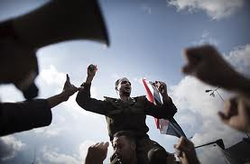

# ＜开阳＞读王天成《大转型：中国民主化战略研究框架》（中）

**渐进主义这些主张要么根本就是反民主的，要么就是不具有任何可行性。先推行部分的开放和自由化来换取民主的“积累”，这种制度设计看起来非常诱人，能够带来中国的进步，但是任何观察了中国近二十年来的政治发展过程的人，如果不是站在当政者的立场上，都会知道中国最近20年来政治领域的开放程度实际上降低了，有限的自由化成果也在不断被侵蚀，身份标志重新出现了，政府对于社会的控制有进一步加剧的趋势，致命的是统治精英们似乎对控制这个国家越来越有信心了，当然这个很应该得到理解——他们要钱有钱，要枪有枪，控制媒体，掌握暴力。**  

# 读王天成《大转型：中国民主化战略研究框架》

# （中）

## 文/汪根松（中国人民大学）

 

民主巩固对于我们来说看似还是一个很遥远的事情，但是尽早探索能够保证我们在面临民主化来临之时有充分的准备，就如何巩固民主来看，我觉得是两方面的双管齐下才能巩固新生的民主：心理上以及制度上的加强。只有培育人民和政治团体相信只有在现有的民主框架内而不是通过其他非法定的途径来解决危机和问题的态度，只有在制度上和行为上深化和巩固民主的法治保障并约束主要政治团体只能在民主和法律框架内寻求化解危机，民主才有可能巩固。

在巩固民主的阶段，很重要的一点诚如作者所言是确定一个国家是采用议会制还是民主制来进行政治结构的设置。我个人对于议会制或者总统制并没有特殊的偏好，我反倒认为在中国这种条件下初期民主化巩固过程中总统制似乎更优，因为同我们同文同祖的台湾在民主化初期即采用的是总统制的方法（当然现在也是），这有利于民主秩序的确立并使野心家不能透过议会掣肘民主化的进程。

作者对各国民主化的划分是以自由化到第一次全国大选所经历的时间为标准的。根据作者的解释，自由化到民主化是整个转型过程的核心，诚哉斯言！自由化如果不能最终过渡到民主化，则一个国家的转型很可能逆转，因为并不能保证在位的威权统治者放弃权力，自由化的成果随时都有可能化为乌有。

关于转型时间长短的问题，作者认为如果转型是在威权领导人的控制下发生的且并未碰到重大的政权危机，则转型就相对较慢，这可以体现在台湾地区的转型过程中，在蒋经国去世之前，国民党上下的政权体系运转的相对还是有效率的，所以虽然1986年民进党就宣告成立了，但是直到国民党有步骤地开放党禁和报禁，民主转型的步骤才加快。

对渐进主义的评价和分析是本书的重要一部分，作者明显反对渐进主义的改革路径。渐进主义改革的支持者中我觉得首先应该认真对待的是“法治先行说”的支持者们，这种观点在中国无论是官方学者还是一些自由派知识分子都有很大市场，他们认同的核心观点是中国现阶段没有多大可能能够实现民主化，像自由选举和开放党禁这些关键性的步骤都不可能快速实现，唯一能够寄希望的是法治建设，以期先建设一个法治社会再通向民主化，同时他们也认为如果没有法治的保证，民主也会陷于混乱的秩序，会给国家带来无尽的灾难。

当然熟悉西方法治思想的人应该明白，法治的实现是有其前提的，一个自由选举的政府、开放的言论环境都是法治必不可少的，不然我不能相信我们会建立一个法治国家。在这些“渐进主义者”看来，我们的法治社会建设来自于威权政府的容忍和默许，甚至来自于他们的鼓励，这无异于与虎谋皮。

作者说得好，司法独立这种事是同全国自由选举、开放党禁纠缠在一起的，没有这些先行的条件，我们凭什么去要求司法独立？有什么可能统治精英会遵守他们制定的宪法？

至于民主与法治的关系，历来是扯不清的问题。民主国家可能没有法治，但是不民主的国家绝对不可能建立起法治，世界上并没有任何一个国家有这种“美好”的制度。

厘清这些问题的一个重要的步骤是需要我们确定到底什么是法治？我相信在很多“法治先行说”支持者中，也有很多人弄不清楚这个问题。法治的定义我觉得作者说的挺好，法治应该是以个人的自由和权利来限制政府，预防政府和其他主体侵犯个人的权利和自由。在威权主义下，我们拿什么来限制统治者？我们拿什么来要求法治？

对俞可平的解读很有意思，俞可平是近年来红极一时的“党内民主派”，因为写了《民主是个好东西》而名噪一时，似乎算是个民主派。其主张我以前也略有耳闻，叫做什么“增量民主”理论，我都感觉到这个人说起民主这个概念来万分崇拜，但是说到中国的民主问题来总是把一些官方的伪民主措施贴上“民主”的标签，搞不懂。把中国最近几十年来的一些社会进步归结于民主，真搞不懂，民主不是自由选举、言论自由吗？和政务公开这类的事情有任何的关系吗？

周舵这个人是当时“四君子”之一，名噪一时，如今刘晓波得奖，周舵仍然在国内（我感觉到很奇怪，怎么他没有被出国啊？），周舵在政治风波之后政治观点趋于保守，主张渐进式的改革，以宪政推动民主化，读过他的文章，文章写得真是不错，但是政治观点不敢苟同，我搞不清楚这些人怎么可能想象中共能够允许宪政建立，我们拿什么来约束他们守法、要求他们保证司法的独立啊？你不能想象政治精英们主动放弃自己的政治特权，特别是中国的那些政治精英们。老子打天下儿子坐，咱中国人最相信这点了。

作者对中国渐进主义的发展和理论的评价是中肯的，也指出了渐进主义这些主张要么根本就是反民主的，要么就是不具有任何可行性。先推行部分的开放和自由化来换取民主的“积累”，这种制度设计看起来非常诱人，能够带来中国的进步，但是任何观察了中国近二十年来的政治发展过程的人，如果不是站在当政者的立场上，都会知道中国最近20年来政治领域的开放程度实际上降低了，有限的自由化成果也在不断被侵蚀，身份标志重新出现了，政府对于社会的控制有进一步加剧的趋势，致命的是统治精英们似乎对控制这个国家越来越有信心了，当然这个很应该得到理解——他们要钱有钱，要枪有枪，控制媒体，掌握暴力，要是换做我我也会越来越有信心，而纵观最近一波——甚至历史上的所有民主转型——无不是在政府统治面对危机之时才有发力的机会的，面对一个越来越强势的政府，我们拿什么让他们开放政治自由？难道凭借他们的道德吗？笑话。

当然谈到当代的渐进主义思潮，我们绕不过去天安门广场的枪声，也许真的如作者所说，天安门的枪声让所有人都变了，让他们一时之间不知所措了，内心经历了巨大的争斗，终于在外部和内心的压力之下，很多人开始反思自己的思想，包括1989年自己的行为，渐进主义逐渐找到了市场，并成为当今中国占主导地位的政治改革思想。也许那些枪声让他们体会到了恐惧，他们把这些枪声带来的混乱和失序当做是快速民主化的恶果，认为如果我们不那么着急要求民主和自由，也许民主就会慢慢到来，多么幼稚的想法啊。

1992年邓小平南巡，中国正式开始了政治控制下的市场化改革，同时期东欧和苏联的政治转型也已经基本完成，经济出现了复苏的痕迹，20年过去了，东欧国家早就摆脱了民主化初期的动荡，国民经济、政治自由都有了实质性的提高，但是不知何故，他们昔日的盟友中国对他们改革的成果不加赞扬，反而在不断的强调东欧的激进改革带来了灾难性的后果，中国的渐进式改革取得了很大的成就。完全罔顾东欧国家在改革之后取得了巨大的成就——经济上的，更重要的是民主化和自由化带来的人的尊严的提升、经济增长日益为大多数人民分享。

英国式的民主化道路和法国式的革命道路晚清以降都是中国人议论的重要问题，在20世纪90年代知识界整体转向保守的大背景下，越来越多的人开始推崇英国式的道路而反思法国式疾风骤雨的暴力革命，认为英国式的道路代表了演进、渐进，能够在不损害原有秩序的基础上一步步的推动自由化和民主化，而中国未来的民主化就应该遵循这样的方式。但是我想任何熟悉英国历史的知识分子都应该知道，英国在光荣革命之后之所以可以通过渐进的方式推动民主的完善——我所说的是完善，不是民主化，因为英国的民主化在光荣革命之时就确立了，甚至可以说从1215年大宪章签订之日起，英国就有了一个良好的制度来确保臣民和国王之间的协商能够在某种平等的环境下进行，这一点同当今的中国是根本不同的，只不过因为之前无数的革命造就了一个平等的协商环境，在这种环境下，国王和臣民在重大的制度问题上的态度都具有重要的作用，任何一方都不能无视另一方的态度。明显的是，这一点同当代的中国相去甚远。

对于咱们这个情形十分特殊的国家来说，民主转型能否快速进行对于我们能否保证国家的完整、民族之间的团结是有很重要的意义的。我不敢肯定民主转型之后中国仍然能够保证对新疆、西藏的控制，保证国内错综复杂的民族关系能够和解，但是我能肯定一点，如果我们不进行改革，当有一天这个威权体制不能有效控制整个社会的时候——我相信这一天并不会太远——国家会立刻陷入分裂和动荡，只要你看看现在汉族人同维族和藏族人之间的关系就能得出这个结论。在新疆，在西藏，当地原住民同汉族移民之间的关系是非常紧张的，即使在内地的大城市我们之间也存在很深的隔阂，我相信只要同这些民族的人们有过接触的汉族人都不应该否认这一点。

（未完待续） 

（采编自投稿邮箱；责编：麦静）

 
