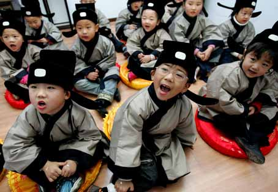
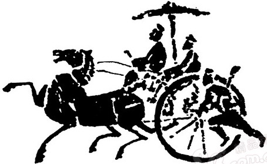

# ＜开阳＞谁来为“国学热”降降温？

**所谓的思潮与文化热也是如此，从来没有任何一个健康的社会是靠着一些“热”来维持甚至得以发展的，能够做出成绩来的也绝不是整日头脑发热的人。唯其去浮去躁，冷静安定地思辨、平心静气地探讨，把“国学”、传统文化放到一个合适的位置上来对待，不唾弃、不热捧，这恐怕才是一个民族真正走向文明成熟的标志。**

### 

### 

# **谁来为****“****国学热****”****降降温？**

### 

## 文/谷卿(暨南大学)

### 

### 

据报载，“学术超男”易中天在《先秦诸子百家争鸣》出版后，感觉很多问题阐述未尽，近日又推出了续篇《中国智慧》，并在接受采访时明确表态，“不想再上《百家讲坛》了”，同时还强调，他对于“国学”的提法表示“非常反感”。 确实如此，“国学”本不是一个合适而恰当的提法，更“热”得让人始料不及。我们现在几乎无日不谈的“国学”，当年第一次被作为口号提出来的时候，就具有着鲜明的意识形态意味，在晚清民国西学大潮席卷一切的情境下，立志于整理国故的传统学人竖起“国学”大旗以对抗“西学”的冲击。新时期以来，所谓“国学”的复兴开始于上世纪八十年代末九十年代初，与当时大众文化占尽风流的情况发生的同时，之前一度湮没无闻甚至惨遭毁灭性打击的传统文化此时正以各种新创和变型的方式参与到商业活动中，作为一种背景映衬着现代化社会，发挥着“点缀”的功能，并通过商业的品味性包装这一露面方式逐步过渡为一种人人必谈的时髦；而在心理层面，呼唤着和平、统一与民族复兴的世界华人迫切地需要一种超越阶级、政党的来为他们起到感召、激励和团结的作用，于是传统文化的各种形态的资源在较短的时间内迅速得到了整合与一轮又一轮的重新阐释，以至于能在各种不同的场合与环境下发挥特殊的功用。这就是文明所谓“国学热”的背景，其实称之为“传统文化热”更为恰当。 

 待到新世纪，在全球化的语境下，民族性的焦虑直接促成和激发了持续的传统文化热，一些老一辈的知识人开始通过追忆、怀念旧时故事，介绍传统文化，来为经济活动中的人们寻求文化和心理上的补偿与慰藉。就这样，大众文化的发展伴随着“经典”和“传统”的不断“加盟”而呈现出极具中国特色的表征来。当年使得阎崇年、易中天、纪连海和于丹一炮走红的《百家讲坛》就是这种以传统文化（经、史、子、艺）为传播主体的大众文化形式。这种文化经营模式、传播方式本质上是一种以轻松、娱乐的形式对传统文化进行消费的行为，与“国学”根本是风马牛不相及的，与学术研究无涉，但在全社会处于文化饥渴状态下普及文化经典常识确有不可忽视的作用的。 “国学”是学问、是学术研究，本不应走向大众、走向市场，钱锺书先生说：“大抵学问是荒江野老屋中，二三素心人商量培养之事，朝市之显学必成俗学。”现今的“国学热”不仅消解了学问的神圣性，引来各种庸常陋见置喙其间，更由于科学意识、现代媒介的介入破坏了学术传统，模糊了人文学科的研究与科学研究、文化传播的界限，造成了大量的误读、误判、误传。其实，我们现在成天把“国学”与文化挂在嘴边，恰恰昭示着我们没文化没怕了，就像一个家族是八辈贫农，穷怕了，连做梦都心惊胆颤，一见到什么略微值钱的东西，全都细大不捐地一气儿揽回。岂不知越是炫富越是证明自己贫穷，越是天天大谈特谈“国学”，越是证明文化常识缺乏得厉害。 我曾写过一篇小文，叫做《国学研究的基本对象》，专门回答一些朋友的提问或廓清大家对一些基本概念的误解。常有认识或不认识的朋友认为我是“研究国学的”，更有戏称我为“国学大师”者，实在令我惶恐不安、哭笑不得。当时写它的目的，就是希望大家在对国学研究对象有所了解的情况下，对学问多一点敬畏、对文化多一点敬畏、对“大师”多一点敬畏，若像某些盼成功、想出名、走捷径的“大师”、“天才”那样，坐井观天、夜郎自大，好似“国学”、“文化”之命脉皆在我口手之中，只待“千载之后，配享文庙”，恐怕只能看作是急功近利的娱乐社会的一场小小闹剧——而现实就是如此，每天上演着许许多多诸如此类的闹剧。 

 从医学角度而言，引起人体发热的原因有很多，比如感染、胶原病、恶性肿瘤等等，都是导因。发热对人体既有利也有害，体温不太高的时候，医生一般建议无需用药。可是，持续的高温不退就不是正常现象了。所谓的思潮与文化热也是如此，从来没有任何一个健康的社会是靠着一些“热”来维持甚至得以发展的，能够做出成绩来的也绝不是整日头脑发热的人。唯其去浮去躁，冷静安定地思辨、平心静气地探讨，把“国学”、传统文化放到一个合适的位置上来对待，不唾弃、不热捧，这恐怕才是一个民族真正走向文明成熟的标志。 

### 

### 

（采编:安镜轩 责编:刘一舟）

### 
