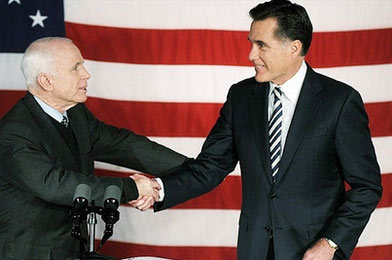
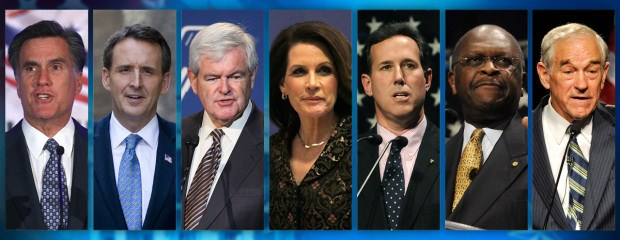
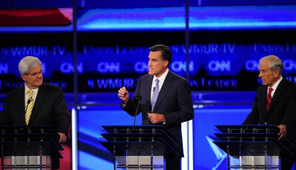
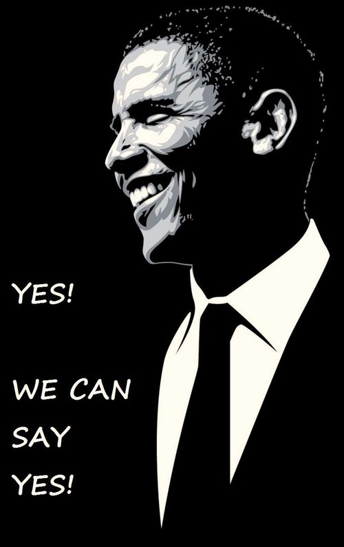

# ＜开阳＞谁来挑战奥巴马：2012美国共和党初选中期解读

**经济形势略有好转、击毙本拉登、奥巴马筹款能力惊人，乃至共和党迟迟未产生“领头羊”都成为了人们判断奥巴马可以连任的原因。那么，奥巴马真的不可战胜吗？**  

# 谁来挑战奥巴马：2012美国共和党初选中期解读

## 文/方忱（外交学院）

 

随着罗姆尼在本次共和党内初选的最大对手桑托勒姆宣布退出，共和党的2012大选候选人已经基本锁定。截止4月17日，罗姆尼已经赢得了684张选举人票，而根据规则，一旦获得超过1144票就能拿下初选——罗姆尼距离这条终点线只有不到500票了。更重要的是，桑托勒姆退选以后，排名第二的金里奇现在只有136票，追上罗姆尼的可能性已微乎其微。

其实，哪怕桑托勒姆没有突然退出，罗姆尼的胜利也是十拿九稳。进入三月以来，罗姆尼节节胜利，逐渐拉开了他和桑托勒姆的差距。即使在被认为是桑托勒姆占据优势的密西西比、阿拉巴马、俄克拉荷马州等州，罗姆尼跟他的差距也微乎其微。当4月初罗姆尼在威斯康辛取胜后，两人的差距已经接近400票。考虑到罗姆尼的选举财力远胜于他，桑托勒姆的后劲显然不足，退选自然是迟早的事。尽管金里奇和罗恩-保罗仍在苦苦支撑，罗姆尼如今已经开始以共和党候选人自居，将矛头逐渐转向奥巴马了。

#### 谁是罗姆尼？

今年65岁的罗姆尼生于一个美国摩门教的显赫家庭，父亲曾担任三届密歇根州州长。罗姆尼在哈佛大学的商学院和法学院取得学位，成绩优异。毕业后，他加入波士顿咨询公司，并很快在业界声名鹊起。几年后，他便加入贝恩资本（Bain Capital）并担任副总裁。在贝恩公司的十几年打拼中，罗姆尼取得了巨大成功。通过“收购频临破产的企业，扭亏为盈，再打包卖出”的策略，罗姆尼将公司资产从创业时的3000万美元增值到90亿美元，成为了私募股权投资基金领域的常胜将军。1999年，他临危受命担任盐湖城冬奥会的组委会主席兼首席执行官，奇迹般地扭亏为盈，更使他声名大噪。2002年，罗姆尼当选马萨诸塞州州长，任内推行的全民医保、平衡财政使他成功地向政治家转型。2008年，罗姆尼宣布参加共和党总统候选人的角逐，最终败给了麦凯恩。

从履历上看，罗姆尼似乎是个“完美”的总统候选人：他是无比成功的CEO，而今天的美国看上去就是一个濒临破产的公司。这个债台高筑、就业不振的庞大经济体不正需要“扭亏为盈”的魔力吗？可是，为什么罗姆尼会在08年输掉共和党初选呢？

原因很简单——在共和党，罗姆尼的劣势和优势一样突出。罗姆尼是摩门教徒，这和共和党文化保守主义的主力福音派相冲突，被视作异端；罗姆尼在担任麻省州长时力推医保，时至今日，这套罗氏医改甚至成为了奥巴马医改的蓝本。这套高福利政策无疑是和共和党主流的小政府、自由放任的经济观念相抵触的；在外交政策方面，罗姆尼倒和共和党主流没有太大分歧，但他亦无重要资历。相较之下，越战老兵麦凯恩就有明显优势了。文化、财政、外交政策的保守主义倾向是共和党的“立党之本”，罗姆尼却在这些问题上丝毫不占便宜，甚至还严重丢分，难怪不受共和党主流待见了。

不过，08年的失败对于罗姆尼来说也未尝不是一件好事。首先，那年的大选，共和党几乎是必败的。在麦凯恩这样的“独行侠”都需要尽全力辩解“我真的跟布什不一样”的情况下，倒还不如不在初选中出线，为未来参选留底牌。其次，相比民主党，共和党更讲究论资排辈，四年前的第二把交椅往往会在四年后被推到前台。里根之于福特，老布什之于里根，麦凯恩之于小布什，均是如此。罗姆尼在08年输得相当体面，这也许是个共和党的传统“好兆头”。当然，更重要的是，罗姆尼终于从失败里摸到了赢得初选的门道：必须把自己打扮成一个“真正”的共和党人！

在历年美国大选中，最后两党对决的结果往往取决于中间选民的取向。然而，在初选中，尤其是共和党的初选，四平八稳、八面玲珑的“中间派”、“温吞水”基本都是要被淘汰的。这样的候选人往往被认为不能代表共和党的价值观。换句话说，意识形态的“正宗”是获得共和党提名的前提，如果对“小政府、自由市场、反堕胎、持枪权利”都犹犹豫豫，他还是个共和党人吗？显然，罗姆尼通往白宫的道路，注定需要一路向右，等甩掉所有党内对手后，再把自己的路线调回来。

跟四年前相比，罗姆尼明显变得更“像”共和党人了。尽管奥巴马医改和他在马萨诸塞州州长任内推动的医改如出一辙，罗姆尼大举批判奥巴马的医疗改革，直呼其为“灾难”，主张彻底废除奥氏的整套改革。经济政策上，他高举共和党的传统武器，呼吁减少政府对企业的干预和监管，降低对企业和富人的税收，削减政府赤字，减少政府开支。在对外政策上，罗姆尼则摇身一变，成为了共和党人最强硬的鹰派——他反对削减国防开支，反对从阿富汗撤军，支持以色列对伊朗施压。他抨击奥巴马政府在外交方面“令人吃惊地软弱”，还声称如果自己当选，将在上任第一天把中国列为货币操纵国。更令人印象深刻的是，他在2月11月的保守政治行动会议上公开表态：“我是严重的保守主义者！”（I am severely conservative）。罗姆尼的这句自白被美国媒体广泛转载，并被视作罗姆尼欲扛起共和党大旗的宣言。当然，奥巴马方面也拿这句话做文章，暗示选民罗姆尼激进、不靠谱。

#### 谁来打败罗姆尼？

今年的共和党内战在一月初正式打响。在艾奥瓦州的第一场选战开始之前，罗姆尼已经被不少人看好，但是他的优势并不明显——前众议院议长金里奇的呼声就跟他不相上下。当然，这种形势的出现也跟其他的热门候选人频频犯错有关。我们不妨来看看罗姆尼的对手都有谁。

里克-佩里，德克萨斯州州长。他政治资本雄厚，也得到保守派的认可，但在台面上表现太糟糕。去年底的电视辩论中，面对罗姆尼这样的经济专家的高谈阔论，他只能生硬地把经济问题往他熟悉的能源问题上扯，最后还闹出“大脑短路”的知名笑话。可以说，在选战开始前，他已经被淘汰出局了。

赫尔曼-凯恩，食品业企业家。作为一个白手起家的非洲裔美国人，凯恩是选战中唯一的没有任何政府经验的候选人。但出人意料的是，这似乎并没有成为凯恩的短板。在去年9到10月，凯恩甚至一度成为了领跑者——他提出的“三九税率”简单明了，令人耳目一新。真正击垮凯恩的，还是接连爆发的性丑闻。12月初，凯恩宣布退选，转而支持金里奇。

米歇尔-巴赫曼，茶党领袖，明尼苏达州众议员。一时间轰轰烈烈的茶党运动给了巴赫曼很大的信心，但显然她高估了自己的能量。巴赫曼参选后的支持率一直在下滑，很快就不得不退选。

洪博培，前美国驻华大使、犹他州州长。洪博培可能是中国人最熟悉的候选人，但对于美国人来说，他可能又是名气最小的候选人。实际上，洪博培的背景和罗姆尼有许多相似之处：商业背景、摩门教徒、州长……甚至连长相都有几分相似。但是，罗姆尼的优势也是全方面的，洪博培在一个比自己更强的“相似者”面前没有胜算。新罕布什尔的选战结束后，洪博培宣布退选，并转而支持罗姆尼。

这样一路算下来，我们发现，其实还留在选战里的人已经不多了。罗姆尼的对手，似乎只剩金里奇了。

金里奇是共和党内的大佬。1994年，金里奇率领共和党上演大翻盘，一举终结了民主党在众议院长达42年的第一大党历史，金里奇本人也成为了艾森豪威尔时代后首位共和党众议长。这位历史教授出身、写过17本专著、20年前就是风云人物的政坛老江湖号称保守主义的思想家。如果说罗姆尼的最大劣势是他抓不住共和党的主流符号，那么金里奇就恰好相反——还有谁比金里奇更能代表共和党的“思想”呢？在桑托勒姆崛起以前，由于茶党、保守派的候选人纷纷下马，金里奇给人这样一种印象：那些不喜欢罗姆尼的，都投给我吧！

不过，金里奇当然不是完人。如果考虑重视家庭伦理的传统共和党价值观，金里奇简直就是一个伪君子。1962年，年仅19岁的金里奇娶了自己的高中老师，年仅26岁的Jackie。大约20年后，Jackie得了癌症，金里奇却在和一位叫Marianne的女士偷情。当Jackie刚动完手术，尚在医院恢复时，金里奇把一纸离婚协议书摆到了她面前。不久，金里奇和Marianne完婚。可到了1993年，金里奇又开始和另一位叫Callista的女士偷情。7年后，金里奇迎娶了自己的第三任妻子。要知道，金里奇在九十年代是共和党通过性丑闻弹劾克林顿的主力干将——人们纷纷提出质疑：你怎么可以在白天义正词严地去谴责克林顿，晚上却在干同样的事情？

但需要注意的是，“再婚”在美国政坛虽然不那么光彩，但也算不上“致命伤”。这就好像罗姆尼夫妇虽然是“高中同学，青梅竹马”，家庭和谐，但也不足以单凭这个送他进白宫。

#### 桑托勒姆：意料之外，情理之中

当艾奥瓦州的选战揭开共和党初选的序幕时，不少分析家都看好金里奇拿下第一战。艾奥瓦是一个基督教福音派拥有主导权的州，从理论上讲，金里奇、佩里、凯恩这样的典型保守主义者胜算极大。罗姆尼这样的温和派非常吃亏。考虑到其他佩里、凯恩等人已经退选，金里奇看上去十拿九稳。可是，最终的结果却令人大跌眼镜：金里奇仅位列第四，而罗姆尼竟然高居第二，得票几乎是金里奇的两倍。更令人吃惊的是，艾奥瓦的胜利者居然是名不见经传的桑托勒姆。（最初的统计结果是罗姆尼险胜，后来经过修正，确认桑托勒姆获胜）

这里面其实有两个问题：第一，为什么金里奇会在艾奥瓦输给罗姆尼？第二，为什么赢下艾奥瓦的是桑托勒姆？

先看第一个问题。如前文提到的，罗姆尼在艾奥瓦州的选举是非常吃力的。福音派宁可选择虽然结巴，但至少信仰纯正的佩里，也不会青睐这位“混进共和党的异教徒”。可是，我们也需要看到，福音派选民虽然能够牢固地坚守自己的价值观，但他们却一直没有找到一个稳定的支持对象。从巴赫曼到凯恩，从佩里到金里奇，这些保守主义者似乎都无法逃脱“兴也勃焉，亡也忽焉”的命运。自12月下旬始，可能是受选举资金告急和负面新闻双重打击的影响，金里奇的民调步步走低。更何况，桑托勒姆的出现让本来计划给金里奇投票的选民们有了新的选择——同样是保守派，桑托勒姆既真诚、又年轻，为什么要选一个在华盛顿厮混了几十年的老家伙呢？

所以，第一个问题的答案和第二个问题的答案密不可分。很大程度上，正是桑托勒姆分走了金里奇失去的选票。

桑托勒姆今年只有54岁，比他今年的几个主要对手都年轻不少，但是，他却已经在美国的政治中心活跃了20多年了。1990年，32岁的桑托勒姆被选为美国众议院议员，成为当时最年轻的众议员之一。1995年，在金里奇领导的下，共和党取得大胜，桑托勒姆也借此东风当选了宾夕法尼亚州的参议员。2006年，桑托勒姆在参议员竞选中遭遇滑铁卢，惨败给民主党对手。和金里奇、罗姆尼这样资本雄厚的参选人比起来，桑托勒姆实在太不显眼。

是什么让这位支持率一度低于百分之一的候选人变身黑马、脱颖而出呢？答案在于，桑托勒姆超强硬的社会文化保守立场迅速地凝聚了“保守主义”涣散的人气。那些对凯恩、佩里失望的保守派们，终于看到了一个强悍的共和党价值观卫道士。

这个虔诚的天主教徒有六个孩子，其中最小的孩子伊莎贝拉患有严重的先天疾病，存活可能性极低。但桑托勒姆坚持不放弃，在全家的精心照料下，如今她已经三岁了。桑托勒姆也曾向媒体表示，女儿的病情是让他做出退选决定的重要原因。一个更动人的故事则是桑托勒姆的妻子曾经生下一个仅20周的早产儿，出生后不到两小时就死亡了。但桑托勒姆夫妇仍然坚持把死去的婴儿抱回家，介绍给其他尚且年幼的孩子。当晚，夫妇二人则躺在死婴两侧，守候一晚上。在他们看来，这种仪式是对生命的尊重，全家都应该意识到这死去的婴儿也是我们家庭的成员。

桑托勒姆在社会文化议题上的立场在保守选民，尤其是福音派信徒中间很有感染力。他坚定地反对同性婚姻和一切情况下的堕胎行为，把保守主义的文化观念发挥到了极致。就在前文中提到的罗姆尼自称“我是严重的保守主义者”的那个场合，桑托勒姆向与会者表示：竞选不仅关乎就业和经济，同时也关乎一系列“基本原则”。 桑托勒姆坚定的保守主义者形象，不但跟人们眼中罗姆尼“摇摆不定”的印象产生对比，更是跟金里奇的“嘴上仁义道德，背地浪子风流”产生落差。从这个角度看，在艾奥瓦州旗开得胜的黑马桑托勒姆赢得既在意料之外，也在情理之中。

#### 罗恩-保罗为什么而战？

艾奥瓦一战，金里奇丢尽了面子。如果输给罗姆尼还可以归因于对手财力惊人，在艾奥瓦这样的弱势州也舍得花大钱助选，那么惨败给默默无闻的桑托勒姆就很难再找借口了。艾奥瓦的失利打击了金里奇团队的士气，而遗憾的是，他的颓势仍在继续。一周后，在新罕布什尔州，罗姆尼取得大胜，金里奇依然排在第四位——不同的是，他的得票还不到罗姆尼的四分之一。结果公布后，麦凯恩亲临罗姆尼的竞选现场给予支持，也从侧面反应出共和党党内大佬对金里奇已经基本失去信心。

虽然金里奇在随后的南卡罗来纳州意外取胜，但在佛罗里达败给罗姆尼后，金里奇其实已经无力回天了。在佛罗里达这样拥有1900万人口的大州，候选人投入广告的费用是巨大的。金里奇只能指望罗姆尼连续犯错，否则他有限的预算根本支撑不了今后在加利福尼亚、德克萨斯等大州的选举。另外，在一月份，竞选是在艾奥瓦、新罕布什尔、南卡、佛罗里达逐一进行，然而进入二月份，尤其是三月份以后，经常是几个州同时开选。在被称作“超级星期二”的3月6日，甚至会有11个州同时开选的盛况。这样的选举形势，只会对资金充裕、选举布局完整的罗姆尼有利。事情的发展果然不出所料。除了在自己的家乡佐治亚州以外，金里奇一场未胜。

在桑托勒姆宣布退选后，留在选战中的只剩下罗姆尼、金里奇和罗恩-保罗三人。在金里奇颓势尽显后，党内大佬纷纷劝其退选，避免加深党内恶斗，让奥巴马渔翁得利。前议长距离退选恐怕只有一步之遥了。然而，哪怕我们已经可以断言“罗姆尼必定拿下初选”，也不能得出“共和党初选很快就要结束”的结论。因为，还有一个人在顽强地战斗——罗恩-保罗。

今年77岁的保罗已经有17个孙子女和1个曾孙了，但他也很有可能是当今美国最有活力和耐力的政治家。和罗姆尼一样，罗恩-保罗也参加了2008年的共和党初选，但一个令人吃惊的事实是，当麦凯恩于3月赢得1191票率先撞线赢得初选以后，保罗仍然没有放弃——他一直坚持到6月才正式退选。今年的选战中，罗恩-保罗迄今为止只赢得55张选举人票（但已经超过08年他得到的所有票数），排在罗姆尼、桑托勒姆和金里奇之后。但很显然，这次他同样不会轻易地退出——对他来说，选战的意义或许根本不是选总统，而是传播自己的思想理念。而这种特殊的使命感，让他在成为选举的最大异数的同时，塑造了一个“思想战士”的形象。

保罗的经济主张，是纯正的奥地利学派。他反对增税，支持政府削减开支、消减赤字，甚至提出废除美联储、恢复金本位。他坚决反对任何形式的政府干预，坚持宪法对个人权利的保障。在外交政策上，他奉行孤立主义。保罗不但强烈反对伊拉克战争，还提出美国应从世界各地撤军，甚至退出联合国。

不难看出，保罗的政治观点显得太过“异端”，赢得选举的可能性微乎其微。然而，我们绝不能忽视保罗参选的重要意义——而且事实上，考虑到他的“异端”特点，保罗的成绩一点都不差。在艾奥瓦州，保罗仅落后罗姆尼和桑托勒姆3个百分点，几乎取胜。在新罕布什尔州，保罗更是高居第二，得票比金里奇和桑托勒姆加起来还多。

了解保罗的政治观点，是理解保守主义和共和党核心价值的一把钥匙。一个有趣的现象是，虽然其他共和党人一再把自己打造成保守主义的代言人，但他们的实际施政却往往是与保守主义原则向背的。比如，布什总统在他的任期内不但没有奉行“小政府”，反而大大扩张政府权力，大量举债；在外交政策上，布什的决策更成为了保罗在国会中的主要批判对象。很显然，如今很难再说共和党人是一个真诚地奉行“小政府”的了。但是，保罗例外。

还有一个典型的例子是在堕胎问题上的态度。和其他候选人一样，保罗旗帜鲜明地反对堕胎，但同时，他声称“政府不应干预民众在这一问题上的选择”。所以，在保罗的思想体系中，“小政府”观念是高于一切的，尤其高于那些对具体问题上的投机和表态。

于是，我们也不难理解为什么保罗有“不先生”的绰号了。在国会，保罗是最坚定的“原则派”，曾有人形容他是“完全奉守原则而且绝不让步”的人。保罗从来不向政治行动委员会（Political Action Committee）收取补助、从来不向国会里的游说份子低头、从来不因为政党的利益而支持自己不认同的法案，而不像其他政客那样不停地妥协。

这也就是为什么许多人愿意支持这个看上去永远不可能赢得大选的候选人。同样，在共和党初选阶段充满火药味的相互攻讦中，也鲜有候选人攻击罗恩-保罗——这不仅是因为他们明白保罗不可能赢得选举，也因为他们清楚保罗在选民心中享有的美誉度。你可以说保罗脱离实际（其实关于这点也很有疑问），但不能指责他的真诚。另外，值得注意的是，保罗之所以能在选战中支撑那么久，也跟他在民众中得到的广泛赞誉有关。保罗的筹款能力非常强，对年轻人的吸引力也很高。据说，如果美国大选在Facebook上进行，保罗肯定能赢得大选。

当然，我们必须面对一个事实：保罗不可能战胜罗姆尼。但是，我们不能忽略他以及他为之而战的理念。无论今年他选择在什么时候退选，我们都应对这位真正的保守主义者致以深深的敬意。

#### 桑托勒姆的最后一搏

在金里奇一蹶不振，而罗恩-保罗只是异数的情况下，能和罗姆尼竞争的只有桑托勒姆了。对于厌恶罗姆尼的福音派、茶党以及其它激进派别来说，阻止罗姆尼的最现实手段就是把票投给桑托勒姆。事实证明，桑托勒姆的确一度取得了理想的成绩，他在艾奥瓦的横空出世绝对不是昙花一现。

二月份，罗姆尼不得不面临来自桑托勒姆的极大挑战。在明尼苏达、科罗拉多这两个他曾在2008年战胜过麦凯恩的州，他竟然都遭遇惨败。桑托勒姆不仅在这两个州取胜，还在密苏里州赢得55%的选票，一举破了自己共和党初选以来的最高得票记录。

二月份桑托勒姆取得的三连胜，可以被看作桑托勒姆的最后一搏。进入三月份后，桑托勒姆的选情也开始下滑，胜利的天平最终倒向了罗姆尼。除了在福音派票仓堪萨斯取得大胜外，桑托勒姆为数不多的胜利都赢得相当艰难。他在“超级星期二”中的表现也不如预期，仅仅赢得三个中部州。

不过尽管如此，桑托勒姆的表现已经足以令他自己感到满意了。从一个落选参议员和支持率只有百分之一的候选人，一举上升为罗姆尼的最大对手，他很可能已经把目光放到了2016年。而且，我们注意到桑托勒姆在赢得艾奥瓦州后主动进行了战略转变：在选战开始前，他的主要标签是“坚定的文化保守主义者”，然而，在看到了自己的崛起势头甚至胜选可能后，他已经开始把自己要争取的主要选民群体转向“蓝领阶层”，而不是单纯的福音派选民。

桑托勒姆开始不断地在演讲中抨击罗姆尼不懂民间疾苦，维护华尔街和少数精英的利益。还强调自己出生在矿工家庭，而非罗姆尼“四世三公”的政治世家。在选举过程中，他甚至自己开着小卡车跑遍各县，展现他的淳朴和真诚。桑托勒姆的战略简单而直接：既然我没有罗姆尼那么有钱，那不如直接争取蓝领、争取草根，用99%战胜1%。桑托勒姆的转变的确起到了效果，据统计，在蓝领选民中，桑托勒姆的支持率比罗姆尼高10个百分点。桑托勒姆在密歇根的胜利也是一个重要成果。

之所以说桑托勒姆在二月的胜利是“最后一搏”，也与他的胜利跟当时的时事变化有关，不具代表性。二月初，奥巴马宣布新的医保改革措施，改革将强制要求美国各宗教医院和学校为雇员购买避孕药物保险。这个决定在美国的天主教群体中引起轩然大波，在反对避孕的天主教徒看来，这个强制规定将逼迫自己违反宗教信仰。多名主教在给总统的抗议信中提及“严重侮辱宗教自由”。在这样的背景下，本人就是天主教徒的桑托勒姆自然成为了这轮抗议的主要受益者——当然，通过前文的分析，我们应意识到最应该受益的其实不是桑托勒姆，而是罗恩-保罗。毕竟，奥巴马的这个医改新举措本质上是“大政府”的体现。但是，选民不会考虑那么多，因为从标签上看，桑托勒姆才是“文化保守主义”的代言人。

无论如何，桑托勒姆并没有在三月缩小他和罗姆尼之间的差距。而这，恐怕才是桑托勒姆退选的最大原因。

#### 奥巴马是不可战胜的吗？

随着罗姆尼在共和党初选的领先优势越来越不可撼动，人们已经开始讨论罗姆尼能否在年底的大选中击败奥巴马了。不过，多项民调显示，罗姆尼仍然落后奥巴马数个百分点。多数分析家也倾向认为奥巴马能成功连任。经济形势略有好转、击毙本拉登、奥巴马筹款能力惊人，乃至共和党迟迟未产生“领头羊”都成为了人们判断奥巴马可以连任的原因。那么，奥巴马真的不可战胜吗？

现在下这个结论为时尚早。奥巴马的第一个总统任期非常动荡，经济的疲软、外交的软弱都成为了共和党人攻击的目标，更不用提争议极大的奥巴马医改。奥巴马本人也非常清楚自己远未建立优势，所以当罗姆尼逐渐锁定共和党初选的优势地位后，奥巴马选择了主动出击，提早释放对抗罗姆尼的信息。

在近段时间民主党方面投放的一系列竞选广告中，罗姆尼已经成为了主要目标。罗姆尼的那句“我喜欢解雇人。我们应该能够解雇那些为我们提供服务的人”成为了重要标靶。民主党希望把罗姆尼刻画成一个“贪婪的资本家”，为了商业利益不惜一切代价。当然，罗姆尼在新罕布什尔发表这番言论的原意是表达“企业应当优胜劣汰，自由市场经济可以提高经济效率”，但把这句话单独拿出来，就显得罗姆尼不顾普通工人死活了。

其实，罗姆尼丝毫不避讳自己“大资本家”的背景，相反，他经常提及自己在贝恩公司对其它企业“救死扶伤”的经历。在罗姆尼看来，自己所在的私募股权投资基金挽救了大量濒临破产的企业，而这，不就是在创造就业机会吗？虽然民主党人攻击罗姆尼搞的是“秃鹰资本主义”，残酷地掠夺市场资源，但是，他们也必须面对贝恩资本在十年间创造了近10万个就业机会的事实。

罗姆尼最实打实的优势正是他在经济问题上“妙手回春”的美名。在进入两党对决后，罗姆尼很有可能将经济问题当作头号话题加以发挥。目前为止，民主党方面在经济政策上对罗姆尼的质疑主要是符号化的谴责，而对于罗姆尼来说，他可以举出大量的实据证明当今美国经济政策的失败。从这个意义上说，奥巴马在选战的头号议题上并没有任何优势可言。

外交政策方面，“诺贝尔和平奖得主”奥巴马一直承受着国内强硬派的猛烈抨击。但不得不承认，奥巴马在外交政策方面的成绩是相当正面的。从伊拉克和阿富汗抽身较为顺利，与盟国的关系大大加强，虽然美国在全球的地缘政治影响力有所下降，但这本质上是国际权力重心偏移的体现，不能归咎于奥巴马政府。另外，欧洲、亚洲国家目前都更倾向民主党连任——这是一个有趣的现象：以往，中右翼政党执政的欧洲国家以及希望看到美国在亚洲保持存在的日韩等国都是共和党的盟友，但在布什失败的八年任期后，他们都对共和党的外交政策表示疑虑。对中国来说也是如此，一直以来，中国更喜欢和奉行现实政治、鼓吹自由贸易的共和党打交道，而不是更重视人权外交和有保护主义倾向的民主党。然而，罗姆尼在初选中对中国的强硬态度，也使中国方面对罗姆尼有所顾虑。

对于现任总统来说，外交成果是一个重要的选举筹码，因为只有他可以摆出实际的成果。所以，只要在外交上不犯大错，外交政策都会给现任总统的连任计划加分。当然，我们不能忽略美国国内的保守派关于奥巴马外交软弱的批评，尽管这个问题的批评并不会成为左右大选结果的主因。

在2008年，关于罗姆尼的一个常见争议是他的摩门教背景。这在2012大选中肯定也会引起关注。不过，经过2008年的铺垫，这一问题给罗姆尼带来的负面影响已经淡化了。何况罗姆尼的个人形象上佳，家庭圆满，与丑闻绝缘，宗教问题并不是罗姆尼参选的主要威胁。不过，考虑到摩门教背景，南方福音派很可能不会在大选中支持罗姆尼，但问题是，他们更不可能支持民主党人奥巴马——然而在“蓝州”，民主党支持者却很有可能因为奥巴马政府在经济问题上的失败转而支持罗姆尼。从这个角度看，罗姆尼并非没有机会。

另外，也有人认为共和党今年的内斗颇为激烈，这很有可能造成共和党内部分裂，丧失团结。这个问题对于共和党的影响还有待观察。2008年，奥巴马和希拉里也一度斗得昏天暗地，但最终希拉里还是选择妥协，转而支持奥巴马。根据目前的情况看，桑托勒姆转而支持罗姆尼的可能性不大，这是否将成为罗姆尼未来选情的掣肘仍有待事实检验。但是，我们也需要注意到尽管各个共和党候选人的政见千差万别，但在一个问题上却是空前一致的：奥巴马的医改必须废除——再考虑到奥巴马医改的反对者包括大量穷人（最贫困的那部分美国人担心奥巴马医改将削弱针对他们的福利），共和党及其支持者的团结并非不能实现。

今天距离共和党召开全国代表大会还有四个月，距离大选还有半年，未来仍有发生变数的可能。但不出意外的话，2012年的这场对决将在奥巴马和罗姆尼之间进行。民主党方面早早确定了奥巴马的参选资格，而共和党则经历了跌宕起伏的党内竞争。罗姆尼看来已经通过了第一关考验——在回答谁来挑战奥巴马以后，是时候考虑如何击败奥巴马了。

 

（采编：尹桑 责编：尹桑）

 
