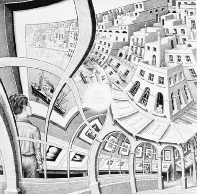

# ＜开阳＞退避者与乌托邦（上）——理想主义者的梦幻曲

**毫无疑问，退避者们是热爱自由的一群人，但他们所藉以追求自由的手段并非努力获取足以使自己无所求于人的财富，亦非试图掌握足以左右他人生死的权力，对他们而言，沉思意味着自由。他们清醒地认识到，对被诱惑与欲望包围的人类而言，知识与想象力具有极端的重要性，正是因为它们的缺失，更多的人只是在为他人而活，因此不可能拥有真正的自由。**

### 

### ** **

# 退避者与乌托邦（上）

# ——理想主义者的梦幻曲

## 文/刘昌东 （中国人民大学）

 “人性这根曲木，绝造不出可用之材。” 这是一句出自康德《世界公民观点之下的普遍历史观念》中的慨叹。自此而后，近现代以来的学者中曾发出过类似感慨的不知凡几，这句话的回音至今仍常常在我们的耳边响起。虽然他们说出这些话的场合与情境千差万别，但他们对人性总是怀着一种复杂的情感：既为它的难以把捉而烦扰，为它的极端不确定性而神伤，又为它无限的可能性而倾倒。每次读到那些类似的表达时，我总会努力去体味其中蕴含的无限精思，也时常试着对人性作一个自我的解读。尽管这样的尝试往往无疾而终，但在这过程中感触至深之时，也总会产生这样类似的感受：在关乎人类的事务中，完美的结果似乎是难以企及的。而在那些无法完美解决的事务中，最能撩拨起人们心弦的，又莫过于胸中炽热燃烧的理想主义的情感了。不幸的是，常常也就是这些我们不能慨然割舍的情感，使人性这根曲木失去了成材的机会。对于理想主义，我们每个人几乎都会觉得再熟悉不过，但熟悉永远不等于了解，侃侃而谈也并不意味着了然于胸。在我们身处的这个时代里，这些情感对我们究竟代表着什么？我们又该怎样对待自己的理想？我给不出明确的答案，谨以下面这些文字作为我的回答。 首先我想说的是，这个世界上有这么一种人，他们有不轻易向人屈服的勇气，但也没有高踞别人之上的傲气，这类人和社会组织不容易契合，于是，他们极力寻求逃避的地方，藉以享受几许孤寂的自由。这些气质使他们拒绝接受流行的诱惑，宁愿生活在纯粹思想的乌托邦中，专心致志于重要的工作，而不顾及一般的漠视与敌意，然后得到与一般流行的意见相反的知识。借用殷海光先生的概念，我愿意把他们称作“退避者”，比如伏沃小屋中的卢梭或是瓦尔登湖畔的梭罗，又比如分别隐居在海牙与哥本哈根的斯宾诺莎和克尔凯郭尔。 

 毫无疑问，这类人为数不多，尤其是在强调个人与社会有机融合的当下。乍看起来，这类人对社会是可有可无的，他们既不主动参与社会生活，又不愿意直接用他们的力量去改变别人的生活，他们只陶醉于自己的“小天地”，他们所深爱的生活，乃如罗素所说的“为爱所激发并为知识所指导的生活”，即一种以求知欲为伴的生活。他们的信仰是建立在对知识与真理的渴望之上的，他们致力于人类知识范围的扩展与开拓。他们拒绝简单地接受一种对世界的简单认识，努力用自己的方式去解释世界中发生的一切，而非仅仅接受别人的解释。他们喜爱独立的思考而非随波逐流，但这并不表明他们仅仅是社会生活冷眼的旁观者，毋宁说他们所期望的不是以直接介入的方式去改变社会的外在面貌，而是在精神领域中努力推动一场革命风暴的产生，他们相信一旦精神领域的革命完成，现实世界也不能无动于衷。“淡墨堆中有废兴”，这是他们对自己工作的认识，他们认为后人藉以评价前人的是这个时代留给了后人什么，而他们相信思想是我们所能留给后人的最珍贵的东西。追求能留给后人的最宝贵的思想，这就是他们的理想。 无疑，这是一个极具所谓“理想主义”色彩的想法，在一般人眼中，这无异于镜花水月空中楼阁，只是虚无缥缈之物罢了。但在退避者看来，这样的理想才最值得追求。因为人不同于其他的动物，人终究是属于两个世界的成员，一个是被因果律所控制的物质世界，另一个是其范围能够由我们自己决定的精神世界，而从一定意义上说，我们的思想能够走多远，我们便能在多大程度上拓展我们精神世界的范围。在因果律无所不在的物质世界中，我们无法享受到我们所期望的最大限度的自由，因为即使我们可以决定我们行动的目的与动机，但这一行动的结果却仍是不自由的，陷阱密布的自然随时可以将我们的努力甚至作为我们行动载体的身体毁灭。而在精神世界中，将不再有我们无法控制的因素掣肘，也不再有任何灾难可以彻底毁灭我们在这一世界中生存的载体——思想。因此，唯有思想与价值观念才是个体人格尊严的基础，是人存在的本质所在。这就是为什么退避者们会把思想置于如此至高无上的位置。 毫无疑问，退避者们是热爱自由的一群人，但他们所藉以追求自由的手段并非努力获取足以使自己无所求于人的财富，亦非试图掌握足以左右他人生死的权力，对他们而言，沉思意味着自由。他们清醒地认识到，对被诱惑与欲望包围的人类而言，知识与想象力具有极端的重要性，正是因为它们的缺失，更多的人只是在为他人而活，因此不可能拥有真正的自由。他们也深深地了解，斯宾诺莎为何会对财富，荣誉感和感官的快乐抱有如此深重的恐惧感，所以他们必须努力使自己保持高傲的独立性与超然的态度，以抗拒个体在社会中的同质化以及外在诱惑对灵魂的腐蚀。“安居自守，乐其所乐，不降志不辱身”，这或许就是他们需要的。 他们强调对于自我的认知与回归，他们认为回到自我，并不是故作清高或孤芳自赏，而是一种谨慎而自由的态度，是恢复个人内在秩序所不可或缺的。以流行的观点看，退避者们实在太自我封闭了。但人们忘了熟悉永远不等于了解，退避者们所追求的正是一种真正意义上的开放，一种以求知欲为伴的开放，他们认识到自己的无知，也从不否认认识善恶的可能性，他们勇于探索幸福的奥秘，把那些让他们安于现状的迷惑拒之门外。再来重新审视流行的观点，流行的开放不过是指对于任何强大事物的屈从，对世俗成功的崇拜，同时又以这个所谓的原则来压制别人。孰高孰低，明眼人一见便知，自不待言。然而不幸的是，自由终究是难以获得的，尤其是在自我意识式微的现代，退避者们的乌托邦疆域日蹙，几乎已经走到了尽头。那么这个理想的乌托邦是否能够继续存在下去，对我们的国家而言，这个乌托邦又有怎样的意义？这是接下来我想要探索的问题。 究其本质而言，乌托邦并不具有一个放之四海而皆准的精确定义，在现代西方自由主义者那里，它更多地被与法西斯和共产主义等极权主义政权联系在一起，但在这里我不想把它和政治意识形态更多地联系在一起，我所意指的乌托邦只能代表一种相信凭借人类思想的力量，未来终将超越现在的理想主义的情感，这也是退避者们共同秉持的情感。但就是在这一极为宽泛的定义上，乌托邦也正在渐渐消失，遑论退避者们所建立的那个理想者的国度了。 不得不承认的是，在文明高度发达社会力量空前强大的现代，个人想要脱离社会以获取个人自由是极其困难的。越来越明显的趋势是，现代社会正在变成一个充满蜜糖的大蜂窝，虽然到处流溢着蜂蜜，但人们的思考能力与独立性却日益丧失。高度发达的物质文明并不能带来梦想中的尘世天国，反而造成了物质与精神文明发展背道而驰的恶果。无孔不入的社会媒体宰制着人们的精神生活，事物的意义在信息与材料的汪洋面前显得前所未有的无力，人们可以极其轻松地获得前人难以想象的丰富信息资源，但人们的思考分析能力却并未得到相应地提升。思想上的充分吸收仍然需要付出大量的时间与极大的努力，但越来越多的人已经没有耐心再去等待那些迟缓的思想者们慢吞吞地思考，快节奏的生活需要快餐式的思考与表达，关键是你要去表达，至于你怎样表达则显得不那么重要。 

 于是我们可以看到，虽然参与范围不断扩大，媒体的责任意识与公共舆论的价值却在日益萎缩，人们对媒体信息与观点的依赖程度也在日益加深，独立的思考成为了代价昂贵的奢侈品，普罗大众被渐渐塑造成为缺乏思考能力与反抗能力而只具备强大纳税能力的动物群体，这也使得个人脱离社会变得越发不可能，自由更是遥不可及。大众文化带来的过度刺激使人们的感官逐渐麻木，严肃的话题再也提不起人们的兴趣，对消费文明的狂热导致了对政治的普遍冷漠，缺乏约束的娱乐精神将严肃的社会问题消解于无形，价值的相对化使得对善恶的明确认识也受到了怀疑，这种腐蚀性的怀疑主义让我们再也没有集体性的道德准则可以依赖，道德判断也失去了普遍性的力量。人们虽然时常对现实感到不满，但自我意识的缺乏使他们既看不到未来的出路也找不到自己的方向。 而在我们的国家里，退避者们生存的空间似乎更为促狭。在强势政府的背景下，个人意志显得极其卑微，由于缺乏有力的社群组织，个人往往被迫直接受到政府公权力的侵害，政府的公信力则在一次次群体事件之后成为了笑料；数千年从未改变的官本位下整个社会对于权力的崇拜与追逐使得政治成为了思想的沙漠，职业政治家们主宰了政治决策，人民成为了最为弱势的群体；当改革走过了前三十年，内生的文化动力似乎也已经失去，在冰冷的现实面前，人们再也无法指望用思想来改变自己的命运；承载着人们对未来期望的年轻人也不得不选择依附与妥协，毕竟体制是横亘在他们面前难以逾越的鸿沟。“未来会更好”正在沦为邀买人心和给予徒然安慰的工具，在这样的背景下，退避者几无立锥之处，更无须奢谈其他了。自由的思想者早已不容于当世，如果无法逆流而上，清者自清便成为了暂时的最佳选择。思想的地位从未像今天这样低落，而这就是退避者们所面对的现代，他们实际上已经避无可避。世事既已如此，退避者又到哪里去建立他们的乌托邦呢？ 如果把这群退避者们的理想比作舒曼的《梦幻曲》，那么看起来他们精心谱就的这支曲子已经不可避免地来到了尾声，每一个音符都显得无比沉重，难道这些自由最虔诚的信徒注定要为自由而殉道吗，他们的存在是否还有意义，他们又该做些什么以避免他们所捍卫的自由遭遇同样的结局？我想他们将证明自己配的上享有自由。 

（采编：项栋梁 责编：项栋梁）
