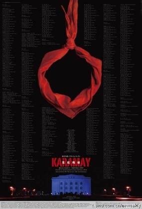

# ＜开阳＞逃离，或者改变

“**我们何其不幸，生在这样一个仍然拒绝现代文明的国家；我们又何其幸也，能够记录、推动并亲眼见证这个古老国度向现代文明的转型。胡舒立说，中国有很多故事等待讲述，它是任何一个新闻记者都梦寐以求之地。毫无疑问，中国的未来变革期待更多值得倾听和信赖的声音，我们要留下自己的声音。**” 

# 逃离，或者改变

## 文 / 常远（厦门大学）

### 

### 1

中青报今日的冰点特稿登了一篇[《人民会用脚投票》](http://zqb.cyol.com/content/2010-12/08/content_3459196.htm) ，讲述作家陈秉安创作《大逃港》背后的故事，读来让人唏嘘不已。 上世纪50年代至80年代，有将近100万名内地居民，由深圳越境逃往香港。这被研究者认为是冷战时期历时最长、人数最多的群体性逃亡事件，史称“大逃港”。想必对建国以来历史稍有常识的人，听闻此事时都不会感到吃惊，但是广东人民出版社新近出版的这本《大逃港》，由陈秉安先生耗时22年、参访百余名相关人物、搜集大量史料后写就，有细节有当事人的讲述，还原了宏大历史背景下个体的血泪与呼喊。 **在那位“世上美名尔享尽，人间坏事君做绝”的反革命家属主政大陆的二十七年间，这片土地活脱脱变成了惨绝人寰的人间地狱。从土改到对“黑五类”及其子女的迫害和歧视，从镇反到对前国民党留陆人员的清算，从反右到人类史上罕见规模的大饥荒，从毁掉一代人的知青下乡到文化大革命，无论你是书斋论道的知识分子还是躬耕田桑的农民，无论你是车间轰鸣机器旁的“社会主义主人翁”还是校园里朝气蓬勃意气风发的“社会主义接班人”，概莫能逃脱被体制车轮无情碾压的命运。** “当时对偷渡者的打击是异常严厉的。凡不经合法手续前往香港者，都被视为“叛国投敌”，抓到就处以收容。而边防部队对于偷渡者是最大的障碍。在上世纪60年代之前，边防战士遇到不听命令的偷渡者可以随时开枪，许多偷渡者被打死在滩涂上和山里。”可以想见，越境逃离的风险非常大，甚至称得上是“死亡之旅”，但几十年间依然有数十万人“前仆后继不畏艰难”，逃港现象直至80年代才逐渐少了下来。他们是在追求“天堂”里的富裕生活吗，不，他们只是想活下来，“活着”，仅此而已，但当时的大陆，早已冲破了这个底线。有个人“先后偷渡了12次都被抓住，创下了一个记录。到第13次，边防战士看了他都脸熟，实在不好意思再抓了，他才成功地逃到了香港”，唯有一个结论可以解释这种“把生死置之度外”的行为：**在这里生活下去的风险远远大于逃离的成本。** **铁丝网、急湍、高山密林、暴风雨、滑坡、警犬、身后呼啸的子弹、亲人的生离死别，什么都无法阻断，活下来的渴望，对自由的向往。这是人类生命的本能，是一切洗脑造神的政治运动肆虐之后，一切国家民族社会主义现代化等空洞宏大叙事的“紧箍咒”唠叨不停之下，仍然会存留、挺立的东西。** 当时没有做到的，今日区区的GFW又能如何？任何墙都无法将人类与自由阻隔。 

### 

### 2

不知怎的，我想起了十六年前的一场大火。1994年12月8日18时20分左右，新疆“两基”教育评估验收专场文艺演出在克拉玛依市友谊馆举行，舞台光柱灯烤燃纱幕，燃起大火，一个声音高喊：“大家都坐下，不要动！让领导先走！”20余名领导成功逃生，325人殒命，132人受伤，死难者中288人是学生，37人是老师、家长和工作人员。（纪录片《克拉玛依》[下载](http://sinaurl.%20cn/h4CzO6)） **时至今日，克拉玛依大火依然是人们心头的一块疤；十六年了，让人毛骨悚然的“让领导先走”依然在这片土地上回响。君曾见，“我爸是李刚”的嚣张跋扈；君可闻，长春六十码“打死你我陪”的人性消弭。十六年了，权力崇拜、皇权与奴性依然扎根在这片土地上，涤荡在长江黄河的上空；六十年了，权力仍然没有低下头来，被舆论和司法关进监督的牢笼。** 克拉玛依的孩子们在火海中尖叫哀号的时候，不曾有一个可以逃离的“蛇口深圳湾”：一个叫况丽的女官员，大火发生时凭借著对地形的熟悉钻进了厕所，又凭著成年人的力气，把原本可塞三十人以上的厕所反锁，任凭孩子们哭喊也绝不开门，事后在厕所门外地上发现一百多具学生尸体。他们如花般绽放的生命就这样凋零在一声理直气壮的“让领导先走”里。 整整半年前，南方周末一篇[《多少精英正在移民海外 他们寻求什么》](http://www.infzm.com/content/45945)引起了新一轮针对“移民潮”的关注与讨论。如今，逃离这里的方式不再像谍战片一样惊险刺激，也无需再付出如此惨痛的代价：拨通中介的电话，银行里备好充足的资金，操着优雅而流利的英文，穿上西装系好领带，站在美利坚英吉利或者那片袋鼠的土地上，深呼吸：你好，新世界。 与此同时，逃离这里的“道德压力”消失了，当人们得知你竟然成功离开了这个国家，眼睛里流露出的不再是对“叛国投敌分子”的同仇敌忾，而是掩饰不住的羡慕与向往。不过三十年，笼罩在这个国家国民身份上的“正义”和“荣光”消失得无影无踪。 

### 

### 3

曾经跟一个朋友谈起出国的话题。他说出去了就别再回来了，不管多难，都要留在外面，为了自己，也为了下一代。我说我曾经犹豫过，但现在想清楚了，不管怎样我都会回来。他说为什么？因为我要参与这个制度的葬礼。是的，亲手埋葬它。 西方社会的结构和形态均已稳固，均已实现或正在实践普世的民主与法制，社会流动的方向及规律业已成型，即使仍有变化，也是局部细节的小修小补，是量，而不是质变。而世界上只有中国，仍是“人类历史上最大试验场”，仍蕴藏着无限的可能性，变革的到来只是时间问题，你有着塑造一个领域的行业标准，开创一个时代的机会和可能。按照刘瑜老师的说法，国外是完成时，而中国是进行时。安替说，出国留学的人一定要回来，中国未来三十年一定非常精彩，莫要错过“看大戏”。 **没有什么比亲身参与甚至推动一个社会的变革更令人激动的事情了，更何况，这是祖祖辈辈生活的土地。坐在加州或欧洲小镇的阳光下悠闲的喝咖啡与在中国看到“事情逐渐起变化”，我毫不犹豫的选择后者。** **我们何其不幸，生在这样一个仍然拒绝现代文明的国家；我们又何其幸也，能够记录、推动并亲眼见证这个古老国度向现代文明的转型。胡舒立说，中国有很多故事等待讲述，它是任何一个新闻记者都梦寐以求之地。毫无疑问，中国的未来变革期待更多值得倾听和信赖的声音，我们要留下自己的声音。**

 曾经向两位朋友约稿，写一组呼吁留学生回国的文章。跟49年时回国“建设社会主义新中国”的一代留学生不同，我们知晓世界的模样，也看得真切这个社会的荒唐，大家回国来，共同改变它，推动它，开创一个崭新的伟大的时代，诉说一个关于中国的“光荣与梦想”。箐丰兄说回不回来是个人自由，此文不妥。想想也是，很容易写成“用宏大叙事裹挟个人选择”的激扬文字，理一理事实，说一说想法，也就罢了。 想逃离的，祝走成；留下来的，我们一起改变。 

### 

### 【编辑注】

本文原发于校内，因为关键词，导致新鲜事被屏蔽，各位读者可以前往原文地址分享此文支持作者。 原文链接：[http://blog.renren.com/blog/188752901/504183661?from=188752901](http://blog.renren.com/blog/188752901/504183661?from=188752901)
