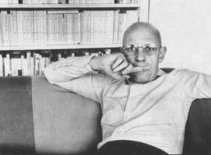
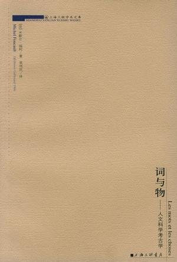
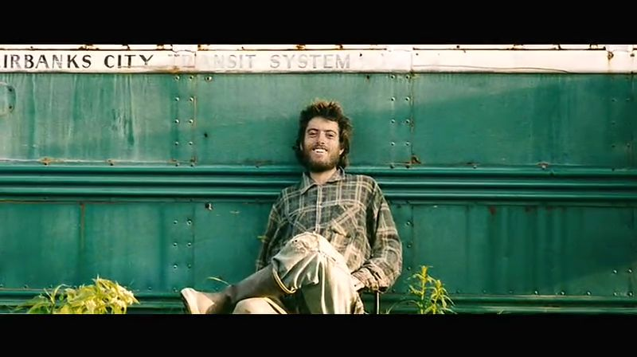

# ＜开阳＞逾越的快感

**理解福柯的关键词应当是“逾越”。因为不管是在学术研究还是在日常生活中，福柯都在不懈地追求逾越给他带来的生命快感，而且逾越也是福柯在古希腊罗马人中发掘的“生存美学”并试图以之来反思和重建现代人的自身的本质。通过逾越，真正的关心自己来获得自由、自律的美学化生活方式，也正是通过各种逾越，尤其是对文艺复兴以来的理性和人文主义以及自身的逾越，福柯对现当代思想界发挥了最持久、深刻而广泛的影响。 **  

# 逾越的快感

## 文/ 文靖（华中科技大学）

 

不理解福柯，便很难理解当代的人文社会科学。因为在福柯之后，人文社会科学不再是原来的人文社会科学。福柯因其思想的深刻性和视角的独特性，深深地影响了他之后的人文社会科学的发展，他的研究涉及哲学、政治学、社会学等众多学科。看似福柯主要关注的是一些边缘性的和之前很少有人关注的人和事，如疯癫、病人、犯人、惩罚、性史等，但福柯正是通过这些边缘性的人和事的研究，发掘了人文社会科学最本质和核心的问题，并使人文社会科学研究范式发生革命。他的影响广泛而又深刻。法国著名哲学家吉尔.德勒兹认为这个世纪将被称作“福柯时代”，德国法兰克福学派第二代大师哈贝马斯曾评价到,“在我这一代对我们的时代进行诊断的哲学家圈子里，福柯是对时代精神影响最持久的”。美国学者克利兹曼也曾由衷地说，“福柯之死在法国知识界造成了一个巨大的空白。在现代历史上，没有任何一个思想家像他那样对历史学、哲学、文学和文学理论、社会科学乃至医学产生如此之大的影响。”他的传记作者詹姆斯•米勒认为，“在仰慕者的眼里，他已经取代了萨特作为知识分子的象征：批评迅捷，勇于揭露权力的腐败，无畏惧地喊着左拉的著名口号‘我要控诉！’”。从这些众多的评论就不难看出福柯在社会上拥有何等的影响了。

那么应该如何去理解福柯呢？他从事学术研究的动机是一个很好的切口。“至于我的动机，它十分简单。...它就是好奇心，而且是唯一的好奇心，值得我坚持不懈的去实践它。不过，这种好奇心不是去吸收适合认识的东西，而是使得自我逾越得以可能。那么，坚持不懈地认识我们是否必须确保知识的获得，而不是以某种方式尽可能地确定认识者的失足，这有什么价值呢？...但是，如果哲学不是思想的自我批判的工作，那么当今的哲学（我指的是哲学活动）又是什么呢？如果它不是不再确定已知，也不是着手了解怎样和直到何时另一种思考才是可能的，那么又是什么呢？”我第一次看到这段话是在福柯《性经验史》的第二卷《快感的享用》中，当时就为之一震。后来看福柯的传记才知道，在葬礼上上，他的学生吉尔.德勒兹宣读悼文时就选用了这段话，再后来随着阅读福柯的更多的著作和对其学术生涯的了解，便发现这段话确实能很好的概括其终生追求和奋斗的历程。终其一生，福柯都在不断地逾越自我，他每一次写作都是对原来自我的偏离，每一次都采取与自己原有不同的思维方式进行思考。所以在一次采访中他对记者说道，你们不要期望我和原来的自己保持一致。因为在福柯看来这是多么的无聊。不仅他的学术观点如此，他的生活实践也是如此的，他的学术与生活实践是相辅相成的，生活中他在一次次的寻求极端体验中逾越自己。

****

他的逾越主要体现在如下几个方面。首先表现在对西方自文艺复兴以来确立的现代理性和人文主义等基本原则的逾越，正是通过颠覆文艺复兴以来建立的各项原则和成果，尤其是通过摧毁近代话语体系，使原有的理性与人文主义和人的观念面临前所未有的挑战，福柯通过在《词与物》中对整个西方人文社会科学的考古学研究，宣告了人的死亡。其次是对西方社会的各种具体制度和规范的逾越。如他在《规训与惩罚》中对西方监狱的权力谱系学考察，认为这种制度从之前的肉体惩罚到现在的深入灵魂，现代惩罚旨在震撼心灵，而不是肉体，监狱成了现代社会总体性的、连续性的监视体制运行的场所，权力以规训形式作用于犯人身上，规训技术主要通过监视、规范化和检查而发挥作用。福柯认为这种规训并不仅仅出现在犯罪和惩罚的场合中，在现代工厂、学校、军队中也广为使用，他认为现代社会就是一个规训社会，福柯通过一系列的相关研究深刻地揭示出权力对现代主体塑造的重大影响。福柯不仅通过自己的研究来实现对各种具体制度和规范的逾越，而且自己也积极主动投身各种政治运动实践，最后集中体现在一次次对自我的逾越。福柯的每一次写作都是对原来自我的逾越，尤其是通过实际日常生活的冒险，特别是通过自身的肉体对死亡和不可能的事情进行实际的和直接的体验。福柯认为人的真正价值就在于为自身创造的各种生活的可能性，使自己在不断逾越的好奇心的驱使下，经历各种生活之美，推动生活之美本身跨入广阔的自由境界。但是在福柯看来，生活之美是悲剧性和喜剧性的巧妙结合，他继承了尼采的观点甚至认为悲剧的价值高于喜剧的意义。因此，生活之美并不只是轻松愉快的享受过程，更是充满曲折、困苦、冒险甚至失败的经历，是一种悲壮之美、逾越之美。他的这种逾越之美其实就是他晚年在古希腊文化中发掘出来的“生存美学”，也是贯穿于他一生学术与生活中所关注的问题。

福柯一生所关注的基本问题始终是我们自身的命运。他既要研究我们自身的现状及其历史原因，又要寻求我们自身实现自由的美学生存的出路。福柯70年代之前集中讨论了知识考古学和权力谱系学，研究现代各种话语及其实践形式，并探讨真理游戏及其策略，为的就是揭示形成我们自身现状的历史奥秘，而在70年代之后关于性史、自我的技术、治理和生存美学的研究，是为了寻求我们自身现状的出路。福柯在不同的阶段关注的对象是很不一样的。但是通过这些不同的研究内容可以反映他一直关注的一条主线，那就是福柯一直在探索一种现代主体的谱系学，也就是现代主体是如何形成的。福柯用他特有的谱系学方式向我们表明，现代主体是如何在历史过程中逐渐获得今日之形象的。福柯认为，塑造主体主要有三种模式：知识塑造、权力塑造、自我塑造。正是通过这一主线，福柯试图去挖掘西方从古希腊到现在未曾发现的历史。我们必须把福柯关于知识权力和性的问题，和他关于真理游戏和生存美学的论述一起分析。福柯始终关注的重点是我们自身的问题：我们是如何成为会说话、能劳动和有生命的主体的？然而作为主体的我们自身，又怎样成为知识、权力和道德行为的对象和客体的？所以在福柯的具体研究中一步步的深入探讨了现代主体是如何在历史过程中逐渐获得今日之形象的。

在《词与物》中，福柯主要讲的是知识对人的塑造，通过描述三个知识型及其更替来考察知识塑造人的历史。而在《规训与惩罚》中，通过讲惩罚和监狱的历史，主要讨论的是权力是怎样对人进行塑造的。而《古典时代疯狂史》讲的是疯癫的历史，说明的是知识和权力合为一体从而对疯癫进行捕获。在福柯最后的不到十年里，尤其是在《性经验史》二三卷和1980到1984在法兰西学院的一系列讲座中，他主要关注的是主体塑造的第三种方式：自我塑造。我认为，在福柯看来，这三种塑造方式是三位一体的，这样的话就比较容易理解福柯的学术径路，就会明白福柯在后期为什么“突然”转向对自我塑造的关注和研究。这三种塑造先分开来看的话，知识（真理）对应的是与自然的关系，权力（策略）对应的是与他人的关系，自我（伦理）对应的是与自己的关系，但它们其实是同一个过程的不同方面。首先我们来看知识塑造。对古人来讲，要生存就要与自然作斗争，就要认识自然，此时他们知识的对象是自然；然而当遇到一个和他们一样的人类群体时，与其他群体的关系就凸显出来了，这时他们的知识对象就是他人，就是要认识他人；而当群体内分工越来越细化，个体间异质性增加，对自我的认识就显得更加重要，此时人们更关注与自我的关系，此时知识对象的重点是自己。权力和自我塑造亦如此，权力面对自然时追求客观性的认识，权力面对他人时强调的是策略，强调的是相互的主体间性，而权力面对自我时更多的是一种修养一种伦理。自我面对自然时，整个人类便是“我”，自我面对其他群体时，我群便是“我”，自我面对异质性的他人个体时，自我便变成了“个人”。其实这样分析仅是从某一个角度去看，实际的情况是这三种塑造方式在每一个时代都有，可能只是占主导的塑造方式不一样，比如17世纪以来的主体主要受到知识和权力的支配和塑造，但自我的塑造从古希腊即有之，福柯就是要发掘被现代知识和权力蒙蔽的另外一种主体的塑造方式，即自我的塑造。当然不管是知识、权力的塑造，还是自我的塑造，都是一个历史的过程，所以福柯就是要用他所特有的考古学和谱系学发掘被遗弃的历史，并向人们展示各个不同主体塑造方式演变和更替的动态过程，最终探索一种现代主体的谱系学，也就是现代主体是如何形成的，以期能对现代以知识和权力为主导的主体进行批判反思和重建现代主体。为了实现其最终目的，福柯最后几年转向了古希腊。

正是在古希腊福柯发掘了“生存美学”这一统摄他一生的学术与生活的关键词。生存美学的核心点就是认为人类生存的本质具有审美性，而审美是与逾越密不可分的。因此我们就能很好的理解福柯为什么不管在学术上还是在生活中时时都在追求不断的逾越，因为他一生都在践行这种“生存美学”观。福柯认为古希腊人活在一种生存美学的状态中：他们不受道德戒律的钳制，因为他们的道德是以伦理为取向的，而不是以规范为取向；他们不受知识的束缚，因为他们的知识是以精神性为取向的，而不是以认识为取向；他们把“关心自己”放在第一位，“认识自己”只是“关心自己”的一种方式；他们把自己的身体、灵魂、生命、生活塑造成艺术品，而“关心自己”是古希腊人这种生存美学的核心。福柯发现在古希腊罗马文献中所谈论的生活的艺术、风格和技巧，几乎都是围绕“关心自己”的。它通过一系列的技术、技巧、策略和程序，在个人生活中逐一贯彻“关心自己”的原则。福柯的生存美学，是在继承古希腊罗马“关心自己”和自我的技术等历史传统的基础上，结合尼采和福柯本人亲身总结的实践智慧和艺术化的生活风格，并总结福柯前期考古学和谱系学的批判研究成果的一个综合产物。简单讲，在福柯看来，生存美学就是自我的技术，是“关心自己”的艺术美学，是为了使自身的生存提升到愉悦快感境界的实践智慧。在福柯看来，古希腊人过着一种自由、自律的美学化的生活。福柯所勾画的这种自由、自律、过着美学化生活的古希腊人形象与他在前期著作中所描绘的受知识和权力制约的现代人形象构成了鲜明的对比。福柯建构了希腊人自由、自律美学化的生活的理想类型，希望能对17世纪以来的被知识和权力建构的主体有一个反思和参照的作用，但福柯却有意或者无意地忽视了他所说的这种美学化的生活方式，其实只是少数贵族化的生活方式的美化。

福柯所描绘的古希腊人自由、自律的生存美学生活方式，实际情况究竟如何呢？这种生活方式的发掘对现代社会又有什么样的影响呢？我们可以看到福柯在讨论古希腊的生存美学时，几乎没有涉及到“权力”这个词。然而，实际上古希腊罗马的生存美学中至少存在三种权力统治关系，首先是奴隶主对奴隶的统治，其次是成年人对未成年人的统治，再次是男性对女性的统治。其实质是一种少数贵族化的生活方式的美化。我们可以想想，这样的生存美学能给谁带来自由呢？福柯在他转向古希腊时放弃了他在批判现代社会时一贯坚持的边缘立场。在其前期的著作中，福柯从疯人、病人、犯人、性倒错者等现代社会的边缘人的视角出发，对现代性施以猛烈的攻击和批判，但在面对古希腊时，福柯却把边缘人(奴隶、女性)搁在一边，无条件推崇起奴隶主精英的生活方式，并把它有意拉高为“生存美学”。当然，我们并不会因此否定生存美学会为现代人反抗知识--权力之网提供借鉴，毕竟这只是福柯建立的一种理想类型，而不能把它完全当事实看待。

理解福柯的关键词应当是“逾越”。因为不管是在学术研究还是在日常生活中，福柯都在不懈地追求逾越给他带来的生命快感，而且逾越也是福柯在古希腊罗马人中发掘的“生存美学”并试图以之来反思和重建现代人的自身的本质。通过逾越，真正的关心自己来获得自由、自律的美学化生活方式，也正是通过各种逾越，尤其是对文艺复兴以来的理性和人文主义以及自身的逾越，福柯对现当代思想界发挥了最持久、深刻而广泛的影响。

 

（采编自投稿邮箱；责编：陈锴）

 
