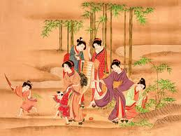
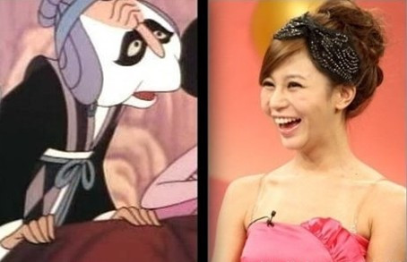

# ＜开阳＞道德与性交易

**现在公众对性交易的抵触情绪其实是一种天然正常的现象，即便是支持性交易，大概也不会有谁能很坦然的接受自己的妻女进入这个行业。但是在这个问题上的“装饰性道德”则已经没什么装饰的必要了。首先性产业合法的国家并没有出现很多人认为的各种社会问题，反倒是毒赌黄俱全的荷兰性犯罪和毒品犯罪出现频率最低。其次这种“装饰性”的尺度取决于每个国家和地区不同人群本身的集体价值观总和。从绝对意义上讲，性产业本身没有“原罪”可言。**  

# 道德与性交易

## 文/林斯云（湖南大学）

 

道德到底是什么？

这个世界上有数十亿的人类，在地球这么大的空间中，人与人之间必然会发生联系。人是难以脱离自己的族群而独立生存的，他们必须要通过交易获得自己赖以生存的生活资料。

那么交易就会产生交易的规则。最简单的规则就是一手交钱，一手交货。随着生产力的提高，交易的规则就会逐渐复杂起来，产生证券和股票产物。可用来交易的东西也会逐渐丰富起来。最初的农业社会人们交易体力，工业社会人们交易智力，信息化社会人们的创造力也会用来交易，这些交易促进整个社会生产力的提高。通过交易人们所得到的产品会越来越丰富，所能达到的享受也越来越使人满足。

为了保证这套交易的顺利进行，人们制定了法律。因为交易是同时造福多方面的，如果有一方面像独吞交易带来的好处，整个宏观交易机制就会被破坏，以后这样的交易就难以进行，为了避免这种后果就需要有人出面维持交易规则。

然而交易是极其广义的，很多时候它难以用明文规定得到保障，因为这太琐碎了。比如我们常说的“尊老爱幼”，如果出台一部法律似乎根本写不完人们要怎样个尊老爱幼法，但是尊老爱幼确实是一种交易，或者说是一种博弈。任何人都有自己老去的时候，如果年轻的时候不善待老年人，所形成的这种社会风气，难免使得自己老去的时候没有得到下一代的尊重。所以我们现在拿出自己的尊重，其实是想交易得到未来我们希望得到的尊重。很多事情都是如此，如果我们随地扔垃圾，形成的这种风气会使得环境变得糟糕，那么每个人都受到影响。我们付出走到垃圾筒扔垃圾的体力，其实为的是交易到一个干净的环境为自己增加舒适。

道德就是这种博弈的产物。我们希望每一个人都来遵守这种博弈的规则，为的都是我们每一个人，我们自己。

中国古代认为女子三从四德是一种道德，那是因为古代女性在体力生产活动中所发挥的贡献较低。女性只是被当做繁衍后代的工具，而人丁是农业中一样重要的资源。男性视自身后代为某种财产，而且对这种财产的产权意识是极为自私的。他们不能容忍自己的女性和其他男性交往过密，就设置出了当时的道德。因为女性在这个博弈当中所能支付的筹码是很单薄的，所以她们没有能力和男性博弈，甘愿忍受这种压迫。

但是随着生产力的提高，女性也有了自己能出卖的能力。最初的棉纺织厂大量使用女工，因为女性纤细的手和细致的内心更好胜任这项工作。最早的女权主义，本质上就是女性用自己的能力作为砝码要求博弈关系的改变。之后她们也做到了。

我们今天看到的以往对女性那些礼教所产生的愤慨，实际上是一种对落后生产力的鄙夷。但是在那个年代这些教条却是合理的。因为当时的博弈状况就是如此，弱肉强食就是生物世界最原始的“元规则”。

我们还提倡“尊重女性”，因为现在女性只有生理上逊色于男性，其他能力相差无几。她们已然不是弱者。物质社会又改变了人们的心理，男性需要女性的温柔和睿智，所以男性的那种“绅士风度”，本质上也是要用来交易女性对自己的青睐。这也是为什么大家排着队出现在女神头像下面。

但是漫长农业社会所积淀的那种道德，已然对今天产生着影响。现在还有人对处女情有独钟，这就是一种博弈的错乱。人家早就不被男性支配了，她们有权享受自己的性自由。换言之，处女情结在现代社会就是一种不道德的思想。

有人认为女性出卖肉体交易金钱是一种不道德。我想他们下意识地还是把性交易和以往对男性对女性的压迫联系到了一起。事实上这也是一种对性交易博弈机制的认识错乱。人们对性的需求虽然羞耻，这是出于人类的本能，但是这种需求再正常合理不过。没找过小姐还没撸过管么？那些愿意拍AV的女优用自己姣好的身材满足了广大成年消费者的需要，自己也到得了片酬。她们不可能是受谁的强迫选择从事这项工作，据说松岛枫还是因为支持自己学导演的男友而去拍AV，有人能说她不爱自己的男友么？人们对性工作者的蔑称，其内在的逻辑是侮辱“这个女人没有任何其他能力。只能通过羞耻的性交易赚钱”。但是任何人广义上都在出卖自己的能力，程序猿出卖自己智商，大明星出卖脸蛋，虽然性是羞耻的，但是并不妨碍它成为商品。萝拉长得美丽，身材又好，也许她没有其他的什么能力，但是在外表这方面她是远超其他人的。人们夸奖别人说你聪明，你也用这种先天的聪明赚钱，为什么别人夸你美丽你就不能用先天的美丽赚钱呢？

道德往本质上说，就是每个人对博弈规则的遵守与否。剥离这种规则谈道德，是很虚妄飘渺的。博弈规则是随着时代变化的。以前道德的东西，现在就不道德了。

性交易本身过程中没有任何人受到伤害，而且是任何人都在获得好处。只是因为性的羞耻的，所以人们习惯把它往肮脏上联系。这只是人类本能上认为的肮脏。真正的肮脏则是对博弈规则的破坏。

人们可以因为自己的偏好不去从事性交易，就像我数学不好不去念程序猿一样。但是这个职业本身没有任何道德上值得指摘的地方，也没有人有权利侮辱性工作者。

性交易的众多反对者当中，很多人提出一个这样的问题，性交易不能仅仅从经济方面出发论证其合理性，还有他们所谓的“社会效益”。最开始我的想法是，所谓道德如果脱离人类社会的博弈这一产生“道德”这一核心，根本是一种虚妄的概念。也就是说，只要任何交易不具备物质上的负面外部性，就是“道德”且合理的。这在我上篇文章中有一个完整的逻辑链来证明，这里就不赘述了。

但是历史主义的解释力仍旧不够充足。事实上我们能看到人们依然会对即便是对本身利益没有直接冲突的一些观念还是会持批判的态度。也就是说，其实道德还分为两种，第一种是“规范性的道德”，也就是我在前一篇文章中演绎的道德，但是还有一种道德难以用原先的逻辑推理出来。

“规范性道德”和“装饰性道德”是辉格在他那本新书《自私的皮球》中提出来的。这本书中有的内容给了我很大启发，在《“扰”了什么》一文中，辉格举例说当初上节目的那个拜金女“宁可坐在宝马车里哭”的言论一出，立马引起了各方面的笔伐口诛。按照辉格的说法，把物质列为择偶的首要条件，这是古今中外极其普遍的。我们现在看到女方要求男方有房有车才能结婚，其实是个很正常且合理地情况。但是偏偏这种行为是不能明确表达出来的。所谓“装饰性”，其实就是一种“帮助人们掩盖其行为的真正实质”的功能。

辉格还举例出了亲友之间的礼尚往来，也是一种大家心知肚明的行为。相当于一种无截止期的长期等额交易，但是这层窗户纸谁也不会去点破。一旦把话说死，那就陷入了双方都尴尬的局面（事实上我们会发现，那些长期“只进不出”的人，同样也会遭到亲友嫌弃。我们只是用具体行为惩罚ta，但是不会道出其中根本）。为限制这种“把话说死”的情况，也产生里另一种规范，即“装饰性道德”。

除了婚姻和人际，同样的例子也曾出现在公众舆论当中。比较典型的就是“范跑跑”。所有人在汶川地震发生之后对范的言论都持很不齿的态度。我记得推倒柏林墙当初也写过一篇范跑跑的文章，而他认为的观点则是其实公众和范跑跑之间也就是“真小人”和“伪君子”的区别，谁能保证说面对地震，还有那么足够的理性置自己于不顾考虑其他人？

然而规范性道德又难以用人类社会的物质机械博弈作解释。它并不是看得见摸得着的利益引起的。这种道德的成立还必须精确到每个个体身上而不能用集体做单位来解构。

最原始的时候，婚姻的确是一种简单的物质博弈。中文当中“家”这个字，是一个庇护所和人所饲养的牲口（也就是财产）组成的。男性为女性提供物质条件，女性为男性提供后代。双方都得拿出交易的砝码。但是现代婚姻已经远远超过了这个砝码范畴，它不光是财产上的，也是对对方性格、品质、价值观和行为逻辑种种因素的总和。考虑到这些因素才能保证婚姻作为一种时间跨度极为长久的“交易”能顺利进行下去。

人类最早期的需求无外乎自我生存和繁衍后代，和大多数物种一样。但是人类拥有生产力后，可以进行剩余物质的交易以期更好的生活，而在进行交易的过程中又会产生对个体的倾向判断和策略。比如和自己血缘关系更近或接触更为频繁的个体，与之交易会更稳定。这产生了人类一系列的情人际情感，包括情亲（动物之间没有除了直系亲属关系以外的亲情），同情，友谊和爱情等等。

而人类脱离因为生产力低下的生存困难之虞时，逐渐地，这种情感机制通过基因编码，脱离产生它的本因而存在并遗传下去。也就是说，现在的人类因为早期的交易关系产生的情感，已经不是作为策略而是升华到人的心理世界之中。这是人类这种拥有一个超高级的智力中枢的生物所区别其他动物的地方。

当然，不同人由于先天或者后天的原因，情感机制对他们的作用效果也是不一样的。有的人热情，有的人凉薄。没有伦理批判的必要。只是拜金女的措辞太过绝对，超过了绝大多数一般人所能承受的情感机制所控制的价值观领域，而引起很多人的批评。另一个角度讲，很多人也无法接受金钱完全成为衡量感情的看法，而担心这种价值观泛滥。这种忧虑本身并不大可能实现，因而封杀非诚勿扰这档节目的声音似乎显得太过蛮横。

拜金女和范跑跑所引起的舆论争议，本质上是“装饰性道德”这种机制在维护人类着情感系统，而他们的言论拂逆了这套机制。很多人不会完全出于物质去结婚，也不会完全出于自己的性命去逃命（尽管后者这一行为在执行过程中也许根本不受理性的支配而是出于本能）。

总而言之，“装饰性道德”在这里装饰的是一种人们本身重视物质的天性，这出于人的生存或意图更好物质生活的本能，也就是“自私”。而情感也是从这里衍生出来的，至今也成为绝大多数人的某种本能。

那么解读人对性交易的偏见和抵触，也要从一个我当初回避过的问题谈起——人为什么会对性产生羞耻和因此衍生出的对性泛滥的忧虑感。

通过观察肌肉放松等现象，可以发现智力水平较高的动物和人类一样也会有性快感，但是这些动物很多都是在特定季节才会发情。因为这些动物如果在秋季和冬季产下或抚养幼崽，会面临食物不足的境地。因而春天是最适合交配的季节。这套机制是动物面对客观自然条件形成的。人类尽管基本可以克服这些自然因素生存，但是也会面临后代不多资源有限的境况，人口增多到一定地步，边际收益就开始递减。于是人产生了一种“自然的性道德”，也就是抑制自己的性欲，“达到保证种族自然和健康的成长的目的”。同样人类的高级哺乳动物都会抵制和避免乱伦，（比如为什么狮群只有一头雄狮，成年的雄狮必须去跟其他母狮群交配而不能留在自己的族群中）也是出于同样的目的。

和情感一样，人群对性的抵触也源于自身的生存资料的稀缺，性泛滥最为一种不合理的繁殖决策而被摒弃。到现在的人类社会，大众对于性的羞耻感也就被演变成为一种“装饰性道德”。约炮如果是作为个人行为一般人看来无可厚非，但是公开展示和炫耀难免引起人因为性羞耻而产生不适，激发了负面外部性。同样的道理，饮食和性都是人的正常需求，但是你应该没有胆量在公众场合满足后者。这种外部性不是物质上的，而是一种心理成本。

再回到性交易这个主题上来。现在公众对性交易的抵触情绪其实是一种天然正常的现象，即便是支持性交易，大概也不会有谁能很坦然的接受自己的妻女进入这个行业。但是在这个问题上的“装饰性道德”则已经没什么装饰的必要了。首先性产业合法的国家并没有出现很多人认为的各种社会问题，反倒是毒赌黄俱全的荷兰性犯罪和毒品犯罪出现频率最低。其次这种“装饰性”的尺度取决于每个国家和地区不同人群本身的集体价值观总和。从绝对意义上讲，性产业本身没有“原罪”可言。

当然不同个体对性产业的看法有所差异，这也是所有个体自身固有的权利。但是权利仅限于看法，而不能约束他人的行为。具体到性产业的话，我认为现在从业者的年龄限制还需要提高，我估计大致要提高到22岁。这个年龄基本能和父母撇清物质关系，才算真正有权利选择自己的职业。同时规定已婚男女不得在没协议的情况下提供或购买性服务，以免夫妻一方和子女背负对方自身从事性交易的心理和名誉成本。至于性病什么的，政府注意监管就行了，证实下来根本不是什么大问题。

 **后记：**

美剧《How I Meet You Mum》中，uncle巴尼的女友昆萤其实就是个脱衣舞娘（不知道是不是卖艺不卖身的那种）。而巴尼从一开始就知道对方的职业，依然选择和对方交往。整个剧情的喜剧包袱其实也是从巴尼的这种矛盾展开（我估计这一季巴尼是要和她分手了）。事实上支持性交易合法和不希望自己的妻女从事完全不矛盾。理性的巴尼喜欢昆萤的性感和睿智，但是深层次的心理当中又有作为男友对女友“产权”的排他性。巴尼本人完全不排斥性交易，反倒是一副不去风月场所撒钱就没法儿活的样子。但是如果巴尼有女儿的话，那么作为一个父亲他会一定程度关心女儿婚姻和私生活，这则本能地是基于自身后代繁殖的决策考虑。不过以巴尼的性格和美国社会文化所具备的对性交易的道德压力，我想他也不一定就反对女儿从事这个职业。如果这个世界上40%的人反对性交易，60%的人支持性交易，那么反对与否，支持与否就没有伦理上的绝对正确的意义了。但是作为一种人畜无害的职业，人们是有权利从事的，尽管很多人也有对ta们持有偏见的权利。

“自然的性道德”和“文明性的道德”是弗洛伊德著作《性学三论》中最后一章《“自然的性道德”与现代神经症》中引述自冯·埃伦菲尔斯（von Ehrenfels）的著作《性伦理学》两个概念。弗洛伊德本人只截取了“文明的性道德”作为自己学说的论据。我没有能找到埃伦菲尔斯的那本著作，根据弗洛伊德对前者有限的介绍在这里姑且做这个粗糙的演绎。事实上弗洛伊德用“文明的性道德”的解读性压抑更加有解释力，但是是针对个体病例的而非针对普遍的现代人群体，只有文明性的性压抑发挥到了一定程度才会产生足够让弗洛伊德关注的病例。这个理论十分庞杂我不能贸然发言。如果有心理学专业的读者知道的相关理论的话请留言告诉我。

关于这篇文章，辉格与我的启示还不止这两个道德概念。辉格把生物进化根本归因于“决策”这个核心价值上。生物对于后代繁衍的决策是十分重视的。一切繁衍的机制都是围绕最高效率的“决策”而定。根据这个核心理念，我大致推演出了“性羞耻”的来源。这种心理后来又参与了人类之后复杂的文明社会发展建设中，在个人的心理世界和社会文明中被固化下来。不同文明对性就有不同的态度。这个命题牵涉的学科太广泛，在这里也无法展开论述了。

 

（采编：彭程；责编：彭程）

 
