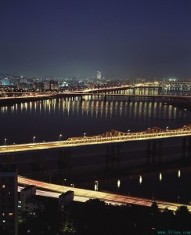

# ＜开阳＞隐喻和威权

**支撑我们前行的，不该是“他们没有好下场”，而是“我们没有好下场”。不是邪不压正，而是不抗争就暗无天日，不是口水和隐喻，而是分析与事实。中国的抗争，善用外部机遇，却忽视内部结构，缺乏一个累积的学习曲线，是一种基于路径依赖的机械借用。而韧性的制度，则利用巨大的权力和资源优势，通过妥协，收编，审查等手段，积极主动地进行策略创新。在我们寻找隐喻并为此争得不可开交的时候，制度创造的模式在悄悄地自我调整，并试图赶上民间的自学速度。**  

# 隐喻和威权

## 文/赵蒙旸（香港中文大学）

 

“独裁者都没有好下场。”每当暴君们以各种窝囊的姿势倒下或即将倒下时，都会出现这句经典感慨。还有人会给全世界落难兄弟们排序，拟定出解救的时间表。我们都在玩一场竞猜游戏，定时炸弹将会在何时何地爆炸呢？这类话语的潜台词是，独裁者的命运都是注定的，注定会出现一个作为导火索的临界点，你不努力，别人会努力，所以他早晚会完蛋。 

拉斯韦尔说过，管理公众的恰当方法是坚持强调我们事业的最终胜利。这句话不仅适用于统治者对公众的操纵，也适用于公众对统治者的想象，两者都一样有害。为了验证我们事业的最终胜利，人们坚持搜寻着各类隐喻，其中最突出的有两种。 

一种是不利于制度的隐喻。京城的大水让我们找到了证据：它是中国神话即将终结的隐喻，制度与其吹鼓手将毁于一场史无前例的洪水。奥运开幕式是伦敦人对北京的尽情嘲弄，运动员受处罚是举国体制的自食其果。甚至英式幽默，都可以反衬出中国文化对于创造力的扼杀。类似的论调其实很好仿制：越是将自己放在大国的宏大叙事里，越是骨子里的小国，这样的国度脆弱而易死，在偶发事件前如同保温箱里的初生儿。换言之，任何一次对现状的羞辱，都可以为制度的坠落背书。 

炮制隐喻是种政治正确，深究话语则要冒一定风险。特别当谈论中国的特殊国情时，似乎会和环球时报体绑在一起。媒体的渔网一过滤，奇观效应一登场，现存的问题都变成一个模子做出的成品，解决工序就像凉拌番茄一样简单。如果你插话说凉拌番茄只是表面现象，或者红烧肉的工序也值得研究，轻则被打回学术象牙塔，重则被各种罪行标签砸中。然而中国的很多问题，又确实只此一家，绝无分店。很多人把普世的价值和差异的现实当成了同一种东西，似乎对于后者的深究必然是对前者的否定。 

看到制度无能的同时，还要证明自己的成长，所以另一种隐喻就关乎自身。举个最明显的例子，抗争政治中间，大小灾祸面前，民间的私力救济总成为人们津津乐道的话题。合作和冲突，本来就是生物界在进化过程中发展出的本能，甚至都不为人类所特有。然而正常的人类行为，却一次次被拔高成自组织能力的提高，公民意识的觉醒，是“自由，市场，财富”的衍生品。 

人们的道德和公民意识并没有提高，而是在特定的环境下，被诱导出来的特定的行为。在另外的场景下，同一批人完全可能作出令众人不齿的表现。1964年，纽约姑娘吉诺维斯在38名直接目击者的旁观下被暴徒杀害。事件刚发生后，媒体也大肆批驳美国白领的道德沦丧，但后来的实验证明这其实是心理学上多元无知效应的体现。以此类推，发生在中国的种种突发灾难下的冷漠与温情，集体行动中的理性与暴力，也多半和文化没什么关系，而只是恰巧满足了某些心理机制和博弈结果出现的条件。 

同时需要指出的是，在一个复杂系统里，各种情况都会发生，某种程度上说，只要不是太过离谱的假设，几乎都能找到一两个例证。经济学家阿塞莫格鲁说过一句玩笑话：很难想象还能提出一种没有以某种形式出现在文献某处的关于民主化或民主巩固的看法。这话看似夸张，实则是事实，因为在不同的条件下，各种结果确实都发生了。比如在压制程度与抗议水平的关系上，针对不同地区的经验调查发现，有时候低程度的压制激发了抗议，高程度的压制浇灭了抗议；有些时候高程度的压制在短期内有效，长期看无效；又有些时候低程度的压制就成功消解了抗议。如果你抱定了一种观念不动摇，很有可能到处都能看到支持这种判断的证据，但问题是，你看到的只是部分事实。对于隐喻来说也是一样，它表达的观点也许没有错，但很可能其代表性和适用面都是很小的。 

支撑我们前行的，不该是“他们没有好下场”，而是“我们没有好下场”。不是邪不压正，而是不抗争就暗无天日，不是口水和隐喻，而是分析与事实。中国的抗争，善用外部机遇，却忽视内部结构，缺乏一个累积的学习曲线，是一种基于路径依赖的机械借用。而韧性的制度，则利用巨大的权力和资源优势，通过妥协，收编，审查等手段，积极主动地进行策略创新。在我们寻找隐喻并为此争得不可开交的时候，制度创造的模式在悄悄地自我调整，并试图赶上民间的自学速度。 

绝对的威权主义做底色，一定的文学素养做基础，点缀上绵绵不绝的吐槽热情，隐喻的流水线上永远不缺新产品。人类是多么喜欢以小见大的生物，一场大水袭来了，一场抗争兴起了，一个政权倒下了，我们的想象力就开始裸奔了。遗憾的是，事实上我们的胜算没有任何变化。 

 

（采编：楼杭丹；责编：楼杭丹）

 
