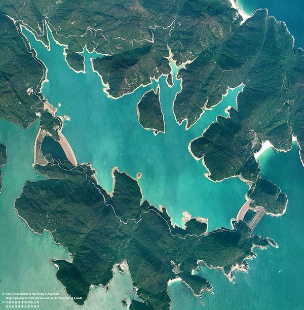
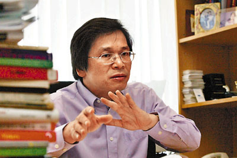
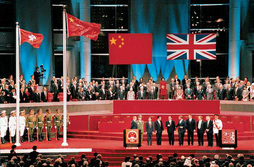

# ＜开阳＞香港供水简考

**香港有立法会议员报怨广东东江水价过高。因为香港人突然发现，原来困扰他们几十年的缺水问题不知在何时变成了水多得用不完。但香港买水时为了压低价格，签订的协议类似于“包月”，每年供水量是设定值，用不完也不能退，多余的只能排到海里。香港亲大陆政党“民建联”立法会议员陈鉴林多次和广东省官员会面，希望更改目前的条约，改成按供水量实报实销，他还准备带团到北京向中央请愿。**  

# 香港供水简考

## 文 / 包文韬（华南理工大学）

 

每每香港与大陆产生矛盾，总会崩出来“大陆给香港供水供食”所以“港人应当感恩”的说法，严重时会有威胁“停止给香港供水”的呼声，这种不成熟且略欠思考的言论虽是极少数，但也很伤害双方感情。因此我粗略收集了一些数据，希望能简单介绍香港的供水历史与现状。

香港本身相当缺乏天然水源，但19世纪中叶以前，香港以农业为主且人口很少。当时主要依靠山涧溪水和私人开凿的井水，用水矛盾并不明显。

开埠之后，多采溪涧水为用，政府参考中国传统农业灌溉技术，利用竹筒接驳成水管以供应附近洋人住宅区。后来山水因降雨量远低于采水量，日渐干涸，政府便于1851年开凿五口水井，但这种水源经常受到污染，成为传染病温床。

1850年代，香港政府因应洋商要求，开始考虑公共供水计划。

时任港督威廉·罗便臣爵士于1859年决定利用水塘储存雨水，以求穏定的食水供应，并于1863年完成兴建香港首个水塘——薄扶林水塘。

于是水塘成为了港英时期香港的主要食水来源，政府先后建成了17个水塘及水库。

很有意思的是，41年日军进攻香港时，正利用了占领水塘，切断英军供水的战略。成功逼得一万多英军投降，时任港督杨慕琦（Mark Young）在九龙半岛酒店与日军最高长官酒井隆签署了投降协议。

二战胜利，英国重新接管后的数十年中，由于人口急剧增长，经济资源充沛（亚洲四小龙嘛！），新兴建的水塘工程，规模相当庞大。当中著名的有在海上兴建的船湾食水湖和万宜水库。

虽然不断兴建水塘，但供水量仍不足以支持快速增长的人口。在1963年6月至1964年5月，香港就因严重天旱，实施4天供水4小时。

港英政府被水资源问题搞得焦头烂额之后，脑袋终于开窍了。想到香港和大陆接壤，为什么不利用大陆的水资源呢？

1960年代，在船湾食水湖和石壁水塘建筑工程进行的同时，港英政府开始跟广东省购买食水。

在1960年至1989年之间，港英政府和广东有关当局签署了五份供水的协议。自此开始，香港的食水主要来源就变成了广东省的东江。

事有不巧，60年开始买水后不久，大陆就爆发了文革，与英国关系变差。

港英政府觉得中国政府不靠谱，反正也刚开始用，依赖度不高，为免水源将来被中国控制住，开始了海水化淡的方法来取得食水的计划。

香港第一个海水化淡厂——乐安排海水化淡厂——于1975年建成。但海水淡化时至今日仍然是高难度技术，成本怎么可能比得上直接买来自北方的江水？果然，后来因为运行成本过高及来自东江的供水日趋稳定的关系，海水化淡厂在1982年关闭及停用，并在1992年以爆破方式拆卸。

意识到所有手段都不如买水后，港英政府开始专心和广东洽谈。其后每年大陆都共给香港大量淡水，且每年增长，以满足人口和工业发展的需要。同样，香港也保证，每年必须购买满一定数量的淡水，保证大陆不会为供水系统亏本。

广东省给香港的供水量一直在逐年增加，在2000年时已达到7.8亿立方米。供水系统现时的设计最高供应量是每年11亿立方米。

不过，由九十年代起，香港工业北移，用水量显著下降。经长时间商议后，港府与广东省当局在1998年达成协议，双方同意1998年至2004年内供水量的每年增幅可减少2,000万立方米。后来，广东省方面同意保持每年最终供水量11亿立方米维持不变。2008年12月签订新协议，根据这项综合协议安排，港府会每年一次向广东省方面付款。在现行协议下，每日供水比率会有较大灵活性，以配合于本地收集所得的雨水在季节上的变化，这会使香港能更有效地控制水塘的存水水平，从而减少浪费情况，并节省抽水成本。

2011年12月5日，香港发展局局长林郑月娥与广东省水利厅厅长黄柏青在深圳签署2012年至2014年东江水供水的新协议。根据新协议，香港将于2012年缴付35亿3,870万元、2013年缴付37亿4,330万元和2014年缴付39亿5,934万元的固定总金额，作为购买东江水的费用。这增幅反映了粤港两地预测的通胀和人民币兑换港元的升值。

细心的读者也许已经发现了，大陆给香港的供水不是无偿，且价格谈不上便宜，差不多是3港元一个立方。与国内自来水价格相仿。

2010年，香港有立法会议员报怨广东东江水价过高。因为香港人突然发现，原来困扰他们几十年的缺水问题不知在何时变成了水多得用不完。但香港买水时为了压低价格，签订的协议类似于“包月”，每年供水量是设定值，用不完也不能退，多余的只能排到海里。香港亲大陆政党“民建联”立法会议员陈鉴林多次和广东省官员会面，希望更改目前的条约，改成按供水量实报实销，他还准备带团到北京向中央请愿。香港中文大学经济研究员王家英认为，东江水供应香港的协议是在英国殖民地时代达成的，当时港英政府高估了香港人口的增长和工业用水，而形成当前东江水供多于求，他还称透过中央的压力要广东省减价违反了商业行为，这个例子一开就破坏了香港一贯行之有效的商业的精神。

香港方面是缺水时想要水，喝饱了想省钱；而大陆方面，则不想丢掉这棵巨大的摇钱树。

引水设施一旦完工，几近于一劳永逸。卖得越多，赚得越多。有消息透露称广东省的供水生意，利润高达五成，赚得多，又轻松。甚至在2009年广东省出现严重旱灾时，港方曾提出透过减少输港供水以助纾缓旱情，但被大陆婉拒。同样情况下，实实在在的港币对旱情更有帮助。

香港原先的供水系统分为两套，饮用是淡水，冲厕所专门建立的海水管道。

但近年来的新建建筑越来越多使用饮用水冲厕所了。

#### 就当我是分割线

无独有偶，与香港同有英国殖民历史的新加坡也是海岛国家，淡水资源面临着和香港一样的困境，不妨对比一下新加坡政府是怎么做的以及马来西亚的供水史。

新加坡在2011年的人均GDP是50123美元，香港则是49137美元，不相上下。

其他数据也都相仿，总体来说新加坡的规模比香港略小，面积和人口均约为香港的70%。

新加坡最早也是以收集雨水和淡化海水为努力方向，不能满足后转向马来西亚的柔佛洲进口淡水。

1920年代时，两地就开始了淡水交易。后来1961年和62年分别签订了长期供水协议，签订这份协议时，新加坡走了大运。

新加坡狗屎运好就好在签订的日子吉利。

当时马来西亚和新加坡很有希望合并成一个国家，所以在淡水价格上，马来西亚基本没怎么争过，由着新加坡来。

于是价格定成了每1000加仑（约合4.5立方米）售价0.01美元——这沿用了1920年代的物价标准。

后来新加坡和马来西亚也确实合并了——1963年的事情——1965年新加坡又重新独立——马来西亚大呼上当。

但是水价一直没变，新加坡一直以几乎免费的价格使用来自马来西亚的淡水，这便宜占得不小。

马来西亚也有意见啊，太便宜了，这个生意一做就生气，不做还不行。多次和新加坡抗议，新加坡政府则以条约规定为由，拒绝提价。而马来西亚一方面依赖新加坡的投资，另一方面也希望继续向新加坡输出劳动力，过度依赖新加坡，自己腰板不硬，不敢有后续动作，也就只能作罢。现在看起来，到2061年之前，新加坡的水价都不会涨了。

所以比较新加坡的水价和大陆供港水价，并没有太多的意义。毕竟就修建水塘和海水淡化等其他所有可以想到的取水方式来说，向大陆买水是最便宜的一种，价格即使高于平常，依然十分有竞争力。

这个故事告诉我们，签100年的合同风险是很大的——有的人嫌长，有的人嫌短。

新加坡在享用廉价淡水时也没有得意，他们的海水淡化技术一直在发展，未来的目标是可以供应1/4的全国用水。而且新加坡的水资源重复使用率很高，现在的饮用水中，已经有相当一部分是从冲厕水中过滤得来的了，当然，这是完全无害的。

#### 小结：

其实，大陆给香港供水和大陆给香港带来旅客和机遇，香港给大陆提供金融服务一样。本来就是简单的交易，没有谁有恩于另一方，双方各取所需，共同获利——这也是交易的意义所在。

（采编：黄理罡；责编：黄理罡）

 
