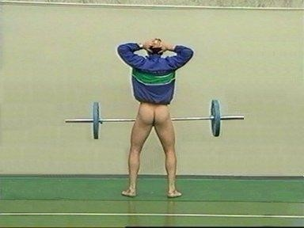
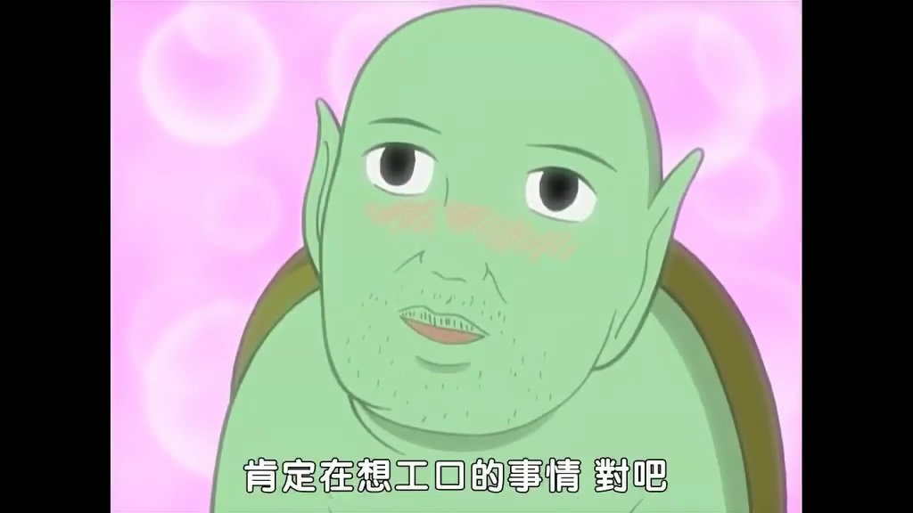
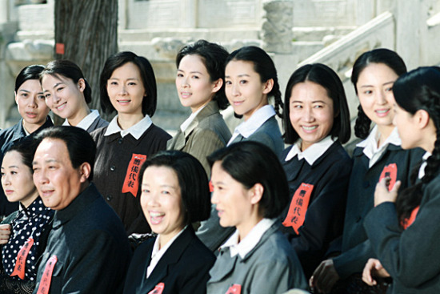
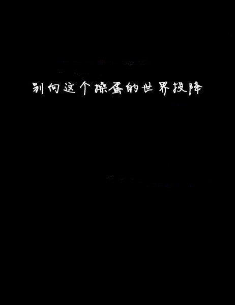
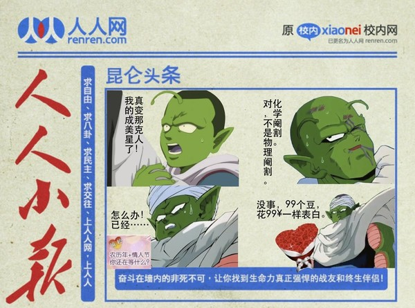
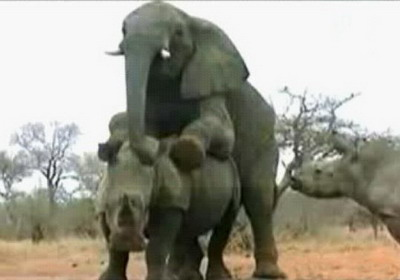

# ＜情人节特稿＞没有性别的人

**医生将一根银色的金属杆突然插入，然后手法圆润地迅速划拉了一圈，将皮肉分离开来。伴随着的是我撕心裂肺的喊声。我操！这你他妈都不打麻药？手术结束后我整个都是蹲在地上走路的，稍微直起腰身就疼痛难忍。现在回想起来还心有余悸，伴随着隐隐的蛋疼。**

### 

### 

# 没有性别的人

### 

## 文 / 陈轩（兰州大学）

### 

### 

一 记得第一次对性别这个概念产生印象来源于小学的时候看漫画书。《龙珠》里面有个那美克星，那个星球上的那美克星人绿油油的，额前长着两根软塌塌的触角，他们（它们？）就是一种没有性别的单性繁殖人类。似乎星球上所有的人都是由一个大长老似的领袖下了蛋以后孵化出来的，然后每个人有不同的性向，有战斗型的，有劳作型的，还有的似乎也能单性繁殖后代。 小时候虽然对男女繁殖之类的事情不甚了了，但也觉得鸟山明的这个想象很神奇。鸡下蛋还要分公鸡母鸡呢，而那美克星所有的人类都是一种性别，或者说没有性别。不过那时也隐隐有种担忧：那样的话多无聊啊。 

### 

### 

### 

如果说我们的人生的确曾经处在过“没有性别的人”这种状态的话，那就是幼年时期了，准确的说，是前小学时代。记得我上的幼儿园的的厕所是不分男女的。进了门右拐，右边是小便池，左边是蹲坑。上厕所时间，男的右边站一溜，女的左面蹲一排。大家除了排泄工具和体位的不同，似乎也没有太多的区别。至于说这样的安排对幼儿心理成长之类的有没有影响，我就不得而知了。只是我清楚地记得，有一次我走进厕所，看见一个男孩站在蹲位旁弯着腰好奇地看着另一个女孩小便，那女孩神情淡定，不以为意。这一幕场景在我脑中至今历历如昨，只是当事人面目模糊，似乎象征着什么。 小学的时候，甚至更早到幼儿园，我便煞有介事地喜欢起女生来了。只不过那种性别意识只是出于社会环境中文化精神方面的影响下的无意识带入，没有多少物理上生物上甚至真正意义的心理上异性相吸的因素。那时候的头脑里，对性别或者爱恋只是知其然而不知其所以然。我知道，男的“应该”去喜欢一个女的，至于说，男的“为什么”要去喜欢女的，我只能归结到“应该”上去。这就和做题不求甚解地一层层套公式一样，即便解了出来，也没有多少快感。但真正的性别意识，也就在这种无意识的模仿带入中滋生着。 

### 

### 二

而在生理层面，这种觉醒或者伪觉醒就要晚得多。这当然是正常的。记得还是很小的时候，有一次和父母睡在一张床上。早上醒来觉得尿涨得难受，正准备去厕所，忽然感到谁把我的内裤扒了开来。然后就听见我妈对我爸说着什么，似乎就我立起的小鸟展开了讨论。我惊诧莫名，赶忙一动不动装睡。现在我已经记不得他们当时说的是什么了。但我猜测，如果我结婚了生了儿子有一天早上我媳妇看见儿子因为憋尿而晨勃的话，她很可能嬉笑着问我的是：你还记不记得你第一次勃起是多大岁数了？ 小时候有几次经历似乎足够引发我对这块区分性别的标志性建筑的痛恨。其中之一便是包皮手术。记不得几年级了，我爸带我去医院。医生叫我脱裤子，用手仔细拨弄着。然后得出结论，我的不用剪掉包皮，只需要把冗长的皮和龟头分离开来就可以了。然后我急切地问：要打麻药吗？医生说小手术打什么麻药。之后我便躺在手术台上，医生让我放松平躺，但我实在太紧张了，还是勾着头略略倾起身盯着即将被整编的部位。然后恐怖的一幕出现了：医生将一根银色的金属杆突然插入，然后手法圆润地迅速划拉了一圈，将皮肉分离开来。伴随着的是我撕心裂肺的喊声。我操！这你他妈都不打麻药？手术结束后我整个都是蹲在地上走路的，稍微直起腰身就疼痛难忍。现在回想起来还心有余悸，伴随着隐隐的蛋疼。 手术之后，上厕所一直是一个头疼的问题。尿液含盐，一沾碰就疼得钻心。平常上个厕所都惊动全家，我爸我妈一齐帮忙才能撒个稳妥尿。有一次去素描老师家上课，画到一半憋不住尿，又难于启齿向老师求助，在卫生间里折腾了半个多小时。出来后满头大汗。旁边一起学画的小朋友都惊异地看着我，还好那个时候大家都没什么想象力，放到现在这岁数，就要被邪恶了。 

### 

 那时实在疼得难受。之前我得过阑尾炎，开刀把阑尾去掉了，于是我就问我爸太疼了能不能也开刀把小鸡鸡取了。我爸没怎么理我，就虎着脸应付一句：瞎说。现在想来，那是我今后漫长的阉割情结的第一次不经意表露。 直到今天，龟头上的皮肤仍旧红彤彤吹弹可破，就像手臂擦伤后新长好的一层，对着吹气都能感到凉飕飕地。然后我就很发愁，要是结了婚为了生小孩不戴套的话，那我岂不是要疼晕过去？ 每当这种时候，我就不断地想逃离性别。成为一个那美克星人。 

### 

### 三

告子曰过那句你们都耳熟能详的食色性也。从生理需求角度食色虽一，但色比食有着更多的社会含义。因为要满足食的需求，我们只需求诸于大地，求诸于自然，完成它你只需和食物发生关系。但是色则不一样，其有涉他性，你需要和另一个个体共同完成。这其中便复杂得多。 小学毕业的时候有一次和班上同学在一起玩。不知不觉话题便牵扯到了男女之事上了。之前我故作清高，一直不参加小伙伴之间的这种讨论，不知道谁说了一句陈轩只晓得念书，这方面总是不开窍。然后大伙儿便一起朝向我揶揄了起来。其实我明白他们在谈什么，只是觉得好孩子不应该谈论这个，一直装做不懂，这次也毫不例外地看着他们假痴乔呆。 这时候一个相熟的哥们就仿佛看着女儿嫁不出去似的焦急地对我说：你真的不懂？我接着装傻充楞：什么呀。他突然伸出一根手指，另一只手的食指拇指圈了个环，比划了一下：你真的不知道？在一片灿烂的哄笑声中，我死死地硬着头皮：什么意思？ 其实，潜意识里，我只是不愿意承认这样一个事实：每一个人生来便要不可避免地宣布，我们一定会对于某种并没有多少智力含量的行为感兴趣。而且这种行为一定要和另外一个智识上不见得具备一定水准的人共同完成。 北斗六聚，有一天曲一曰请吃饭。饭后我们三五成群地在街上走着。过马路的时候，一个长腿细腰穿着热裤的姑娘从我们面前走过。一般这种时刻，我绝不会看姑娘，而是迅速注意男人的动态。果不其然，面前这个移动的物体像一块控制眼球朝向的磁铁，这帮家伙的注意力齐齐被牵着走。 

### 

 那一时刻，我心底突然莫名地感到一种愤怒。这种愤怒来源于之前所说的那种深刻的无力感：作为男人，我们为什么注定要被女人所吸引？ 我喜欢人类复杂而深刻的哲理和思想，那些对人类社会运作规律的洞见令我击节再三；我喜欢人类冷峻而犀利的理性和逻辑，那些对天地万物自然法则的破译令我拜伏于地；我喜欢人类微妙而精致的情感和文艺，“无边丝雨，自在飞花”，你往往不敢相信一个千百年前的古人能够仅仅通过三五纸面的符号，简单描述他的曾经所见，就能够向你内心传达他体验过的细微心绪。 在这些人类精神领域创造出的精深、博大与雅致面前，那些肉体的浅层欲望和吸引，仿佛显得一点存在的意义都没有。这种吸引，既不来源于智识上的敬仰与崇拜，也不来源于道德情感下的同情与悲悯。它一切的理由，只是逃不脱造物在我们体内注射的那些名称古怪而芬芳的化学物质的作用。在我看来，这种吸引和向往，在精神世界中唯一的理由，便是它使我在某些时刻很不情愿地意识到这样一个令人痛苦的事实：人只不过是一种动物。 

### 

### 四

这就像我们每个人成长都要经历“伟大领袖毛主席也要做爱”式的幻灭的旅程。虽然痛楚，却也无可奈何。 

### 

### 

### 

我不是没有学过生物学。我知道两性繁殖对于生物进化的重大意义。但是当你把自己抽象成了培养皿中的实验物体时，性别带给人的那种荒诞的焦虑将成倍地放大。 有一次，和姑娘在房间里亲吻拥抱。当我把脸埋在她发间，气喘吁吁解开她衣扣的时候，突然间，莫名地，整个人被一种无可言说的滑稽笼罩了。我为什么要心跳气喘？我为什么要勃然兴起？我为什么要让一个既不会骈四俪六吟诗填词，也不会解偏微分方程的生物，主宰我自己的身体状况？ 这听起来有点风马牛不相及，但是在那一时刻，我就是受不了我的身体对智力和精神的背叛，受不了自己不能百分之百地全面控制自己身体的事实。是的，每个人都不能控制自己的植物性神经。但是饥饿的消解方式显然更加地个人化。 这种焦虑时时刻刻伴随着我。比如在大街上看见漂亮姑娘，和每一个男人一样，我会不自觉地注视。但是立刻我就觉得这种行为无聊之极，显得我和那些直白地表达自己欲望的格调不高的男人一样，不是一个受过教育的青年应该表现的状态；但是如果故意视而不见，我又会在心里大骂自己装逼，这又显得我和那些故意反常态而装逼至死的男人一样，不是一个惯于直抒胸臆、坦荡对人的人应该表现的状态。 于是，就在这种蛋疼的挣扎中，每一个路遇的美女都让我怀疑人生。 因为性别而产生的焦虑和耻辱还不止于此。我曾经写过一篇流传甚广的文字[《性欲和悲剧》](http://blog.renren.com/blog/235008536/289841995)。那篇文章其实浅显地谈论了性别资源配置效率不高的问题。在此不予赘言。而今天，我显然想表达的是一个更加基本的关切：因性别本身的存在而带来的问题。 

### 

### 五

我花了六年多的时间喜欢一个姑娘。为此还写了[另一篇文章](http://blog.renren.com/blog/235008536/479370161)，然后“男默女泪”这个词组便和我产生了牵连，而且“来自豆瓣”便成了我最不喜欢的四字词组。 

### 

 每当别人问我：她要是结婚了，你还要继续等下去吗？我往往会说，到那时我便会勤加锻炼身体，注意饮食健康，和她的那一位比一比谁活的更长。 而实际上，我内心深处还有另一种不便告人的解决方案：我去主动寻求化学阉割，挥慧剑，斩尘根，跳脱三界之外，不在五行之中。从此得大自在，大解脱，但求智识精进，笑看滚滚红尘。 

### 

 这并不是纯粹开玩笑。我受够了每每深夜里情丝纠缠的苦恼，年年回乡时愁肠百结的失落。这样的经历虽然也可以幻化成许多么看上去美好的文字和回忆，但是归根结底是无妄的虚幻。《四十二章经》中佛祖有言：革囊众秽，尔来何为？我没有佛祖的修为和造化，我作为人类控制不了自己动物的一面，那么我可不可以利用现代人技术的优势，自我了断，从而“即得须陀洹果”呢？ 

### 

### 六

是的，即便看上去如此像一个精神有问题的人的叙述，我也必须承认，这就是我成长中不断遇到的“阉割情结”。这种情结，根植于对弃绝幼时带给我生理痛楚的器官的想象，引导出我对精神和肉体分离的愤慨。 当我温香拥被，软玉在怀时，我会觉得这种粗浅难耐、毫无智力因素的单调重复的活动毫无意义。它剥夺了人之所以为人的骄傲和尊贵，展现了人之所以类兽的无奈和妥协。每当高潮退尽的时候，我觉得空静澄澈，灵台清明，那一个当口，内心没有平日充斥的杂乱与躁动，那是人最接近神的时刻。 当我佳人难得，情思婉转时，又会想要彻底逃离这种无谓的虚妄。这种在那美克星上不会存在的痛苦，更加加深了我对造物主的痛恨：你本可以让你的子民免受此苦的。这一切毫无道理的复杂性，难道真的只是造物兴之所至给我们开的一个玩笑而已？ 从精神上来说，好像我真的没有办法给性别一个意义。所以每念及此，我都想永远处在那个最接近神的状态，想做一个没有性别的人。 

### 

（后记：这篇文字半年前就存在我的硬盘里了，但是一直没有成稿。今天是情人节，于是想到了这篇明显不合时宜的思考。遂于深夜完稿。在此顺便祝大家节日快乐，还是那句老话，没成双的早日成双，成双的早日。） 

### 

### 

（编辑：黄理罡）
