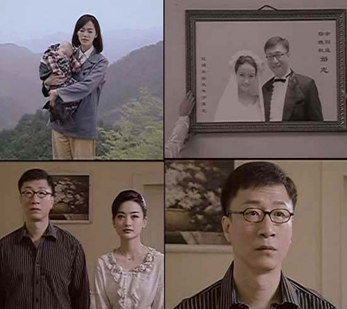
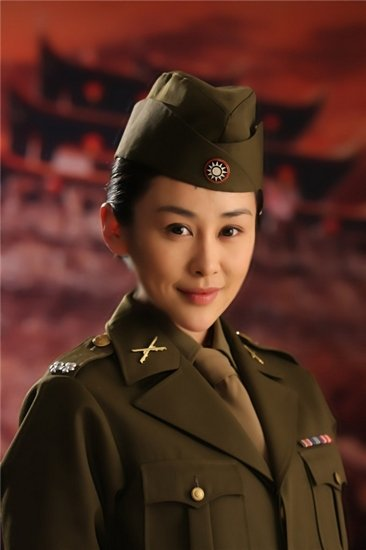

# ＜摇光 ＞从大陆的谍战片看仇恨教育

**历史总是胜利者的宣言，总是由胜利者书写。因此如今再看这些谍战剧，也就觉得娱乐真地就仅仅是娱乐，知道的人，笑而不语，不知道的人，权当看个故事。至于内容真实性，纯属意淫，请勿对号入座更没人关心。只是如若想要借一部谍战剧弘扬主旋律，凸显高大全，辨忠奸，重温对反动派的血海深仇，作用依旧还是有的，不然当年那个读了十多年书的自己为何被骗的像个五毛一样，巴不得上演一出跨海大战，勇闯美丽岛，征服浅浅的一湾海峡。**

** **

# **从大陆的谍战片看仇恨教育**

** **

## **文/蒲阳(**华东政法大学)

我打开电视，满目的尔虞我诈，一幕幕敌我厮杀，而这敌我，不是民族恨国家仇，而是阋于墙的兄弟，中国人杀中国人。

若要将这些电视剧统计完，魂飞魄散，经脉尽断。在敌营潜伏了十八年后，终于找到了梅花档案，于是在听到保密局的枪声后，穿着一双绣花鞋，盼望远离这谍海风云。却在开国前夜被暗算，遂明白，人间正道是沧桑。

应该从何说起？六十年过去了，不是反思这样一场战争到底有没有打的必要，这样一场战争的出现给中华民族带来了多么深重的苦难，相反，拼命抹黑战败的一方，却是为了证明自己统治的合法性正义性。中国古代说胜者王侯败者寇，现在战败的一方蜗居于美丽岛，成了亚洲四小龙，对于这些虚假做作胡编乱造的垃圾也不屑于评论，免得掉价。而没有机会去美丽岛的自己也很好奇，当年战败的一方会以怎样的姿态来诉说这段历史，是否也如老大哥一样极尽猥琐无耻之能事，不把你损到无以复加的地步绝不收手。美丽岛这么些年，只见到流星花园开到了泡沫之夏，命中注定爱的不是你，而是恋恋风尘，热血艋舺。美丽岛会否也有谍战剧？我不得而知，希望宝岛同胞为我指点迷津。但我着实知道的，是老大哥这边江山如此多娇，一日更比一日红，势要将谍战进行到底，总之一句话，黑你没商量。

零九年有两部很火的谍战剧，一部是《余则成回忆录——我生命中的三个女人》，还有一部还是余则成演的：《战火屠城，两个家族的国共血泪史》。则成的回忆录让我知道，原来，他们是反动派，曾经那么坏，杀了那么多人，还一味将历史掩盖。则成多厉害，不动声色，金屋藏村姑，娶了媳妇，有了小三，包了情人，还把反动派一帮人玩的团团转。原来什么军统什么中统，都不仅仅是吃稀饭的干活，重要的还在于，吃了还变成了饭桶，不拉，终于憋成了傻X。则成笑傲谍场，不动声色，借刀杀人，为老大哥默默奉献，终至妻离子散，至此，本人已是头涔涔而泪潸潸，则成为人民服务的精神可见一斑。于是咬牙切齿，怒火中烧，好你个反动派，恨不得立马租条船跑到美丽岛把光头拉出来鞭尸，顺带收复钓鱼岛。可惜，光头没有被做成腊肉，英雄无用武之地，皮鞭有无尸可鞭之虞。

看血泪史时更是莫名地鼓舞，一个小小的痞子因为有了正确的理想，上了道，从此就一帆风顺，平步青云，事业有成，成了排长，成了连长，成了团长，最后还顺带泡了老师的婆娘。杨立青真是羡煞当今八零后，秒杀腐女与宅男。怪不得公务员热持久不退，那是因为对着电视剧爱得深沉。杨家，瞿家，又有钱，又有权，本自同根生，相煎何太急？也许可以说，为了不同的信念，所以一部分人选择了信仰，一部分人归于现实。当瞿恩就义，那番惊天动地的话语，让自己无知的脸泪流满面。再回首，当梦想破灭，理念坍塌，信仰崩溃，空虚的人生该怎样填满？错误的信仰又会不会将自己引入歧途引火烧身成为历史的炮灰还至死不悔？激情燃烧，终于燃烧坏了脑子。多年后，另一场浩劫会否让杨立青更加悔恨自己竟有亲戚是反动派？

到如今，弹指挥间，三年时间。再细细回想那些被洗脑后的热情与冲动，发现，为什么我的眼里还是常含泪水？因为斯德哥尔摩综合症又犯了。历史总是胜利者的宣言，总是由胜利者书写。因此如今再看这些谍战剧，也就觉得娱乐真地就仅仅是娱乐，知道的人，笑而不语，不知道的人，权当看个故事。至于内容真实性，纯属意淫，请勿对号入座更没人关心。只是如若想要借一部谍战剧弘扬主旋律，凸显高大全，辨忠奸，重温对反动派的血海深仇，作用依旧还是有的，不然当年那个读了十多年书的自己为何被骗的像个五毛一样，巴不得上演一出跨海大战，勇闯美丽岛，征服浅浅的一湾海峡。现而今，对于美丽岛的向往依旧未变。

统治者总是为了自己永远伟大光荣正确，便想方设法千方百计处心积虑要将对手置于死地打到万劫不复之地永世不得超生，所以，反动派永远心狠手辣无恶不作嗜血成性杀人不眨眼，即使有点家庭情怀儿女情长，那也是为了艺术需要，而绝非此等歹徒所能做出来的，因为有违伦常，有违老大哥的理想。所以，今天，小小的荧屏还在等待黎明之前，看那借枪的小丑，如何假模假式克敌于无形，力挽狂澜。殊不知多少人为这无意义的内战死在了黎明前。黎明早就到来，45年日本投降就已到来，只是被别有用心的歹徒扼杀，于是血雨腥风，重回战争年代，枪没借到，迎来了个空口说白话的白眼狼。缴你的枪，拆你的房，几年前还在征你的粮。

人民是历史的创造者，胜利者是史书的作者。人们不可以忘记历史，因为忘记即意味着背叛。但是，仇恨却绝不该被一再地提及。否则，一个只知道培养仇恨意识的政权，若非不是与人们有不公戴天之仇，亦必会被自己培养的仇恨人民所推翻。亮点就在于，老大哥两者兼而有之，还是融合地那么和谐。更有将这种趋势可持续发展下去的决心。也许多年之后，这些谍战剧也还真会成为人类反动文艺中的奇葩，让人们懂得，历史的屈改，可以多么地厚颜无耻可以多么地不遗余力多么地超出想象力的极限。

战争不是和平，自由绝非奴役，无知，永远都是愚民的力量。冤冤相报，最终抱到自己头上，可能现在时候未到。再谍谍不休，人民为了你好，也会让你提前下课。

江水漂月，时光荏苒。这暗战何时结束？也许就在不远处。

(采编自投稿邮箱 责编：管思聪)
