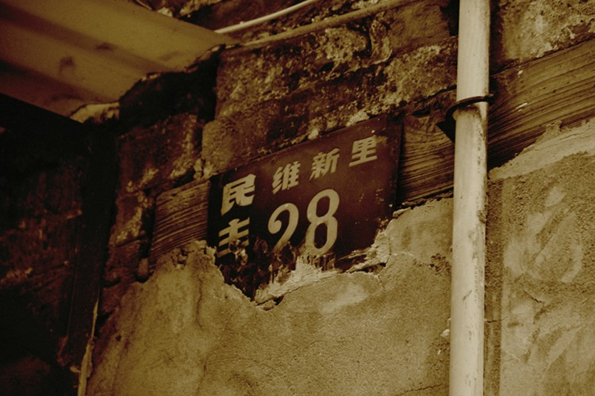
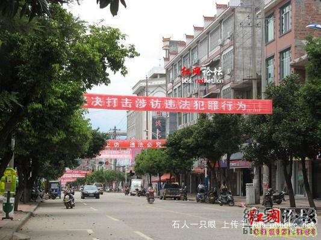
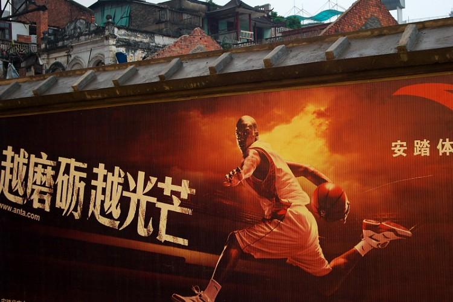

# ＜摇光 ＞制度才能改变中国——从驳《你怎样，中国就怎样》谈起

** 制度才能改变中国，只有如此，搞建筑的，才会因严格的质量监督不敢偷工减料而使自己的建筑牢固安全；搞造船的，才会因残酷的出厂审核而使 自己设计的船历尽完 美；搞食品的，才会因畏惧事故后的严惩与赔偿而保证食品的质量；搞金融的，才会因有效的金融监管而使自己手下没有一笔假帐；搞法律 的，才会因司法独立而不 惧威胁与利诱抑或是舆论的道德暴力从而维护司法公正；搞政治的，才会因渴望百姓的选票而真正的代表中国最广大人民的根本利益全心 全意为人民服务……** 

# 制度才能改变中国

# ——从驳《你怎样，中国就怎样》谈起

## 文/ 兰天（浙江大学）

 看了一篇分享量很高的文章《你怎样，你的中国就怎样》，一个美好的憧憬——建设道德理想国。我并不反对我们应该提高自身的道德水平，但是我觉得此文的立论 基础是人人都是一个道德高尚遵守规则的人。这是一个道德的柏拉图式理想国，与儒家提倡的“礼义廉耻”、本朝先帝所提的“以德治国”、当今圣上的“八荣八 耻”是一脉相通的。纵观中国历史上唯一可能存在的道德理想国尧舜禹时代，仅仅是依据传说，并没有什么证据，况且那个时候实行“禅让制”，恰恰是这个制度保 证了最有道德的人做君主，这才有能力影响一个国家的风气。但是即使国君原来道德高尚或者是伪善，拥有了绝对权力以后，也就有了恶的一面，继而有了禹后来传 位给启，开启了中国几千年的世袭制。迄今为止，“王道乐土”仅仅是中国知识分子的一种理想。正如托马斯·潘恩在《常识》中所指出的， “如果良心的激发是天日可鉴的、始终如一的和信守不渝的，一个人就毋需其它的立法者。”如果仅用道德就能治理好一个国家，那拿法律来干嘛？拿政府来干嘛？ 拿制度来干嘛？倘若我们人人都是天使，我们就不需要什么法律，也不需要政府了，正因为我们不是，我们还有痼疾，比如自私，比如对金钱、权力的无限渴望，因 此我们必须通过法律、政府、制度来维持社会秩序，使其能正常运转，确保人民权利的实现。 还有一条热门状态说“再过十年二十年，当官的是我们，当设计师的是我们，当建设工人的是我们，当新闻记者的是我们，各行各业的中流砥柱都是我们。但求那时 的八零九零人还能像今天这样问心无愧有良知。大难面前，我们也该自省，因为我们是什么样，中国的未来就是什么样。” 我也时常扪心自问，假如我有一天能够窃取高位（用“窃”是因为就凭我曾发表过的言论，在目前体制下的中国连政审都通不过，基本就告别当官了），会不会去贪 污受贿？沈阳市原副市长马向东在隔离审查是接受央视记者采访时，替我做出了回答：“我小时候是穷人家孩子，和姐姐相依为命，我还是工人时，也发自内心认为 如果我能当官，一定会为人民谋福利。后来我真当上官了，刚开始别人给我送钱时，我也拒绝过，后来觉得几百块也没多大关系，但晚上也会睡不着觉，后来权力越 大，掌管的部门越多，收得也越来越多，还有这也是一种社会关系，如果我拒收，朋友反过来会觉得我不太好交往，社会风气不端正，市长的坏做分，也对我有一些 不好的暗示，给我壮了胆，而我的做法也对下属有坏的影响···”（根据视频整理，可自行搜索） 我们可否这样揣度，马向东当年一无所有时，也曾是一个努力奋斗、渴望正义的进步青年，如果他出生在80、90年代，或许现在跟我们一样坐在电脑前呼唤真相、 呼唤正义、大骂铁道部，调侃“信不信”“奇迹”。同样，假如当我像他一样当上了副市长，别人来送钱求办事，我也很可能跟他一样想，既然一句话就能给别人办 事还能收到钱，那收就收吧，这个官位是组织上给的，又不是老百姓给的，收钱办事又不会给组织上带来损失，对百姓好不好？他们又没有权利罢免我的官位，我怕 什么，收就是了。受害人检举上访？我在我这级别就给他掐灭了希望的火苗。越级上访？嘿嘿，你不知道越级上访是犯罪吗？给我关进精神病院去。再说我不收以后 别人会认为我不合群，领导暗示我，我不收点钱怎么给领导送钱，我这官还怎么当？ 

 就是屁股决定脑袋，制度决定行为，这不是道德上“选择什么”的问题，而是制度上“能否选择”的问题。也可以这样理解，比如你喜欢吃肯德基，但是你周围的人 都吃麦当劳，而且不断暗示你不能吃肯德基，并且如果你吃肯德基，就会失去很多，而吃麦当劳，则会得到很多，那，你是吃肯德基还是麦当劳？ 纵观中国历史，我们不仅出产残缺的身体：太监和小脚女人，也出产残缺的精神：奴性与虚伪。革命军中马前卒邹容在1903年的《革命军》中说：中国人无历史， 中国之所谓二十四朝之史，实为一部奴隶史，虚伪史。鲁迅在《华盖集》中说，中国的尊孔、学儒、读经、复古，是为知道“怎样敷衍、偷生、献媚、弄权，然而能 够假借大义，窃取美名。”我在我的上篇文章[《动车而来的思考——民无信不立，国无信则衰》](http://blog.renren.com/blog/249676773/743088367)中 也提到中国人的虚伪，或者该称为“务实”，是我们多少年来在理论与实际、语言与行动、书本与生活、理想与现状的巨大反差中总结出来的“智慧”和生存之道。 例如宋朝提出“存天理，灭人欲”的大儒朱熹，反对寡妇再嫁，自己却与一美丽寡妇偷欢。刘志军2011年1月刚部署铁道部门反腐，2月就因腐败问题被隔离审 查。 既然我们表面是虚伪的，我们何不承认了自己的丑陋？柏杨在《丑陋的中国人》中说：“中国人不会继续丑陋下去，只有不承认自己丑陋的才会继续丑陋下去！” 我们在设计政治体制时，每个人都应当被假定为一个恶人，在其所有的行为中除了追求私利就不会有其他目的。我们必须借助于这种私利统治他，同时，尽管他具有 无穷的贪欲和野心，我们还必须利用他的私利使他为了公众利益进行合作。我们应该“以恶治恶”，前一个“恶”可以理解为宪法、法治手段、制度化的规章，后一 个可以理解为人类对于权力而存在的那些缺陷。 坏的制度，可能使不受制约的坏人肆无忌惮地行，甚至使好人也不能不为恶，同时通过信息屏蔽而披上“善”的外衣，而此时他所强求于别人的“善”，实际上是要人 为他无私奉献。即黄宗羲斥责的“使天下人不得自私，不得自利，以我之大私为天下之大公。”坏的制度下，君子也不得不做伪小人。坏的制度使人伪恶——未必言 恶但必行恶，尽管心未必那么恶。君子长期做伪小人的结果，往往也就成了真小人了。正如清华大学历史学教授秦晖所言：“满嘴的仁义道德，成天做男盗女娼”的 虚伪，难道不比“满嘴的仁义道德，一脑子（想想而已）男盗女娼”恶劣百倍？ 好的制度（例如权力制衡），可以使心中邪恶的人也受到监督制约害怕受惩而不能为恶，继而不能不持续“虚伪地”行善。小人长期做“伪君子”，久而久之做习惯 了，也就可能变成半真半假乃至全真君子了呢。好的制度使人“伪善”——不仅言善而且行善，尽管心未必那么善。亦如秦教授所言：“一脑子男盗女娼，成天做仁义道德”，这总比“满嘴的说而不做的仁义道德、一脑子男盗女娼”好吧？ 制度才能改变中国，只有如此，搞建筑的，才会因严格的质量监督不敢偷工减料而使自己的建筑牢固安全；搞造船的，才会因残酷的出厂审核而使自己设计的船历尽完 美；搞食品的，才会因畏惧事故后的严惩与赔偿而保证食品的质量；搞金融的，才会因有效的金融监管而使自己手下没有一笔假帐；搞法律的，才会因司法独立而不 惧威胁与利诱抑或是舆论的道德暴力从而维护司法公正；搞政治的，才会因渴望百姓的选票而真正的代表中国最广大人民的根本利益全心全意为人民服务…… 

 附：[郑蕊《你怎样，你的中国就怎样》](http://blog.renren.com/blog/220852895/742879026) 

#### 29日后记：

有留言说：这篇文章只写了什么才能改变中国，却没有写我们该怎么做。 我的回答：道德是律己的，而不是律人的。从古至今，道德理想国都是无法达到的理想而已。我写这篇文章，只是为了宣传一种思想，希望不要寄托在提高道德就能改 变中国，而是民主制度才能改变中国。人的思想是慢慢进步的，而这种进步需要对一些事件的反思，也需要进步思想的启发。这次的7.23事件，引起了网络上空 前的讨论，对于政府的质疑也是空前来的，很多人以前没有意识到是我们的制度出了问题，现在意识到了，就是进步。启发民智、宣传思想是任何变革的第一步。正 如有了当年的欧洲的启蒙运动，让大多数人开始思考封建制度的弊端，民主制度的优越，才有后来的民主制度取代封建制度。若中国大部分都意识到民主制度关系到 自己的切身利益，才是中国该走的道路。那假如有一天有一个导火索，民意的支持就将决定中国未来的道路。正如切尔诺贝利事故发生后，前苏联当局隐瞒说是火 灾，民众开始对政府极度不信任和幻灭。戈尔巴乔夫也承认切尔诺贝利事件苏联政府的撒谎是压倒苏联的最后一根稻草。 

**（采编：陈轩； 责编：陈轩）**

