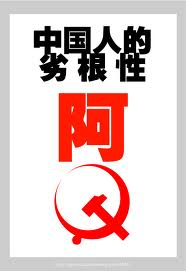
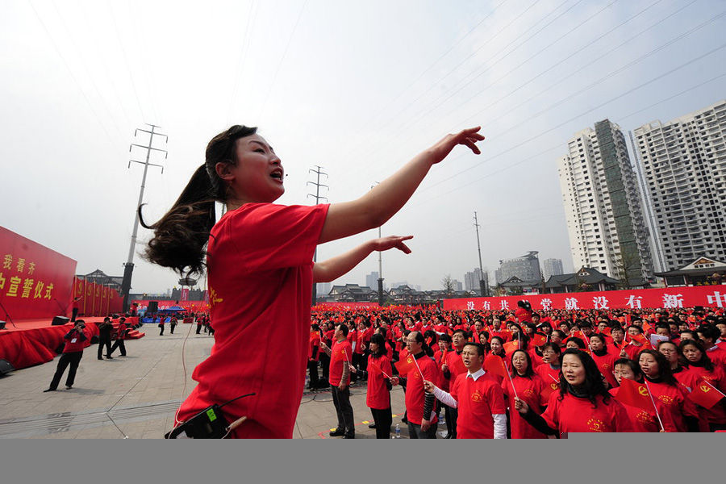

# ＜摇光＞2012，让我们告别宏大叙事

**“多谈些问题，少谈些主义”，有许多问题，即使是民主了，也未必就能解决。我们的视角，太多的集中于宏观层面的政治制度，却忘记了现实中有很多事情是“不可合同化”的。去生活中捕捉这些灰色的碎片，打开现实世界中的这个“灰匣子”，可能比泛泛而论那些宏大的概念要有意义得多。是时候搁置对于那些宏大命题的争议了，只有当知识分子们告别宏大叙事，转向具体地讨论哪些问题需要改、怎么改的时候，中国才可能看到希望。**  

# 2012，让我们告别宏大叙事

## 文/徐超 （上海交通大学）

 

100年前的今天，孙中山带着还没有准备好的中国，步履蹒跚地迈进共和时代，民主共和观念**被**“深入人心”了。100年后的今天，当我们重新审视这段历史时，却不得不承认，毛公总结的是对的：**百代犹行秦法政**。

自康梁算起，多少仁人志士都认为中国之病在于制度；可是100多年来，宪法里的词汇越来越冠冕堂皇，而官场沉疴却依旧积重难返。我们曾经师美，师法，师俄，我们曾经被日本殖民过，可是所有这些外来思想的冲击，总是换汤不换药，中国始终没有跳出“人治”的逻辑套套。

于是，我们又将目光从制度转向文化。对于中国的国民性，鲁迅骂过，柏杨骂过，当年的李敖也骂过，三位前辈骂完，像一枚石子投入湖中，激起小小一圈涟漪，之后重归平静。即使是波澜壮阔的新文化运动，能以千钧之力重建一门语言，也没能从根本上改变中国人的所谓“劣根性”。

我们的父辈可能同我们一样太过着急，想在短短的十年内完成从经济到政治的转变，乃至想凭一己之力移风易俗，结果适得其反，历史刚刚步入正轨便被扳向另一个岔道。倘若没有那次事件，可能万里、田纪云就能顺利地领导改革平稳的前进；可能就不会授人以柄，就没有左派的疯狂反扑，我们现在手中的牌就要好打许多。

可惜这些都是没有发生的历史。一代人有一代人的使命，我们的父辈种下的苦果，自然要由我们来品尝。可是他们用高昂的学费换来的经验和教训，我们却并没有继承。“告别革命”的声音犹在耳畔，我们却选择性地忘记。当年父辈们的“宏大叙事”，那些激动人心的概念和字眼，我们依旧在重复阐述。**难道，我们非要重蹈覆辙才能真正体会到这些血淋淋的教训吗？**

**“多谈些问题，少谈些主义”**，胡适之先生在民国时期就给了知识分子们一记耳光，可是我们都是好了伤疤忘了痛。**不信？现在我问你，我们整天骂天朝不好，那么现在请给我具体说说，到底有哪些不好？**除了强拆、城管，还能说点别的吗？能说点你自己身边的事情吗？

革命，改良，自由，民主，这些大而无当的字眼并不能解决任何问题。群体性事件越来越多，网民们的集体亢奋也越来越频繁，可是却没有人——哪怕有一点儿新思想——去具体分析问题的原因，**而一味地将其归因为制度，归因为缺乏监督。有些问题，即使是民主了，自由了，也未必就能解决。比如贫富差距问题，医患关系问题，社会保障问题，土地流转问题，地方财政问题，金融抑制问题，股市监管问题，房价问题，司法腐败问题……这些都是非常棘手的问题，不是revolution能解决的。**

**我们的视角，过多的集中于宏观层面的政治制度，或者集中于所谓唤醒“沉默的大多数”，或者讨论是否我们每个人都有罪。是的，讨论这些问题门槛比较低，骂起来又酣畅淋漓，可是这种廉价的“启蒙”也不过是资源的重复建设，甚至会误导更多的人。**

是的，**要讨论“娜拉出走之后”的问题门槛比较高**，想要了解各个方面的知识是有成本的，**需要花时间去阅读一些可能稍微专业一点的书籍**；与宅在电脑前发帖不同，你可能需要去跟别人交流，去了解现实中的问题。**而这些问题谁看的最清楚？是我们的父母、亲朋、好友，那些可能被你看不起、被你称为“犬儒”的人们。**他们才是“人民”的主体。老百姓过日子最迫切需要解决的问题，他们了解的最清楚。

我们之所以要从微观入手，**是因为现实中有太多的事情是“不可合同化”的****。这些东西可能尚未或者根本没法写进法律中去；或者即使写入，监督成本也太大，可操作性不强。**这就留下了很多的灰色地带。中国是个很有意思的国家，因为这段法律的真空，不是由宗教或者名义上的道德来填补的，**而是潜规则在其中起到主导作用。**比如说，县里的一个工程，可以给县长的一个亲戚来做，也可以给普通承包商来做；医院批发药品，可以买院长朋友的，也可以买普通供应商的；医生给病人开药，可以开昂贵的药拿回扣，也可以开便宜的药；派出所长的亲戚违章驾驶，可以吊销驾照，也可以象征性地罚点款，甚至一句“下不为例”了事。**这些潜规则可能都是些“难言之隐”，因为很多时候他们的确拥有这些自由裁量权。**

象牙塔中的学者，更多的是通过文献来认识世界。**没有多少学者愿意像冯军旗那样花两年时间深入“中县”，打开这个“灰匣子”。于是这个灰色世界一直神神秘秘，想说的人不知道，知道的人不想说。**连问题出在哪里都不知道，我们又怎么想对策呢？**去生活中捕捉这些灰色的碎片，可能比泛泛而论那些宏大的概念要有意义得多。**

而且，中国不是由北京上海这样的大城市组成的，而是由一个个县城、一个个乡镇组成的。**而这些天高皇帝远的地方的社会秩序，跟知识分子们所熟悉的城市可能很不相同。以城市的视角来分析全中国，不能不说是知识分子们普遍的目光短浅之处。**在这点上，**我们应该更多地跟曾经经历过上山下乡的前辈交流，跟现在农村县城中的父母亲戚交流。**

当然，你可能会想，这些问题留给专业人士去做好了，我能做的只是唤醒身边的人，唤醒一个是一个。可是，**这种努力注定是徒劳的，因为你跟周边人的话语体系都不一样。**尽管全中国可能有很多强拆、强占耕地等等恶性事件，但是对于你身边的大多数人而言，这些并不会对他们造成多么大的冲击。毕竟，他们自己没有遇到，他们身边的人也绝少遇到。**你对普通民众讲这些东西，跟讲《知音》《故事会》上的故事没什么区别。****当他们指着窗外的繁荣盛世反驳你的时候，你难道没有感到过无言以对吗？**

**你可以反抗某一个政党，某一个政权，某一个主义，但是你不能违背自然规律。宏大叙事对于普通民众而言，不过是过眼浮云，只有他们身边发生的故事才能在他们的心底打下烙印。**传教般重复那些“基本概念”能带来的只不过是知识分子内部自我认同的加强，但想让百姓们真正认同这套话语体系，太难，太难。**因为你所说的，离他们的生活太遥远。**

**普京在接受记者采访时，总是不忘记指出，反对派的游行没有明确的目的。**他说的是对的，假设现在突然变天了，那些宏大层面上的诉求都得到了实现，你们知道还有哪些问题是亟待解决的吗？你们知道这些问题应当如何解决吗？

革命也好，改良也好，都只是手段，最终要有一个明确的目标。民主自由也只是目前发现的最好的平台而已，**他们既不是最终目的，也不能确保能改善老百姓的生活。这就像淘宝这个平台，如果没有具体的各个小店，这个平台又有什么意义呢？**

**是时候搁置对于那些宏大命题的争议了。**在新的一年中，**我不希望再看到这么多优秀的智力资源浪费在无休无止又没有多少现实意义的清谈当中，**当知识分子们告别宏大叙事，转向**具体地讨论哪些问题需要改、怎么改**的时候，中国才可能看到希望。

2012年元旦于上海

 

（采编：楼杭丹；责编：麦静）

 
