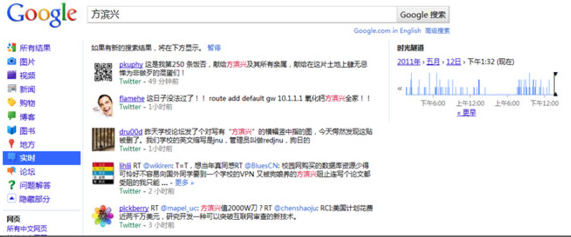
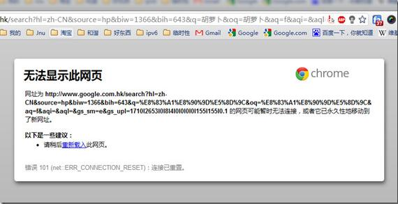
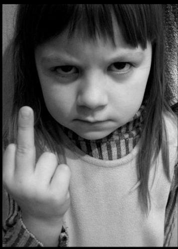
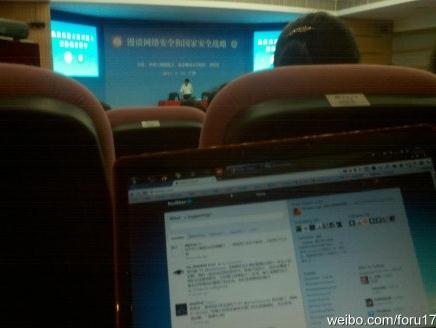

# ＜摇光＞GFW之父方滨兴讲座后杂想

**这里方这种观点存在推理错误，即“窃取论点”和“偷换论题”，他需要说明的中国的审核系统是否合理，而不是应不应该有审核系统，方要通过证据证明其中国“审核系统是合理的”观点，他却先假定国外“审核系统是合理的”，然后通过结论证明了假设。再说人家那系统跟你这系统是一样么！！！！？**  ** ** 

### 

### 

# **GFW之父方滨兴讲座后杂想**

## 文/罗磊 （暨南大学 ）

  今天上午，被称为“网络防火墙之父”的中科院院士、北京邮电大学校长方滨兴在我们暨大管理学院会议厅进行了主题为《漫谈网络安全和国家安全战略》的讲座。趁着今天没课，写一篇文章，说一下自己关于今天讲座的一些思考。 用google实时搜索了一下“方滨兴”，大家一定会惊讶地发现这个人的名字被人提起的频率也不低。 在互联网这个世界，有人不断被人提起是因为他们在这个领域叱咤风云，马化腾、马云之类，也有人不断被提起是因为娱乐，芙蓉姐姐、凤姐和五条杠队长，而方滨兴到底是谁？他没有身家显赫、也跟娱乐沾不上什么边，但为什么他总是被人提起？ 

 谁是方滨兴？一个科研成果丰硕的院士？一个中国重点大学的校长？还是？在这里，先附上维基百科[http://zh.wikipedia.org/wiki/%E6%96%B9%E6%BB%A8%E5%85%B4](http://zh.wikipedia.org/wiki/%E6%96%B9%E6%BB%A8%E5%85%B4)，这里有着这个传奇人物的详细资料。 中国网络防火墙之父，只要你上网，你就或多或少被这个人影响，twitter和facebook的屏蔽，google服务的被干扰，搜索“胡萝卜”时屏幕上冰冷的“该页无法显示”,无一例外与这个人和他所取得的工作成果有着不可分割的关系。 由于众所周知的原因，我们的政府对互联网进行了内容审核和过滤，感谢方校长们的辛勤努力，我们中国毋庸置疑地在“网络内容审核和过滤系统”方面取得了世界领军者的地位，我们的Great firewall技术绝对令“美帝”也佩服，成为埃及、突尼斯、利比亚之流网络监管部门学习的好榜样，比较尴尬地是这几个国家没学好，还是挂了。 

 说实话，讲座的质量不高，近三个小时的讲座，中途离场的人不少，睡着的人也不少，方滨兴的主要内容主要都是在漫谈一些基础的网络安全技术，恐怕不小心走错门的同学还以为这是在上课，技术层面的东西太多，较为枯燥，亮点是他现场演示了入侵一个普通用户的计算机，监控这个无辜用户的摄像头、还把他的文件夹翻了个遍。 昨天晚上才得知今天他要来讲座的信息，很是兴奋，一是久仰了“方滨兴”的大名，像我们这种小民能见到名人，自然免不了激动，当然，一开始知道他的名字因为这个“大名”是个“臭名”或者“骂名”。二是想利用这个机会提一个问题：“GFW的白名单系统什么时候开始实行？”，借机看看这个顶层人士能透出什么风声，遗憾的是，最后这个讲座成了报告会，没有交流，主持人就直接say bye让大家吃去饭了。 本人喜欢互联网，崇尚互联网那种“开放、自由、分享”的精神，加上是个技术控，老是折腾，经常需要看国外的一些东西，也需要用国外的一些网络产品，使用gmail当邮箱，使用google reader当阅读器看资讯，使用dropbox同步重要文件，上twitter看八卦，上youtube看使命召唤的视频。 我基本算是见证了这些产品怎么走向死亡或者残疾： twiiter被封的时候，我没什么反应，因为当时要高考也少上网；facebook被封的时候我也没什么反应，上面没几个好友，再说当时同学们也都在人人网偷菜，自己一个人在FB也太孤单；youtube被封的时候，我有点小郁闷了，因为看不到每周更新的COD游戏视频了，最后当google退出中国被封的时候，我郁闷了，gmail经常无法登陆，google reader时不时断开链接，就连搜索“胡萝卜炒蛋”的时候都被重置，手机android市场更新一下软件都连接不上。 之前一直觉得能忍就忍，每年花一百多买翻墙用的账号也罢了，就当学技术的学费，心想：“中国现在在改革期，转型期，需要稳定，这些过滤和屏蔽措施还是必要的”，心想自己总是能有办法解决这些问题，翻墙，代理服务器什么的，上有政策，我有对策，可是后来愈发严厉的审核和屏蔽，已经很严重地影响我的一些方面，最后，在这里，先说一下fuck GFW。 

 今天讲座的时候，我特意带上了本本，找了一个有电源的位置，通过wifi上网，顺便挂着SSH翻墙，上面方滨兴提到什么，我都会立马利用google搜索相关资料，验证真实性，在这里还得感谢一下暨大的网络还真给力。并且开着麦库记录自己的随想，当然，还有上twitter（真想刺激一下方校长）。 

 **国外的系统和我们的系统** 方在最后半个小时，终于谈到了网络审核，他屡次提到了建立审核过滤系统的合理性，方言：“我们现在的审核过滤系统是合理并且必要的，我们特意做过调查，google在180个国家都有过滤系统（期间方演示了google德国搜索“希特勒”的一个[寒蝉效应](http://zh.wikipedia.org/wiki/%E6%96%B9%E6%BB%A8%E5%85%B4)案例”）,他们也对内容进行审核”，另外还提到绿坝，说除了中国，韩国，澳大利亚，德国也有绿坝类似的软件”，不难看出，他的推理逻辑为：“因为国外也有，所以我们有是正常的、合理的”。 这里方这种观点存在推理错误，即“窃取论点”和“偷换论题”，他需要说明的中国的审核系统是否**合理**，而不是**应不应该有**审核系统，方要通过证据证明其中国“审核系统是合理的”观点，他却先假定国外“审核系统是合理的”，然后通过结论证明了假设。再说人家那系统跟你这系统是一样么！！！！？ 的确，google在180多个国家都有过滤系统，可是人家要过滤什么，是有法步骤，有程序，不像我们，二话不说，出现敏感词，直接封杀。google在大多数国家，对于色情信息，种族歧视，明显的犯罪信息都有过滤，说到这，我还纳闷google搜一些日本女性爱情动作片演员的名字都不行，神马波多野结衣啊，松岛枫啊，苍井空啊我都不知道，逼着我用百度。 在这里说一下方教授提出得google[ 寒蝉效应组织](http://chillingeffects.org/)，误解人家就不说了，请不要诬蔑人家。大家英文理解下面这段寒蝉组织官方声明应该没问题，就不翻译了。 Chilling Effects aims to help you understand the protections that the First Amendment and intellectual property laws give to your online activities. We are excited about the new opportunities the Internet offers individuals to express their views, parody politicians, celebrate their favorite movie stars, or criticize businesses. But we’ve noticed that not everyone feels the same way. Anecdotal evidence suggests that some individuals and corporations are using intellectual property and other laws to silence other online users. Chilling Effects encourages respect for intellectual property law, while frowning on its misuse to "chill" legitimate activity.  **谈谈利比亚** 方滨兴今天在讲座上再次提到利比亚，其在这个话题上的观点早已经引起争议。 请看方滨兴在北京邮电大学2011届毕业会上的演讲[《寄语研究生：常怀爱国之心 常抒爱国之情》](http://www.univs.cn/newweb/channels/campus2009/2011-03-31/1301534837d972507.html) 其观点，无非也就是“西方亡华之心不死，资本主义罪恶”的较为经典的《环球时报》思想。认为西方别有用心，阴谋论，什么事都有有预谋有计划的。 当场听到方滨兴讲这种观点，还是比较遗憾，尤其是方滨兴还是作为一个大学的校长的身份，方是一个理科生，哈工大，中科院，科研技术上自然令人佩服，可是人文素养上，是在是不敢恭维。 对于利比亚，CCTV这次的报道还算客气，如果北约南联盟那时期是90分反面宣传，伊拉克战争是80分反面宣传，这次算得上是60分反面宣传了，一个国际舆论在那里，中国也不敢明着支持卡扎菲，感谢新媒体，让更多人知道了不少真想，政府想再单方面宣传也不敢随便了，卡扎菲过去的行径就不说了，2011年就对国内民众的一些言论，就值得进行推翻。 在这里提及一个概念，在国际法中，有一个R2P法则，即[Responisiblity to protect](http://www.responsibilitytoprotect.org/)，国家保护责任，当某国政府明显地让民众受到反人类罪行的威胁，而本国的民众没有力量对这种威胁进行反抗的时候，其他国家有责任进行干涉。 今天方滨兴还说到这实际是利比亚国内的部族冲突，属于内政，不应干涉，对于那些持“这是他们国家的内政，其他国家不应该干涉”的人，我想再说一下，1994年发生在非洲卢旺达的部族冲突，胡图族对图西族及胡图族温和派有组织的种族灭绝大屠杀共造成80万至100万人死亡。20年不到啊，同学，你当年也就4、5岁啊，同学（对于90后），不少跟你一样大的图西族小孩，就直接被砍刀给砍死了，同学！当然，这依旧是他们的内政，那一次，联合国“政治正确”选择了消极态度，西方选择了不干涉，结果是什么？近100万条生命啊！！！这是人类“文明社会”的耻辱。  **科研道德** 今天在讲座的过程中，面对前面讲台上那个侃侃而谈的人，我突然想到了“科研道德”这个概念，我不知道对这个词的定义是什么，就我理解，就是学者、研究者在进行学术研究、科技研究的过程中，到底应该什么道德准则，他们的研究成果对于人类社会到底有什么意思？是否应该有一个底线？ 讲座之前，我跟同学说，方这个人，可以说是“祸国殃民”，制造的是愚民工具。想这个问题的时候，我想到那些军工企业，那些军事发明家，他们做的是武器，武器：在纳粹德国的军队手上，可以杀千万人，可在那些反抗者手里，又能抵抗入侵者。可是方的这个系统？除了屏蔽敏感内容，成为最有技术含量的愚民工具？他另一个方面作用有多大呢？ 或者，正如方滨兴今天总是讲的“道高一尺魔高一丈”那样，每一次防火墙的升级，都能激励破墙者向越来越坚硬的墙发出挑战，寻找漏洞。孰道孰魔，在这个魔界，魔才是真正的“道”吧。 本没有墙，人站在两边，墙就有了。欲破之，另一边的人过来就可以了。 **我们是否需要****F*ck ****方？** 

****

 讲座途中，我发了一条微博： 

  * 其实我觉得[#方滨兴#](http://t.sina.com.cn/k/%25E6%2596%25B9%25E6%25BB%25A8%25E5%2585%25B4&refer=miniblog_jing)也挺无辜的，一个搞科研的，成为一个令人反感系统的代言人，众矢之的，背上骂名，但是我想这些搞科研的是不是应该要有点[#科研伦理#](http://t.sina.com.cn/k/%25E7%25A7%2591%25E7%25A0%2594%25E4%25BC%25A6%25E7%2590%2586&refer=miniblog_jing)，也许方校长的境界很高，我们这些人体会不到，人在江湖，身不由己。
古龙的小说浓缩起来就是“人在江湖，身不由己”，大江大湖，中国这个江湖是混乱的，从曾经混乱走向逐步的秩序和法制，我无法体会方院长站在他那个高度所想的东西，科学研究本是中立，是个清水衙门，负责网络的部门也是按照上面某部的指示进行工作。 大家的情绪需要发泄，发泄给一个有具体形象的人更能给大家带来快感，终究是这个体制问题。可面对冰冷无情的体制，无力的个人怎么发泄？ 不知20年后，如果我们走进了一个开放、自由的公民社会，那堵墙不再，方校长还在的话，他会怎么回味自己的所作所为。 **我想提的问题** 虽然最后领导们都很饿了急着去吃饭了，没有给我们提问的机会，我还是想了几个问题。当时准备提问的就是第一个 1.我们是否会使用白名单，什么时候会开始实行？最近电信的大规模访问国外网站故障与这个有关系么？ 现在的过滤系统还是黑名单，即凡是出现在这个名单中的网站，都进行屏蔽，而白名单则相反，只有在这个名单上的网站，才能访问（针对国外网站，国内网站有备案制度）。个人很关心这个，就这几天出现了企业用户不能访问外国网站的情况，怀疑是电信的国际出口进行白名单测试，我自己的网站域名主机都是国外的，如果实行白名单，我的网站应该就要消失了。 另外还想个问题，不准备问，写出来也就当调侃。 “方校长你好，我想请问一下网络审查过滤系统对互联网产业的影响有多大？对互联网经济有什么作用？当然，听说方校长买了6个VPN，校长你还是推动了这个VPN产业的发展的，VPN商人还是很喜欢方校长的。”  **写在最后：** 花了几个小时，写这篇博文的过程还算流畅，其中查证了一些例子。 昨晚跟我妈聊天，说到今天方滨兴要来，骂了他几句，我妈跟我说：“人家比你牛，你要学习人家，人家比你成功，你还有什么话可说”。 的确，“院士”、“校长”的头衔，的确是某种定义的成功。可是成功就正确吗？ 在这里给大家一个建议： 使用google进行搜索，至少你搜索一个关键字被屏蔽的时候，你还能知道什么被屏蔽了。 附上一个小tips给暨大的同学，可以稳定地使用google的服务 [http://note.sdo.com/my#/my/notedetail/uPUSw~jr5OKFnM01I00Ajn](http://note.sdo.com/my#/my/notedetail/uPUSw~jr5OKFnM01I00Ajn) 如果你有兴趣翻墙，可以提供技术协助。 我的twiter[@foru17](http://twitter.com/#!/foru17) 我的新浪微博:[@罗罗磊磊](http://t.sina.com.cn/foru17)  原文地址：[http://luolei.org/2011/05/gfw/](http://luolei.org/2011/05/gfw/)

（采编：陈轩 责编：陈轩）
