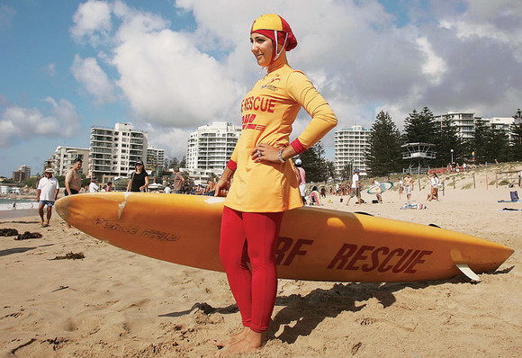
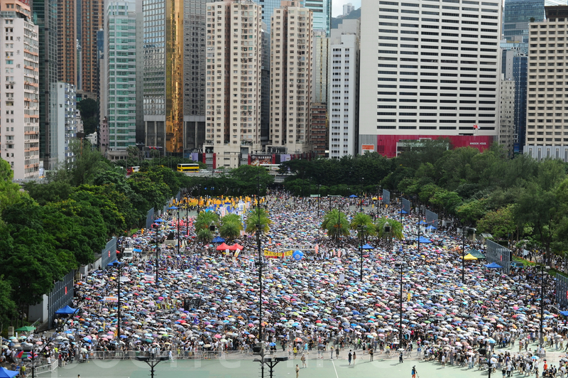

# ＜摇光＞HK的随想

** **

 

# 

## 

每次到香港，都会有更多的想法和发现。敝帚自珍，无论想法浅深，都随手写下，记录自己的思想。

一、幸福的国民都是相似的，不幸的国民各有各的不幸。

在尖东SOGO百货，看到两个身穿全身裹得跟粽子一样的传统装束穆斯林妇女，每人手中握着几件劲爆三点式泳衣，一路小跑冲入了更衣室，眼睛里闪耀着不可抑制的兴奋的光芒。如果在她们祖国，估计买到的符合法律规定的最时髦泳衣基本是这种款式：

所以我在这里借用托尔斯泰的这句话。老实说，我真正理解了这句话的深刻含义，还是在看完了《枪炮，细菌与钢铁》之后。

你对生活在伊朗的人们说，伊朗人民你们国家产石油，很有钱哦！你们幸福吗？伊朗妇女愁眉苦脸摇头说不幸福，因为我们不能穿三点式泳装去游泳，我们还上不了“非死不可”，我们还不知道我们的总统是不是由人民选出来的；

你转向印度说，印度人民你们IT产业牛逼，还有民主制度哦！你们幸福吗？印度人摇头说还是不幸福，因为我们还是很贫穷，宗教冲突频繁，还有遗留的种姓歧视；

你又转向巴西说，巴西人民你们有民主制度，也不存在宗教冲突，经济发展也很快哦！你们幸福吗？巴西人民摇摇头说还是不很幸福，我们贫富差距还很大，腐败丛生，虽然有了民主但是还欠缺法治；

你又转向天朝问天朝人民你们幸福吗？

天朝人民嘿嘿嘿，说幸你妹的福。

盖因说，一个国家的人民要幸福，必须物质要得以满足，精神要得以满足，权利要得以满足，各种因数缺一不可。独立宣言说了，“人人生而平等，他们都有从他们‘造物主’那边赋予了某些不可转让的权利，其中包括生命权、自由权、和追求幸福的权利”。

少了一点，人民都不能幸福。人民都要伤感很久，继而辗转到别的国家和地区，去买三点式泳衣，喝没有三聚氰胺的牛奶，呼吸新鲜的空气，住具有永久产权带停车位和花园不会被强拆的房子，去追求幸福。

二、要清楚所追求的东西究竟能带来什么，不能带来什么。

我想到，能让香港人民，和来到香港的人感到幸福的，是香港所拥有的高度的法治化，自由宽松的商业环境和资本市场，发达的现代文明，还有言论自由。当然，人民没有太多的选举权力，但港人一直在争取。

人人都清楚香港具有如上的优点，但这些优点如果内地也拥有了，能改变什么社会问题？又不能改变什么社会问题？

这一点很重要，其实跟追求一个美女、一个好工作一样，追求一个体制的改变也需要清醒，你要清楚这个。避免等那一天来到的时候梦想实现的时候又产生诸如“原来美国也有黑暗的一面我再也不相信爱情了”类型的各种傻逼的幻灭感。

譬如，法治和民主和自由，并不能阻止一些传统的愚昧和观念继续流传。

在香港，每条街都有卖各种中药材，补品，鱼翅燕窝。去“糖朝”吃甜品，坐下一看，桌子上中英互译，给你生动讲解“tangshui”的滋补功能。让我顿然有种看英文解说Chairman Jiang's Three Representatives之感。

要说虚假广告，所有的标有“滋阴壮阳”的补品，都是虚假广告，如果真的我们老祖宗那么有能耐发现了这么多壮阳的东西，我们国人一口气吃上几百年，那现在美国的成人动作片的男主角哪里还轮得到黑人和白人混，是吧，随便上一个华裔，两碗牛鞭汤下肚，都可以傲视群雄。哼哼。

不要指望民主和法治能打击封建迷信，美国就是个好的例子。即便已经是世界第一科技强国，《科学美国人》的专栏作家还是隔三差五地要跟“创世论”较劲一番并耐心对普罗大众推广进化论。这在中国是不可想象的，因为我们在学校教材里推广进化论的手段和效果跟我们推广政治课的手段和效果一样强大。

但是，给予人民思想的自由，去接触各种理论，通过思考并选择自己认为正确的理论，比强迫人民去接受一个唯一的理论更为重要。后者固然能够让牛顿的三大定律深入所有人心，但前者却能促进量子力学，相对论乃至更多新理论的诞生。

还有，香港所具有的这些社会环境和制度优势也不能阻止当地媒体的各种媚俗低俗化。

香港媒体媚俗和新闻娱乐化程度同内地媒体相比，绝对有过之而无不及。你上香港的报刊亭转一圈，三分之一的杂志都是娱乐类，各种劲爆封面再配上吸引人粤语繁体文字，“XX哥夜浦姣女被拍，劲爆激吻咖喱鸡”“波神大玩湿身诱惑”。即便主流报纸譬如苹果日报，遇到重大题材也喜欢用标题搏出位，重花边新闻，重娱乐效果，而忽略事件深度的探讨，上面评论文章的水平跟内地的什么南方周末新京报潇湘晨报的比简直弱爆了。

甚至我可以肯定地说，一个国家的媒体的自由程度和大部分媒体的媚俗程度这简直是必然成正比的关系。假若实施严格的审查，则所有的杂志报刊都必然无任何讨好民众读者的三俗图片文字，家家都是人民日报社论，篇篇都是新华社通稿，严肃高雅，品位不凡。

但是我估计这些社论和通稿甚至还不如苹果日报的杂谈版块里面的文章更接近事实的真相。

若渴望自由所带来的思想解放，就要忍受自由所带来的媚俗风气。法制只会会制裁一些诸如侵犯个人隐私权之类的行为，但法律绝无权力判决一个人的意识形态是否违法，一个人的思想低俗是否有罪。

啊，低俗，来吧，我不怕你，“波神大玩湿身诱惑”，来吧，come on baby。

另外，民选的代表可能不像你们所想象的那样完美。

打开香港的电视，常常可以看到各路代表委员高声痛骂曾特首和官员，不排除他们该骂，但有的时候代表们只是图个痛快，挥拳，喊口号，甚至不比微博上的网民骂人水平更高。

许多人常常嘲笑台湾立委或立法院的委员们群殴的景象，认为我们的人民素质不高，施行民主会导致政治庸俗化，给人一种“乱象”的感觉。

但这些人可曾想过为何这些素质“不高”，长相平平，梗脖子打架喊口号的的代表和委员，却能更好地为他们的人民谋福利？而我们那些代表，虽然都是演艺界和体育界的各路精英，西服革履，见多识广，知书达理，说话做事绝对有品位有风度，却几十年都没投过反对票，甘当政治花瓶和宠物？

总有一天大家会想明白这件事，然后猛一拍大腿：干！我们选的是代表啊！又TM不是选我老婆或丈夫，长得漂亮说话有风度有个屁用，敢出头才是真！

最后，法治，言论自由和民主的环境，也不能阻止或减少谣言的产生和大量传播。香港街头报亭，基本是娱乐、成人和政治类刊物三分天下。如果你翻政治反动类报刊，基本随手可见各种秘史和小道消息，真假难辨。网上的辟谣党，真相帝要是在香港书摊前呆一个小时，估计都会气出心脏病来。

但是这根本不重要。因为不禁言固然带来了横行的各种谣言，但自然会有有识之士立刻做出批驳，让各种横行的谣言寿命缩短。

相反，禁言固然能减少一部分民间谣言的流传，但官方的谣言却牢不可破，且那些民间流传的谣言一旦散播开来也很难消除。

网络和围脖固然带来了海量的各种谣言。但若没有网络和围脖，估计我们到现在还对“从宇宙飞船上看到的唯一人工建筑就是中国的长城”这种SB谣言深信不疑。

感兴趣的同学可以去看《叫魂》这本书。

某篇国际友人写的文章《中华人民谣言共和国》，前阵子火了段时间。但其实，谣言在一个国家的人民中能够广泛传播的最根本基础，乃是国民对统治者和政府的极度不信任。如果你将人民不信任政府的责任，推卸到人民的身上，或推卸到网络身上，这真是情何以堪。

另，若将世界上网友的技能和本事排个顺序，中国的网民基本都可以名列前茅。我们的网民的搜索技巧超过了CIA，破案推理技巧超过了FBI，对大事件的反应速度超过了SWAT，法律顾问团阵容完胜默多克的辩护律师团。放眼世界，WEB2.0时代，哪个国家的哪个社交网站可以发动和组织如此大规模的群众集体参与调查各种大案要案，红十会内幕，达芬奇内幕……网友争相爆料，波澜壮阔，高潮一波接一波。相比之下，非死不可和推特上那些只会分享“yo yo man gonna have a party in night club downtown got lots of chicks there come 2 join us buddy”类型消息然后无数好友纷纷猛点“赞”的发达国家网友再次弱爆了！

当然，埃及和突尼斯的网友很牛逼。

为我们的网民感到骄傲还是悲哀呢。我们的网民把警察局，法院，检察院，政府的活全部都干完了，为什么我们的社会还是那么糟呢？

很简单啊，一个国家怎么可以这样荒唐，乃至要基本依靠人民的自发揭发举证和大量网友的志愿参与调查来揭露和打击社会的黑暗面呢？然后这帮人民在检举揭发的过程中突然又开始互相攻击说你造谣党，你五毛，你美分，你水军，你专制，你片面，啊要是实现了民主和自由后有你这样的人存在真是可怕啊！

最后人民自己打成一团，公检法全体专业人士袖手旁观，看帖不发帖。新浪小秘书在旁边当裁判，不时发布个消息：某某账号散播虚假信息，经查实，停止关注一星期。

一个月后，事件没有水落石出，真相也不知道，法院也没有判决，唯一不同的是广大人民又提高了和广大人民进行群众斗争的经验，认清了各种五毛美分水军造谣假民主假自由假科学假客观假正经分子的嘴脸。嗯哼。

这TM都算什么玩意啊这都是！！！

三、文化的沙漠却是绿洲

大概是95，96年那时候，我还在上小学，从报纸上看到过两篇报道。

第一个报道说的是采访某春晚小品专业户，让他谈对香港文化的看法。该春晚专业户说，香港是个殖民地，他们只有殖民地文化，他们的“双周一成”电影尽管票房好，“四大天王”歌曲尽管很流行，金庸小说尽管很火爆，但都是舶来品和市民消遣的作品，没有中华文明的底蕴，比不上内地的作品。

第二个报道更牛逼，说广州目前上映了两部电影，第一部是内地影片的《独生女》，讲述独生子女娇生惯养不懂体贴父母的影片，具有教育意义，票房很好，父母纷纷带孩子观看；第二部，是香港影星周星驰的《大话西游》，该片对著名古典文学作品《西游记》进行了低俗浅薄的修改和加工，但票房惨淡，许多人纷纷表示“看不懂”。文章最后说，这表明了内地观众的品味已经有极大的提高，以香港周星驰为代表的低俗市井“无厘头”喜剧文化已经彻底没落，未来将会有一批更加出色的作品问世，陶冶观众的高雅情操云云。

几年后这两部片的各自下场如何我就不提了。

内地仗着自己的面积比香港大几万倍而嘲笑了香港本土文化的市井化商业化和庸俗化嘲笑了几十年，蓦然发现，就是这庸俗商业市井的香港电影香港流行音乐香港武侠小说，反哺了整个大陆几代人的青少年阶层。在这片贫瘠的红色的文化沙漠中，高产各种商业片和流行音乐的香港，反而更像是唯一的文化绿洲。

香港的报刊亭固然以低俗快餐文化为主打，但也有许多书店，你在里面可以买到许多真正的好书。高雅的文化和低俗的报刊并行不悖，都是这个文化自由的都市的一道景观。

而音像制品就更不用说了。北京一个音乐爱好者可能要辛辛苦苦三五年才从五道口的各路打口摊上淘齐的一套古典乐全集，在香港的CD TOWER每间连锁店里都有。两种成长环境，孰优孰劣，一目了然。

7月，香港书展。和去年一样，各类图书云集，嘉宾到场，同时各路嫩模也纷纷携带写真集赶到，在会场内外搔首弄姿。

但是书展的主办方已经不再和往常一样对这些低俗诱人的“嫩模”驱赶和禁止了。只是做了少许的限制。

去年，书展的主办方总裁林天福解释为什么不再驱赶“嫩模”，说：“我认为，我们必须学懂以包容的态度来看待一些我们不喜欢的人和事。今天，因为一些书籍订立一些限制，明天，又因为一些书籍订立更多的限制，那么最终不但香港书展会失去它的特质，就连香港人引以自豪的自由也会付诸东流。我始终相信，当我们的社会有浓厚的文化氛围，当我们的年轻人都抱着追求知识、追求文化的热情，他们自会判断什么是杂音，什么是天籁。”

貌似成功了，去年的书展，焦点是嘉宾韩寒，梁文道，嫩模只是成为了文化盛宴的一道点缀。

但是今年风景又是不同，各路嫩模在会场又是淋浴又是泡泡浴，大有“The NenMo Strickes Back”的趋势。

另一旁则是各路重量级嘉宾：于建嵘，李承鹏，刘慈欣，唔，还有李敖。好吧。我很期待李敖大战嫩模的场景。

如果你只看到了香港文化世俗和商业的一面，那么可能你只看到了嫩模，而没有看到书展。

四、物质文明不是全部。

可能很多人就会说，你还不是羡慕人家的物质文明？你还不是羡慕人家钱多？要是大陆也有那么多钱，你也一样会羡慕。

其实说到物质文明，内地新兴的大城市更是物欲横流，如果谈到大兴土木的基础设施建设和繁华街景，香港早就被内地的新兴城市甩下了几条街。

如果你抬头看香港的大部分街道。你会发现繁华装修的只是街边的第一层楼。大多数楼到了第三层便呈现出一幅破旧景象，让你回想起电影麦兜春田花花幼稚园里的片段。这些给人一种“资本主义行将腐朽没落”感觉的建筑，自然无法跟比邻的深圳那到处拔地而起的雄伟的CBD和购物中心相比。

但是又是什么使得这些密集破旧的楼房间的店铺，比内地大城市光鲜无比的CBD更具有吸引力？iphone在内地也可以买到，“路易死尾灯”在大陆也有分店，但是为什么那么多人一定要到香港的这些修葺过的破旧楼房沿街铺面来买？

不排除天然深水港和贸易中心的优势造就了商品的低价。但根本原因大家其实都心知肚明，在香港买的东西没有被打过那么多税。

这里的政府收的税少，但他们所管理的市场却还能保证你买的东西更好。

五、干什么都要去香港啊现在

如今香港吸引人的不只是打折和免税的服装和电子商品，还有安全的奶粉，还有户口，还有教育资源。

越来越多的人往返深港两地走私奶粉，越来越多的孕妇奔赴香港生产，越来越多的内地高考状元选择到香港求学。

是香港越来越进步了么？不是，是内地越来越退步了。

说到教育，有个段子：79年中国教育学家到美国考察，发现大部分学生上课都大声说笑，坐没坐像站没站像，课堂纪律混乱，学习的内容却十分简单。于是断定：20年后中国教育必将全面超越美国！

同时还有一群美国专家也到中国考察，发现学生大都牛逼无比，上课时不苟言笑，初中便能徒手解X元X次方程，四则运算心算快过计算机，各种物理公式和化学元素周期表背得滚瓜烂熟，甚至从小学便开设英语课，于是惊呼：20年后中国这代年轻人必将超越美国同龄人！

然后，30年都TM过去了……

个人觉得这个段子伪造的痕迹很重，因为一眼看去知音体的味道便扑面而来。

但从这个故事至少可以反映出一些问题。

首先，便是对大多数人而言，他们18岁以前的所学会的知识再多，成绩再好，对其一生的命运可能都不会有什么太大影响。一个小孩子18岁以前再牛逼高考全国总分第一，可能长大了也就是个体制内处级干部，体制外企业小经理的结局。然后，将如上结论推广，对于一个国家而言，这个国家的18岁以下的小P孩们的总体学习成绩如何，也跟这个国家的前途和命运没有半点锤子关系。

其实，高压应试教育固然扼杀想象力，但至少可以培养出许多合格的工程师。如果没有政治课，还有一个有活力的，自由的经济环境，这些工程师人才群体就算出不了大师拿不到诺贝尔奖图灵奖菲尔茨奖，合作起来搞几十个世界级的电子产品企业还是绰绰有余的。台湾韩国和日本便是例子。(ps:貌似被孔老二这个王八蛋的学说辐射过的地区，中小学生都学业繁重啊混蛋！）

但是同样是接受了应试教育，如果他们毕业后的环境缺乏生机，晋升都是靠人际关系，没有激励机制来鼓励个人的创新和突破，民办企业要受到官办体制内垄断企业的打压和排挤，又有各种政策限制草根的创业，那么这些毕业生走出社会后也不会有什么大出息。

我们国家最不缺乏民族自信心和自豪感爆表的同胞。

在围脖上看到一个带V的同胞，在国外也呆了很久。某日和几个法国大学生聊天，问：“你们平日除了上课外，课余时间都干什么？”法国二逼大学生答：“喝酒，耍朋友，示威，烧车子。”

于是这个同胞感叹：“现在国外的年轻人都太沉溺于安逸的生活了，不懂得奋斗和为社会做贡献。而反观我们中国，却有许多勤奋向上的年轻人，让人感到希望。”接着便是未来属于中国之类的感叹云云。

一群勤奋向上，但是没有自由和权利的奴隶，和一群散漫懒惰，但是拥有自由和权利的公民，哪一个群体所创造的未来会更加美好点呢？

这是个疑问句，人人都可以回答。

 

（采编：宋晓慧 责编：佛冉）

 
