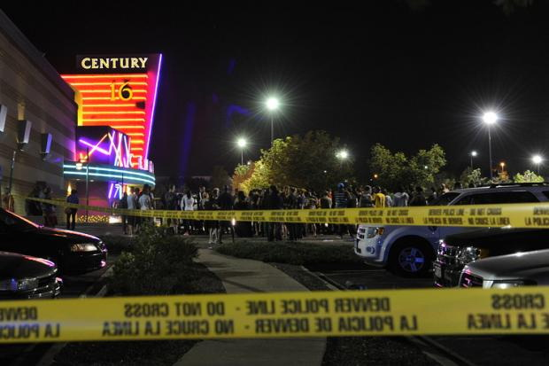
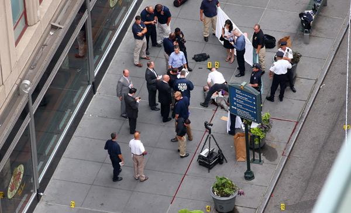
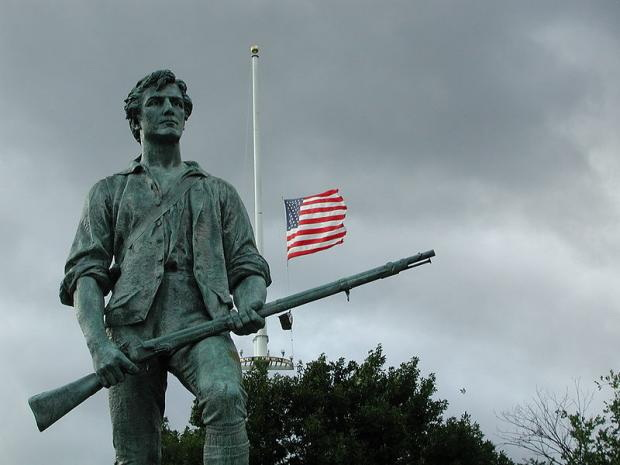
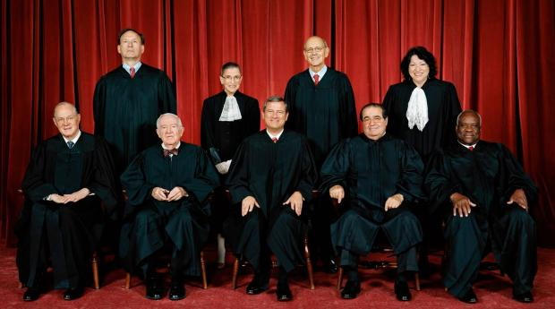
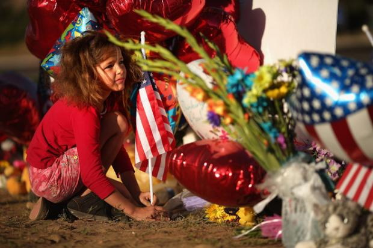

# ＜摇光＞“枪”的背后

**禁枪的决定需要绝大多数美国人在思想和认识上的转变。在那之前，我们只能悲观的等待着更多的枪击案成为报纸的头条新闻。但我们希望更多国人能够认识到，美国并没有什么“允许持枪是为了杀贪官”的荒谬法律。同时，真正保护公民安全、自由和民主的，不是枪支，而是法治。**  

# “枪”的背后

## 文/汪毅（University of Minnesota Law School）

 

#### **接连4起严重的枪击案**

2012年7月20日，0点。盛装打扮的人们走进位于科罗拉多州奥罗拉的世纪电影院，满怀欣喜地等待着《蝙蝠侠——黑暗骑士崛起》的上演。世界上再也找不出另一个像美国人这样喜爱超级英雄的民族。对他们来说，这场电影的首映俨然就是一个节日。

然而，邪恶悄然降临，沉浸在电影特技中的人们却浑然不知。犯罪嫌疑人James Eagan Holmes在电影院中看了20分钟电影后，回到停车场换上了防弹衣和防毒面具，手持来复枪、M&P15机关枪和手枪再次来到电影院中。当他从紧急出口进入的时候，前排的观众还以为他只是那些盛装打扮的观众中的一员。直到凶手扔出烟雾弹，掏枪大开杀戒的时候，人们才意识到这不再是电影，而且也不会有超级英雄挺身而出来保护他们。

12人死亡，58人受伤。最小的死者，是一个只有三个月大的婴儿。

科罗拉多枪击案现场（图片来源：Getty Images）

2012年8月5日，上午10点。虔诚的锡克教徒正如以往的每个周日一样，聚在位于威斯康星州橡树溪的锡克教堂中参加礼拜。突然，白人至上主义者Wade Michael Page闯入教堂，开枪朝人群射击。惊慌失措的人们奔向四周，但是枪手仍然一次次的扣下扳机。

6人死亡。4个人死在教堂内，2人死在屋外。枪手在被警察击中后，开枪自杀。

2012年8月13日，中午12:30。位于德克萨斯州的Texas A&M大学旁，再次发生枪击事件，包括枪手和一名警察在内的3人死亡。

2012年8月24日，早上9:30。一名男子在射杀了他的前同事后，在每年接待超过400万游客的帝国大厦前，与2位即将追到他的警察交火。流弹伤及10人。枪手被当场击毙。

纽约帝国大厦枪击案现场（图片来源：The New York Times）

#### **美国为何允许持枪？**

自2007年发生的弗吉尼亚理工大学枪击案以来，有关美国的枪击案的新闻似乎就一直不绝于耳。国人总是在问同样的几个问题：“美国人怎么能随便持有枪支呢？”“枪支泛滥太可怕了！美国为什么不禁枪？”

核心问题：美国为何允许持枪？

因为在美国宪法的第二修正案中明确写有：“_**一支训练有素的民兵，对一个自由州的安全实为必要，民众拥有并且佩带枪支的权利不容侵犯。**_”（A well regulated Militia, being necessary to the security of a free State, theright of the people to keep and bear Arms, shall not be infringed.）

这个就是美国人可以在一些约束条件下持有枪支的法律依据。

宪法第二修正案于1791年写入宪法，属于闻名于世界的“权利法案”的中的一条，紧随保护言论自由的宪法第一修正案。由此可见保护佩带枪支权利的悠久历史。

法律的形成源于当时社会的风俗习惯。从“五月花”号载着避难的清教徒登上北美大陆的那一刻起，枪便成为了北美定居者生活中重要的组成部分。从打猎，到和印第安人争夺土地，到赶走大英帝国统治者的独立战争。枪以及“训练有素的民兵”在其中都发挥了不容忽视的作用。

美国公园中的民兵雕像（图片来源：Wikipedia）

也正是从保护“自由州的安全”的角度出发，才有了宪法第二修正案。

开国先贤汉密尔顿（Alexander Hamilton）在《联邦党人文集》中指出：_“一个优秀的、训练良好的民兵团队，在国家需要进行防御时，随时可以参战。同时，有一大批在训练和使用武器方面相差不多的公民，他们随时准备保卫自身的和同胞们的权利。在我看来这是代替常备军的唯一办法；如果有常备军存在，这也是防备它的最安全的办法。”_

当然，这其中还包含着很多州权和联邦权利斗争的背景，就不做过多的阐述了。

#### 

#### **最高法院标志性判例**

同其他具有重大影响的社会议题一样，持枪的合法性一直饱受争议。不同意识形态的州对于限制枪支有着不同的看法，也随之体现到当地的立法当中。比如南方传统保守州的相关法律对持枪就比较宽松。相反，作为自由派思想盛行的纽约，就有着非常严格的禁枪法律。而首都华盛顿和伊利诺伊州一度禁止个人持枪。

这便引出了最高法院近年来有关宪法第二修正案两个著名的判例：2008年的哥伦比亚特区诉海勒案（DISTRICT OF COLUMBIA ET AL. v. HELLER）和2010年的麦克唐纳德诉芝加哥案（McDonald v. Chicago）。

海勒（Dick Heller）是哥伦比亚特区（即美国首都华盛顿）的一名警官。根据哥伦比亚特区的法律，作为一名警官，他可以在联邦政府大楼持枪，但不可以在家中拥有枪支。海勒被一心想推翻哥伦比亚特区禁枪法律的保守派团体选中，从低级法院开始起诉。经过一路上诉，终于把官司打到了联邦最高法院。此时的联邦最高法院的9名大法官中，具有保守派思想的大法官已经占到多数。（有关美国联邦最高法院的通俗读物，推荐《九人：美国最高法院风云》，上海三联书店出版，作者：杰弗里·图宾，译者：何帆）

经过双方激烈的交锋和法院的审理，最高法院以5:4的微弱优势，判决哥伦比亚特区败诉。因其法律违反了美国宪法第二修正案对于个人持枪权利的保护。

由斯卡利亚大法官撰写的法院多数意见认为，宪法第二修正案保护个人持枪的权利，并不一定要服务于民兵组织，同时保护个人将枪支使用于传统法定的用途，比如在家自卫。“The Second Amendment protects an individual right to possess a firearm unconnected with service in a militia, and to use that arm for traditionally lawful purposes, such as self-defense within the home.”

而少数意见书撰写人斯蒂文森大法官则对于第二修正案有着自己的看法，他认为只有公民和民兵组织联系在一起的时候，持枪的权利才受到保护。“It protects only the right to possess and carry a firearm in connection with militia service.”

由于哥伦比亚特区属于联邦领地，并非联邦中的一个州，这项判决生效后只适用于联邦领地。保守派们乘胜追击，在2010年的麦克唐纳德诉芝加哥案（McDonald v. Chicago）中再次以5:4的优势宣判伊利诺伊州芝加哥的禁枪法律无效。从而将判例的使用范围扩大到所有州，也就是整个美国。

麦克唐纳德诉芝加哥案中最高法院大法官合影

至此，在美国980万平方公里的领土上居住的居民都实实在在“享受“到了在宪法第二修正案保护下持枪（自卫）的权利，没有任何禁枪令可以阻止他们在家中放一把自卫用的手枪。

当然，如同言论自由一样，持枪的自由并非没有任何限制。最高法院也在判决书中明确表明，这项权利并不是无限制的（not unlimited）。比如，最高法院支持有关隐藏携带武器的禁令，支持有关禁止重罪犯和精神病人持枪的禁令，也支持在学校和政府等敏感地区禁止持枪的法律。

#### 

#### **美国为什么不禁枪？**

回到刚才的第二个问题：“美国为什么不禁枪？”

上文已经提到，美国人持枪的权利，从建国起便受宪法的保护，并在近些年得到了最高法院的背书。

在美国的民主体制下，禁枪不是最高领导人们开个常委会议就能决定的。任何本地的禁枪令都会再次被最高法院判为违反宪法。

修改宪法？对宪法的再次修订需要“国会两院必要人数（而非全体议员）的三分之二以上多数可以提出宪法修正的议案。或，美国三分之二以上的州要求国会召开修宪会议。“然后，“宪法修正案在获得国会或者全国性修宪会议的通过后，还需要获得四分之三以上的州的批准方能生效。“

简而言之，只有绝大多数美国人要求禁枪，就如同禁止黑奴那样，才可能从根本上立法禁枪。

显然，现在的美国，不具备这个基础。

#### 

#### **无解的僵局**

枪，已然成为美国政治中的一个敏感话题。在上个月科罗拉多枪击案发生后，美国现任总统奥巴马，以及共和党总统候选人罗姆尼都在第一时间向死难家属致电慰问。但就如哥伦比亚大学政治学教授EdwinWinckler指出的：“不管是奥巴马，还是罗姆尼，在有关枪击事件的声明中甚至连‘枪’（Gun）这个字都不敢提，都只是用了‘Shooting’取而代之。就是因为怕美国枪支协会（NRA）会在11月的总统大选中反对自己。”

在众多持枪的支持者中，有些是利益相关者，比如武器制造商和枪支协会，有些是持有传统价值观的保守派。他们有他们支持持枪的理由。比如，公民持枪可以对罪犯产生一种心理的上的威慑，从而降低犯罪的可能。他们认为，严格执行资格审查可以让不应持枪的人远离枪支。更有激进的支持持枪者表示，如果那天在电影院，有具有正义感的持枪公民，完全可以在枪手开枪的第一时间就将其击毙，从而避免其射完数百发子弹，造成如此大的伤亡。此外，持枪权利也体现出美国人自建国起对专制统治的厌恶和抵制，就如斯卡利亚大法官在判决书中写到的：“_一群受过持枪训练的民兵，是对暴政最好的抵抗。_”（When the able-bodied men of a nation are trained in arms and organized, they are better able to resist tyranny.）

然而，我们都知道，再严格的持枪背景检查也没法阻止科罗拉多的那位毫无精神病史和犯罪记录的“优秀”大学生举起冲锋枪扫向无辜的妇女和儿童。我们也知道，像瑞典、日本和德国这些严格限制枪支使用的民主国家，一样很好的保护了公民安全和自由，而且他们甚至比美国更加民主。

一个小女孩儿在纪念科罗拉多枪击案的死难者（图片来源：Getty Images）

或许，美国人需要一些更刻骨铭心的触动。1996年，发生在澳大利亚的耸人听闻的枪击案导致35人死亡。自那以后，澳大利亚着手立法，严格限制了枪支的使用。

就如上面所说，禁枪的决定需要绝大多数美国人在思想和认识上的转变。在那之前，我们只能悲观的等待着更多的枪击案成为报纸的头条新闻。

当然，这篇博文更多的是希望国人可以了解，美国并没有什么“允许持枪是为了杀贪官”的荒谬法律。同时，**真正保护公民安全、自由和民主的，不是枪支，而是法治。**

 源地址：财新网博客[http://wang-yi.blog.caixin.com/archives/44778](http://wang-yi.blog.caixin.com/archives/44778)  

(采编：彭程；责编：佛冉)

 
