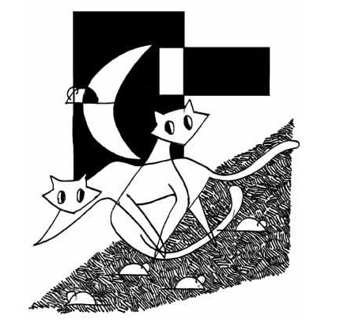

# ＜摇光＞“毛线”本质

**孔子在形容普通人的时候说：其未得之也，患得之；既得之，患失之。——在你得到一样东西之前，它的价值大小取决于你为了得到它付出了多少。你付出的越多，你就会越觉得它越有价值。就像一个男生追一个女生，在没有追到手的时候，他花的心思越多，他就会觉得自己越爱这个女生，哪怕是这个女生什么都没做。在你已经得到这样东西之后，它的价值大小取决于你对它的掌控能力。你越不容易掌控，你就会觉得它价值越大。**  

# “毛线”本质

## 文/王路（中山大学）

叔本华说：一个人坐在那闲着没事的时候，如果他不是拿起手头上任何一个物件——手杖、小刀、餐叉之类——有节奏地敲击起来，那么，这个人就有可能获得我的尊敬，因为这个人起码有可能在思考事情。

叔本华是对的。当我在等地铁的时候，我观察周围的人，假如一个人没有在盯着手机看小说刷微博，又没有盯旁边的美女帅哥的话，他一定会左右踱来踱去，或者把两手在抱胸、叉腰、插兜之间不停地来回切换。总之，他不可以让自己安静下来，哪怕只是片刻。当他同一个姿势保持了一分钟之后，如果再不切换，他就要陷入极大的无聊和空虚之中。所以，他要做一些事情，以便唤醒自己的存在感，哪怕只是敲敲手指或者抖抖腿。甚至可以武断地下一个结论：那些一旦坐下来就不自觉地抖腿或者转笔的人，一定是很难安静下来观照自己内心、具备内省功夫的人。

一只猫，可以追着自己的尾巴玩得乐此不疲。如果你拿起一根绳子凑到它面前，它的注意力立刻就会被吸引过来，伸出小爪来捉绳子。但如果你把绳子扔给它让它自己玩，它马上就会失去兴趣，因为它会觉得一下就能捉住的东西太没有难度了。

人和猫也相去不了多少。孔子在形容普通人的时候说：其未得之也，患得之；既得之，患失之。——在你得到一样东西之前，它的价值大小取决于你为了得到它付出了多少。你付出的越多，你就会越觉得它越有价值。就像一个男生追一个女生，在没有追到手的时候，他花的心思越多，他就会觉得自己越爱这个女生，哪怕是这个女生什么都没做。在你已经得到这样东西之后，它的价值大小取决于你对它的掌控能力。你越不容易掌控，你就会觉得它价值越大。比如，恋爱中的两方，越是受到家长的阻挠，反而越容易促进两个人的感情。假如一方完全可以掌控局面，他就会像猫面对丢给它的绳子一样，觉得索然寡味。所以两个人一定要势均力敌才能达到平衡。

普通人之所以会如此，是因为他们必须通过“掌控”来感受自己的存在。他们惧怕失去“掌控”的能力。他们掌控不了自己的内心，只好企图掌控外物。当他闲坐无事的时候，敲击桌子发出有节奏的声音让他感到很开心：看，这声音是我发出的。即便旁边没有其他人，这声音也能提示他自己“我在这里”。

猫喜欢玩毛线团——这玩意儿比绳子有意思多了：她要很小心翼翼地才能站到它上面，轻轻一触碰它就会跑掉，但她又可以及时把它追回来。喵星人可以独自玩毛线团玩得不亦乐乎，正是因为她对它的掌控在若即若离之间，这样，才能最大限度地激发她的存在感。如果人类想拿iPad换走喵星人的毛线团，她一定会不屑地拒绝：姐才不稀罕这块冰屁股的硬床板，想拿这破玩意儿换走姐的豪华座驾？太侮辱姐的智商了吧！如果你试图告诉她：亲，你知不知道你玩的其实只是一坨毛线啊！她一定认为你是个脑残。

庄子讲过两个故事。尧想把天下让给许由，许由不受，对尧说：你喜欢的玩意儿，在哥眼里只是一坨毛线啊。惠子害怕庄子抢他的相位，庄子对惠子说：你喜欢的玩意儿，在哥眼里只是一坨毛线啊。庄子说“至人无己，神人无功，圣人无名”。他们的高明之处在于可以不通过掌控外物就能感受到自己的存在，从而可以突破世俗追求的藩篱，从而追求内心层面的东西。

《周易·遁卦》说：君子以独立不惧，遁世无闷。独立不惧，就是可以在和周围所有人都不同的时候也不会感到惶恐。遁世无闷，就是可以在周围没有任何人的时候也不会感到无聊。到了这个境界，基本上可以摆脱对外界的依赖，从而安静下来与自己的内心交流。

一个人突破自我、境界提升的过程，就是不断地看清万事万物的“毛线”本质的过程。小时候我在乡下捡到过一本抗战小说，那本小说的结尾几十页被人撕掉擦屁股了。我看前面的部分看得十分兴奋彻夜难眠，认为那几乎是世界上最好看的小说，一直为看不到它的结尾深感遗憾。大学之后，在学校图书馆找到了那本书，看了结尾，我的感觉只能用三个字来形容：毛线啊。

最近流行一句话叫“不明觉厉”，意思是“不明白但是觉得很厉害”。这句话简直太有道理了，因为它是同义重复。——凡是你觉得厉害的东西，皆因为你没有看清楚它的“毛线”本质。如果你明白它是怎么回事，你就一点不会觉得它厉害。

对一个人最强有力的侮辱是，在他激情澎湃滔滔不绝地向你讲述他的各项辉煌成就之后，你淡淡地回应他三个字：毛线啊。这时候，他会怀疑他一切自大的基础只是喵星人式的自大，是建立在纯粹的自我意识之上的，他感觉到自己的三观基础因为你的三个字而有了崩坏的危险，以至于惴惴不安恼羞成怒。

而一个人内心最强大的体现就是，在得到所有人“毛线啊”的评价时丝毫不觉得侮辱和不安，那是因为他确信自己树立三观的土壤不会因为旁人的质疑而崩坏。这就是庄子评价宋荣子时所说的——举世誉之而不加劝，举世非之而不加沮。

 

（采编：何凌昊；责编：何凌昊）

 
