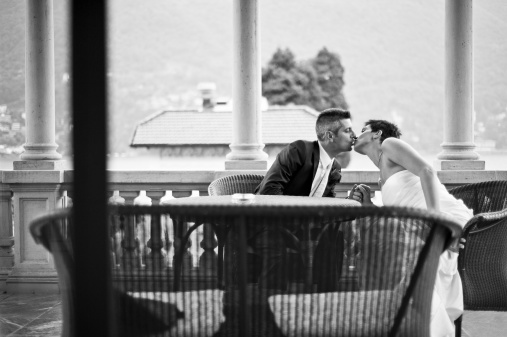

# ＜摇光＞“老子明天要起义，今晚怎么说？”

**我愿意看到一个懦弱的人，面对生死抉择，念及家中妻儿老小，满腔的血气化作一个惭愧的低头，纵然这个世界目之为懦夫，回到家中依然是个未曾亏欠家人的汉子；或是一个热血的人，在赴死的前夜，忍着泪水给自己的妻子写下诀别的方巾，之后走出书斋，坦然面对风雨雷霆。这两种人，或勇或怯，好歹活得干净。**  

# “老子明天要起义，今晚怎么说？”

## 文/申毅（南开大学）

 

事先声明，本文题目是引用别人的话，这篇文章是吐槽，非政治，你你你你可以不要紧张了。

汪精卫和陈璧君的故事应该很多人都知道了，在汪精卫刺杀摄政王前夜，陈璧君鼓励汪说：“你去干吧，你明天就要去死，我没有旁的送给你。”于是，她和汪精卫睡了一晚。

我估计这是人人网政治圈男青年心中最美好的励志故事了。

最近，似乎，有人，搞了一个人人网政治圈女性打分帖。看起来是一场“屌丝的逆袭”，政治圈里面女生毕竟少，物以稀为贵，更何况是大活人。确实有的女生往自己脸上贴金，打分帖一出，不要说贴金了，连脸皮也要带着金箔一起撕下来。

我对这里面的纠葛不感兴趣，不过我很好奇，对于从网“政治圈”的男青年，尤其是自称“屌丝”的这些人，“圈内”的女生，到底是什么？

**女生是什么？**

草圈里面男欢女爱早不是一件新鲜事，打分帖一出，无非是更红果果一点，按图索骥，也免了很多人的麻烦。按说有汪精卫的故事珠玉在前，草圈内的情爱纠葛仿佛也有了一层理想主义的面纱，似乎因为有着共同的理想，这其中一切的不体面都被洗刷干净了，在这个圈子里面，男女之间，因有理想，才有交流，因有交流而日久生情，之后才水到渠成。然而我们知道，对于一些人，性爱不是交流的衍生品，性爱是交流的目的。

公然拿女生的相貌来打分，我想这很难说是一种玩笑，当然始作俑者可能也未必觉得这个事情有多好玩。有人说，媒体上，女人经常给男子的相貌打分，但是我觉得，媒体上将男子的相貌打分，本身就隐含着一个前提：这是一个男色时代，观众们需要的也只是这些男演员们的相貌和身材。而将在这个圈内曾经一起交流过，甚至共事过的女生，用相貌来分出一三五七九，同样隐含了一个前提：这个圈子需要这些女生的，也仅仅是她们的相貌和身材。

这个圈子里的女生往往会有一种错误的认识，认为和这些网友首先是志同道合的朋友，其次才是别的什么奇妙的关系，然而，我们可以看到，在很多人眼中，这个圈子里的女生是让这个圈子不至于过于单调无聊的调剂品，是红袖夜添香的梦幻。

人人网政治圈的某些男青年眼中的圈内女生到底是什么？说白了，他们对圈内女生的态度，完全是受荷尔蒙支配的，与理想无关（如果他们有的话），与道德无关（如果他们有的话），只与生殖器有关（如果他们有的话）。他们第一眼看到某个圈内女生，一定是先要上三路下三路打量一番，思想深度来不及探索，先要琢磨一番女生的情感和生理状况：有男友否？是女同否？作风大胆否？思想开放否？方便开房否？开房要钱否？

他们视圈内女生为何？在他们眼中，圈内女生绝不是志同道合的朋友或是同志，说一句诛心的话，在他们眼中，连妓女都不如，妓女尚且要收钱，你跟她扯民主自由来砍价只会当成神经病扔出去。而在这帮政治青年眼中，圈内女生既然“同属一圈”，则完全可以“以理服人”，“用那渊博的知识来得到美女的垂青”，仿佛既然志同道合，那么勾搭就不是勾搭了，约炮就不是约炮了，这些女生也应当为共同的目标而“献身”，否则要你们干什么？政治可是男人的事情。这不禁令人想起一个熟悉的词：“慰安妇”。

出去嫖还要掏钱呢，靠着张口闭口普世价值，就想勾搭女孩子，裤子都脱了还想拽几句哈耶克，连开房都要人家掏钱，真可谓是空手拿鱼平地抠饼，意领们打得好算盘，真是领教了。

**梦中情人**

其实，这帮（他们自称屌丝）玩意儿吧，他们对女生其实是有期待的，有趣的是，这种期待还往往是变化的，有的时候，他们觉得自己还是很有才的，这个时候他们就希望女生们个个都是柳如是，李香君，屌丝们吟几句酸诗，女生就眼冒金星，星眸含泪，立时以身相许；还有的时候，他们觉得自己作为一个草，是很正义的，这时候他们就希望女生都是陈璧君，小凤仙，自己慷慨激昂一番，女生就会说“你明天就要去死，我没有旁的送给你。”又要以身相许；当他们觉得自己实在狗屁不是的时候（当然他们这么清醒还是很值得鼓励的），他们就希望女生都如他般全年无间断发情，于是便大跳精神脱衣舞，运指如飞猛敲键盘，两眼紧盯屏幕恨不得通过网络发射生物脉冲。他们有时会说：“其实我们都是一样的”，要么就是：“这个很正常嘛，都是成年人。”

这些人有时希望女生都是才貌双全守身如玉偏偏独具瞎眼对自己情有独钟的女神，有时希望女生都是作风大胆思想开放视开房如吃饭视贞操如粪土的小太妹。他们的行为举止就在这两种希望之下来回地转换，直到有一天发现自己除了做鸭也就只能和五姑娘过一辈子了，这才世界崩塌，理想幻灭。设身处地地想一想，混到这个份上的男生，不仇恨女生似乎真的很难哟。

**伪君子和真小人**

当然咯，有的人总是喜欢说 “宁做真小人，不做伪君子”。这样的话听起来很爷们。不过我一直很好奇，究竟什么样的人，会觉得这世上除了伪君子，就都是真小人呢？虽然我本人不算啥好人，但是我知道这世上有真君子，在我生命中的每个时候，都有这样的人用他们清澈的眼神照亮我内心的猥琐。我想，确信这世上只有伪君子和真小人的，首先，他们一定确信自己就是塞到炼丹炉里也还是一块废物，君子的梦不敢做，只好做小人了。其次，他们的生活环境恐怕也没有向他们展示君子这种人的存在，他们的家人、朋友、同事，怕都是一般货色，否则，怎么会如此确信世间并无真君子，况且正是因为从来没见过，所以连装都装不来吧。

其次，这些人最有趣的是，他们的逻辑里包含这样一个前提，自己是能做伪君子的，但是自己一生放荡不羁爱自由，洪湖水浪打浪，王八蛋坦荡荡，所以不愿意去装成伪君子。呵呵，就你们肚里那点货色，不当真小人，难道还有哪个白痴把你们当君子了？拉倒吧，你们那个德行，活得老实一点，别人也就是拿你们当窝囊废，谁会发梦拿你们当君子啊，开玩笑么？你们家日历就一个四月一号天天放假么？

不过话说回来，按你们这个水平，要么是窝囊废，要么是真小人，倒确实是做真小人爽利些。

人人网“政治圈”的风气已经越来越迷乱了，或许因为成员鱼龙混杂，加入的门槛过低，这个圈子的风气一直都是如此。然而我依旧不觉得这是什么好的或是合理的事情。拿理想来玩弄姑娘，用学识来骗肉体本来就是一件下作的事情，最近的这些事情不过是将所有人都心照不宣且隐隐期待的事情放到了台面上。文人无行，这句话流传了好多年，放到现在依然一针见血。不愿思考任何严肃的事情，不愿磨砺自己的品性，不愿约束自己的行为，在空乏迷乱的争论中获得廉价的得意，任何一个还没有完全堕落的人恐怕都不愿意与这些人为伍，更遑论已然凤毛麟角的最后的精神贵族。

林觉民的《与妻书》，满篇笔墨和着血泪，于今日读来依旧令人默然。我愿意看到一个懦弱的人，面对生死抉择，念及家中妻儿老小，满腔的血气化作一个惭愧的低头，纵然这个世界目之为懦夫，回到家中依然是个未曾亏欠家人的汉子；或是一个热血的人，在赴死的前夜，忍着泪水给自己的妻子写下诀别的方巾，之后走出书斋，坦然面对风雨雷霆。这两种人，或勇或怯，好歹活得干净。我宁愿接受他们在命运的夹缝中死命挣扎，坚强的意志与命运金石相击火花迸溅，也不愿看到一群从人格到品行都猥琐到了极限的杂碎，眼神浑浊而散乱，面容苍白且松弛，对着无辜的女子淫笑着“老子明天要起义，今晚怎么说”，却用最下流的行为，去玷污那些高贵的句子，和名字。

注：本文在采编时对原文进行了修改，得到作者同意。

附原文链接：[http://blog.renren.com/blog/248818614/802462462](http://blog.renren.com/blog/248818614/802462462)

 

(采编：马特； 责编：麦静)

 
