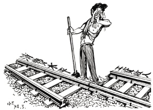

# ＜摇光＞《大时代下的小人物》

**人这一生是如此短暂，终有一天我们将安眠于黄土之下，却依旧如来时一样无知，不知自己从何而来将往何去。世界美丽也罢，荒芜欲罢，我们再也无能为力。我们曾经存在的意义是什么？那种念及身后之事的悲凉，时时流过骨髓袭向内心。有人问我你想要什么？我说，我想要一种存在感，想赋予生以意义。我想给这个世界留下些什么，让它知道，曾经有个这样的人，他在这里出生、在这里成长、在这里老去、在这里离开。****** **而这样的问题，经济虽然贵为当世显学，却无法加以回答。**

# **大时代下的小人物**

## 文/金荣贵（中国人民大学）

 

**（一）**

读科伦•麦凯恩的《转吧，这伟大的世界》，是需要一点耐心和勇气的，“一部颇有野心、内容庞杂的‘交响乐’式作品”，有人这样评价。借用菲利普•珀蒂在世贸双塔间走钢丝这一事件，作者将视角从双塔之上的白云高空转到地面仰视的人群，用细腻抒情的笔触串起十位社会底层普通百姓的生活，他们中有修士、法官、妓女、护士、青年画家、酒吧侍者、早期黑客、阵亡士兵的母亲等。都市繁忙熙熙攘攘，人们却如一个个孤岛，小心翼翼地经营各自的生活。“……每个人都守着自己的小小世界，心中都有着与人交流的深层愿望，人人都有自己的故事，每个故事都从奇怪的中间部分开始”。

心灵孤独、向往交流、寻求救赎，二十世纪七十年代在美国，那是一个多事的时代：互联网的发明、越战、尼克松下台、涂鸦艺术的兴起、解放神学的兴盛……孤独的存在和对交流的向往，是书里的重要主题。然而我在这里所欣赏的，不是作者手法如何高超，如何把握这一切，展开一个我们通常所谓的“宏大叙事”，而是钦佩他作为时代讲述者，努力将其所处时代表达出来，“让其一下子充满意义、充满逻辑、充满终极感”的勇气。

人这一生是如此短暂，终有一天我们将安眠于黄土之下，却依旧如来时一样无知，不知自己从何而来将往何去。世界美丽也罢，荒芜欲罢，我们再也无能为力。我们曾经存在的意义是什么？那种念及身后之事的悲凉，时时流过骨髓袭向内心。有人问我你想要什么？我说，我想要一种存在感，想赋予生以意义。我想给这个世界留下些什么，让它知道，曾经有个这样的人，他在这里出生、在这里成长、在这里老去、在这里离开。

而这样的问题，经济虽然贵为当世显学，却无法加以回答。

“我想为社会历史剧变中的个体做出解释，为他们留下曾经存在过的证明，给那些没有放弃梦想的人们一个合理的依据。否则，谁又能证明他们曾经来过这个世界？”格非在作品创作中，致力于为来过这个世界的个体留下存在的印记，证明他们短暂的存在有丰富的意义，即使这些人不曾被社会和时代所关注、所接纳为被遗忘的人群。这样的诉求，同样见诸于19世纪俄罗斯的“多余人”文学。从普希金笔下苦闷、彷徨、探索而又找不到出路的奥涅金，到莱蒙托夫笔下的毕巧林，再到屠格涅夫笔下在思想上觉醒过来并找寻着社会改革之路的罗亭，终于冈察洛夫笔下缺乏生活热情、退出旁观生活的奥勃洛莫夫，切实把握住了俄国农奴制时代衰亡的历史脉搏。

相似地，科伦·麦凯恩在《转吧，这伟大的世界》里，尝试给生命意义问题以解答。“文学提醒我们，不是所有的生命都已记载：人类还有很多的故事有待去讲”，他笔下的人物中，科里根，就像漫漫长夜里的不灭烛火。王尔德曾经说过：“我们全部都躺在阴沟里，但是我们中的有些人在仰望星空”，而科里根，正是守望星空的一个。

**（二）**

“我在想，过上平常的生活，需要多少勇气呢？”科里根也曾这样问过自己，答案终归是不能。

在飞速旋转的失控汽车里，在生命的最后分秒里——那一刻，艾德丽塔，他看着她，那眼神让人感觉如在诀别，不知他有没有想起那些过于奢侈的温暖瞬间。

人死的一瞬间，是不是就是这样呢？世界在喧嚣，人安静地离开这喧嚣。

“不是我不想上天堂，我喜欢这里”，他说。

唯一值得悲伤的是，生命中实在有太多美丽，多到让这个世界不堪承载。

科里根跟哥哥这样说，基督其实很容易理解的，该去哪里他就去哪里，哪里需要他就呆在哪里。他从不拒绝世界，如果他拒绝世界，他也就是在拒绝神秘，如果他拒绝了神秘，他就是在拒绝信心。科里根需要的是一个完全可信的上帝，一个能从日常生活中看到的上帝。从肮脏、战争、贫困这些艰难而冷酷的真理里，他得到的安慰是，他能看到生活中小小的美丽。他对来世的荣华和天国的甜蜜都没有什么兴趣，在他看来，这只不过是地狱的更衣室；相反，让他感到安慰的是，在现实世界如果定神去看，他能在黑暗里看到光亮，这光亮或许残缺不全，但终归还是小小的光亮。他只是想让这世界变得更好，他也始终不渝地怀着这样的希望。

他所关注的生活主题都是快乐：快乐是什么，怎样会不快乐，在哪里能找到快乐，在哪里快乐会消失。 他不知道他的出现让人满足，让人快乐，让人心生莫名的渴望，他对这一切视而不见，只是埋头向前。大家只觉得他来自另一个时代，一个时光缓慢的时代，一个不那么复杂的时代。人类彼此之间尽管有丧尽天良的恶行，也不会挫败科里根的信仰，或许他很天真，但他也无所谓。他说，他宁可不长心眼地死掉，也不愿让这世上再多一个犬儒出来。

一个疯狂而荒谬的天使，他背负着不堪忍受的复杂。

他是那种听不到自己步声都不相信自己在走路的人。现实如悬崖，他站在窄窄的崖边。他和痛苦有种默契，如果他不能治愈这痛苦，他就染上这痛苦。

他是门下的一道光，可是这门却对他关闭着；他只能散发零零碎碎的自我，最终会被它所穿越的东西阻挡。

这里是世界的边缘，

而他总是只身一人。

许多年前，他一个人在那里举办守夜纪念，没有照片，没有记者，只有他和铺在他地上的纸盒子。

许多年后，他还是只有自己。

“我不知道这些是什么人”，同是修士的同行哭诉，他是个老好人。“他们是我的兄弟，但我真的不知道他们是谁，我让他们失望了。”

这里糟透了，就像哥哥对他的怒吼：人的希望，不过是双眼看到的这些。你不管有多少同情，他们这些本性也是改不了的。

“醒醒吧，找个把你当回事的地方。”

“你要找到自己心中的穷人是不是？那干嘛不在富人脚前谦卑一回呢？难道你的上帝就专门喜欢这些人渣？你为什么不拿出你的慈善来，让富人难堪一下呢？去坐在一个阔太太的台阶上，也把她带到上帝面前？告诉我，如果穷人身上真有耶稣的形象，为什么这些人个个都这么惨不忍睹呢？”

形形色色的无聊搪塞，填补着四周的沉默，种种谎言在空中飘扬着，来回穿梭。

可是，终有什么是不一样了。

这般的荒凉里，还有没有什么希望，给我带来安慰？

有的，科里根用他的背影告诉这个世界，告诉心中那个上帝。

就连他的哥哥也不得不承认：那一瞬间，科里根似乎是对的，这里有需要去认可、需要去拯救的东西，这里也有一些快乐。

没有什么信仰强过受伤的信仰！

茶杯落地时，情书来了；最后的一声呼吸中，吉他激昂地响起。

潮来，潮往，余下的，只有一些渣子。

当初推着钢琴走过沙滩的少年，如今骨灰早已散在都柏林湾的海水里。

“我再次回想起，多年前，我们一起去散步，他一个人走开被海潮包围那情景——科里根孤零零的，站在一片沙洲上，纷乱的电筒光从四周照向 他，海滨的声音向他飘过来，叫着他的名字。他抬起头挥挥手，从齐腰深的水里蹚回来”，这样的回忆在哥哥的脑海里挥之不去。

然而总是有人记得他的。

“他身上有种忠诚”

“这个科里，他活在自己的世界里呢。”

蒂莉说：“他说，他似乎在和上帝开展一场拳击比赛。”

**（三）**

作者刻画的人物群像里，所罗门·索德伯格，在世人眼中，似乎就是命运的另一极端，与科里根有着霄壤之别。名牌大学毕业、财富基础雄厚、身任纽约法官，大多数人认为他住在红木建成的天堂里，做的是体面光彩的工作，他的职业有权有势。

其实说到底，大部分工作是单调平凡的。事实上，他是体制的一部分——一个齿轮之齿，带着一系列轮子在转。

上大学的时候，他还年轻气盛，总觉得有朝一日他会成为世界的轴心，他的一生会给社会带来深远影响。不过，世上哪一个男人年轻的时候不这样想的呢？可是，人迟早会开悟。你会找到一个小小的地盘，将其据为己有，你尽力而为地过日子。

“当整个城市都要烧成灰烬，就要预备自己的骨灰葬礼的时候，市长怎么会还在支支吾吾、公然说谎？”这样的愤怒来自天生的正义感，打击犯罪捍卫正义，这是每个法官信誓旦旦的承诺。然而现实的情况是，律师出马劝解，罪犯承认有罪，以此换取减刑的优遇；如果你要较真，罪犯就会抗诉，案件就会积压，上司就会难堪。这个体制中的英雄，是在最短时间内完成最多审案任务的法官。于是罪犯坦诚有罪、法官默契轻判、罪犯减刑出狱、犯罪继续坦诚的罪恶循环一直持续下去；这样的结果，对于社会自然不妙，但是对于法官、对于律师而言，却是自己的声誉之钥和敛财之道。

其他法官说他最终会习惯的，说他会看到光，不过人总还是在隧道里。法律最主要的是宽容的智慧，得去接受那些傻瓜们。他得学会输，这是成功的代价；他的工作就是在最中间，派发正义，在正确与错误之间做出平衡。

正与误、左与右、上与下，索德伯格觉得自己高高地站在悬崖边，头晕眼花不明就里地举目向上。正如面对游行示威的反战人群，为国家进行越战的合理性进行辩护一样，当事后得知儿子战死消息时，他真的不知道自己做的选择究竟是对是错。

曾经的他，如同科里根一样，然而心有羁绊的他，终没有科里根的勇气和决绝。时光流水的打磨，世上多的一颗鹅卵石；当初的理想主义情怀，已经塞进廉价的黑袍子里；而现在，这理想主义，连在他袍子最黑暗的缝隙里都找不到了。现在偶尔提及理想，或许还有莫名的失落感，然而垂垂老矣的年纪、尊崇有加的生活，皆是羁绊他的巨大枷锁。

索德伯格不是个坏人。也许他只是被人当成了司法的炮灰，只不过政治平衡游戏的一颗棋子，不过他也不是太在乎，善总是要战胜恶的。

这样的自我安慰煲以时间之水，总是一副热气腾腾的良药。

**（四）**

致力救赎的神父、甚感空虚的法官、寻求安慰的母亲、在地下铁里恣意涂鸦的青年、猜测电话那端模样的黑客、郁郁不得志的先锋画家……科伦•麦凯恩，时代的叙事者，敏锐地抓住都市居客心理孤独寻求交流的心理，谱就这曲宏大的时代交响乐——《转吧，这伟大的世界》。

那么我们呢？当我们向孩子叙述我们的时代，或者当后人讲起我们的时代，又该是怎样一番模样？

这是最好的时代？这是最坏的时代？

年前狄更斯在《双城记》开头这样写到：人们面前有着各样事物，人们面前一无所有；人们正在勇登天堂；人们正在直下地狱。

国家经济高速度、企业发展高速度、职场工作高速度、生活节奏高速度，在这个“时间就是金钱”的时代 ，追求物质文明加速度演化的今天，“我们谋杀了时间，这也是我们变得悲惨的原因之一”。动车追尾、大桥坍塌、医患势若水火、人们易粪相食，国人在食品丑闻中完成化学扫盲，从垮塌事故中学习建筑知识……职业道德底线沦陷、价值判断体系崩塌，没有任何信仰、无所顾忌无所敬畏，恶者不觉其恶，丑者不以为丑：这些不是我们看到的全部，却足以刺痛每个人的心。社会结构产生难以愈合的裂痕，贫富差距的不断加大加剧浮躁情绪的蔓延。到处都是些聒噪的声音，人们仿佛都丧失了思考的能力。

有人高呼，谁能给我们的时代一根缰绳？

“慢一点，等等那些几乎要被时代轧死的弱者；慢一点，等等那些还知道去思考些问题的智者；慢一点，等等那些还想在生命的空隙去享受生活的平凡者。慢一点，那些该拥有的还会拥有，但如果走的太快，那些已经拥有的也会失去。谁能给时代一根缰绳，缓一缓我们过于匆忙的步伐？”

是时候需要扪心自问，我们究竟需要为这样的时代付出多少成本和代价？

安静的校园、天真的孩子、守信的商人、廉洁的官员……这样的美好，究竟是失落在了哪里？

抬头寻找天空的翅膀/候鸟出现它的影迹/带来远处的饥荒无情的战火/依然存在的消息

**（五）**

无可否认，人年轻的时候都会如索德伯格那般幻想有朝一日成为世界的轴心，一生会给社会带来深远影响。不过，最现实的结果是，我们中的多数人，最后都不过是这时代下的小人物。

面对这样带着被诅咒的魔鞋般高速旋转的时代，大时代下的小人物面临的可不是简单的该向左走还是向右走的问题。

娱乐主义盛行、消费主义当道，金钱在世界舞台的中心制造出一出出光怪陆离的肥皂剧。成功被异化为存折、房子、车子，良好的声誉、和谐的家庭、交心的友情变得无足轻重。各种“门”被制造、被围观、被遗忘，形形色色的诱惑下人迫不及待戴上枷锁，消费着、享受着，却又焦虑着、失落着，“成功焦虑症”成为折磨众人身心的时代病症。人文课程教授的那些个人应该追求的、为民族文化所欣赏的品质，却在现实经济世界中处处碰壁，陶渊明不会是个好官员，子贡称不上是好商人，这正是现行教育的吊诡。

究竟是哪里不对？时代洪流下的小人物该何去何从？

有的人坚守，有的人迷失，有的人愤怒，有的人淡漠。

最不愿看到的是，一个人从满腔理想到写满忧伤再到麻木心死，无所谓的态度是最致命的。在中国美术馆看到刘国辉的时代青年群像展览之时，这种感觉更为浓烈。画中青年眼中多的是迷惘愁怨，少的是澄澈昂扬。科里根相信信仰，索德伯格相信生活，我们相信什么？

一种无能为力的渺小感曾经长久地困惑着我，这样的感觉也曾困惑整个人类。文艺复兴时期，个体的觉醒促进了“人的发现和世界的发现”，随着科技探索的进展，人们失望地发现原来地球并不是宇宙的中心（自己也就不是宇宙的中心），人原来是由猿猴进化而来。这样的结果，带来的震撼是巨大的，以往那种我是中心高高在上的优越感跌落一地。地球已经存在亿万年，而且还会存在亿万年；我们也不是这个星球的唯一主人，恐龙曾经盛极一时，如今只是站在博物馆里的化石；地球也不是永远的存在，终有一天，地球也会消亡：人类的存在真真切切的是“寄蜉蝣于天地，渺沧海之一粟”。如此说来“蜗角虚名、蝇头微利”也不尽是哲学家们的清谈高唱，某种程度上来说，这是事实。

上帝遭到质疑、名利皆是虚妄、存在如此偶然，以往所相信的如今都是摇摇欲坠的神像，危机之下人类又是怎样继续前进的步伐呢？

答案就在眼前，就在我们面对的这个世界，有史以来这个星球最为灿烂的文明，尽管现在的它走得有点偏离轨道。

高达SEED里，为了创造一个再也没有战争的世界，迪兰达尔议长选择相信命运。DESTINY计划旨在控制改造人类基因组，赋予每个人固定的职责使命，于是人们只会遵循整个人类系统的需要而起作用，战争也将不再发生。

和平是每个人所期望的，但是基拉他们没有选择支持议长。选择相信命运，就再也没有希望这样美好的东西，人类也便失去了未来。没有强大的内心，又该如何应对突如其来的灾难？眼前的世界，虽然还有种族差异、还有政治分歧、甚至还有战争隐患，但毕竟还有希望。因为还有希望，因为还能相信希望，明天才会可能更好。

2012未必是人类的末日，可有一天所有人丢了信任丢了希望，那可真的就是世界末日。

轻轻敲醒沉睡的心灵

慢慢张开你的眼睛

看看忙碌的世界

是否依然孤独地转个不停

 

（采编自投稿邮箱；责编：周拙恒）

 
