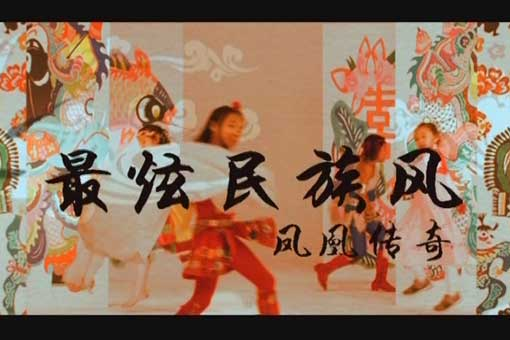

# ＜摇光＞《最炫民族风》到底是不是垃圾

**真心喜欢《最炫民族风》的人自然会消费，而不喜欢的人为什么也消费它呢？——他们消费这种歌曲时带有一种调侃和自嘲的味道，娱乐而已。他们之所以消费，不是喜欢它，而是喜欢消费它的时候带来的那种优越感——于是，越来越多的人被渐次裹挟进来，听凤凰传奇就成了浩浩荡荡的流行大潮。而这种产品本身确实也具备那种大众化的特质，就像瓶装康师傅绿茶，虽然跟上好的毛尖龙井没法比，但聊为解渴，又有何不可。**

# 《最炫民族风》到底是不是垃圾

## 文/王路（中山大学）

 

今天早上，看到一则新闻，高晓松说《最炫民族风》是垃圾。我发了一条状态，表示欣赏高晓松的态度。事实上，我一直很肯定凤凰传奇的歌。——你丫这不是骑墙派吗？——绝对不是。如果你往细处看、深处看，这会牵涉出一些很玄妙的问题。

我绝对不会说《最炫民族风》是垃圾。因为我没有太高的音乐素养。——如果我在一个领域没有足够的素养，我不会轻易发言。做出肯定或者否定的评价是最容易的事情，但是，你做出评判的理由是不是坚实，根基是不是“立在磐石上”，这点很重要。它说明了你是一个果断的人还是武断的人。从外在上看，果断和武断的表现形式毫无二致，但它们之间有根本的不同，就是你有没有内在的依据。有很多伪公知、伪意领，他们对什么事件都要置喙，无论对那个领域是不是熟悉，这样就把局面搅得一团浑水、乌七八糟。我是学经济专业的，硕士方向是宏观经济研究，但我深知自己经济学素养不够，写了那么多篇文章，迄今还没有一篇敢谈宏观经济问题，只敢谈一点古代文学方面的问题。所以，作为一个普通听众的时候，我绝对不会去否定《最炫民族风》。

不过，假如我是高晓松，我也很可能会骂《最炫民族风》是垃圾。即使不当众骂，我也会在和私交较好的朋友一起喝茶聊天时说出来。一个人既然身在这个领域，就一定要有自己的态度和取舍标准。没有自己的标准的话，你在这个领域待着丝毫没有意义，对此领域的发展进步绝无可能做出贡献。凯恩斯主义和货币主义骂了很多年，骂得很好，无论哪一派都值得尊敬（我本人站在货币主义的立场上），而骑墙派认为各有各的道理的那些人可以说都是滥竽充数混饭吃的南郭先生。

一个普通网友（对于某个领域没有特别素养和积累的人），可以喜欢不同的流派，可以看百花齐放。但一个有素养的专业人士，就应当看到和普通网友完全不同的世界。我不懂音乐，我拿懂的领域来举例子：当我在网上看到那种由各种流行歌词改成的“诗经体”，以及一些藏头诗、藏头作文之类的，我会一哂而过。我知道凡是流行的东西都有它流行的理由，但流行并不意味着就是好。我看到那些“诗经体”歌词通常不会表态，如果一应要表态，我只能说：一坨垃圾。就像你把玩过许多精致的紫砂壶之后，再碰到一个做工低劣的紫砂壶，你一定会觉得很讨厌。不过，在所有不懂紫砂壶的客人交口称赞一件低劣品很好的时候，你最明智的办法就是默不作声，笑着打打哈哈，说句呵呵。

因此，我说我欣赏高晓松，实在是由于他有勇气说出自己内心的真实感受，而不怕被众多的“普通网友”骂——我不喜欢就是不喜欢，不管他们有多么多的粉丝和拥趸。

尽管高晓松的内心感受和我的内心感受不一样（我真心没觉得《最炫民族风》太烂），但是，我能理解高晓松。这种理解不是简单地基于我对《最炫民族风》的态度，而是更深一层的原因。如果我觉得一个东西好，我就认为全天下都应当觉得它好的话，那我就太肤浅，太naïve了。当你觉得一个东西还不错的时候，你应当很清晰地知道，在很多人眼里它并没有那么好。这样，你才不至于太狭隘。

对凤凰传奇，我的内心是赞的。赞的原因并不是他们的歌唱得好，而是在他们的评价标准下，他们走得很成功，他们的身后甩下了一大批模仿者、印随者和竞争者。所以，不得不承认，他们在把握市场这一点上，实在是高。（当然，真正高的不仅是两位歌手，更是背后做歌曲的老板。他真的是有过人的市场嗅觉。）

凤凰传奇为什么流行，原因有两重。第一重原因是显而易见的，它很“贴近群众”，有乡土气息。它的营销走的是一场“农村包围城市”的路线，和当年的土红军一样。但是，为什么城市就被他们给包围拿下了呢？为什么很多本来品位不是那么“土”的人也加入凤凰传奇的听众大军了呢。“土”并不是贬义词，任何产品都有其特定的目标客户，对于媒体来说就是特定的受众群体，无论定位是“土里土气”、是“高端洋气”、还是“中端客气”。而凤凰传奇的牛逼之处就在于，他们做的产品突破了原先设定的目标客户群——本来是做低端市场的，结果不仅覆盖了中端，还打入了高端。这就是第二重原因所在。

第二重原因是什么，我且按下不表，先来讲个故事。古代打仗，按照小说话本中的描述，都是两军首领先对着干，为首的那个人，如果单挑赢了，仗就胜了。很多时候，两员勇将如猛虎下山蛟龙出海，大战了三百回合不分胜负，比如张飞和马超、黄忠和关羽。这个时候要决出胜负怎么办？三个字“拖刀计”，也叫“卖破绽”——百用百灵。如果两名猛将武艺相当，谁先卖破绽，只要对方一上当，他就赢了。

凤凰传奇的歌就是卖破绽的歌。——你以为杨魏玲花唱不出来更高雅的歌曲？就算把宋祖英、彭丽媛的歌拿出来，杨魏玲花照样能唱好。——嗓子才是王道啊。只要嗓子好，难道还走不了高端路线吗？杨魏玲花和杨臣刚不一样，她嗓音方面的天赋远比杨臣刚好，杨臣刚只能出一首《老鼠爱大米》，靠歌词方面剑走偏锋取胜，所以他做不出来第二首《幼鼠爱小米》。而杨魏玲花走红的歌不止一两首，所以说她要比杨臣刚厉害得多。真心喜欢《最炫民族风》的人自然会消费，而不喜欢的人为什么也消费它呢？——他们消费这种歌曲时带有一种调侃和自嘲的味道，娱乐而已。他们之所以消费，不是喜欢它，而是喜欢消费它的时候带来的那种优越感——于是，越来越多的人被渐次裹挟进来，听凤凰传奇就成了浩浩荡荡的流行大潮。而这种产品本身确实也具备那种大众化的特质，就像瓶装康师傅绿茶，虽然跟上好的毛尖龙井没法比，但聊为解渴，又有何不可。

所以，不要动不动就说别人低端，没准儿那是拖刀计。瞅着对手破绽的时候先别急着上前，不然，下一秒中刀落马的就是你。不过，中凤凰传奇的刀倒也无所谓啦，做人最重要的是开心嘛。

 

（采编：何凌昊；责编：何凌昊）

 
