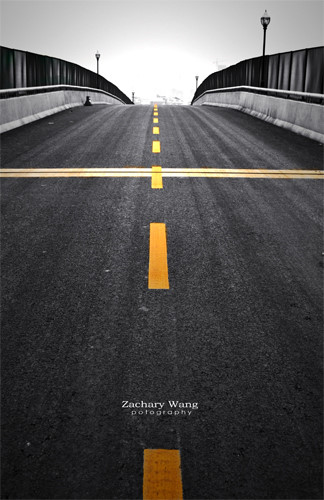
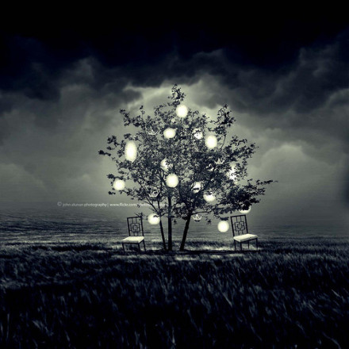

# ＜摇光＞一个人

**要我说，带着最原始的热情甚至癫狂去发疯去恋爱去写作去冒险去为了某个简单的梦想奋不顾身，去救赎去帮助去为了不公和黑暗义愤填膺去为了正义和光明奋力一搏，大不了就是跌倒了痛苦了最终胜利了或者认输了，大不了就做回失败者或者歌颂者。大不了让隔壁家的阿姨在教育小娃娃的时候说，你瞧那个姐姐年轻气盛结果失败的一塌糊涂。——我们至少是我们，而不是一个成功学的案例和一份光鲜的简历。** 

# 一个人

# 文/张一甲（北京大学）

 1 

2011年5月26日，一个平凡的礼拜四，没有什么不同，除了一场雨。

躲在图书馆看了一个下午李力老师的《众妙》，然后起身接了满满一壶热水，来到四楼窗前看雨。

看雨最美的角度就是房檐下。

屋檐将水珠下落的力度、节奏和声音都做了调整，而不是焦躁地直接撞向地面，为外面的郁郁葱葱做了最好的过度。这画面与初来燕园时看的宣传片《光影北大》里那场初雨一模一样。

回到桌前发现水在站着那会儿已经被我喝完了。想到刚才起身的初衷，忍俊不禁。只好再去接一壶。 2

《光影北大》是我对这儿的美丽最深刻的记忆。可能是因为它是一句旁白也没有的宣传片，但最可能的原因大概就是因为它出现在我初来乍到的日子里，所以独特。

从经济学的角度来讲，叫做边际效益递减，换做诗人们会告诉你，人生若只如初见。又或是《廊桥遗梦》中弗朗西斯卡说 “四天之内，他给了我一生，把我分散的部件合成了一个整体。”

无论你站在哪个角度解释，这都只是生命最朴实平凡的体验：我们不需要一个漫长持久的过程去领悟这一切，决定就在那第一眼，你所要的一切都在那里——让年轻成为年轻，让永恒得以永恒。

燕园如此，生命亦如此。 3

站在四楼的角度往下看，行人被雨伞遮挡着只露出下身走路的姿态。一个持伞男人匆匆的步履很像金和茶餐厅每个午夜不停给人们加柠檬水的服务生。

此时我不在雨中，却比雨中的行人更在意这场雨。——这种超度就在一瞬间，此时我是个看客，任凭雨水冲刷着被日常琐碎而蒙蔽的内心，对于原始生命力的崇拜让一切所谓“大是大非”和关于“要成为怎样的人”的念头都变得渺小。

这个时刻我在看着你，下个时刻我又将成为你的风景。这就是世界运行的法则，无所谓主角和观众，在面对这个庞大的世界和无穷的坐标系时生命的存在和渺小也是种馈赠。 4

一个男人对一个女人说：“今天上午不行，今天上午我要去办公室。”

这是个再为平常不过的对白。

但故事是：

男人对女人说：“今天上午不行，今天上午我要去世贸大厦。”女人静默并且一无所知接下来的事情。

——然而这天是美国的9月11日。

你拿什么和命运的未知抗衡？ 

5 

昨天和小远聊天时，说到面对这世间的冲突和丑陋，人们渐渐形成三种状态：

一种始终理想和乐观，坚信可以改变。

一种始终痛苦，始终挣扎，永远无法超脱。

一种是明白了无力和徒劳后选择了一种淡然和悲悯的情怀。

小远说我是第一种，他是第三种。我问:那不就没有行动力了吗? 他说是。

我俩达成的共识是：最伟大的应该是第二种。

这种选择让我不禁想到小崔，还有罗大佑。罗大佑说：小崔，别怕。不是我们病了，是时代病了。

——可不禁想问：这个时代是不是只有抑郁的人才是醒着的？ 6

不妨谈一谈选择。

老生常谈的是“男怕入错行，女怕嫁错郎”。

于是——在21世纪最蓬勃发展的此时此刻，在中华大地上，最为优秀的大学生们在精心地打点着自己的一切：

他们步履匆匆，在准备开会和pre；他们见到老外就想套磁，见到HR就想递简历，他们因为GPA排名的缘故偷偷放弃最初的专业方向；他们生怕遗漏了什么而不停地浏览各种网站猎取各类信息；他们熬夜刷红宝刷三千刷猴哥大不了每晚三点翻栏杆翻厕所——

那么我们是不是要接着教育下一代的人：女怕入错行，也怕嫁错郎，又怕不够靓，还怕没有房！

那么请你给我个答案：

我们出生、发育、求学、恋爱、工作、买房、结婚、养老、死亡，

一个人要多小心翼翼多八面玲珑才能 “体面” 地度过一生？

人要给自己背上多少枷锁才善罢甘休？

而这些铁链中哪一个是为了你的民族、你的信仰、你的国度、你的文化传承而后背负的？

就算你抛开这一切不谈，你是否在以本心为参考系做这些事情呢？

这就是所谓的理智吗？

如果不能回答我，那么统统去他的吧，别跟我谈什么理想，也不要再抱怨这个社会给予你太少。因为你从来没有想过要为这个社会做点什么。 7

1972年林怀民回到台湾，在大学里教新闻。“那个时代的年轻人，包括我，总是想象着自己有能力改变世界。结果，我一不小心碰到了一群跳舞的人和写音乐的人。”

可到了上世纪80年代晚期，当林怀民发现台北的许多咖啡厅统统变成叫做“金可乐”、“金池塘”、“金工业”时，那种弥漫在空气中的拜金主义让他感觉疲惫。在林怀民看来，“云门”与社会的对话已彻底消失了，

“没有对话的对象，你也不想和他们对话”。

虽然手头还有八国演出邀约，但决定“不玩了”的林怀民在1988年还是毅然停掉“云门”。

后来呢？

随后的几年是林怀民一生中最开心的时光，他到大陆看了驻在心中已久的云冈、龙门、敦煌，又游走到了印度。

“在印度，一切都归了零——一杯水就是一杯水，一切节奏都放缓，它逼着你放下很多东西。” 

8 

许巍的歌中有：

我只有两天，我从来没有把握/一天用来出生，一天用来死亡/我只有两天，我从来没有把握/一天用来路过，另一天还是路过……

谁不是个过客？

无论我们怎样精打细算，永恒不是你，也不是我。你和我本身都不应当成为信仰的坐标系。我们的坐标系是这个宇宙，是这个国度和时代的需要以及自然界最本真的法则。

翻开一本书，读一读文化和历史，或者仅仅是望一望天空，我们就应该知道拼命地给自己加保险是一件多么幼稚可笑的事情。自然已经给予我们最原始的审美和崇拜，文化和历史已将超出一个人生命的深度和广度无偿地给了你。你为什么还在斤斤计较一得一失而不情愿坦诚相见？

要我说，

带着最原始的热情甚至癫狂去发疯去恋爱去写作去冒险去为了某个简单的梦想奋不顾身，

去救赎去帮助去为了不公和黑暗义愤填膺去为了正义和光明奋力一搏，

大不了就是跌倒了痛苦了最终胜利了或者认输了，

大不了就做回失败者或者歌颂者。

大不了让隔壁家的阿姨在教育小娃娃的时候说，你瞧那个姐姐年轻气盛结果失败的一塌糊涂。

——我们至少是我们，而不是一个成功学的案例和一份光鲜的简历。 

若是换个时代，大概追逐自己的本心不会再如此艰难，我也不会迷茫这么久。但我们的时代正是这样的一个风起云涌波澜壮阔的时代，一个一不小心就头破血流的时代。

今天起大声宣布：

除了体体面面地做一个精明的人，我还有无穷多种可能

——从历史和国际的纵横坐标来看，这个阶段的中国大概是最令人振奋的冒险乐园。

一个人，一辈子设计着自己，永远是一个人。

一个人，忘了自己，鼓起勇气，他才是一个时代。

 

（采编：何凌昊；责编：尹桑）

 
