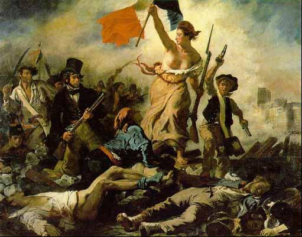

# ＜摇光＞一场关于乳房的独白剧

**当你游刃有余地踩着高跟鞋大步流星时，当你例行公事地对镜梳妆时，当你回到承载了自己青涩岁月的高中校园时，那些豆蔻年华的小姑娘们叽叽喳喳地和你擦肩而过。而你就是从这些匆匆而过中突然意识到，自己不知何时起，是个女人了。**  

# 一场关于乳房的独白剧

## 文/吴昕悦（Wellesley College）

  **独白：** 最初想到要写一部关于乳房的多幕剧是因为看了《阴道独白》。她说，她需要写一部关于阴道的剧是因为女人们从不曾有机会讨论自己的阴道。 而乳房，实际上，我们总是在讨论它们。 大的，小的，美的，丑的，丰满的，干瘪的，年轻的，衰老的。 是的，我们总是在讨论它们，而且不仅仅是女人们。 从波士顿到北京，从男人，到女人，到变性人，从老人到孩子，我用零碎的时间听你们讲了这些故事。 这一部剧献给你们。 

#### 第一幕 男人在说……？

 型号主义者──L先生：大的，当然是大的。 自然宣告人──Q先生：首先，得是真的…… 好好先生──K先生：这个也没有太多要求啦──B以上吧。太大了也不好，像奶牛。 Gay嫌疑人──O兄：我觉得小的更有魅力啊。 鉴赏大师──U大师：两个相切的半球刚好，形状很重要，乳头的位置还刚好，粉红色的浅褐色的……不能太大，最好不要下垂……我说的是能贴到肉的那种……对对。34C最好，并且……（我决定不全文摘录他的鉴赏宝典） 拒绝者──B老师：我们年轻的时候哪里有女孩子在大街上问这种问题！……不，我没注意过，我不想说这个。（在商场的扶梯边的广告上内衣模特的胸部嚣张嘹亮，他推推眼镜瞄了一眼，看到我没走，于是狠狠把头转过去） 鄙视怪阿姨的小朋友──小T：……大咂儿。 优质好老公──S兄：无所谓，喜欢的姑娘A也能摸成F。 坚定分子──R学长：不行，再怎么都不能太平吧，无论如何也得是个女人啊。 …… 他们永远也说不完。 他们宽容，他们挑剔，他们充满爱意，他们贪婪无比。 他们难以取悦。 再激进的女权主义者和父权主义者都会承认，自古以来男人──这些乳腺退化的人对于乳房的审美，格外重要。 

#### 第二幕 诈骗集团

 他们叫我诈骗集团。 我学会从恐龙变成正妹也不过是大学毕业之后。 不，不，最起初，我也只不过是想不再做没有男生理睬的壁花，只是这一切是一个你不能停止的过程──一个并非天生丽质的女生一旦穿上了玻璃鞋，就不会再想脱下。 最大半径的隐形眼镜，深深的双眼皮贴，在眼角延长的宽眼线，人工纤维的假睫毛。 噢，还有事业线。 你不相信？ 你以为上通告的女明星个个都是波霸？告诉你，变成波霸很简单： 有人用极厚的胸罩，那厚度简直可以和乳腺癌病人用的义乳一争高低，把胸衣放在地板上，水泥地都能变成波霸。 有人用硅胶垫，神不知鬼不觉在两侧各藏一个，狠狠把所有肉往中间挤，你所看到的丰满胸部，只有中间一条沟是真的，两边都是假的。 但是就算你再怎么挤，肉总是会滑脱你给它划下的界限的。且不说是人的肌体，就算是二斤猪肉，你也不能让它一直保持一个反重力的形状啊。 所以更多人用封箱胶带。 是的，就是那种卡其色，你搬家的时候用的宽胶带。黏在手上撕下来的时候嗤啦一声，牢固便利，防水防滑。通常情况下你不会希望它黏合在皮肤上。 除了绑票时被贴在人质嘴上，和巩固一个乱真的胸部。 ──从肋下开始，沿着胸衣和所有填充物的边缘，黏合在皮肤上，一层，再一层。一个高耸的胸部就被定型了，只是晚上揭下来的时候会很痛苦。 是的，绑匪用胶带消音，我们用它骗过男人的耳目。女人天生是犯罪分子。 但我本不想骗他的。 看见他的第一眼我就知道，他是我想要找的那种人。 他很高，眉目还算俊朗，表情温柔，情话和调侃恰到好处。 不，我不认为这是一见钟情……那不是年少人由荷尔蒙引发的冲动，而是一种安静的渴望：你会不自觉地想象自己和这个人在一起的情景，你们牵着手饭后散步或是下班了一起做饭。 一切发展得很快，我想他也是喜欢我的。 第四次约会，从三里屯回来，我们都有些醉。他带我去他的公寓，电梯里我靠在他的肩上，显示器红色的数字一格一格地变，我被酒精和不安托到了城市虚渺的高空。 玻璃鞋变成了红舞鞋。 靠在橡木门板上的接吻，玄关，他把我横抱进卧室，放在床上──新换的床单，他是有准备的。我的高跟鞋在跌进层层被褥的那一刻从脚尖滑落在地毯上。他看进我的眼睛說，你真美。 男人们总说喜欢女人真实的样子。 可我真实的样子，你甚至会愿意去看吗？ 脖颈的吻，越来越重的喘息，我把手插进他的头发里，他亲吻我的耳垂，手轻轻探进我的连衣裙，划过小腹，向上── 等等！ 我躲他的手，他的手向下滑，去解胸衣的扣子。 不可以！ 我大声说：可以把灯关上吗。我听见自己的声音异样的高了一个八度。 他愣了一下，笑笑：小丫头，不好意思麽。 我牵牵嘴角。想必不太甜美，但他急着去揿床头的灯，被子掀开露出了结实漂亮的后背。 房间黑下来的那一刻，我死死盯住他那黑暗中看不见的背影，抓住胶带，连带着所有的硅胶垫隐形胸衣，狠狠向下一扯。 撕心裂肺的疼痛。 我倒抽一口冷气，把它们一起扔到床下。沉甸甸的惯性从指尖飞去，不知道滑去了床底的哪个角落。 他来摸我的脸，势在必得地微笑着亲吻我。他的手向下移。我吻他，假装太过投入以至于过分慌乱，差点咬了他的耳朵。我在他耳边问你爱我吗，你爱我吗。他笑了，你这么漂亮这么性感，哪个男人不爱呢。 我本不想骗他的。 他的手摸索到我的胸前，有些吃惊地迟疑了一下，然后落了下去。 他并没有停下来，只是整场做爱之间，他没有再碰我的乳房。 第二天早晨，他开车送我，没有说昨晚的事，临别时在我的唇上吻了一下，还是他原先风度翩翩的样子，他说好好照顾自己，会再给我打电话。 已经三周了。 我还在等他的电话。 

#### 第三幕：夏娃的火山

 乳房。 你可以摸一摸我的乳房，我不介意。 不，我真的不介意。 相信我，我比任何一个基因上的女人都更了解乳房，也更热爱它。一对邻家女孩的美丽乳房能让伊丽莎白泰勒那枚年老力衰的卡拉普钻石黯然失色，它们值得用最精心的方式呵护：蜜霜，香薰，la perla的胸衣也不为过……那些年轻女孩子随随便便地从廉价市场上抓来几件内衣就卖弄风骚，她们根本不知道自己在挥霍些什么。 可偏偏，我生而是一个男人。那个高中年鉴上的阴郁男人，留了挡住半边脸的黑色中长发，人们叫他亚当。 很多人认为变性人都是思想开放的先驱者，但作为女人，我是个传统的保守女士──我喜欢织毛衣，我支持民主党，我讨厌现代艺术，我喜欢养猫，我想用尖细的声音咯咯笑而人们不会用厌恶的眼神看我，我將那些圆润的珍珠和红宝石戴在颈窝上，我想加入junior league（美国社区组织，成员多为中上层阶级女性），香奈儿的小黑裙，白色的捧花，christine louboutin的高跟鞋，这是女人的特权。 而女人拥有的最高特权，是乳房。 即便是住在我对面门房的那个丑陋的小丫头，生了一副暴牙，脸上的雀斑简直能让天文学家望而惊叹，她那该死的每一天都在圆润饱满起来的身体也都是一份无情的嘲笑：你不是一个女人。 乳房。 它是我缺失的那一部分身体，我是一座沉默的火山，这座火山里面是险峻黑仄的暗道，入口是一个瘦骨嶙峋的男人身体，我被困在其中。没有乳房就没有一个出口，一个抵达女人的出口。 而每当我贫瘠的胸部袒露出来时，我就从那火山的暗道上跌了下去，一直坠落，那深处的岩浆在翻滚：我是个女人啊……请不要被火山外冰冷坚硬的岩石层欺骗而从我身边走过。 我需要一个出口。 那个困在我身体里的女人，她很孤独，需要走出去。她想要有自己的姐妹和朋友，她想坠入爱河。 上帝，请你给她开一扇门吧。 但是万能的上帝从不改变他的意志，他让我生而为一个男人。既然如此，我背叛了上帝，我自己赋予了自己一对乳房。 当我把自己攒了三年的钱一次刷掉的时候，医生问我要不要看一看他们的效果图，有翘的圆的尖的高的……我说对于自己想要的胸部，我自己早已有主意了，它们的样子一直盘旋在我心里，它们本就是我身体的一部分，现在，请你把它们还给我。 手术很成功。 一年过去了，在地铁里，经常会有男人和女人看我的胸部。 我知道，他们在心里嘀咕我的乳房一定是假的。 因为它们太美了。 **独白：** 我本是以半是蒙骗的方式约出来夏娃采访的，我上了她的网站，自称是个男人，在见面时，我向她道歉，说我只是想听你作为一个女人聊一聊你的乳房。就像我预想的，她没有拒绝。但是超过我预想的是她竟然说了很多，她说起话来有些害羞和结巴，但描述乳房的语言优美如诗。 和夏娃的采访之后，她跟我开玩笑說会不会觉得很怪。 我说，你的乳房很美。 夏娃愣了一会說，你是第一个夸奖我的女人。 不，我说，是姐妹。 然后她抱着我哭了，抱得很紧，每天服用的雌性激素尚未改变她粗壮的男人臂膀，但她硕大的乳房贴在我胸前，随着她的抽泣一起一伏。 这是一个异常柔软的拥抱。 

#### 第四幕：革命鉴赏

 我们每一个人都是经过严格训练的女性美鉴赏家。 在很大程度上，男性是被忽略的。 承认吧。相比之下，对于男性美的鉴赏标准简直少得可怜，阴茎更多时候只是作为生殖力的象征而鲜有人用美去衡量它。 而对于女人，从文学，绘画，电视，广告，新闻，我们对于女人的美有千百种诠释。丰满或是瘦削，高挑或是娇小，从头发的气息，皮肤的触感到乳房的翘起角度和衔接腰肢和胯部的弧线。 你误会了，我说的并不是现在媒体上恨不得将自己的乳房拿出来挤出来公诸于众的女明星。我不喜欢那样的乳房，它们像被福尔马林浸泡过的尸体那样，已经死去了，只留了头颅挂在墙壁上展示。 我爱我的乳房，它们并不大，但我坚信，它们从不仅仅是男人的玩物或是观赏的物品，它们是哺育生命的，也因这种奇迹般的生命力而性感。 一切美都蕴含着革命的力量。 革命也往往被染上了浪漫主义的色彩──无论后世如何评论，被卷挟在革命中的年轻生命让革命看起来性感迷人……哪怕它也是血腥的，残酷的。 乳房也一样，如果让我去形容最美的乳房，它们一定是充满生命并且赋予生命的。 就像是在《自由女神引导法兰西人民》当中那样，胜利的女神袒露着上身，战士们追随着她，她美丽的乳房象征着最蓬勃的生命力和希望，在画家赋予的神秘耀眼光芒中，死者將安息，而战场上未亡的人们也必將因那坦然明亮的两捧而热血沸腾。 

#### 第五幕：最后的魔法

 **独白：** 我还是个每天背着大书包上学的小姑娘的时候，每天念念不忘的希望有二： 一．凶神恶煞的数学老师不要抓我起来回答问题。 二．我想拥有魔法。 第一个希望总是落空，于是我每每被很悲惨地被一些诸如“牛吃草”之类的诡异题目挂在黑板上出尽洋相。 ……而如果我有魔法，我喜欢的男生就会注意我了。 看到天空中的鸽群，我会想象自己吹个口哨它们就会飞下来。我希望自己打个响指就有风生水起。我闭上眼睛，有藤蔓滋生，天马行空。除你武器，急急如律令。 直至今日，我的指尖也从未迸出过星火，北京的大风也从不听我使唤，总是毫不留情地三秒之内就把我好不容易梳好的头发吹成毛主席式。 我也发现了一个毫不浪漫的事实：让喜欢的男生注意你其实远比学会魔法要简单──胸大一点就可以了。 在青春期，谁不会去注目一个首先变得圆熟的女孩子呢。 只是有的人快一点，有的人慢一点。 我是一个晚熟的人，看着身边的女孩子们，我常常会想，那么当我变成一个女人的时候会是什么样子呢。 婴儿肥消退，单眼皮变成了双眼皮；长得太快膝盖留下了一些白纹，头发从自来卷一点点柔顺下来，雌性激素阻碍你的下颔骨发育，你的下巴尖了起来，你的鼻梁变得像你的父亲，一点点挺起来。你的臀部随着脂肪的囤积一点点翘起来，而年轻人旺盛的新陈代谢又使得你的身体不至于肥胖，随着每次月事来临你的乳房胀痛，一点一点圆润起来，你的一呼一吸都在盛开。 当你游刃有余地踩着高跟鞋大步流星时，当你例行公事地对镜梳妆时，当你回到承载了自己青涩岁月的高中校园时，那些豆蔻年华的小姑娘们叽叽喳喳地和你擦肩而过。而你就是从这些匆匆而过中突然意识到，自己不知何时起，是个女人了。 从女孩变成女人，这过程本身就是魔法。  原文地址：http://blog.renren.com/blog/249693315/793515418  

（采编：徐海星，责编：黄理罡）

 
