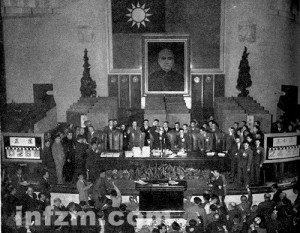
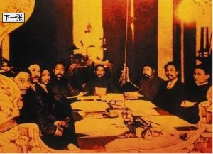

# ＜摇光＞一山不能容二虎？

**在制宪过程中，各党派过于关心和计较党派眼前的利益，而忽视了国家制度设计对于中国和世界的重要意义，更缺乏对中国未来的使命感。反观美国人当年对宪法的制定和批准之所以如此严肃，是因为他们认识到，人类是通过深思熟虑和自由选择来建立一个良好的政府，而不是靠运气和强力来决定他们的政治组织。两党都未能在关键时刻，超越个人情感和党派利益的局限，构想出真正长远可行的宪政制度。**

### 

### 

# 一山不能容二虎？

### 

## 文/ 后玉婷（武汉大学）

### 

### 

至今未看《建党》，但当年还是看了《建国》，不禁想起两者的关联。真正在中国历史上称得上势均力敌的即是二战之后的共党和果党，为何1946年宪法未能成为建国之基石？这次制宪本可以是近代中国最可能实施的一部宪法，因为当时二战结束，抗日战争的胜利，外患基本消除的情况下，人们似乎看到了中国政治多元化的曙光。“一山不能容二虎”的一元化权力结构、成王败寇以及改朝换代的传统，使得这场宪政运动最终还是以武力解决问题，而归于失败。

一般而言，分权有两种重要路径，一是横向的分权，即立法、行政、司法之分权；二是纵向的分权，即中央与地方的分权。古代中国是一个典型的单一制国家，具有深厚的大一统思想和中央集权的传统。19世纪中叶以来，中国传统的政治结构逐渐解体，权力分散的特征逐渐鲜明。随着中央权威的逐步倾斜，地方实力的逐步增长，省域意识因之而生，为联邦主义提供了土壤。从清末兴起的联邦主义运动在1920年的联省自治运动时曾发展到了顶峰。可是中国的文化传统却是一定要“打”成一个单一的大一统的国家。据此有学者提出中国的近代历史基本是地方割据，军阀战争，统一全国的历史。

中国人迷信权威，迷信圣人，这就是中国必须制造出一个权威，来代替皇帝的权威。四六宪法中国民大会的虚置正是为了满足中国人对最高权威的需求，它将权威从一个人转移到代表“所有人”的机构之上。

虚位的总统制和修正的内阁制的政治设计的失败，是导致1946年宪政运动失败的另一主要原因。这与当时的宪政知识分子对政治结构没有深刻的理解，误解了总统制有很大的关系。他们通常认为总统制容易导致总统的专断独裁，因此把责任内阁制作为限制总统权力的工具。这是主观臆断，事实上，无论是总统制还是责任内阁制，都是民主宪政体制，并没有先进和落后的分别。宪政的核心在于权力的制衡，而非一人之治或多人之治。近代中国宪政学者的政治智慧的缺乏，还在于他们缺乏对中国历史的深刻洞察。从历史上看，中国近代以来，能到得到颁布施行的都是采取总统制，而责任内阁制往往一公布即招致破产，责任内阁制在中国没有成功先例。比如在南京临时政府约法中，妄图用责任内阁制制约袁世凯的权力，同样的在四六宪法的协商中，共产党也是期望责任内阁制来防止蒋介石专制。

这样一种因人制法，以法夺权的做法致使宪法成为争夺权力的工具，导致政治力量之间的倾轧。当政治权力得到扭转时，即可翻云覆雨，倒黑为白。试想一下，当时掌有实际军权和政治资源的蒋介石怎肯做一个虚位的总统？在制宪过程中，各党派过于关心和计较党派眼前的利益，而忽视了国家制度设计对于中国和世界的重要意义，更缺乏对中国未来的使命感。反观美国人当年对宪法的制定和批准之所以如此严肃，是因为他们认识到，人类是通过深思熟虑和自由选择来建立一个良好的政府，而不是靠运气和强力来决定他们的政治组织。两党都未能在关键时刻，超越个人情感和党派利益的局限，构想出真正长远可行的宪政制度。

### 

### 

（采编：陈锴 责编：陈锴）

### 

### 
