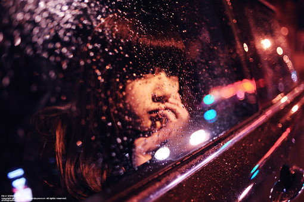
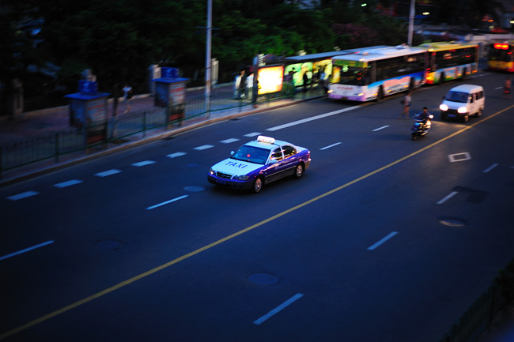

# ＜摇光＞一百座城市

**中国的城市正变得越来越相似，不管走到哪里都是人，夹杂几个外国人，因此而产生人脸辨认的障碍症，因而产生更多的失忆和口吃。我们难以辨认周围的面孔和建筑，一样的流行音乐一样的大众口音一样的低着头看手机的人群，一样的橱窗一样的街道一样的居民区，一样的地铁一样的楼房尚在建设中给您带来了不便，难得听见家乡的口音，回头看看又突然想起曾经的家乡已面目全非。十五的花灯不再像儿时那样热闹，炮仗炸伤我的下巴早已愈合，熟悉的巷道、院落无声凋零，只有哀衰的老人还在守护。他们都很希望我回去，可是有什么办法呢。我们希望寻找一些过去的证据，证明我们在哪里存在过并长大至今，可证据真是单薄。 **

 

# 一百座城市

## 文/ 蹇莉（苏州大学）

 

有一种感觉，不管去多少个地方，哪怕是一百座城市其实都是一样的，城市是一样的，我们也是一样的，我们依旧是一个人。美丽的衣服，美好的食物，美丽的人儿，其实是一样的，哪怕激起我们一瞬间的快乐，很快便归于虚无。就像往湖的中心投掷石块，波纹向四周荡去，可终归归于平静。没有什么能大过当初那一块石头的力量，没有什么能大过我们最初的感知， 除非思考让它越沉越深，但终究会被那湖水所吞没。 生活是无限种可能性的选择，我们在越来越多的选择中迷惘，我们感到混乱甚至一事无成，有一种可能是放弃，我们选择不选择？背对那片湖走开去，世界是虚无主义者的花园。我们的眼前不停地有新事物产生，它们像流星一样闪耀，一样快速陨落；或者说它们犹如洪水猛兽般涌现，又像温柔的刀刃一样将手无寸铁的我们千刀万剐，我们有种无力感，是面对千万种事物的失语和手足无措，置身于瀑流之中，有没有一种选择，是不选择？ 就像变成了石头，成了湍急的河流中坚硬的沉石。那是每当我看见城市中川流的人群所产生的错觉，我总觉得有个人蹲在角落里一直没有动。也许是某个怀疑主义者，他像我一样觉得这一切十分可疑。可以说，我们并不像所有书本、话语、现实媒体中讨论的那样存在者，我们可能是某些高等物种的殖民奴隶，也可能是工具，也可能真的是神的儿女。神眷顾我们，可我们的确没有像他所期许的那样管理家园，我们正一步步走向真正疯狂的一面，时时时刻刻与道德搏斗。

当然更多人只是单纯地感到，这座城市令人窒息、令人眩晕，于是逃往另一座城市。我说过了，每座城市本质上都是一样的，都是聚落在某个范围的中心，差别只是在于外在的文化和发展程度。每座城市相似的原因，是我们的心境没有彻底地改变，我们还是把自己归为某个阶级，走向某个社交圈，我们还是做着我们认为理所当然的事，我们一门心思地谋着利益或是追随所谓梦想，并接受正面引导。可事实并不一定是我们所想象的，表象不一定揭露本质，文字、图像、声音只是媒介，它们像话语一样有欺骗性，很多东西太唯心。我们相信我们发明的工具，我们相信科学，我们相信自己的文明，可文明也是人类自己所创造的，任何一种方法我们都能自圆其说，同时也一定有瑕疵与漏洞。世界是不可能完美的，我们只能在问题没有暴露时自我安慰地活着同时感到足够的满足，而在暴露之后努力地修补。世界建立在我们相信的科学的无限个假设与假设之上的漏洞上，所以人类文明这层建筑并不可靠。 甚至一戳就破。最明显的是，我们根本无法预测未来，我们无法控制大自然。我们只能所谓地满足地活着，那样最好。

中国的城市正变得越来越相似，不管走到哪里都是人，夹杂几个外国人，因此而产生人脸辨认的障碍症，因而产生更多的失忆和口吃。我们难以辨认周围的面孔和建筑，一样的流行音乐一样的大众口音一样的低着头看手机的人群，一样的橱窗一样的街道一样的居民区，一样的地铁一样的楼房尚在建设中给您带来了不便，难得听见家乡的口音，回头看看又突然想起曾经的家乡已面目全非。十五的花灯不再像儿时那样热闹，炮仗炸伤我的下巴早已愈合，熟悉的巷道、院落无声凋零，只有哀衰的老人还在守护。他们都很希望我回去，可是有什么办法呢。我们希望寻找一些过去的证据，证明我们在哪里存在过并长大至今，可证据真是单薄。 我们在一百座城市里，可一百座城市里我们感到同样地无措。

 

（采编：周冰 责编：麦静）

 
