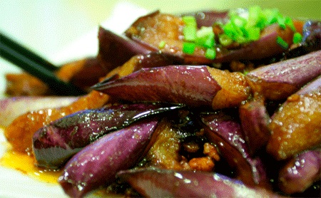

# ＜摇光＞一盘姑娘，油焖茄子

**霸道的锅气是做菜的灵魂，是一鼓作气，是电闪雷鸣，是铁骑踏匈奴，是李广射石虎！直到最后汤汁收干，显出那种你侬我侬的粘稠和暧昧，淋上少许麻油，好了，就这么出锅吧。原本生分的茄条，幸福的躺在雪白的瓷盘中，沉醉在浓厚的酱汁里，吸饱了幸福，忘记了宿命，随时愿意安详凛然地奔赴食客挑剔的嘴巴。** 

# 一盘姑娘，油焖茄子

## 文/杨彬（东南大学）

 

真的，豆子我和你说，目前为止没有几家菜馆的油焖茄子入得了我的眼，珠江路招商银行对面渝香园是其中一家，但必须是那个黑胖老板亲自下厨才真经毕现。

你也看到了，豆花看到布衣做了油焖茄子就恨不得要娶布衣了。这说明什么？这说明了一个看似古拙简单的菜，蕴含了那种催动人心的能量。茄子不一般，是蔬菜，但又不像蔬菜，口感微妙，反而极像荤菜，如果你用做蔬菜那种清淡提鲜滚油轻炒的手法处理，茄子基本能在你的嘴里淡出鸟来，所有的大厨都知道这个道理。但是如果你用做荤菜那种浓油赤酱大火慢炖的手法处理茄子，那味道有了，但是质感全无。在外面的小馆子吃油焖茄子，经常看到的失败之作就好似茄酱，浓重糊烂，拌饭可以，筷子断然夹不起来，就更不要提口感了。

所以豆子你看，这就是度，就和追姑娘一样，作为过来人，咱聊几句题外话，你远了不行，近了不行，轻了不行，重了不行，浅了不行，深了也不行。这就要远近得当，轻重有度，九浅一深。

做一道好菜，最重要的就是选料，这和追姑娘又是一个道理，要有一个好姻缘，先要找个好姑娘。做油焖茄子，要入味透彻，又要保留质感，不能选北方圆茄，也不能选南蛮条茄。圆茄太厚了，切出来的茄条子很难保证每条都带有紫皮，这样白瓤的香气不够。条茄太弱，只能对开切段，紫皮的面积是白瓤的1.5707963倍，韧性过重，硌牙。最好是江南一带的胖茄子，矢状面一开四，再切段，紫皮比白瓤等于0.7853982，接近黄金分割，质地最好，平衡安然。那些青皮黄皮茄子神马的千万别用，就像把妹选了美国妞马来妹，交流不来，不算主流，做出来的不知道是中餐还是西餐。

所以说，豆子你看，喜欢做菜的男人都有女人缘，不光是因为女人也想吃好吃，更加因为做菜真的太像把妹了，菜做好了妹子自然就把到了。油焖茄子其实不是闷出来的，我今天告诉你的，是很多厨子不会告诉你的，好茄子是油泡出来的！油要舍得放，26cm的炒锅，油要下足炸鸡的量，不要太热，木筷子插进油里微微冒细密的小泡的时候，油温是100度，这个时候就要把茄条下锅泡着，逐渐拉高油温，120度的时候小泡开始离开筷子，140度的时候，小泡变大泡，茄子也开始翻腾。不要害怕，把火关小，用铲子慢慢翻滚，这个过程就叫油泡！家里和小店不舍得用油，所以这个步骤就省略成了煸炒，记得我和你说过？茄子是荤菜一样的蔬菜，需要用油脂来提升口感的厚度，所以缺少了油泡，茄子就不行了。这也和把妹是一个道理，有人不舍得花钱，就像做茄子不舍得放油；有人嫌麻烦不愿意做油泡，就像有人各种忙就是不愿意陪姑娘；有人放了油，花了时间，但是不知道掌握合适的温度，就像傻逼的富二代，撒了现金，赔了青春，做了凯子。

其实大厨们都知道，油泡看起来浪费败家，其实是不亏钱的，今天泡茄子的油明天一样可以炸土豆，只是这话不能明说，他们也不会告诉你。就好像你舍得钱砸了Q5，今天接章子怡，明天也能接大S，只是这话不能明说，汪小菲那种买了Q5的也不会告诉你。油泡到最后，就像约会的尾声，总要拉高温度，弄个高潮。勇敢点，开大火，把油温拉到170度以上，在一片热热闹闹的鼎沸中，用漏勺捞出茄条，用力把残油沥干，大火滚油在令人炫目的高潮中能逼出油泡过程中吸入的过多油脂，不至于过于油腻。

豆子你现在应该逐渐悟到了吧，就像遇到一个令你倾心的好姑娘一样，在热恋的同时，你要心思慎密的准备好谈婚论嫁成就你最终幸福的一切必要细节。在油泡茄条的同时，注意，定要是同时，你也应该忙里偷闲，有条有理的把蒜头切成蒜片，把老姜切成姜末，把尖椒切成椒蓉，准备好烹调米酒（如果你在上海我推荐你用冠生园的）和上好的生抽（如果你不是愤青的话，可以用日本产的龟甲万，如果你钟情于国货，可以用六月鲜），如果你仍有余力，可以接着准备锦上添花的香菜末，白芝麻。

接下来是成败的关键，在热恋最炙热的顶点，让一切配比完美的各种头绪条件和机缘在完美的时间和完美地点渗透交融。就用刚才的炒锅，开大火，用锅底残油爆香蒜片姜末椒蓉，第一次加入一汤勺的生抽，干炒出酱油略带焦香的酱香气味，在灼热干燥的氛围里炝入一小碗米酒，紧接着就放入刚刚沥干的茄条，再一次淋入两汤匙的生抽酱油，加一茶匙白糖提鲜，快速翻炒。这时候一定要保持大火，霸道的锅气是做菜的灵魂，是一鼓作气，是电闪雷鸣，是铁骑踏匈奴，是李广射石虎！直到最后汤汁收干，显出那种你侬我侬的粘稠和暧昧，淋上少许麻油，好了，就这么出锅吧。原本生分的茄条，幸福的躺在雪白的瓷盘中，沉醉在浓厚的酱汁里，吸饱了幸福，忘记了宿命，随时愿意安详凛然地奔赴食客挑剔的嘴巴。

轻轻点上一撮香菜末，淡淡地随性撒上一小把白芝麻。如同一次完美的爱情，一盘由炙热开始，历经浓情的油焖茄子最后如此从容的呈上圆桌。

豆子，作为一个成熟的男人，如果你已经能了然于心地做出面前这么一盘油焖茄子，你的好姑娘离你也很近了。

（采编：麦静；责编：麦静）

 
