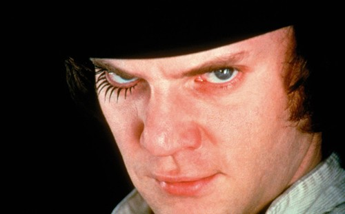

# ＜摇光＞下里巴症候群

**简单来说，下里巴症候群是这样一种病：我们会努力要作一个风雅的人、一个高尚的人，一个脱离了低级趣味的人，结果还是在最不经意的时候暴露出自己的俗人本质。我们试图跟着阳春白雪的调子高唱，脑子里想的却总是阳春面和白雪公主。**  

# 下里巴症候群

## 文/马伯庸（作家）

 

上星期的某一天晚上，我和一位朋友在西单附近吃饭。席间我们高谈阔论，指点江山，臧否人物，言必及王小波、余杰、村上春树、奥尔罕·帕慕克，聊的十分尽兴。大约到了9点多，我们方才起身结帐，各自回家。我踏上地铁之前，忽然看到一处还没收摊的报刊亭，就走了过去。从西单到四惠东大约11站，全程要30多分钟，我必须得买点什么东西消遣。

我的视线从《科学美国人》扫到《译林》，然后又从《看电影》扫到《三联文化周刊》，来回溜达了五、六分钟仍旧游移不决，直到摊主不耐烦说要收摊了，我才催促自己下了决心，在摊子上抓了一本《读者》，匆匆离去。在地铁里，我捧着《读者》看的津津有味，全然不顾自己曾经一逮着机会就嘲讽这本杂志的种种劣行。《读者》杀时间很是不错，我在西单等地铁的时候翻开扉页寄语，在建国门看到中缝后的笑话栏目，然后四惠东地铁停稳的一瞬间，我刚好扫完封底的广告。

尽管我一下车就把《读者》顺手塞进垃圾筒内，扬长而去，但我必须得承认：我在刚才的30分钟过的很愉悦，那些小布尔乔亚式温情故事和心灵鸡汤让我发酵出一种中产阶级的微微醺意。

我上上星期去了一趟三联书店，用公司发的雅高卡买了许多一直想要但很贵的书，比如王鸣盛的《十七史商榷》、张岩的《审核古文案》、杨宽的《中国古代都城制度史》、《百变小红帽－一则童话三百年的演变》，还有若干本“大家小书”系列的小册子。买新书是一件令人愉悦的事，尤其是买了这么多看起来既深沉又有内涵的文化书籍之后，感觉旁人注视自己的眼神都多了几分恭敬。我捧着这些书兴致勃勃地回到家里，把它们一本一本摆在书架上，心里盘算哪些书以后写东西用得着；哪些书以后吹牛用得着；哪些书可以增加自己的修为和学问。

盘算到一半的时候，腹中忽有触动，五谷轮回，山雨欲来。我的视线飞过这些崭新的内涵书，抽出一本机器猫，匆忙跑进厕所……

类似的事情其实经常发生。比如跑去看现代艺术画展，最后发现真正停留超过两分钟欣赏的，都是裸女主题油画；买来许多经典DVD，最后挑拣出来搁进影碟机的只有《恐怖星球》和《料理鼠王》，看到男主角居然是大厨古斯特的私生子时，还乱感动了一把；往PSP里灌了300多种历代典籍文献，然后只是一味玩《分裂细胞》——甚至当我前天偶尔在手机里下载了一款类似口袋妖怪的JAVA游戏以后，我连PSP都不玩了，每天在班车上和地铁里不停地按动手机键，就如同一位真正的无聊上班族。

我有一次看到《Little Britannia》里有个桥段：男主角之一跑去一家高级法国餐厅吃饭，对着白发苍苍的老侍应生说：“给我来份加大的麦辣汉堡。”这让我亲切莫名。

我把这个发现跟朋友们说，他们都纷纷表示自己也有类似的经历。有人拟定了全套瑜珈健身计划，然后周末在家里睡足两天；还有人买了精致的手动咖啡磨，然后摆在最醒目的位置，继续喝速溶伴侣。最后大家一起唉声叹气，试图要把这个发现上升到哲学高度，提炼出一点什么精神感悟，让自己上个层次什么的。

但是这个努力可耻地失败了，于是我们发现这是一种感染范围很广泛的疾病。

简单来说，下里巴症候群是这样一种病：我们会努力要作一个风雅的人、一个高尚的人，一个脱离了低级趣味的人，结果还是在最不经意的时候暴露出自己的俗人本质。我们试图跟着阳春白雪的调子高唱，脑子里想的却总是阳春面和白雪公主。

一般这种疾病分成两个阶段：第一个阶段是你发现了“超我”，折射到现实社会，就是你买了一台西电KS-16608L；第二个阶段是你发现了“本我”，每天晚上都用这玩意儿听《两只蝴蝶》。

其实仔细想想，这种疾病或者说生活状态很不错，一来可以满足自己的虚荣心；二来又不会真正让自己难受——要知道，让一个俗人去勉强风雅，比让一个风雅的人勉强去俗气更不容易，毕竟不是每个人都象郭沫若那样进退自如，能写出《凤凰涅磐》和《咒麻雀》来。

按照文法，在文章的结尾应该提纲挈领，但是刚才已经失败了，现在也不会有什么成功的可能。所以我还是以一个隽永温馨的哲理小故事作为结尾。

我有一个朋友R。有一次，我们一群人去看一部话剧。当时去的早了，话剧还没开演。百无聊赖之下，我们就跑到附近的一家书店闲逛。我偶尔瞥到其中一个书架上放着一些关于佛教的书，忽然下里巴症又发作，于是微皱眉头，用轻松安详的语气说恰好在旁边的A说：“最近俗务缠身，我忽然很想看看禅宗的精神，让自己的心空一下，也未尝不是件愉悦的事。”

Y没理我。我低头一看，R原来正蹲在地上，聚精会神地捧着从书架角落里拿出来的大书。

“你在看什么？”

A把书举了起来，我首先看到的是Y愉悦的表情，然后是封面硕大的字体：“慈禧美容秘籍。”

R的真诚和坦率就如同初春的阳光，我看到自己虚伪的面具惭愧地开始融化。心灵被震撼的我扔下了南怀瑾、南怀仁和慧能，毫无矫饰地抽出一本《奇侠杨小邪》。

我的内心学着《发条橙》结尾的阿历克斯，大声呐喊：“I was cured all right。”

 

（采编：孙梦予；责编：应鹏华）

 
