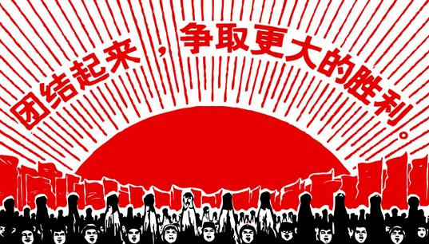

# ＜摇光＞不是所有的岁月都能够遗忘【纪实：写给那个仓皇的年代】

**在那个年代，没人知道自己有什么权利，只知道自己有什么义务。于是，权利就成了空谈阔论的把戏，成了一纸空头支票。好多人用命去赌，终究还是一无所获。自由的思想、独立的意志，或者甚至仅仅是生存的权利、仅仅是表达自己的想法，都是奢侈的。也许正因为如此，才有这么多黯然离去的生命，没有人记得他们的名字，更遑论去祭奠这些在最美好的年华里走失的孩子。**  

# 不是所有的岁月都能够遗忘

# 【纪实：写给那个仓皇的年代】

## 文/张畅（浙江大学）

 

**引子 **

母亲问外公，能不能讲一讲年轻的时候经历过的事情，这么多年，还没听你讲过。外公停顿了几秒，然后面色惊恐地瞪大了眼睛问，做什么用？那时候的事情，对国家，都不是好事情。

我听见母亲在从中国打来的电话里这样描述。

她说她曾努力从外公口中得到一点传奇的故事，像小时候读过的那些英雄的传奇一样，以丰富单薄的生活。可每一次，总是枉然。外公年过八旬，依旧不愿提起他的经历，我也只能从母亲艰难敲打着键盘留下的字迹里，揣测那个年代的过往。

父亲，是家中最小的孩子。从曾经的描述里，我得知爷爷是一名老中医，家传几代的药方，累积起来可以堆满半间房子。可惜，家中七个孩子都没有学医，自然也没有继承爷爷的技艺。可惜，爷爷脾气暴躁，没有给父亲留下太多温暖的回忆，所以也叫人不忍问关于他的信息。可惜，爷爷卧病在床后过早离开，与我未曾谋面。奶奶性情尚好，宽厚仁慈。也在我六岁刚刚开始记事时在睡梦中离开人世，平静、安详。我依旧记得她老人家盘着腿坐在老家北屋的炕上，包饺子的样子。记得她唤我过来，说，来，再跳一个幼儿园学的舞蹈。

有时候，那些原本与你的生命有着密切联系的人，却因为生命局促的限度而与你的生命或是记忆擦肩而过。对你而言，甚至没有痛的记忆，没有眼泪的流淌。若干年后，回忆起他们，那些与你血脉相连的人和事，竟恍如隔世。

于是，我只能写我的母亲，这个常常同我交谈的最亲近也最遥远的人。写她关于过去的点滴的记忆。

我所写的，没有刻意迎合任何人的要求，当然也没有对未来的什么恐惧。我只是想，把他们惨淡的青春写出来，把他们饥饿的日子写出来，把父辈的尚未实现的理想表达出来。文学，在此刻，就如同一汪洪水的缺口，一旦打开，就是几个时代的倾诉。

而我能做的，只能是默默祈祷这倾诉来得不要太晚。

 

**再饿也不能拿公粮？** 

在三年自然灾害和“大跃进”期间，饥饿，充斥着母亲的生活的每一个角落。母亲那年三岁，还不记事。可是随着年岁的增长，依旧是饥饿。饿到已经开始感觉到自己的胃快被自己消化了……越饿越饿，就像马太效应一样，噩梦一样地延展。1958年之后的三年里，数不清的人因饥饿而死。路边的树皮被扒光，马厩里的马粮被抢光，只要家里有家畜都杀掉吃。只要能够保命，其他的什么都是不在乎的。

外公是国家铁路局的火车驾驶员，每天负责运送国家的公粮，玉米、小麦还有其他一些杂七杂八的东西。母亲至今清楚地记得，每一次外公下班回家，都因饥饿全身无力地栽倒在床上。姥姥抱怨说，你每天开车，那些玉米啊、干粮啊都在车里，你就拿一些回家，也不至于让全家老小都饿死。

外公只说了一句话：“再饿也不能拿国家的公粮！”

很多时候，我难以理解外公的倔强。他恪守一些信条如同守护生命一样，然而在活命和公粮面前，又如此取舍。几乎没尝过饥饿滋味的我，常常期求在这其间找到更多哲理，比如“鱼和熊掌”。但是，外公斩钉截铁地告诉我，没有太多的哲理，就是不能拿国家的公粮，不能因为私人的原因获得公家的利益。

如果所有的人都这样坚定不渝，也许也会如外公一样坦然却贫穷地度过原本宝贵的年轻的岁月，也许就不会有太多因欲望扭曲而挣扎，最终毁灭的人在。而这个世界，原本就难以用简单的逻辑来衡量。

后来，家里又添新丁。有了弟弟的母亲不得不被送到乡下奶奶家中，免得被活活饿死。然而，饥饿早已蔓延，不分城乡。全国各地都是一样。在乡下奶奶家中熬过四年的饥饿的母亲，却时常向我谈起那里清澈的溪水、淳朴的民风以及枯萎的果树前盘踞的蟒蛇。夏天，母亲在盛装着糖的篮子下面等，等着糖化，掉进嘴里。为了一顿甜菜和高粱米搅成的简陋的饭菜而开心不已。

人常说，吃亏就是福。母亲当时尚年幼，自然不懂得这个道理。而今天看来，她能够熬过那端日子，还能够留下美好得有些惨淡的回忆，是一件多么不易的事情。

1966年“文化大革命”爆发，母亲10岁。记忆里，学校停课，工厂罢工，店铺关门。街上时常成排走着“罪犯一样的”人，他们低着头，颈上挂着写了自己名字的木牌，上面也写满了批斗的字样。人群中的怒吼、抄家后点燃的书页、风中燃烧的书的碎屑……人们疯了。莫须有的名号夹杂在人们的名字中间，莫名的界限在原本亲密的邻里之间划分，火药味充斥着日常生活。没有人知道为什么会这样，以后要怎样。

母亲说，她看见自己学校的校长站在破旧的操场中央的木桌上，胸前挂着硕大的牌子，名字上打着黑色的“叉”。所有的同学和学校的老师都聚集在操场上。母亲看见平日里温柔可人的老师嘶吼着要打倒他，人群中声声叫喊，于年少的母亲而言就是一群恐惧的符号。她无可破解，也无力知道。她只是茫然地站在他们中央，看见阳光下，老校长的头发闪着银色的光。

后来，读了法国社会心理学家勒庞的著作《乌合之众——大众心理研究》，读了蒋勋先生的《孤独六讲》中的《革命孤独》一章，读了龙应台的《大江大海1949》，读了何兆武先生对于抗战时期西南联大学习的经历回忆录《上学记》，读了齐邦媛女士的《巨流河》之后，我才知道，在一种特定的情境下，在一个人人呼唤革命的时代背景中，个人的命运不过是被操控的工具。这个渺小的个体存活，又怎么去抵挡顺势而来的汹涌的潮水，更遑论发出自己激愤的声音，说出自己内心的苦闷了。而多少人，就这样淹没在时代滚滚的浪潮中不再复活。所幸，我们有文字作为媒介，有文学这方土壤来培育思想，引发思考。

我们今日读到的文字里，有多少是对人力不敌整个境遇的慨叹？有多少是个人命运难以抵挡时代洪流的叹息？有多少活在时间里却错过了时代？有多少是活跃在时代中却输给了时间？

我们能够做的，竟然只能是回忆，只有回忆。因为，回忆，是一种对未来的抵抗。也是对过去的缅怀。

我常想，每个人之所以为人，都是有一种情结支撑的。其中最重要的情结之一，就是“生命意识”。按我个人的理解，生命意识就是一种个体对自我生命的自觉，能够接受生命中难耐的孤独，承受自己的苦难，直到这孤独和苦难同死亡相遇。生命意识，就是一个群体，在走投无路的情况下相互搀扶、彼此照顾、细心呵护的连结。是对爱和被爱的渴望，是对生命的渴求和对死亡的本能的恐惧。可是，在那样一个连填饱肚子都如此艰难的时日里，人的生命意识究竟是增强了，还是减弱了，抑或是消失殆尽？不然，怎么会有人选择自绝生命？

母亲讲到，文革期间的一天，她同姥姥去买菜。邮电局大楼前人山人海。有人跳楼了——有人呼喊着。因为不堪忍受连夜批斗的精神压力和身体不适，邮电局的局长选择了自杀。先前因为亲人下跪来劝阻而未遂，这一次，用电击的方式结束了生命。而自杀，在那个人性混乱，亲疏不分的时代，仿佛是对不公待遇的最强劲也最无奈的怒吼。可是，这样的“怒吼”，几乎每天都在全国各地上演，看惯了的人们也日渐麻木。

生命，竟如同草芥。

**“保皇派？”**

文化大革命，就是“造修正主义的反”，就是“打倒走资本主义道路的当权派”。文化大革命，每天都上演着大悲大喜的剧目，每一出都渗透着人间的寒意。那么多人中，有的还是稚气未脱的孩子，哪里有敌我的分别呢？可是，他们却如此激动地喊着他们自己也不懂的口号，行走在疯狂的人群中，做自己日后也难以置信的事。他们的心里，究竟酿成了什么样的仇恨？

母亲上小学三年级的时候，全校停课，闹革命。孩子们都因为不用上课开心不已。可是局势往往没有这么简单，似乎年少的母亲也从每日的批斗里感受到浓烈的火药味。那天深夜，外公疲惫不堪地回来，说自己被打成了“保皇派”。性格狷介不羁，又很率真的外公没有跟着大家喊口号，批斗自己的领导。于是就成了批斗的对象。母亲说，后来，外婆被送到学习班学习，外公被送到“五七干校”。我的母亲和年幼的舅舅被托付给亲人照看。

凭借从儿时至今的全部记忆，我揣测外公一定经历很多我们只能从历史书里读到的故事。这些故事，就是外公生活的那个时代的缩影。我无力得知它的全部，因为外公不肯讲、不想提。我想，人对于艰难和苦涩的回忆都存有抵触的情绪，或者，是选择性的记忆在作祟。我只是从母亲倾诉的片段，得知外公的母亲在日本人打到中国的时候亲眼看见自己平日里熟悉的邻居被日本人抓走，之后杳无音讯，而外公的母亲则躲在附近的茅草间大气不敢出。

对于一个在文革期间屡次无故被批判，依旧耿直不改的外公而言，昧着良心说假话大概是最大的痛苦。可是，他也承认自己说过假话，因为受不了日日夜夜炸响在耳边的口号式的呼喊，和几乎是人身攻击的批斗。对于一个自己的两个儿女被送到乡下数年，相隔不相见，思女心切的外公，多么茫然无措。而不善表达的他在1975年8月的一天，面对即将被送到乡下，返程却遥遥无期的母亲，却什么都没有说，只是拍了拍母亲的肩膀。对于一个见证过日军侵华、国共内战、中华人民共和国成立以及一切一切我们这一代不可想象的历史事件的外公，究竟如何度过他并不亮丽的青春，去赴一个无限遥远的盛宴？

我无可想象。

我不止一次地怀疑，为什么即便如此，外公依旧近乎固执地相信毛、相信党。记得上初中的时候，我和弟弟在他面前讨论毛泽东的功过是非。现在看来，不过是一个年龄段的好奇心罢。可外公竟然突然打断我们，十分严肃地说，你们根本不懂！

是啊，我们确实不懂。不懂那个疯狂的年代，物质上困苦潦倒的中国人民是怎样凭借精神的支撑捱过难熬的岁月？不懂那个人人自危的时日里，国人们如何在毫无期待的情形下面对每日的生活，去化解心头重压的块垒和滴滴的苦涩？不懂我的外公、外婆，是不是也有过一段难忘的爱情，也像今日的年轻人一样，憧憬着未来无限宽广的生活？

几个月前，我问外婆，文革的那个时候，每个人都已经几乎不分是非了，您相信什么呢？您是怎么熬过来的呢？外婆笑着说，在那个时候，每个人甚至都不晓得自己的话是昧着良心说的，还是跟着政策说的；大家都很极端，可也特别紧张。没一个人都能从别人的痛苦里看到未来的自己，这种感觉是很可怕的。但，我始终相信善良。做人啊，要善良，只有善良，才对得住天、对得住地、对得住自己啊。

我看见外婆温暖的笑容，心里一阵酸楚。

热爱生活，笃信善良。简单的道理，就这样，在艰涩的青春里生成。

**“全部的能量都在那片土地上展现”**

母亲生于1956年。这些年，母亲总喜欢和我讲起她在“青年点”的故事。这些故事，大多我已经听过至少五遍。比如，她说到当时外公和外婆不许她参加舞蹈队的时候，总是很遗憾地说，哎呀，我那个时候跳舞特别有天赋，老师跳一遍，我就能全部记住，而且总是领舞呢。可惜……每一次，我甚至都知道母亲说这些故事时应该显现的神情。可是，每一次，都不忍心打断她。因为我知道，每说一次，对于母亲而言，都是同样的回忆、不同的感觉。

1975年8月，母亲高中毕业后，响应毛主席“知识青年上山下乡，接受贫下中农再教育”的号召，到黑龙江绥化附近的屯子，开始了下乡青年的生活。用母亲的话说，就是开始戴着大红花上军车的时候，觉得自己像一个英雄一样神气，也没想到以后怎么办、多久才能回家见父母之类的。可是一路奔波快一天到了目的地之后，才傻了眼。四周荒无人烟，只有几间破旧不堪的草房，地里的玉米好像没有人收过都烂在地里了，四处都是土。母亲说，当时觉得这辈子都没指望了，估计要一辈子都生活在这儿了。好多人都哭了，一半是想家，一半是绝望。

青年点分东西两间房，男女分住。睡的都是通铺。每天晚上都要自己烧炕，因为炕很长，炕头的人热得要命，炕尾的人冻得不行，刚烧起来的时候到处都是烟。北方天气严寒，冬天的时候每天早晨起床，被子都被冻在墙上拔不下来。于是，母亲就和几个人一起拉被子。母亲每次说到这里，都会笑，说当时一边拉被子一边骂，但是丝毫没觉得苦，真奇怪！

“有一次，正睡到半夜，突然外边起大风。生产队通知马上到地里抢收粮食。晚上出去之后伸手不见五指，每个人负责六根垄。我干着干着，被落得老远，前后都看不到人。当时我害怕极了，风刮的庄稼的声音特恐怖、特凄凉，一会便听到远处传来好多人喊我名字的声音。后来我们一起回到了青年点。”

母亲后来回忆说，人在极度恐惧的时候要么就是丧失判断力，要么就是判断力激增。她属于前者。她觉得，那些喊她名字的声音，在她这么多年之后想起来，还觉得很温暖很兴奋。她一直都没有忘记。

对于十九岁的母亲而言，恐惧的最极端似乎不是死亡，而是失去身边的好朋友，无论是怎样失去。

“还有一次，临近要放假了，青年点点长带人到生产队取粮食，很长时间没有回来。当时我们都没吃早饭，等米下锅呢，这时有两个青年饿的受不了了，在一起赌上了，赌十元钱的，如果谁能一口气喝下三瓶红葡萄酒就赢十元钱，拿这十元钱买饼干充饥。大队的一群人马上到供销社拿了三瓶红葡萄酒，一个青年过去一口气全部喝了下去。这群人后来陪着他回到了青年点。下午，就听到了他死去的噩耗——酒精中毒。”母亲摇着头说，“大家一起把他的尸体放到了学校粮库的粮食堆上，等侯处理。”

母亲屡次提起这个与她本不相识的青年的死，总是叹息。她说，他家里孩子多，他父母过了很久才知道他死的消息，赶过来的时候大家都看见了，可是没觉得他们有多悲伤。那个年代，家里少一口人好像少了一个吃饭的，多了一个活命的；也许，是他当初下乡的时候，父母就没指望着孩子回来。

在那个年代，没人知道自己有什么权利，只知道自己有什么义务。于是，权利就成了空谈阔论的把戏，成了一纸空头支票。好多人用命去赌，终究还是一无所获。自由的思想、独立的意志，或者甚至仅仅是生存的权利、仅仅是表达自己的想法，都是奢侈的。也许正因为如此，才有这么多黯然离去的生命，没有人记得他们的名字，更遑论去祭奠这些在最美好的年华里走失的孩子。

我难以站在母亲的角度去审视年轻的日子。因为她的年轻如此不同于我的年轻。我的年轻是在自由中被“改造”过的无可奈何，却也是风光无限、机遇无穷的。而母亲的年轻时在改造中自由着的放荡无羁，但也别有一番味道。没有经历过，永远想象不到。你相信么？母亲从中国写信给我说，我觉得那个时候是我最难忘的时候，因为那时我的全部的能量都在那片土地上得以展现，都得到了最好的释放。

我无从知道，当时贫穷却快乐的母亲究竟释放了什么能量。信里就写了这么一句话，像诗，又这么真实。母亲不是诗人，母亲从来都不喜欢玩弄文字。但是母亲喜欢我的文字。我出书，一半是为外公，一半是为母亲。我要趁着他们还能阅读的时候把我的文字给他们看，无论他们看了之后是不是喜欢。

从前，母亲常喜欢改我的作文。后来，母亲看不太懂我的文章，就拿来问。再后来，母亲不问，就只是看，一看就是几天。我疑心她想要吞掉其中的每一个字，吞到肚子里去，留在心里。有些文字，不用看得懂，就如同有些话不用听得明白。古人讲，得意忘言，得鱼忘筌。语言和意义的纽带总是纠结难耐，可确是我们都爱思考的逻辑。我的母亲，就沉浸在我自创（某种意义上母亲认为是她创的）的逻辑中，享受自得。我不知道是不是一个写文章的人背后都有一个爱他所写的文章的母亲。我写文章，一半为自己的表达，一半为母亲的阅读。

再后来，我忍不住问母亲。妈，你在青年点的时候，到底有什么能量释放呢？母亲笑笑，说，有很多啊。比如排练歌舞、样板戏给老农们看，比如画宣传画。母亲乐滋滋地说，当时大家下地干活的时候一身都是土，只有我的身上是画画的颜料，大家都叫我“高才生”。

的确，母亲的画很好，母亲的舞蹈也很好。但是，她没有说，她的学习成绩曾经多么出色，她曾经多么想做一名大学教授讲高深的理论。她没有说，她从乡下回家之后赶上了最后一届针对下乡青年的高考，她是如何翻箱倒柜地找已经尘封三年的教材，后来才得知被家里人拿去卖了钱。母亲一个人在被窝里痛哭了一天。距考试只有30天。母亲说，她把她全部的精力都释放在这决定她命运的30天里。她不眠不休，没有老师、没有同伴，没有任何可以依靠的指导。母亲一个人，在30天里创造了奇迹。当然，是母亲一个人的奇迹。外人是不能够明白的。

结果是，母亲考上了师范学校，成了那一届不多见的下乡回乡后考上大学的“高材生”。难怪，母亲总说我不够用功。也许，只有把全部的命运都赌注在一次考试上的气魄和胆识，才叫用功。也许，那是什么恢宏壮举的缩影。也许，我永远做不到。但是，我宁愿把它理解成是我母亲一个人的战斗。

孤独而气势恢弘的战斗。 

（采编：何凌昊；责编：尹桑）

 
