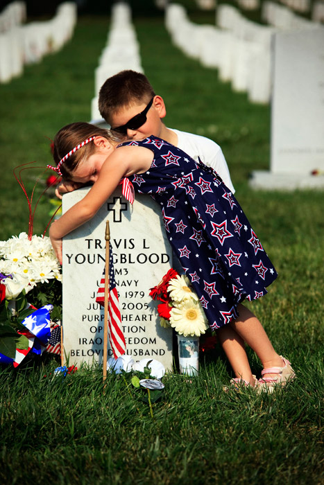
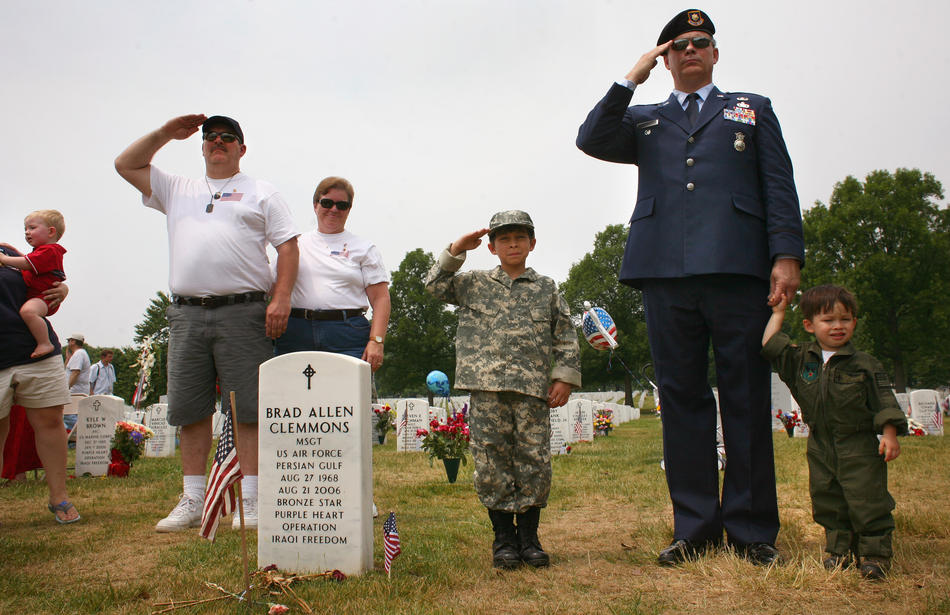

# ＜摇光＞不朽与永生——阿灵顿公墓里的生与死

**秦始皇修建皇陵希望他的帝国万世永存，希特勒梦想着德意志千年帝国，斯大林四处树碑试图让自己被后人敬仰。但是最后，所有帝国顷刻间土崩瓦解，革命导师瞬间成了罪人叛徒。一个人在后人心目中的位置不是靠修建多高的雕像、多大的墓地来衡量的，即便是没有雕像没有墓地，只要为国家，为人民做了应该做的事，国家和人民也不会忘记，而这恰巧是肯尼迪墓地周围平台栏杆上镌刻的肯尼迪的名言：不要问国家能为你做些什么，而要问你能为国家做些什么（Ask not your country can do for you, ask what you can do for your country）。在这样一个宁静的夏日里，这样一句话却能让人热血奔流，这样一句话却能在静默中发出震耳欲聋的声音，想想吧，为国家，你做了什么！**

 

# **不朽与永生**

# **——****阿灵顿公墓里的生与死**

## **文/蒋宇博（加州大学圣地亚哥分校）**

 

小时候，每年清明节必须参加的一项活动，就是全班一起去南湖或人民公园的革命烈士纪念碑扫墓。我们每个人会用白纸折好一朵小白花，用线串好，步行到烈士碑前，然后慢慢地放下。刚及垂髫的小孩哪懂得历史的沉重，更多的是惦记着仪式后的野餐和背包里的食物，这大概是我当时唯一深刻的记忆。

到了束发的年纪，跟同学游览帝都，参观到毛主席纪念堂也没有留下什么印象。只记得那天闷热的天气让我很不舒服，但我还是坚持在太阳底下排了四个小时的长队，最后走进去也只是远远地看到了一个老人躺在水晶棺材里。是那个伟人吗？我的视线恍惚了，好像没有书本里电视里看到的那么高大，就在我疑惑之间，我已经随着移动的人流走出了大厅。

墓园这种地方多少有点不吉利，迷信的人都不敢轻易靠近。而对我来说，坐落在华府波托马克河西岸弗吉尼亚山丘上的阿灵顿国家公墓（Arlington Cemetery）只是每天上班路上必经的一个地铁站。当我在某个周末带着敬畏与好奇踏进这里的时候，我感受到的却是完全不一样的气氛。公墓园里没有悚然与诡异的氛围，周围的一切都很美很明亮，像普通的公园，只不过更平静安详。一排排样式简单的白色大理石墓碑一望无际，有种纯洁、神圣的感觉。在长达一百多年的时间里，这片土地上埋葬了多少荣耀与叹息，心碎与安慰。从美国内战到美西战争、从一战、二战到韩战、越战和如今的伊拉克战争，“挑战者号”和“哥伦比亚号”航天飞机遇难人员等，超过三十二万人长眠于此。这其中，不仅仅包括了美国建国以来在每场战争中牺牲的将士和战后的退役军人，还有他们的配偶及未成年子女。如果生前不幸与家人分开，那么死后与家人团聚在此，也足已慰藉。

让我真正震撼的是这里真正的自由平等——所有的人，生而平等，死而平等。这些为国奉献的人们，无论军衔与职位，将军还是士兵；无论是冲锋陷阵的英雄，还是作为后勤服务的女性；无论是牺牲战场，还是退伍后终老家乡，均不分等级地葬在这里。所有的墓碑肩并肩地排列在一起，手足相望，沐浴着阳光，朝着华盛顿纪念碑的方向。死亡和分离总是不幸的，但若葬在此处，也算是幸福与光荣吧。我经过一位名叫George William Casey将军的墓碑，上面摆放着几枚勋章，告诉着世人他曾经的无尚荣耀。后来我才知道，Casey将军的儿子是现任美军总参谋长，将军自己曾任第一骑兵师师长，后战死于越南战争。就是这么一位战功赫赫的军人，他的墓碑样式大小和普通士兵别无二致。

我没有去过八宝山革命公墓，但我清楚地知道如果不是“老革命”，不是领导首长，是没有资格搬进去的。全国这么多的烈士陵园，最常见的也只是一座突兀的群雕，那些牺牲的普通烈士们连个名字都找不到。即便这样，能成为人们日夜敬仰的群雕之一小部分已是大幸。

我曾经读到章东磐《父亲的战场》里松山破败的中国革命军第八军抗日阵亡将士墓碑时，泪如雨下。有很多人因为头顶上帽徽的不同，就算是身处同一阵营的抗战将士，也被长期的遗忘，英勇事迹被淡化成可有可无的传奇，甚至忠魂的坟墓被人捣毁倾覆，忠骸被人挫骨扬灰。同样地持戈保卫社稷，为什么有些人能在电视栏目上作为“人民英雄”反复播映，有些人却只能在惨淡的生活中苦度残生？为什么杀死自己同胞的内战者能比抵御外敌入侵的抗战者更加尊贵？扪心自问，如果我是那60多年前抗日的战士，知道生前死后不但不能得到应有的荣耀，反而会因为我参加国军的抗战而备受歧视和迫害，甚至暴尸荒野，我会怎么想？我定会想“这样的国亡了也罢！”所以，我能理解书中叶进财老人对生活的微词，我敬仰张子文老人能在受到如此委屈后还能说出这么一句“都过去了”的话，这样的胸襟是中华民族真正的脊梁。正是六十多年前包括国共两党和英美苏盟军在内的抗日武装共同用青春的胸膛挺起东亚病夫的脊梁，用自己宝贵的血肉之躯抵挡住日军钢铁的洪流，才让中国赢得了一个世纪的尊严，才让那些无知的健忘者和无耻的历史制造者们有了遗忘的资格和篡改历史的机会。

历史诚然是不能绝对真实被反映出来的，但最大程度的保持历史的本真，从而了解历史，进而理解历史、反思历史，是历史存在的最大价值所在。当一个人只能被别人代表的时候，当一段历史因为与今日当局的荣光无关就被刻意铲除的时候，当国人还不能正视灾难深重的近现代中国那些悲烈的历史“可歌者少，可泣者多”的时候，我看不到民族伟大复兴和崛起的动力，我看不到二十一世纪是中国人世纪的理由。耻辱是面镜子，如果我们不能正视它认真反思，而是把它打碎，那么更大的耻辱仍旧会降临我们身上。

龙应台先生曾经在《大江大海1949》里提到过长春围城，后来我自己也发表过与此相关的文章（不幸被和谐了）。1948年6月，解放军包围长春，但由于缺乏攻城装备以及避免伤亡的考虑，东北野战军方面决定采取“长期围困”的策略。在围城和守城的军队之间，数以万计的人民在彷徨和饥饿中挣扎。整个长春几乎成为一座死城，白骨之城。为了求生，甚至出现了人相食的惨剧。战死的将士尚有孤冢，而那些死在长春灾难的人们，你们的灵魂可曾安息。正如张正隆先生所说：“死城的累累白骨，应该避而不谈，或是一笔带过吗？”今天又一次提到，我想，我们国家是否应该鼓起勇气举办一次大规模的祭奠仪式，协助他们的后人找到死者的遗骨或遗物，竖一块纪念碑，用民族宽厚的心，祈愿死于白山黑水间的同胞从此安息，早日魂归故里，倘有来世，重新开始宁静、和平的新人生，也提醒后世子孙不要让悲剧重演。

而在阿灵顿公墓中，虽然多位总统和上将埋葬与此，但只有无名烈士墓（Tomb of Unknowns）前才有哨兵站岗，而且是一天二十四小时，全年无休。每到阵亡将士纪念日和退伍军人节，美国人都会来公墓献上花圈致敬。这种朴实的情感让我深深的感动。值得人们珍惜的将永远是人们的爱国情怀，为国捐躯，死得其所。只要曾经为国家服务过，就有属于自己应得的荣耀，国家会铭记，人民会悼念。不管历史谁对谁错，个人的付出不会被轻易抹杀与遗忘。

在罗伯特李将军故居下方，有个非常简朴的环形墓地，是被刺杀的肯尼迪总统的，墓碑上仅简单刻着亡者的姓名和生卒年月。四块深灰色的墓石并排镶嵌在花岗岩中，肯尼迪下葬时杰奎琳亲手点燃的一簇长明火静静地燃烧，象征着肯尼迪的精神永存，望之令人心碎。参观者虽众，但可谓鸦雀无声。想想中国帝王墓的气势和奢华，想想皇家园林，再看看这块普通得不起眼的墓地，敬佩之情油然而生。秦始皇修建皇陵希望他的帝国万世永存，希特勒梦想着德意志千年帝国，斯大林四处树碑试图让自己被后人敬仰。但是最后，所有帝国顷刻间土崩瓦解，革命导师瞬间成了罪人叛徒。一个人在后人心目中的位置不是靠修建多高的雕像、多大的墓地来衡量的，即便是没有雕像没有墓地，只要为国家，为人民做了应该做的事，国家和人民也不会忘记，而这恰巧是肯尼迪墓地周围平台栏杆上镌刻的肯尼迪的名言：不要问国家能为你做些什么，而要问你能为国家做些什么（Ask not your country can do for you, ask what you can do for your country）。在这样一个宁静的夏日里，这样一句话却能让人热血奔流，这样一句话却能在静默中发出震耳欲聋的声音，想想吧，为国家，你做了什么！

当我参观完公墓准备离开时，我一时迷失了方向而且四周偏僻空无一人。就在这时，一辆奔驰车突然停到我旁边，一位满头银发的老人放下车窗问我：“孩子，迷路了吗，是要下山吗？”我赶紧答：“是的。”于是他善意地说：“那上车吧，我载你一程。”这样的荒郊野岭可能很多人都会犹豫再三，但老人友善的笑容竟让我难以拒绝。上了车老人才告诉我，如果我再往前走就是军事禁区了，若是贸然走进，肯定要被军方拘留的，我当时吓出一身冷汗。再往下聊，气氛轻松了许多，我了解到老人的父亲是一名长眠于此的二战老兵，他只要有空都会来探望他的父亲。告别老人时，我突然明白了阿灵顿公墓存在的意义，美利坚祖先们拼死保护的正是他们一直信仰的普世价值：乐于助人，和平友爱，自由民主，公平正义。他们的后人继承了他们的遗志，珍惜着这笔财富，让烈士们的精神得到不朽与永生。而一个懂得尊重牺牲和珍视荣誉的国家，当国家有难时，人们也愿意用鲜血和忠诚去守护。这样的牺牲，死而无憾。

7月9日于弗吉尼亚州阿灵顿郡

 

（采编自投稿邮箱；责编：何凌昊）

 
