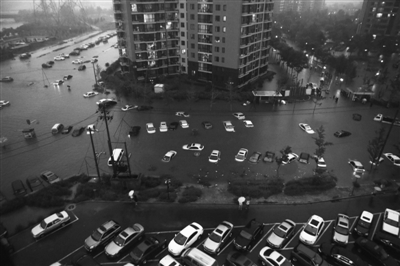
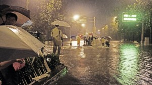

# ＜摇光＞不要总把具体问题泛政治化

**笔者说的”泛政治化“的含义，用我们中国人自己的成语来形容的话，我认为最合适的表达是——党同伐异，通俗的说，就是对不同的观点缺乏基本的包容，更谈不上去理解和尝试接受一点点那些让自己不愉快、不舒服的观点中的有益因素。这种现象在我们的舆论生活中，是广泛存在的，我们在网络上常见的诸如五毛、美分、带路、粪青等等等等的大帽子，就是这种“泛政治化”的党同伐异的最好注脚，这种泛政治化，才是今后中国有可能的更广泛的公众对公共事务的参与，也就是中国更加民主的最大的敌人。**

# 不要总把具体问题泛政治化

## 蒙镭（中国人民大学）

 

北京经历了罕见的大雨，情况大家都很清楚，就不多说了。

这次大雨，反应出了不少问题，比如市政排水系统的问题、城市内涝应急方案的问题等等。生活的城市出了问题，批评政府，是应该的。因为从契约关系上讲，市民是市政服务契约的权利人，而政府作为契约的另一方，有责任尽自己最大的可能把市政建设做得更好，避免类似自然灾害发生时，还会出现大问题。

每当有具体的问题出现的时候，总有一些所谓意见领袖跳出来，把具体的问题泛政治化，把需要各方携手解决的具体问题，简单地演化成官民对立、公私对立，比如，李姓公知又迫不及待地“点上了一支蜡烛”，不知道这支蜡烛能不能引导大家去思考如何解决城市内涝这一普遍的“城市病”，能不能让北京的市民在以后的大雨中，不受内涝之苦。

城市内涝，是所有巨型城市都存在的问题，不是中国独有的，因而和“体制”扯不上什么关系：进入21世纪以来，有名的国际大都市的内涝问题，就不下20次，远的有2001年的巴黎，2007年的柏林和伦敦，近的有2010年的东京、2011年的首尔。就在今年早些时候，纽约、悉尼、台北等城市，也饱受城市内涝之苦。

从地理环境上看，北京所处的燕赵平原，周围没有大江大河这样的天然排水渠道，这样的地理水文环境，决定了无论多么发达的排水设施，都无法在第一时间疏导由于海量雨水带来的积水。加上地势平坦，没有大江大河来吸纳这些积水，城市内涝从某种程度上讲，是无法根除的，现实的可能只能是减轻内涝带来的副作用。这也是都市作为一种现代生活方式带来的副产品。既然享受了现代都市生活带来的舒适和便捷，那么也必然需要承受都市生活的各种副产品，很不幸的是，大雨内涝就是其中之一，因此，端起碗来吃肉，放下碗来骂娘，是没什么意义的。

当然，这么说，并不是说不能因为城市内涝而批评和抱怨，批评和抱怨是基本的权利，政府作为公共服务提供者，也应当站出来承担应当承担的责任，并且尽可能的把公共服务做的更好。但是从昨天的情况看，并不能说北京市政府在此次事件中是完全缺位的。没有统一的调度和指挥，那些交警就不可能冒雨走上街头，民警、消防队员就不可能跳到几米深的积水里去救人，甚至为此丢掉自己宝贵的生命，没有新闻在六点半就发布的罕见的橙色暴雨预警，不明真相开车上街的人，恐怕会更多。至于那些在家敲键盘的北京朋友，没有一个人电话不通、网络不通、断水断电，你能在家里敲键盘骂政府操蛋、骂体制操蛋，本身就是公共服务没有缺位的证明。

对于昨天的大雨，我们有一千条一万条理由批评政府，但是我们也需要警惕当下任何公共事件都被泛政治化的倾向，因为一个具体的事件，如果总是这样被公知们简单的等同于官民矛盾和公私对抗的话，是无法让大家思考如何去解决这个客观的、具体的、在一定程度上甚至无法避免的问题的，泛政治化只会加剧对抗，造成更多的矛盾，制造更多的口水，结果就成为左边的骂批评体制的不对，右边的说政府体制是王八蛋，直至昨天那些感人的场景，那些为了别人牺牲自己的人，被淹没在对骂和口水当中，结果没把事情做好的政府，可以拿这些本不该牺牲的人玩边际效应已经递减到很严重程度的多难兴邦大爱无疆的游戏，而那些本来就对什么都不满的群体，则可以拿此事当子弹，从而赚取跟多的人气，更多的粉丝。

### 【后续】：

1、看到自己的一点随感被阅读、评论、分享那么多，受宠若惊。有很多朋友给了宝贵的回复，因为笔者也是个要工作讨生活的人，所以也没有那么多时间一一回复，所以就写一点事后的感想，供大家批评指正。

2、首先说一说“泛政治化”的意思，语言毕竟是抽象的，一个概念在不同的人眼里会有不同的、根据自己喜好来进行的解读，这是完全正常的。笔者认为的“泛政治化”，在很多回复中引起了一些一点都不让人意外的误读，泛政治化，不等于批评政府，批评公权，笔者提出的不能“泛政治化”的呼吁，绝不等于不能批评政府、指责政府，我们的体制本身就缺乏足够的监督和制衡，没有这种有时稍显过激的舆论制衡，公权必将更加傲慢和僵硬。笔者说的”泛政治化“的含义，用我们中国人自己的成语来形容的话，我认为最合适的表达是——党同伐异，通俗的说，就是对不同的观点缺乏基本的包容，更谈不上去理解和尝试接受一点点那些让自己不愉快、不舒服的观点中的有益因素。这种现象在我们的舆论生活中，是广泛存在的，我们在网络上常见的诸如五毛、美分、带路、粪青等等等等的大帽子，就是这种“泛政治化”的党同伐异的最好注脚，这种泛政治化，才是今后中国有可能的更广泛的公众对公共事务的参与，也就是中国更加民主的最大的敌人。

3、如果从政治观点上来说，笔者应该是一个标准的右派，是一个自由主义思想的坚定支持者。但是任何观念上的自由，能够落实到运转良好的体制，必须要求这个社会的大多数政治参与者能够对“异质思维”，也就是那些自己不喜欢、不认同的思想和行为（只要不违反法律规定）有由起码的包容。一看到自己不中意的观点和说法，就帽子横飞，口水四溅，什么叫“泛政治化”？这就叫泛政治化。如果让这些缺乏基本包容思想的人成为社会的主流，那么中国的未来，将会是灰暗的。

4、今天闲下来看了看回复，那些上来就给人扣一顶大帽子，然后一个劲儿喷口水、恨不得马上把笔者淹死的人，有多少人是认真地看了看文章的观点呢？无非是看到了一些自己不合意的观点，就开始了各种表演。这种行为背后的思维方式，和民主自由的理念，完全是百分之百不兼容的。笔者混迹中国网络多年，被扣过各种帽子，当过五毛，死过全家，也当过美分带路党，还当过网特，其实对这种扣帽子的玩法，已经基本免疫了。

就说这么多吧，认同的自然认同，惹谁不高兴了，就继续扣帽子喷吧。

 

（采编：黄理罡 责编：黄理罡）

 
