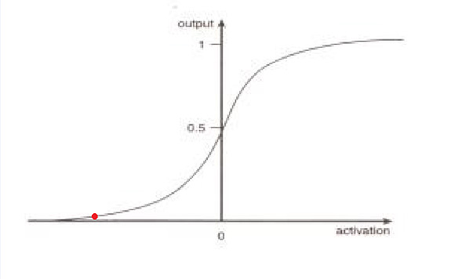

# ＜摇光＞不要让诅咒自我实现 ——写给悲观朋友们的一封信

**有时候在想，研究历史的秦晖、许纪霖都没有放弃，研究政治哲学的刘瑜、崔卫平都没有放弃，研究农 村问题的于建嵘都没有放弃，研究法制的蔡定剑、贺卫方、江平都没有放弃，研究经济的茅于轼都没有放弃，从体制中走出来的秦晓都没有放弃，体制内的温家宝、 辛子陵都没有放弃，奔走在维权一线的许志永、滕彪都没有放弃，致力于社会观察的笑蜀、熊培云都没有放弃，我们到底有什么资格妄下断言，中国是片被诅咒的土地？**

# 不要让诅咒自我实现

# ——写给悲观朋友们的一封信

## 徐超 （上海交通大学）

 “这是一片被诅咒的土地。”王虎兄在《[熊猫彩照不能](http://blog.renren.com/blog/240087520/725868687)》一文中如是说。 的确，在“体制绑架文化，文化反哺体制”的现状下，新华字典中那句“我们都有光明的未来”看起来就像痴人说梦。娱乐至死加1984，就像顾姗姗所说的，除了坐等天上掉下个李登辉，体制内出个戈尔巴乔夫，我们似乎看不到任何希望。我自己也悲观地认为，在我的有生之年里，我是等不到GFW被推倒那一天的。 我同悲观的朋友们一样，都不认同马克思的历史主义观点，所谓“历史大潮，浩浩荡荡。顺之者昌，逆之者亡”就如同宿命论一样，并非什么真理。所以，我不认为 这片土地最终一定能迎接自由的曙光，李大钊所说的“试看将来的环球，必是赤旗的世界”或许会像恐怖片中的贞子一样，从电视机里爬到现实中来。 但我认同秦晖老师的观点：历史是无法预言的。在结果到来之前，所有的乐观估计与悲观猜测，都没有什么意义。就像薛定谔的猫，在测量之前你永远无法知道它到底是活着，还是已死去。 

我之所以依然抱有希望，只是因为，预言是会自我实现的。当越来越多的人相信“这是一片被诅咒的土地”时，越来越多的人就会放弃努力，于是中国可能就真的失去改变的动力了，而诅咒的预言也就一语成谶。 事情的结果取决于人们的预期。就像当人们认为通胀即将来临的时候，通胀就会被制造出来。而要减缓通胀的脚步，就必须重建人们的信心。所以，我想劝告那些持 悲观态度的朋友们，结果如何我们无从得知，但是你每一次鼓吹“支那无解”，每一次成功地让又一个公民心灰意冷的时候，你们就又让这片土地往深渊中迈了一 步。从某种程度上说，是你们，在诅咒这片土地——虽然，我100%相信你们的动机不是那样的。 你们看起来言之凿凿的“无解论”，并不能经得起推敲。就像中世纪漫漫长夜中的欧洲人民，可能在梦里都无法想象文艺复兴的光辉吧；就像《柏林墙》的作者弗雷 德里克·泰勒，小时候也觉得这堵墙在他的有生之年里可能会一直矗立在那里。是的，我也无法证明，GFW最终一定会被推倒，你也无法证明一定不会。只要不是 100%的必死无疑，希望就一直存在。 

现实的黑暗，其实我们完全可以有另一种解释。社会的演进历程，可能就像这条逻辑斯蒂曲线，我们正处在红点所在的位置。在现在看来，社会演进的速度太 慢，以至于我们觉察不到。每当有改良派提出“日拱一卒”的时候，悲观党们便投来鄙夷的目光，似乎他们手握真理“改良是绝对不可能成功的”。但在我看来，你 努力去改良，便推动着社会往右发展；你要是悲观放弃，社会只能往左倒退。 有时候在想，研究历史的秦晖、许纪霖都没有放弃，研究政治哲学的刘瑜、崔卫平都没有放弃，研究农村问题的于建嵘都没有放弃，研究法制的蔡定剑、贺卫方、江平都没有放弃，研究经济的茅于轼都没有放弃，从体制中走出来的秦晓都没有放弃，体制内的温家宝、辛子陵都没有放弃，奔走在维权一线的许志永、滕彪都没有放 弃，致力于社会观察的笑蜀、熊培云都没有放弃，我们到底有什么资格妄下断言，中国是片被诅咒的土地？ 这不是乐观者的过度自信，只是我们认为，哪怕我们的努力一时并不能成功，我也不愿意用自己的双手将中国推入深渊。我不会诅咒自己的祖国。 最后，引用崔卫平老师的一段话：你所站立的那个地方，正是你的中国。你怎么样，中国便怎么样。你是什么，中国便是什么。你有光明，中国便不黑暗。 

 

（采编：安镜轩；责编：黄理罡）

