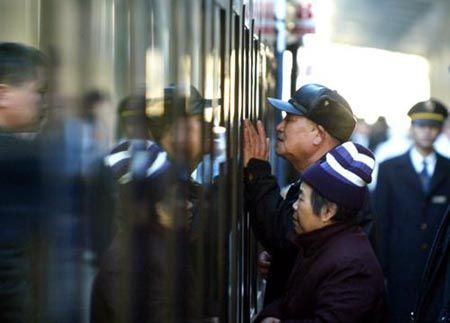
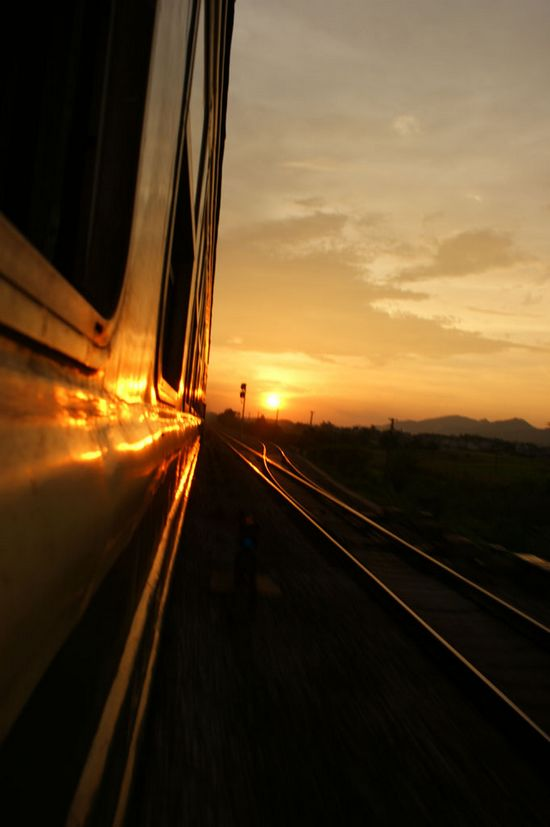
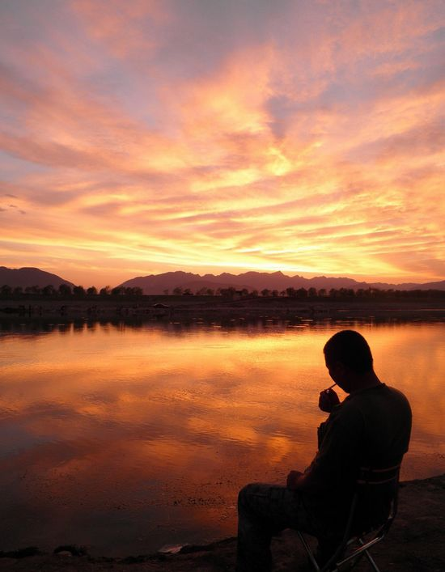

# ＜摇光＞且听车吟

**站台里还有火车汽笛高亢的呻吟着，以不知疲倦的姿态提醒人们，在无名的车厢里，上演着一幕幕的悲欢离合。**  

# 且听车吟

## 文/贾彬（西安财经学院）

 

刚刚整理好自己的铺位，脱下厚厚的棉服以适应卧铺车厢与车外迥异的温度，从铺位上麻利地跳下，好像在对外宣示着，自己的心情还算轻松。

“来，兄弟，帮咱……搭把手。”过道上一个刚上车的中年人气喘吁吁着。

“一、二……”

“这行李是挺沉的啊”，我帮他把一个大行李包扔到行李架上后说到。

“兄弟到哪啊？”

“西安，哥们儿也去西安？”

“我也到西安，但是得转去兰州，明天晚上到了后还得倒一趟车。”

恍然间觉得车厢里一片寂静，为了掩饰这寂静时特有的尴尬气氛，我把头自然地转向了窗外，无端的车站一角成为我转移注意力的对象，外面的建筑瞬间显得突兀又荒唐。我不知道此刻车厢里还有一个眼泪打着转的孩子和我做着同样的动作，我们视线的碰撞点是月台上两位蹒跚的老人，俨然两位老人已经哭的眼睛通红，但还在故作镇定地向车厢里的孩子招手，我听不见外边的声音，但老两口颤动的嘴角告诉我，是让自己的孙女保重。

如果说哭泣的声音可以感染情绪，那么一副眼圈中泪水打转的面相则倍加让人怜伤。

小女孩随着列车向后跑去，以试图缩减列车前驶的距离，终于，小女孩眼睛里停留的泪水还是划过了面颊，而老人也消失在我们的视线里。

我站起身，拿出上车前买的几罐啤酒和一些零食，边打开啤酒边把零食递给刚还在哭泣的小女孩，小女孩的父亲摇摇头，说：“谢谢兄弟，你吃吧，她吃不了，我是回族。”说完看他朝车厢另外一头走去，在售货车上也买了几罐啤酒回来，坐在我对面喝了起来。

车厢里又开始有了些喧闹的意味，我下面的两个对铺是一对情侣，在车窗边闲谈，手机里放着类似爱情买卖之类的歌曲，仿佛在诉说着感情在这个年代里的泛滥与缺失，而浑然不觉的情侣俩依然在忘情的缠绵，用实际行动来对抗歌词里的无病呻吟。坐在我旁边座位的是一个女学生，只是多了几分成熟女人的扮相。

打量了一圈人后，我喝了一口酒说：“你这是过年回家了吧，刚才在车站的是她爷爷奶奶吧？。”

中年男人和我碰了碰酒，“那是她姥姥和姥爷，我现在才是回家。”

我有些不明就里地问：“那她妈妈就是东北的了，刚才她还喊着妈妈呢，怎么车站没看见？”说完我就喝干了酒罐里剩下的最后一口酒。

中年男人好像被我问的有些不知所措，也和我同时打开另一罐啤酒，声音低沉的吞吐道：“她妈和我……离婚了。”

我这时才知道了车站上两位老人哭泣的另一层意义，一系列破碎的画面被串联了起来。心里想着，难怪刚才这个男人安慰女儿时说妈妈看病去了，要过段时间再回来。小女孩自然不会有任何怀疑，这善意的谎言很快让她破涕为笑。我虽然脑子里在快速联想与反应该怎么样缓解气氛，却还是木然的失语了。他见我没有说什么，可能明白这样的事情终究不好安慰，于是继续刚才的话继续说：“我们结婚十来年了，孩子都六岁了。”

“那，怎么又到了现在这个地步呢？”

“哎，当初在一起时……感觉一切……都好，就好像两个人……永远也不会分开一样。谁会想到现在……”男人叹息着。显然，他情绪有些激动，些许颤抖的手显露了他的局促不安，小女孩在一旁跑跳着，全然体会不了父亲的悲伤。窗户旁的情侣依然用手机放着伤啊、恋啊的时髦歌曲，总让人感觉有些不伦不类，旁边座位的女学生自顾自的摆弄着手机，不时传来几下笑声，让人推想这是沉浸在初恋里的青春少女。

“平常也喝一些酒？”我试图以这种插科打诨的问话来转移情绪。

“恩，虽然这也是穆斯林的忌讳，但是平常没什么事了也会喝点，无论自己还是和朋友。平常高兴了喝点酒助助兴，要是郁闷的话喝点酒解解闷，喝点酒呢情绪一高，喜欢那种感觉。”显然话题的转移还是有些作用。我也有些轻松地说：“我也一样，和宿舍的人，没事也常喝点啤酒，尤其和宿舍的一哥们儿，他也是回民。我们在大街上、在河边、在山里都喝过，喜欢那种刚喝点酒有点微晕的感觉，一起聊各种事。谈人生、谈理想、谈女人。”中年男人仿佛意会了这样的说法，不约而同地举起了酒罐，爽快的干了剩下的酒。“真的，要是火车上两日一夜没酒喝，就这么无聊的过，得多没劲。”中年人附和着开了另外一罐，顺便也帮我开了一罐。问道：“你能喝吧？”我倒没像平常一样，会调侃的说出自己的口头禅：“这不是跟骂人一样么”，但也是打趣地说：“即便不能喝也得陪哥们喝点啊，火车上遇到一样心性的朋友还是头一遭呢。”

餐盘里放了满满的一堆空啤酒罐。整整一个下午，就这样，一直喝着聊着。从爱情谈到了理想，从生活提到了社会。

躺在床上，有些翻来覆去，他也没睡吧？人这辈子在这样的时候又有谁能睡得着呢。不由想起自己的两次恋爱，突然觉得用那句世俗的“白天不懂夜的黑”来形容这境况甚是恰当。在迷迷糊糊中睡着了。

“你告诉他，我现在他妈的出差呢，等我回去，再他妈找他，妈的。”上铺传来清晰的电话声，剽悍的对白叫醒了我，掏出手机看看时间，发现该起床了。还没下床就看到了那哥们已经坐在那里了。

边系鞋带边问：“怎么样？睡着了没？”

“还可以吧，前半夜没怎么睡，在想事，幸亏喝点酒，睡的还能早点，早晨醒的早。”

我低着头快速地穿戴完，用凉水洗了个头。回到座位上默默地坐着，取出假期里带回家的几本杂志翻阅，就这样，磨着时间到了中午。

“再来几罐？”中年男人拿着刚买来的啤酒说到。

我点了点头。繁杂的思绪让我只是匆匆地望了他一眼，继而将视线移到了窗外。

“你看，窗外那么多人，走来走去，到头来是为了什么？”我不知道为何会有如此的感慨。或许一般人面对如此的发问会觉得我有些莫名其妙，但他却顺着我的理路来窥测自己：“自己能明白一些事情，但很多时候却无法与他人分享，他们也和我们一样满怀着追求和期望。但是，有些想法你懂的……”如此的会心让我们的谈话又重新开始。不免又转入了伤感且时断时续的交谈。

“就没有试图挽回么？”我不合时宜地抛出一句突兀的话。

“我也没办法，也恳求过，但都是徒劳。本来我想我们能够顶住层层阻力，能面对他人的不解和非议，像民族习惯、风俗饮食之类的差异相比于两个人能够在一起又算得了什么，就觉得怎么都得在一起，但是呢，也怪我。当初教她玩的游戏，却没想到……”男人有些哽咽。

我默不作声，他继续诉说着：“当初和她一起玩同一款游戏，她学会了之后，她自己又申请了一个账号，我也不清楚她怎么就认识了另外一个人，再后来我知道了，看到了一些聊天记录，她可能……又有了另外的感情了。昨晚上我们聊了一宿，她和我说了很多，我希望理性一点，但拗不过她，她要离婚……”说着说着男人有些语无伦次。

也许他希望我能明白他的感受，看着我说：“她说离婚后，再结婚就找个有房有车的男人。”我似乎经不起这样的眼神，有气没力的回答道：“是社会变了还是人心变了？最寒心的不是你和她，是年迈的老人和年幼的孩子！”不知道这样的话语激起了他怎样的思考，但我能明白，他也有他的父母，他先前曾和我讲他和妻子在东北开饭馆，平时也并不怎么回兰州，除非家里有事或者逢年过节之类的。

“我觉得，作为一个男人，现在是我这辈子活的最窝囊的时候。”

我不知道该用怎样的话语来形容当时的感觉，就独自的喝了一大口酒作为一种情感上的补偿。

“哎，其实吧，想想也不算什么事情，过去了可能就没事了，啥事还能过不去呢？”

我知道在人难受的时刻自己会以从容而洒脱的话来开导自己，尽管于事无补。但咽泪装欢却更让人心酸。

“咱聊点开心的，呵呵……那边的情侣一直在放歌，你喜欢听歌不？呵呵……”我问出后才发觉自己的笑有多么做作和尴尬。“恩，音乐常听，但一般不听这些情情爱爱的歌，觉得没什么意思，我爱听些老歌，尤其是Beyond、谭咏麟、张国荣啊。”听到这些字眼我更觉得想法有些靠近了，男人在喝酒的时候动情往往就是不住地举杯，更巧的就是两个人心照不宣的不断同时举起。

“平时也爱看看电影什么的，喜欢那些朴实一点的，喜欢那个叫贾……柯……樟吧？先前看了他新排的《Hello，树先生》，虽然开始看有些懵，但看了几遍觉得里面的意味很深刻、刻画很到位。”

“贾樟柯，我也一样啊 。”表面平静的回应，却掩饰不住交谈的喜悦，丝毫没有因为他叫错贾樟柯的名字而对其有所保留，而是对一个中年人了解贾樟柯而觉得诧异，因为我周围的同学有很多都没有听过贾樟柯。

“旅客朋友们，前方到站是终点站——西安车站……”广播里漫出播音员清脆的声音，打断了我浑浊的思路。大家开始无序的取各种行李。

我没有和他说，这是我唯一一次觉得火车上的时间是短暂而非漫长。

收拾行李的时候，“同学，我这里有好几个包，你帮我拿一个吧。谢谢啊。”同城的女大学女生不知道什么时候换了一套衣服。我微笑着拎起自己的包和她的箱子没有说太多的话朝车门走去，往后看了看中年朋友，他不慌不忙的拎起那个其实不大的行李包，领着小女孩被人群簇拥着向另一边的车门走去，我不知为什么，好像眼圈里面有东西在打着转，打着转……

大踏步的走出车站，车站口一个年轻男子接过我手里的箱子陪着这位潮女向人堆里涌去。

站台里还有火车汽笛高亢的呻吟着，以不知疲倦的姿态提醒人们，在无名的车厢里，上演着一幕幕的悲欢离合。

 

（采编：徐海星 ；责编：黄理罡）

 
