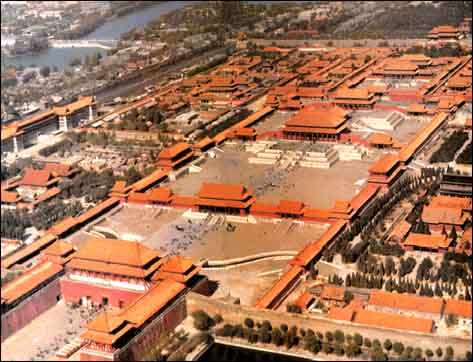

# ＜摇光＞且论“崖山之后”

** “中华”从来都是一个发展而变化着的概念，而绝不是狭隘的血统上的传承。据《国语•晋语八》记载“昔成王盟诸侯于岐阳，楚为荆蛮，置茅蕝，设望表，与鲜卑守燎。” 至少在西周时候，楚国还是个蛮邦，与鲜卑同列。到了春秋末、战国初他们就成为了华夏的一员，总没有人说屈原因为血统不纯正，就不是中国人，《楚辞》是异族的文化成果吧？**

# 且论“崖山之后”

## 文/ 周圣哲(北京大学)

 

好像越来越多的人在叫嚣着“崖山之后无中华”。也许本人理性思维能力有限，从逻辑上实在很难理解他们想表达什么。

崖山之后无中华。

我且退一步，蒙元、满清都不算作是中华。那么大明王朝是什么？朱元璋是异族？于谦、张居正是野蛮人？王阳明、李贽、顾炎武、黄宗羲、王夫之他们就不是中华文明的成果？我们现在这些自诩为华夏神明之胄，讲着“百善孝为先”的家伙又算什么！？文化上已经被亡族灭种的可怜虫？这种身份，至少我无意领受。当然，如果某些人硬要自认正被异文明奴役着的文化上的亡国奴，人各有志，那么且让他们继续被奴役着，不得强求。

且先谈谈一个实在忍不住想要批判的论点：“不单单是我这么说，日本人都这么说。”

这作为一个学术观点确实是日本京都大学著名史学家内藤湖南先生提出来的，可是他什么时候能够代表“日本人”这么一个大的群体了？可以负责任的说，持此论者可以去日本做一份问卷调查，100个人中如果有一个听说过崖山是什么地方，我有充分理由怀疑他要么到那旅游过要么是历史系博士修的还是中国古代史专业。不是每个日本人都有铃木杏里的历史知识水平的！

进入正题。

首先考察什么是中华。

大概，在多数中国人的历史观中，最为强盛的中华正统王朝是大唐。而我想指出的重点是：李世民他们家从血统上来说，全是鲜卑后裔，正宗的鞑子。

看看李世民他爸妈，往高了算，就算他是二分之一的汉人血统，到了李治怎么也只剩下四分之一了吧。举例来说，大概在太宗初期，李世民曾经要把一个公主嫁给姓崔的，博陵崔还是清河崔记不清了。得到的回复是：“不行”，理由是：“你们是鞑子后裔，而我们是华夏正统。”可是，那又怎样，堂堂的千年豪门在后来不还是要去抱人大腿，甚至以色娱人，还是男色。而后人们有谁会说，从公元618年开始到908年，将近三百年间，中华文明受尽了异族野蛮的李唐王朝的摧残？好像那些自认文化亡国奴的家伙们还无比憧憬向往着强盛的大唐。似乎，只能吐槽说，有些家伙历史功底实在太烂。

再往上溯，西晋五胡乱华之后，正统王朝搬到了南方，而最后，统一中国的却是隋。这是一个北方王朝，从北周来，北周从西魏，西魏从北魏，全是鲜卑王朝。我就奇怪了，怎么没有人说589年陈朝被隋灭掉以后，中华文明就已经终结？

于是，妄自揣度那些讲“崖山之后无中华”的家伙们如果讲话也还讲究逻辑的话，那么这句话只能是异族征服对中华文明是一种极大摧残的激烈修辞表达。

咱不妨先考察一下一个怎样的王朝能够算在中华文明的范畴之内。如前所述，如果把李唐算作中华文明的话，那么血统不重要，重要的是一种文化认同。李世民他们家当了皇帝以后，讲的是汉语，尊的是中华文明的圣人，把自己的祖宗追封皇帝追到了老子那，拜的不是嘎仙洞。那么即算他们的血脉中流淌的是鲜卑人血液，那又怎样？

“中华”从来都是一个发展而变化着的概念，而绝不是狭隘的血统上的传承。据《国语•晋语八》记载“昔成王盟诸侯于岐阳，楚为荆蛮，置茅蕝，设望表，与鲜卑守燎。” 至少在西周时候，楚国还是个蛮邦，与鲜卑同列。到了春秋末、战国初他们就成为了华夏的一员，总没有人说屈原因为血统不纯正，就不是中国人，《楚辞》是异族的文化成果吧？

那么，同样的道理，五胡乱华之后，匈奴王刘聪自称是刘备之后，满清王朝尤其在后期，所有语言都变成了汉语，乾隆他们都拜的是炎帝陵，自认为炎黄子孙。我们又何必一厢情愿的自认为是被异族人蹂躏着。

还是讨论一下人们开始反思异族征服的逻辑关系。似乎我们可以看出这样的逻辑链条：1、日本人对中国的侵略造成了我们的深重灾难，是民族的耻辱；2、满清、蒙元等异族的入侵似乎跟日本的入侵差不多；3、于是历史上所有的异族入侵都是中华文明的灾难。

这么可笑的逻辑居然能够骗过那么多人？文明的灾难不是通过看似有逻辑的推理演绎来的，而是就在那里的历史事实！在那个时代，是灾难就是灾难，跟后人的逻辑推演哪有半毛钱关系。

看是否灾难该看的是这次入侵对文明的冲击程度，损失程度而不是是否是异族入侵。换言之，在那样一个时代，异族入侵与农民起义实质上来说能有多大差别？从兴起的史实上来说，黄巢、张献忠这类人对摧残中华文明所作的贡献至少不会比满清要小。

清末以前没有“民族主义”这种奇怪甚至到有些畸形的狭隘东西。以今天的民族主义去套宋末、明末的历史，就像欧阳修修《五代史》时硬要把冯道说成是佞臣一般可笑而无知（用这两个词似乎不那么妥当，也许换成“别有用心”更贴切一点）。

也许，现在已经被“民族主义”洗脑而历史功底又不是那么好的天朝子民们实在无法想象没有这个怪胎之前人们的生活状态。我只知道，哪怕是在异族的统治之下，我的祖辈们世世代代活了下来，作为一个讲究“子不言父过”的传统儒家信徒，实在不大懂那些说着“崖山之后无中华”的人们是否是在指责自己的祖辈都是孬种、亡国奴。

现在已经说明了血统不是是否中华文明的标准。那么我想，那些持“崖山之后无中华”此论者一个重要论据大概是：清王朝260多年的统治造成了中华文明发展的停滞。这点，确为事实，无可否认。而我只想指出的是，大明崩溃之后崛起的任何一个王朝，不论民族，只要他的建立者有足够智慧与能力的话，就一定会造成中华文明发展的停滞。

首先，清王朝确实压抑了中华文明思想、科技上的发展。昨天又翻了一遍《明夷待访录》，以今天的角度来说，甚至可以把它看做资产阶级民主派崛起的政治宣言。科技上，晚明出现了中国古代社会最高科技成果《天工开物》。而在思想上、科技上洋务运动之前，大清再也停滞不前。更有甚者，我们现在的《天工开物》是日语翻译本：这些东西在大清是禁书。

到这里，重要的是探究清王朝压抑科技、社会发展的理由是什么而不是一味的谴责。初清的统治者不是傻子，不会一时冲动就开始损人不利己地搞文字狱。

很简单，因为他们看到商业的发达、科技的进步带来了一个完全等级崩坏、自由思想弥漫，不断要求更大政治权利的晚明市民阶层，这帮人居然还要求要实相权虚君权，反了你！于是从经济基础上压制这帮家伙的成长，压制科技进步、压制商业发展、压制思想自由，才有爱新觉罗家江山的万万年。

可是，问题是，这和是否异族有什么关系？！只要是一个要保自己子孙江山稳固的家伙就要做的。现在给不少人吹捧得直追秦皇汉武的明太祖朱元璋甚至还要禁《孟子》，只是因为孟子说：“君之视臣如手足，则臣视君如腹心；君之视臣如犬马，则臣视君如国人；君之视臣如土芥，则臣视君如寇仇。”后来士大夫反抗太激烈，换了个办法，像现在天朝删减《泰坦尼克号》一般剜去了《孟子》当中的思想毒瘤。

再说，大清是中国历史上煌煌几千年当中唯一一个有效而长期稳定地控制着外蒙、新疆、西藏甚至东北、台湾的王朝。若有异议者不妨拿中国历史上的地图和当年大清王朝的疆域比比，所谓英明神武、开疆拓土，为今天的中华民族奠定基业，对于爱新觉罗家再高的评价也不过分。

附带吐槽一句，大清朝的皇帝比明朝皇帝整体素质实在高多了。汉唐的皇帝不好当，偷点懒说不定会挂的，宋以后的皇帝实在不是个技术活。明朝皇帝就实在有点奇葩，几十年不上朝那是常事，全国上下到处去玩最后莫名其妙死了的有，全身心炼丹飞升的有，硬要当木匠的有，打仗太菜被俘最后又给放回来搞政变的有，就是少有正常一点的。清朝史学家赵翼都曾经感慨“不知主德如此，何以尚能延此百六七十年之天下而不遽失，诚不可解也。”

从皇太极直到雍正、乾隆，不得不承认，这样一个本只是屈居白山黑水之间民族的崛起绝不是偶然，他们表现出来的深刻战略眼光、政治智慧怎能是那些只知道“争国本”还一争十几年的家伙们能够想象。

怪只能怪清朝的皇帝太能干，进入近代以后君主太能干似乎不是啥好事。大英帝国的责任内阁制建立的基础是斯图亚特王朝末代君主安妮女王的无作为、汉诺威王朝满口德语不懂英语的乔治一世、乔治二世的贪图享乐。宣称“朕即国家”的路易十四时期太过辉煌，那么大革命、路易十六给送上断头台就似乎成了必然。

扯远了，只是想说明朝崩溃之后任意一个王朝都会压制社会与思想进步，与是否异族八竿子打不着，要怪只能怪清朝皇帝太勤快，偷点懒，说不定那帮市民阶层还是会崛起的。

再退一万步说，那些指责着异族统治的家伙们怎么看身边早已从血缘、文化上完全无法分开的少数民族。或者阴谋论一点说，这帮家伙们是否实际上是在以大汉族主义为名义谴责异族统治的时候，在为某些以反抗民族压迫为幌子谋取分裂国家者寻求思想支撑？！其心可诛，其行可诛！！

最后很想感慨，前段时间看到有人在传希特勒说过“不需要让青少年有判断力和批判力···只要给他们···”。如果历史功底实在有待改善，自以为是的青年们就自以为知道了些什么，又不经理性思考，用所谓的判断力和批判力接受“崖山之后无中华”这种危险而不负责任荒谬思想的话，那么确实还是不要有思想比较好。

 

（采编：应宁康；责编：陈锴）

 
