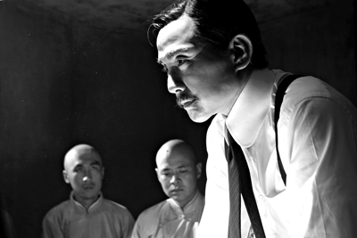
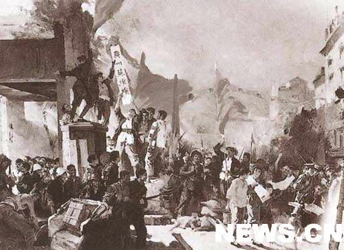
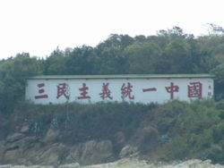

# ＜摇光＞丧家狗孙中山：民主与统一的悖论

**举国所弃之时，俄国人收留了他，孙中山真成了一条“丧家狗”。和俄国人的合作，产生了两个结果，一个是共产党，一个是国民党，两者都学习列宁式政党的组织方式，建立党军，其实就是党政军高度集权化的思路。孙中山从“三民主义”走向“集权主义”，正是近代中国“统一压倒民主”的时势使然，是他“国家自由”观的具体体现。这种手段与理念的张力，时时在孙中山心中萦绕，挥之不去。**  

# 丧家狗孙中山：民主与统一的悖论

## 张亮（北京大学）

 

今年国庆，天安门照例是万人攒动，天安门正中高悬的毛泽东画像，目光直视前方，稍显孤独。

毛目光所尽，是一张“国父”孙中山的巨幅画像。国庆60周年时，这两个共和国的缔造者就是这么冷峻的互相对视。 民国以来，无论蒋或者毛，这两位迷信杰出人物统治论的政治强人，一直认为自己党的事业，包括自己的事业，都是孙中山衣钵的传人，中山陵一直是海峡两岸共同的政治祭坛。

于是，当辛亥革命百周年到来之际，关注这位中国华盛顿的思想源头，似乎是纪念辛亥年的题中应有之义。

孙文，十足的洋派。虽然有个名字叫“文”，却还有中山樵、孙逸仙博士、孙大炮、国父等等正号、外号、绰号。。。

孙先生的一生，是光荣的一生，伟大的一生，无比正确的一生。他是个十足的民主派，你看他的五权宪法、三民主义，不正是脱胎于美国的经典宪政模式——三权分立吗？孟德斯鸠似乎不会完全理解他。孙先生认为，立法、行政、司法是间接民权，他更中意的是直接民权——考试权和弹劾权，民众直接参与行政，直接监督官员。考试权决定政府公务员考试任用，类似于科举制度的延续，监察权则是国民党的党内监督，类似于中国传统政治中的台谏制度。孙中山的务实可见一斑，他不搞真正的三权分立，而是搞五权宪法，是要把传统中国社会的两种政治形态整合进现代中国。两千年前，孔子有感于周人礼乐制度的完备，感叹到：周监于二代，郁郁乎文哉，吾从周！ 自幼看了孙先生的理想蓝图，我又禁不住要高呼：郁郁乎文哉，吾从孙！

然而，伟大的理想的无比正确的孙先生，自从第一次广州起义起，一直到病逝于天津，他的革命理想总是如镜中月，水中花。近代中国，正如李泽厚的著名论断，往往是救亡压倒启蒙，自由或者民主往往只是达致救亡的工具。那么就“中国的华盛顿”而言，到底他是一个民主派，还是统一派？在他心底里，统一和民主，他更看重谁？一边是中华民国的国父，高举自由、民主、平等大旗，一边又大搞“党化”，甚至个人崇拜，与黄兴、陶成章等革命老同志龃龉不断，孙先生在中国近代史上举足轻重，却又扑朔迷离。

我们都知道孙中山著名的“三民主义”，其中根基是“民权主义”。但是我们往往不知道，孙中山在这篇著名的演讲稿里，所讲的“民权”并非是争个人的政治自由，而是争国家的政治自由。他认为，欧洲现代国家组织形式完备，国家力量强大，所以首先争的是个人自由，而中国晚近以来，恰恰是国家力量萎靡，民族精神萎靡，一盘散沙。此种情形下，只有强调“国家自由”，才能攥紧拳头，集中力量，争国家的自由。为此，我们甚至要不惜牺牲自己的个人自由。

抛开孙中山对“政治自由”的定义不论，这种定义当然与洛克密尔这些盎格鲁撒克逊思想家强调的“政治自由”大相径庭，他们的“政治自由”出发点，一定是个人自由。但孙的定义与1814年德国“自由观”却不谋而合，同样面对外敌的入侵，普鲁士要与欧洲最强大的军事力量拿破仑对抗，并完成民族统一，中国要面临西方列强的侵占与凌辱，重新完成国家统一与民族独立。相似情形下，无论德国的费希特，还是中国的孙中山，都喊出了“争国家的自由就是争你们个人的自由”的时代声音。

所以，孙中山死后，国民党和共产党虽然立刻分裂，但都各自宣称继承了孙的遗志。姑且不论国民党执行孙之遗愿如何，“反帝反封建”的旗帜却始终不倒。1927年的国共内斗，胜利者是蒋介石，他排斥了汪派，架空了胡汉民，使得军人力量在国民党内超过了党政势力。他武装镇压了共产党，跟毛泽东一样，他是真信枪杆子里出政权。身为黄埔军校校长，国民党军事精英培训基地的核心人物，孙中山求国家自由的旗帜交到了他的手中，变成了以武力求统一。

孙中山的前半生，是求民主的一生，身为一个无官无职，空有一身凌云志的江洋大盗，在满清统治下，所谓的“统一”和“稳定”在他眼中一文不值。早年，青年孙文曾经维新派名士王韬引荐，见过李鸿章，却未能引起他的注意。甲午中国战败，举国喧哗，孙却认为是天赐良机，乘机在广州谋反。孙亲自领导过七次反清起义，主要依靠的都是会党和土匪，惠州起义甚至准备去投靠台湾的日本总督，要求接济枪械未果。至于与日本浪人组织黑龙会的深厚交谊，则是广为人知，同盟会的成立仪式正是在黑龙会东京总部举行。二次革命其实孙中山领导的一场国民党叛乱，失败之余，全国舆论指责，孙与黄兴、李烈钧均仓皇逃亡日本。

孙最早在国内是被称做江洋大盗的，那个时候他不怕天下大乱，他要把中国生生的推倒了重新整修过，“驱逐鞑虏，恢复中华”，建立一个汉人的天下。这个时期的孙，其思想是“民主压倒统一”。为了建立一个理想的自由民主的共和国，孙不惜天下大乱，甚至不惜频频向觊觎中国的列强求援，这也是像梁启超这样的立宪党人始终与孙为敌的原因。

然而奇怪的是，这个时期的革命党，并不把宣传“民主”作为他们的工作重点。在日本的同盟会机关报，着重的宣传重点是“排满革命”。他们说，汉人本来是极有活力的，只是由于腐败的满人控制政权，使我们汉人学习西方，自强不息的精神给扼杀了，来维持他们满人少数族裔的集权统治。

这一招是很毒的，这是要釜底抽薪，把满清架空了在火上烤——不管你是不是支持宪政改革，只要你这个满人的朝廷还在，就是四万万汉人的耻辱，满清就应该被推翻。所以，尽管朝廷也在搞新政，革命党一概斥之为“欺骗”，理论基础就在于政权是满人的，不是汉人的，“非我族类，其心必异”。明末鼎革以来，这种“排满”的种族革命思想就潜伏汉人士子心中，到清末，革命党以章太炎倡导最力。

孙先生这时候想的，不完全是要搞民主，确切的说，是要搞汉人的民主，或者更明白的说，是要依靠同盟会来搞民主。所以，甘于冒着被斥责为“乱党”的骂名，也要把那皇帝老儿拉于马下。

满人果真是腐败透顶了，让武汉新军抓住了机会，而孙中山也抓住机会，做了第一任临时大总统，成了国父。

孙中山的这个临时大总统得来侥幸，虽说是革命先行者，可正想他回国时说的那样：他没给革命带回来一分钱，只带回来革命的精神。据说武昌起义的消息刚传到美国时，孙中山正在餐馆里洗盘子，他的朋友拿着报纸一边冲进来一边喊：“逸仙，别洗盘子了，回国当大总统去！”

孙中山的大总统看似的来侥幸，可是，毕竟三十万革命军不能只靠革命精神过日子，无钱无军的孙文和革命党最终向老袁妥协。孙向自由民主的老师，西方列强们求援，但列强们表面“局外旁观”，其实却要求中国保持稳定和统一，怎么才能稳定统一？革命党那几条枪是不行的，北洋陆军是当时中国，甚至也是近代中国最强大的一支陆军，老袁是他们的大王，所以列强，除了日本之外，都把宝压在老袁身上。近代以来，日本一直是希望中国分裂的，以便火中取栗，趁火打劫。

本来，中国的事情，谁掌握了军队，谁就能左右政局，关键是掌握军队的人有没有向民主靠拢的意愿。老袁一开初，也还兴致勃勃要搞宪政，要做中国的“华盛顿”。可惜他想错了，华盛顿已经有人做过了，他首先连议会都无法成为多数，连中央政府都是国民党的人，他老袁搞政党政治搞不过国民党，眼看要被架空。国民党的几个省的都督，江西的李烈钧，广东的胡汉民等，也早虎视眈眈，与各地实力军阀勾结，觊觎总统与国会权力。卧榻之侧，岂荣他人酣睡。袁项城被称作“奸雄”，若为“统一”故，自然要拿起枪杆子，有些奸雄的姿态。 后来的事情，大家都清楚，国民党的代理老大宋教仁被刺杀，当时舆论几乎一边倒，说是老袁杀了宋。那么老袁以总统身份要求法院审理，查出来是自己的心腹赵秉钧。本来这个时候按照法律完全可以继续审理下去，到底是不是老袁在幕后主使呢？唐德刚在《袁氏当国》里面说，这案子有几分像尼克松的“水门事件”，老大未见得知道事情真相，手下人会错意，捅出漏子，结果老大不得不出来给手下擦屁股。这个事情如果在美国，完全可以按法律办，该弹劾就弹劾，该罢免就罢免，可是在民国初年的中国，却非的兵戎相见。

孙中山大发雷霆，认定是老袁害了宋，电招国民党都督，秘密反袁。孙在这个时候的旗帜仍然是“民主压倒统一”，但是袁世凯此时尚未正式解散国会，“宋案”本身也未水落石出，袁世凯充其量是破坏共和的嫌疑犯，并未是人人得而诛之的大祸首。因此，孙中山一手导演的“二次革命”不得人心，也就势所必然。我想问的是，孙在当时政府里是什么职位呢？他有什么资格”电招国民党都督“商议反对民国政府的大总统？在法律手段没有用尽的时候，你就号召大家搞分裂，似乎，正是革命党的积习做遂。梁启超早在1909年陈述君主立宪为当务之急，就指出，若是革命倡行，则中国将是“乱暴派”的天下，而这个“乱暴派”，就是指他最大的政敌国民党。

孙已经不是“民主压倒统一”，而是“党见压倒民主”了。所以，连黄兴都差点因为动兵的事情和他闹翻。

可惜的是，孙的个人魅力压过了理性，国民党都督仓促举旗，被老袁的军队打得土崩瓦解。

“二次革命”失败，国民党土崩瓦解，孙又走上逃亡老路。这时候，他的“民主旗号”虚张的同时，”统一“的旗号正式高举。在日本成立的个人崇拜的”中华革命党。遭到黄兴、汪兆铭等元老集体抵制，孙的理想似乎接近破灭。

真是峰回路转，原本害怕统一的西南军阀看上了”孙大炮“这张王牌，伸出了援助之手，而孙，也堂而皇之登上一个分裂的地方割据政权的”元首“宝座。不到半数的国会议员组成的参议院合法吗？没关系，就叫非常国会，而孙，也就理所当然的成了”非常大总统“。

到这个时候，原本以民主为旗帜的孙打出了”北伐“的旗号。何谓”北伐“？诸葛亮征讨汉贼是北伐，是要”兴复汉室，还于旧都“，是以汉室正统自居的地方政权的虚张声势。那么这个时候的孙，他的旗号就是打着”统一“旗号的分裂了。 为了他这个统一的目的，西南两广的军阀都无法忍受，都觉得他是在做梦，而后来他的部下陈炯明干脆倒戈。单靠孙自己，他的”武力统一“的梦想是无论如何无法实现的。

于是，他开始企求西方。原本以为欧美是自己的老师和朋友的孙，万万没想到遭到了言辞拒绝。美国广州领事拒绝向孙的广州政府提供海关银，不承认孙的政府的合法性。甚至在广州”商团暴动“时，英国人公然支持商团。

孙终于“出离愤怒”了，当国际国内空前孤立时，他想到了苏俄，这个同样是四面受敌的”国际孤儿“。苏俄本来对孙兴趣不大，只是在与北京政府谈判受阻时候，才想到了孙。孙正式做为一个国中之国的代表与苏俄签定协议——“孙文越飞宣言”，承认外蒙古被苏军占领的现状，换来苏苏俄的支持。

这个时候，孙的”民主理想“已经丢到九霄云外。为了寻求支持，在日本抛出二十一条的时候，孙就已经主动向日本承诺，只要日本支持自己，比二十一条还要苛刻的条件都可以答应。可惜日本看不上孙文那点小势力，给予拒绝。

就这样，在遭到欧美抛弃后，为了实现“武力统一”的理想，孙主动投向近代中国最大的敌人日本和俄国的怀抱。

“统一压倒了民主”，当孙慷慨激昂批判北京政府的不法时，却没有想过自己的合法性。内战，似乎从来就不是他想避免的。

美国著名汉学家史扶邻在称孙为“勉为其难的革命家”。是的，孙是矛盾的，他亲自出生入死，参与缔造的共和国，却并未完全体现他的民主理念，甚至出现了倒退。

那么孙的办法是什么呢？他把革命党继续党化，把党军合一，党政合一，军队，成了革命的灵魂，民主，不过成了一个口号。

近代中国军人政治的风气在孙学习俄国的“党军”政治后达到高潮。从这一点说，在他逝去的日子里，中国两大军事政治集团的长期鏖战，都是对他“武力统一”思想的继承。

其实，孙是很聪明的，在他病逝前前往天津途中时，有两件事情值得回味。一是中途路过日本，发表了《大亚细亚主义》的演讲。虽然继承了他一贯“媚日”的作风，大谈中日友好，称日本是亚洲的龙头，黄人要团结起来对抗欧美，但同时，也委婉的提到了日本对中国的侵略。认为正因为中日是兄弟之国，所以日本对中国的侵略才尤其让中国人感到耻辱和不可理解。可惜，日本人并未能很好的理解孙的这翻话语。

如果说孙的这翻话语还梢显委婉，那么他在天津病重期间对前来探望的张学良的嘱咐就十分直白：你们东北夹在红白两大帝国主义之间，你们东北的年轻人要小心。

孙走了，他临终留下的遗言“革命尚未成功，同志仍须努力”，成了见人见智的理解，国共两党都在从中吸取政治和思想资源，中国历史，在以后的日子里，沿着孙的“武力统一”的思路继续前进。

孙到底是一个理想主义者，还是一个披着理想主义外衣的实用主义者，我们不得而知。但是一边被人戏称“孙大炮”，一边却又在许多关键时刻灵活到令人嗔目结舌的政治运作，不能不让人感叹他性格的复杂面相。终其一生，他都在为革命奔走，却几乎处处碰壁，时时失败，几成丧家之狗。直到晚年，对西方列强绝望，依靠俄国人之力，才能振臂一呼。虽然俄国人向孙中山妥协，在孙文越飞宣言中，明确表示“中国不适合共产主义”，孙中山内心的挣扎与矛盾仍然是剧烈的。孙中山本身不信任共产主义，却只有苏俄向他伸出橄榄枝。一个是被国际社会，华盛顿条约体系孤立的孤儿赤色俄国，一个是被国内军阀排挤，无兵无钱的孙大炮，二者的眉来眼去，情投意合，符合孙中山一贯的实用主义态度。举国所弃之时，俄国人收留了他，孙中山真成了一条“丧家狗”。和俄国人的合作，产生了两个结果，一个是共产党，一个是国民党，两者都学习列宁式政党的组织方式，建立党军，其实就是党政军高度集权化的思路。孙中山从“三民主义”走向“集权主义”，正是近代中国“统一压倒民主”的时势使然，是他“国家自由”观的具体体现。这种手段与理念的张力，时时在孙中山心中萦绕，挥之不去。张学良回忆，他临死时告诫自己，东北要小心日本俄国，一个白色一个红色帝国主义，应是符合其内心所感。孙中山一生都生活在矛盾中，甚至给人一种左右摇摆之感。实用的主义，急刻的性格，固执的党见，使这个民主的巨人朝着另一条道路偏斜。民主与共和真的只有国民党可以领导吗？当现实政治不尽如人意时，是在法制的规范内寻求解决，还是纷纷揭竿而起？一个脆弱的共和国，一个孙亲自缔造的共和国，是否是缺乏了“民主婴儿”应得的善意的哺育和过多的苛责呢？

那么，当硝烟早已散尽的今天，辛亥革命百年之际，当代中国人，重新面对这个当年孙文所面对的命题时，是否又是一个新的悖论？

原文地址：[http://blog.renren.com/blog/305460099/768050718](http://blog.renren.com/blog/305460099/768050718)

 

（采编：管思聪；责编：管思聪）

 
