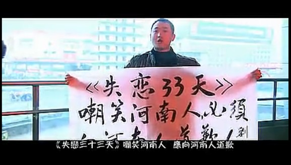

# ＜摇光＞中国人歧视河南人，和欧洲人歧视犹太人是一回事吗？

**所以即便河南出现小偷、骗子的概率不比他省高，但是仅仅因为它的人口多，那么多数人碰到的小偷、骗子中最多的还会是河南人。于是就会逐渐形成这样一种文化。这种文化和我们觉得上海人洋气——其实就是其拥有现代文明生活素质，是一样的道理。** **如果没有这样的信息反馈，那么就会出现对所有人一样的信息审核，结果就是所有人都面临河南人遇到的情况。因此即便没有“河南人”这个概念，那么也会有“四川人”作为替代概念取代它。** 

# 中国人歧视河南人，

# 和欧洲人歧视犹太人是一回事吗？

## 文/邓辉（安徽大学）

 

今天早上我转发李硕一条评论，如下：

**“歧视不但是人类社会的常态，而且是基本人权。不许歧视跟1984里面的thoughtcrime没有任何区别。”** 

我加上评语如下：

**“嗯，只要不是制度性强制歧视（其存在也有理由），个人对他人的歧视也是自由。我就很歧视智力低、不学习又骂别人学习好的傻逼！”** 

关于“歧视”我已经多次讲过了，在旧文《跑路与希特勒的意淫》（http://blog.renren.com/blog/242943260/777543730）中我就说过资本主义是如何消除歧视的，也提到了贝克尔，所以某些关于歧视的常识我是知道的。。因此我在自己的转载评论中加了一句“只要不是制度强制性歧视”。

从诺斯以后，新古典制度学派眼中的制度就开始与大众眼中的不同了。在诺斯的著作里，他把宗教、道德、意识形态等等也归为了“制度”，都是“institution”。后来在林毅夫的博士论文中，他把我们常说的制度称为“正式制度安排”，而把宗教、道德、意识形态等等称为“非正式制度安排”。

正式制度安排和非正式制度安排的区分点，在于前者有固定的强制性常设规范机构人员，而后者没有。前者有警察、法院、城管维护，而后者只有你的亲戚、朋友、父母监督，前者固定区域内人所受的监督群体是一样的，而后者不一样。

为什么非正式制度安排没有规范性常设机构人员呢？原因在于监督者对前者相比于对后者更容易进行测量与执行，而且前者强制执行的受益更高。

比如我们会把防止盗窃的盗窃罪会列为正式制度安排，而把撒谎不会列为正式制度安排。因为保护财产免受盗窃带来的受益，足以使每个被保护者们都愿意出一定的资金资养活一个专门抓小偷的机构（个人）。

而对于撒谎，一方面别人撒谎对自己带来的损害有限；另一方面由于信息传输中的“噪音”是必然存在的，你很难鉴定对方到底是撒谎，还是你自己获取信息能力与信息传输本身的问题，于是很难对“撒谎”进行界定。因此，我们不会花钱雇人保护自己不被别人欺骗，请注意不是“诈骗”。

可是不论是诚实还是守信，都可以对经济带来效率，所以这种维护经济效率的行为早早的就被列入道德——主要通过行为者自身的内心进行约束。

当我们明白正式制度安排与非正式制度安排两者的根本区别不在于“是否约束”，而是在是于“是否强制约束”之后，我们就会明白它们存在的本质都是为了维护效率。当然，所谓的“效率”在某些平等主义者看来是违反道德的，比如歧视妇女。但是在古代，如果不歧视妇女以减少人口出生率，那么在马尔萨斯困境之下，我们就只能通过农民战争引来的大屠杀消灭多余的人口，以带来其他幸存者生活下去的效率：结果其实就是为了消除一种不人道，带来一种更不人道的方式。

不可否认，制度带来的效率并不是被每个人平均分享的，所以很多制度是由少数人制定与维护的。不过需要注意的一点是，既然这种效率是被少数人所享受的，那么多数人根本就不会遵守这种制度，因为他们执行这个约束没有受益；所以为了使多数人遵守这种制度，那么此种制度肯定是强制性的“正式制度安排”——对非受益者进行惩罚。

这种常见的少数人受益的歧视制度，就是欧洲长时间的歧视犹太人的制度。作为没有国土而流浪的的“巴比伦之囚”，在19世纪以前欧洲所有国家都是不允许犹太人拥有土地的。因为如果犹太人可以购买土地，那么现在的土地价格必然上涨，结果就是当地兼并土地的贵族利益受损。同时，借宗教之口，欧洲国家，包括英国，都长时间对犹太人从事的高利贷行业实行强制规范。这样宗教贵族与世俗政权就可以轻而易举地利用道义剥夺犹太人的财产，而“贫民”又可以获得“低利率”的贷款。

这些歧视都是少数人受益的歧视，也就是贝克尔在其博士论文《歧视的经济学分析》中，应用经济学原理解释的现象：减少竞争，使得相关产业受到保护。当然也存在所有人“受益”关于歧视的正式制度安排，那就是关税制度和移民政策限制制度。这两种制度都是国与国之间的，而一国之内并不会存在。

我们常常说的“砍省”、“上海人歧视外地人”、“河南骗子”等现象，都不是正式制度安排，所以它们的产生原因，必然在于实施者所有人都可以从此制度获得受益。前段时间，常远曾经著文说外省人歧视河南人的现象，并说自己不会因此神经过敏。我觉得他十分聪明，为什么呢？

因为外地人歧视河南人的原因在于“河南骗子多”。至于这个“多”是指概率高，还是总量大，值得分析。但是不论如何，解决这个问题本身，就是在于每个河南人认认真真、踏踏实实地做工作；仅仅感情用事地吼两声，那是没用的。这是由于产生这个问题的原因在于“信息的反馈效应”。

我们平时在和陌生人打交道时，都要判断对方的人品、素质等方面，不然自己可能受骗。可是判断人品是需要时间和精力的，如何简单地判断一个人呢？答案就是通过检验其对你的第一印象、他的户籍所在地以及长相等等。这里的第一印象特别重要，这会形成“晕轮效应”或者“首因效应”。

所以即便河南出现小偷、骗子的概率不比他省高，但是仅仅因为它的人口多，那么多数人碰到的小偷、骗子中最多的还会是河南人。于是就会逐渐形成这样一种文化。这种文化和我们觉得上海人洋气——其实就是其拥有现代文明生活素质，是一样的道理。

如果没有这样的信息反馈，那么就会出现对所有人一样的信息审核，结果就是所有人都面临河南人遇到的情况。因此即便没有“河南人”这个概念，那么也会有“四川人”作为替代概念取代它。

同时大脑也是模块化的记人、记事，这是大脑神经记忆储存信息的方式造成的。类似于我们记撒切尔的脸时，我们只会注意她的眼睛和鼻子这些易记得模块。这是大脑有效率快速记忆，与去除无用信息的必然结果。小偷、骗子河南人出现的次数比较多，那么人的大脑神经就会对“河南”反应得更强烈与敏感。于是提到小偷、骗子时，我们就会条件反射地首先想到他们。这一点，不敢说对与错，但是这是无法改变的。

我们要明白强制性的歧视其实往往是限制竞争，对多数人是坏的结果，所以黑奴制是错的；但是某些非强制的歧视，即便它有些违反人道的意味，但是它是维护效率的——往往是次优选择，防止更差的情况出现。

 

（采编：麦静；责编：麦静）

 
