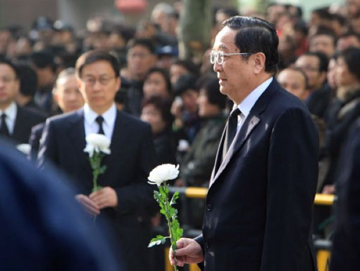

# ＜摇光＞为什么人大不能搬出北京市？

**现在对人大法大这样的高校而言，很难。“迁离北京”事实上意味着解除学校对权力的“人身依附”。学校的迁移也好，企业总部的迁移也好，都是这个道理。当中国的政府权力一手遮天的时候，接近权力就意味着拥有一切。首都的功能分散就是无源之水无本之末。**  

# 为什么人大不能搬出北京市？

## 文/ 元淦恭（中国人民大学）

 

由于通州区委书记在“两会”上再提人大通州校区的事情，这一事件再度成为人大学生关注的焦点，昨天笔者写了[《天要下雨娘要嫁人》](http://blog.renren.com/blog/251347137/811574655?frommyblog)，表达了对这件事的基本态度，就是不赞成人大把本科生发配到通州，但是已经没有任何方法可以挽回，所以“天要下雨，娘要嫁人”，随他去吧。

#### 海淀区是中国的文化中心

笔者不赞成人大把主校区搬到通州，主要原因是因为海淀区，尤其是中关村、海淀黄庄两个地铁站周围的区域，是整个中国的文化中心。在这个区域，无论人大，还是北大清华，甚至于是新东方，都已经成为构成中国大陆这一文化高地的不可分割的组成部分。

人大并不是一个只有九百多亩的狭小校园，而是生长在北京西北部这片文化沃土之上的一棵大树，你在任何其他地方播种，都难以复制这里的土壤。

海淀有什么？海淀有北大、清华，有万圣书园，有许多的文人聚会、私人沙龙，有丰富多元的讲座和论坛。这些东西，早就不只是属于某一个大学，某一个群体，而是属于北京海淀的全体学生，属于这里每一个热爱文化，热爱求知的人。如果人民大学的本科生迁离了海淀区，就迁离了中国最有文化的高地，这种搬迁才是对人民大学地位低下的自我承认。“对不起，我没有地了，中关村留给你们，我去通州了”。

说得难听一点，现在人大虽然综合实力和北大清华相去甚远，至少还可以以“我们在北大旁边”自居，如果真的哪一天搬了，实际上就成了一种“自我放逐”。

#### 搬到通州不会太坏

本科生搬到通州去之后，会怎么样呢？

笔者当然不认为本科生搬到通州人民大学就万劫不复，但是也不能赞同那种，搬到通州可以“开创新局”的观点。有人说，原来海淀很偏僻，但是海淀早已形成了高校的集群，民国的时代，燕大和清华对峙，便给这里留下丰厚文脉，而1949年以后高校群集的态势，是从那时候开始的传统的自然延续。为什么当初人大西郊校区要选址在双榆树？就是因为这里本身已经有的文化积淀。

反观人大将要迁去的通州，一所像样的大学都没有。如果说要搬到昌平与法大为邻，也算是“呼朋引伴”，你搬到通州去，就成了自娱自乐。所谓“鱼儿离不开水”，人民大学离不开海淀这一汪清泉，搬到一个工商业新区去，这就使其历史发生了割裂。

有人说，以后通州会发展得很快，进城也会很方便。笔者并不否认。但是，通州发展得再快，进城在方便，通州与海淀相隔甚远，将来人大的本科生只能偏居通州一隅，参加市内学术活动，与其他学校学生的交流机会，势必大大减少。海淀区过去因为文化繁荣，长期就是中国思想活跃，政治气氛活泼的地域，也是每次地方人大选举运动最热闹的所在，你搬到通州去，这样的事情都会同人大学生无缘。

厦门大学建了漳州校区。当年厦门PX事件的时候，厦大就搞停开渡船，免得漳校学生到岛上串联。以笔者之愚见，人大、法大这样的学校，把本科生从市区都搬出去，恐怕也有维稳的需要。你们都住在荒郊野外，量你要搞学潮，你也进不来。

甚至可以说，全国的大学城，都有这个功效。把大学生弄得远离城市，美其名曰是可以“静心学习”，实际上是方便管理。北京最需要搬到郊外去的大学，就是人大和法大，政府是早有计划的。由于人大和法大是北京以人文社科为主（北师大是综合性大学，有大量的理学）的院校当中最强大的两个，而且长期以来因为法学、政治学、新闻学等学科的传统，使得这两个学校的反骨比较强，双反分子很多，在那一年的夏天，这两个学校的学生冲锋陷阵的比例也很高，这都让当局感到心有余悸，这才是有关部门希望这两个学校的本科生搬到郊外去的一个“难言之隐”吧。

有人说，搬到通州不会影响人大学生从事实习，笔者基本同意。虽然相对于在海淀，在通州的学生去实习肯定不太方便。但总体来说，对学生的影响不会太大。该进城实习的照样得进城。

#### 学校在郊外好不好？

笔者个人认为，大学生实习不能说没有必要，但是大量的实习和兼职，恐怕也并不符合大学教育的初衷。

实事求是地说，一般的学科在郊外，甚至到山野，并不是什么太不好的事情。过去中国就讲究在依山傍水的地方建书院，以修身养性，专心治学，就是为了远离尘世浮嚣。所以说起来，如果海淀的学校都搬到密云延庆去，也不是不可以。

但不同的学科有不同的特点，如果是钻故纸堆，或是埋首于实验室，在城里诱惑太多，反而没有什么好处。但要是社会科学，那就不能远离城市。为什么华盛顿大学的政治学在全美享有盛誉，就是因为它地处首都嘛。所以说，北京什么高校都可以搬到郊外去，人大、法大、中财和外经贸这几所学校，是特别不宜迁离城市中心的。

#### 人大地位会下降吗？

人民大学现在这个地位，不算高，也不算太低。在现行的政治经济体制不发生根本性变化的情况下，人大的现有地位不会再有太大的波动了。

本科生部迁到通州，对招生的实质性影响不会太大。而且说实话，现在高考前填志愿的人，很多也没有把一个学校的校区问题搞得多清楚。但是对于到通州的学生来说，确实非常不好。因为人大还保留了一个海淀校区，未来人大的绝大多数老师还要继续在海淀生活。迁到通州之后，本科生和教师的交流会变得更加困难。大量的学术活动可能还在海淀校区进行，本科生参加人大校内的，和海淀区其它学校的讲座、学术交流等等都会受到很大的限制，这对人大本科生的成长当然是极其不利的。

但是，人大只要保留海淀校区，老师的生活不会发生质的变化，师资也不会发生多么严重的流失（如果不在同时面临其他问题的话），而且做帝王师也好，上电视也好，参加各种会议当公知意领也罢，也不会受到多大影响。

所以嘛，这件事只是苦了本科生而已（只不过还同时改善了本科生的居住条件和物质生活水平）。反正在我国，高校从来都不是以学生为中心的，更不是以本科生为中心的。

#### 高校分布之不合理

笔者在[《天要下雨娘要嫁人》](http://blog.renren.com/blog/251347137/811574655?frommyblog)中说，人大这样的学校与其迁到郊区，不如迁出北京。但事实上，人大不可能迁出北京。原因也不单单是人大教师已有的既得利益和北京市民的诉求这么简单。

当下中国存在着一个很大的矛盾，就是高等教育资源布局和经济格局之间的不契合。一些城市的经济实力远远不足以吸纳这个城市的大学毕业生，譬如南京、武汉、成都、西安、合肥等等，都是如此。另一方面，一些城市的经济实力极为强大，但却没有足够多的高等教育资源，譬如苏州、深圳。

具体到三大经济区——京津冀、长三角、珠三角，很明显的一个趋势是京津的高等教育资源远远超过了后两者。北京、天津985高校毕业生的数量和质量与京津经济总量之比，远远要大于长三角和珠三角，也就是京津的人力资本要比长三角、珠三角丰富得多。最后的结果，事实上也导致长三角和珠三角的经济结构相对于北京要差得多，对出口加工业非常依赖。珠三角和苏锡常等地，在高端人才上确实是存在一定程度的短缺，至少是远远不如北京有优势。

张千帆写过一篇文章，叫《勿因歧视加剧歧视》。这两个“歧视”，其实是两种不同类型的“歧视”。第一种歧视源于大城市的特权，实际上就是京沪这两个城市所获得的政策同其他城市大不同，实际上是“地域歧视”，即对京沪以外的地区本身的歧视。后一种歧视，则是对京沪以外地区的居民的歧视，是“人的歧视”，因为这些地区本身经济发展水平不够，这些居民才流入京沪，但是现在还要对这些居民加以歧视。京沪以外地区发展不如京沪的原因本身就是京沪的特权所致【有人会说1949年以前上海没有特权也是大都市，但笔者需要强调的是现在的上海已经不是当时的上海，当前上海经济中国有、统制色彩非常浓厚，和1949年以前的情形不可比，这是另一个问题，在此不展开】，就是因为其他地区被京沪歧视，你还要不让人家进来拥有公民权利，当然是不合理的。

高校的问题，实际上有因也有果。高校在不同地区之间的分布情况，既是政府地域歧视政策的结果，又可能是导致新的地域歧视的原因。

有新闻系的学生说，如果人大迁出北京，新闻系学生怎么办？这个问题问得很到位。确实，现在北京的媒体资源，要远远多于上海和珠三角。上海媒体和南方媒体不能说水平低，但是就媒体发育的规模，和媒体的层次来说，上海和广东都远远不能和北京相比。而且以上海、广东为总部的媒体，也大都在北京有强大的采编团队。网易、腾讯总部都在广东，但网易和腾讯的网站内容基本上也都是在北京制作的。

事实上这种现象，本身就是各种资源高度集中于北京的结果，如果说中国的高校、研究机构和一些重要的产业本身都不在北京，那么在长三角和珠三角完全可以形成新的传媒中心。民国时，天津的《大公报》、上海的《申报》不是都不在首都吗？民国时期的文化、传媒、艺术和信息中心并没有集中在首都，甚至于可以说，南京从来就没有成为过文化、传媒和艺术的中心。

#### 根在政府的资源垄断

所以，问题的根在北京的资源垄断，而北京的资源垄断之根，又在政府的权力垄断。

在1949年以后的中国，始终没有形成独立于政府之外的学术力量。虽然说人大、法大等以社会科学为主的高校，也确实有一些坚持真理的学者，也培养出一些有良知的不犬儒的学生，但不能改变整个中国学术界总体上高度依附于政府的现状。中国的科研也好，社会科学课题也好，受到政府力量的干预太深，他们必须和政府之间，和官员之间建立一些联系。这是非北京而不能的。

又由于中国的政府力量和国有经济力量强，和民间经济力量弱，所以导致北京的第三产业的发达程度远远超过了其他城市，所以使得高校教师也喜欢北京这样的环境，他们可以在这样的环境下得到更多的表达空间，得到更多“挣外快”的机会。

高校作为人力资本的聚集地，本身需要一定的集群效应。所以牛津大学也是几十个学校合成的整体嘛。北京的高校集群效应是全国其他城市不可比的。武汉、南京的好大学不少，但是整个规模还是不够大，而且加上城市经济基础不太好，所以没有办法把这么多学生hold住。

现在要说搬，搬到深圳苏州行不行？行。但是不能某一个高校自己搬，得想办法让许多高校都搬。如果深圳和苏州这样的新兴城市，能够成为优质大学聚集之地，那么这些城市的产业结构也会发生很大的变化。原来一些媒体，一些研究机构，一些NGO组织必须要在北京，它完全可能随着高校的搬迁，而随之转移到其他城市，从而使得北京的资源分配到其他城市去。如果真的把北京的资源由多个城市相对均匀地接纳，而非某个学校孤零零地搬走（像中科大一样），就完全可以形成搬到另一个地方的高校和那个地方之间形成共赢的局面。

但是，这种共赢实际上实现不了。如果明天人大真的搬到深圳去，没有其他学校接招，最后的结果就是人大自己在深圳被晾起来了。不管深圳怎样捧人大，人大还是无法获得她在北京的那种资源和机会。你一个学校在那里，可能经管类的学生会有不少机会，但是学法学学新闻的学生确实就可能遇到很大的瓶颈和问题。因为在北京城市拥有巨大特权的情况下，要让既有的经济文化资源离开北京，不是件容易的事。

现在对人大法大这样的高校而言，很难。“迁离北京”事实上意味着解除学校对权力的“人身依附”。学校的迁移也好，企业总部的迁移也好，都是这个道理。当中国的政府权力一手遮天的时候，接近权力就意味着拥有一切。首都的功能分散就是无源之水无本之末。

现在你要说让北京的经济文化资源以条块状整体搬迁出去，对整个国家的经济发展，区域协调，乃至于对南方一些地区的经济转型都是很有好处的，但是没有可行性。政治体制这个根子不改，人大就算搬到密云延庆去，也跳不出北京市这个如来佛手掌心。

 

（采编：陈锴；责编：陈锴）

 
