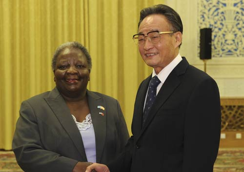

# ＜摇光＞为什么他们都说腐败好？

**贝克尔认为人们犯罪的时候会权衡利弊，如果犯罪带来的收益大于成本，那么他就会犯罪。官员当然也不例外，因为官员也是人。于是遏制官员的腐败有两种方法，一是减少官员的腐败收益，二是提高官员的腐败成本。**  

# 为什么他们都说腐败好？

## 文/邓辉（安徽大学）

 

估计文艺青年都读过林达的那套《近距离看美国》丛书，因此对汉密尔顿与杰佛逊就国债问题达成协议——确定美国迁都华盛顿的故事应该都不陌生。不过我最早知道此故事是读弗里德曼的那篇《贿赂的用途》。由于某些朋友可能不知道此故事，所以下面我就简单说一下故事的梗概。

美国独立战争的时候，美国政府连正儿八经的政府结构都没有，所以征税是个问题；而由于独立的过程中政府没有稳定的税收收入，所以军队的军饷就是一个棘手的问题，因此解决的一个办法就是给士兵们发债券。但是美国独立后很长一段时间，美国中央政府与其说是一个政府，不如说是一个类似于欧盟议会的机构；而由于中央政府的权利过小，所以政府兑现当年独立战争时政府发放给士兵与国外的那些战争债券就变得是遥遥无期了。

后来经过费城制宪会议，美国各州同意建立一个联合统一且较以前强有力的政府——美利坚合众国，而后来成为合众国第一任财长的汉密尔顿提出的第一个政府议案就是中央政府把战时国债兑现了。现在大部分历史学家都非常肯定汉密尔顿提出的这项议案，因为它确立了美国政府在本国百姓与他国人们心中的信用，为以后美国的经济发展建立了良好的政府信誉基础。

但是这个政策却在当时包含争议：因为正如前文所说，在美国独立后相当长的时间里，独立战争中那些浴血奋战的战士们——最初持有国债的那些人，早就觉得这些国债是废纸，于是低价处理给了其他人。因此如果简单的根据每个人手中国债的数量兑现国债，就会出现一个值得思考的问题：最应该得到补偿的那些老兵并没有得到补偿，反而是那些“奸商”获利了。

因此当看到汉密尔顿提出政府归还国债的方案后，杰弗逊是反对的，他在想有没有一个更好、更人道、更公平的国债兑现方案。不过杰弗逊没有执拗下去，因为很快汉密尔顿提出了一个诱人的条件：如果杰弗逊同意这个国债兑现方案，那么汉密尔顿及其伙伴将支持国会通过一个美国政府建都方案——把合众国的新首都建在离杰弗逊的家乡——弗吉尼亚近点儿的地方。

而汉密尔顿及其伙伴为什么非要通过这条法案呢？也许汉密尔顿本人仅仅是因为坚持自己的经济思想，因为他并没有从此议案中直接受益，但是他议会中的伙伴们（包括他的亲兄弟）肯定有人坐收渔翁之利：在议会的64名议员中，有29名是债卷的持有者。

这个故事估计很多人都知道，所以我补充一个类似的故事，不过故事的发生地是在博茨瓦纳。非洲，特别是撒哈拉以南的非洲，基本就是地狱的代名词，而那里为数不多的亮点就有一个叫做博茨瓦纳的国家。与南非大部分处于温带不同，博茨瓦纳基本属于热带，它的成功，是对地理决定论的一记重拳。虽然它的成功相比于某些东亚国家的发展还有些差距，但是相比于那些1998年人均GDP510美元的黑非洲同胞们来说，同年博茨瓦纳3070美元的年人均GDP收入已经算足够成功了。

博茨瓦纳经济发展有一点儿很中国特别像，那就是政府对基础设施的投入占GDP的比重非常高。而政府过多的涉入经济活动，必然会给官员带来过多的腐败机会。因此在博茨瓦纳独立的初期，政府在农业、特别是养牛业的基础设施方面投入巨大，且国家也垄断着牛的屠宰与销售环节，于是养牛行业在博茨瓦纳收入颇丰。而值得注意的是，此时在博茨瓦纳的议会中有三分之二的议员拥有的财富与牛相关。显然博茨瓦纳政府在养牛产业的投入巨大，有以权谋私的嫌疑。

不论是汉密尔顿的国债兑现政策，还是博茨瓦纳的农业基础设施政策，议会推动这些政策都或多或少有些腐败的嫌疑；不过很多年后，人们还是对这些政策本身的评价持积极正面看法的。当然在此之中，官员们主观上、甚至行为上都有腐败的嫌疑，可是政策的好坏与官员主观的好坏是两个完全不同的问题。类似于你妈妈急着催你结婚，你母亲主观上可能的好的，但是这个行为本身的好坏又要看你的评价。

所以如何评价中国腐败的关键不是在于官员本身的腐败，因为官员腐败这个主观行为肯定的非法与不道德的；而问题的关键在于如何评价这些腐败诱发的政策是好政策，还是坏政策。最典型的例子就是如何评价国家对联通牌照的发放问题。

在中国，只有一家公司拥有所有电信行业所有领域的牌照——从移动通信、固定通话到网络连接，那就是中国联通。可是联通的产生原因在于上个世纪90年代初军队为了赚钱——这肯定是一个腐败的理由，可是如何评价这个政策本身呢？显然开放电信市场，允许更多的厂商进入，对于促进竞争，保护消费者的权利，联通的产生在政策层面上是一个好政策。

正是因为腐败行为人的主观想法和客观政策结果是两回事，所以许多经济学家才会提出腐败有利于中国的经济发展的观点，这其中就包括了樊纲、张曙光、张维迎。也恰恰是因为大众混淆了主观与客观不同，而腐败行为人的主观想法肯定都是非法与不道德的，所以这些经济学家的论点被舆论狂批。

很多人以为“腐败有利于经济的发展”的论点，是那些“中国主流经济学家”原创的混蛋思想；其实不然，红朝的经济学家有何德何能，会提出如此原创的思想呢？他们至多篡改篡改“破窗理论”提出洪水与地震有助于扩大内需，而提出腐败与经济发展关系原创思想的肯定另有他人，比如上文提到的弗里德曼。

不过弗里德曼关于腐败的文章比较少，他的学生贝克尔对此方面的论述颇多。贝克尔认为人们犯罪的时候会权衡利弊，如果犯罪带来的收益大于成本，那么他就会犯罪。官员当然也不例外，因为官员也是人。于是遏制官员的腐败有两种方法，一是减少官员的腐败收益，二是提高官员的腐败成本。后者往往被大众重视，比如要求舆论监督、民主改革、媒体开放，这些政策不过是提高了官员腐败成本的期望——官员腐败被捕的概率提高了。苏联解体后的俄罗斯，它的民主化进程、媒体自由化程度都比大陆强了太多，但是它的全球腐败程度排名却高于中国（2011年全球各国贪污感知指数中国排名世界75，俄罗斯排名世界143）。因此减少腐败也要从减少官员收益的监督着手。

说到减少政府腐败的收益，这时就不得不提两个经济学家了，他们同时分别创立了寻租学说，为如何减少官员腐败的受益提供了理论依据：其中一位叫塔洛克（图洛克），另一位叫安妮·克鲁格（她的书很难买到）。他们俩认为政府对经济的干预，使得市场的供给或者需求曲线产生了移动，市场价格的变化带来租金，为官员带来了腐败的机会。因此减少官员腐败受益的方法就是市场化。这里不得不说一个事实，那就是大众对苏联休克疗法后俄罗斯的市场化持反面评价态度。其实俄罗斯的市场化指数很低，它的全球市场化排名是144，而中国是138，这也和前面提到的两国腐败指数排名相呼应。（相关文章可以参看逸纷的[文章](http://blog.renren.com/blog/441397518/808721999)）

由于政府对需求曲线的干预，往往以公平作为借口，比如对教育、医药、客运火车票市场的干预，本文不想在此问题上纠缠，所以只说政府对供给曲线的干预。政府对供给曲线的干预常见有两种常见手段：一是产业保护政策，比如对汽车行业的补贴、关税保护等等；二是行业准入政策，比如政府对发放钢铁、电解铝企业牌照时的最低产量要求。哪些企业产业可以享受补贴？哪些外资企业的产品被允许进口？国内哪些企业有技术生产资质？这些都是官员说了算，因此这两种政策为政府官员提供了无数的腐败机会。

同时这两种政策往往是相互关联、相伴相生的。在发展中国家，由于政府的财力有限，且往往处于城乡二元经济发展阶段，或者劳动力密集型产业发展阶段，政府财力只能补助数个大型重工业厂商，于是政府会限定产业的准入门槛，以补助少量的厂商。补贴那些厂商，自然是官员说了算，其中必然有巨大的腐败空间。而这也就是拉美病、印度病问题的根源。这类政策在拉美叫做“进口替代政策”，类似于中国的保护民族品牌与国家战略行业政策。

这两种政策都是促使行业的供给曲线向左上方移动，也就是减少供给，使得商品的价格奇高而质量巨差。它们对经济的发展自然是有百害而无一利，但是只有这种促使供给曲线向左上方移动的腐败类型吗？当然不是，比如前文提到的联通案例，它就是促使行业的供给曲线向右下方移动，增加了市场的供给。可是官员们为什么会同意减少管制或准入门槛，让供给曲线向右下放移动呢？

此原因和拉弗曲线的原理类似。如果大家读过曼昆的《微观经济学》，一定会记得里根当年减少税收的一个想法：减少税收使得供给增加，而供给的增加又会促进税收总额的增加，所以政府降低税率也许会增加政府的税收。于是里根根据此想法，推行新的经济政策，并成功的促进了美国经济的增长，为克林顿时期美国政府的税收收入增加奠定了基础。同样的道理，官员们接受潜在厂商的贿赂，同意新的厂商加入设限的行业，在一定情况下可能会增加官员的收入。因为新的厂商的加入会使得产品的价格下降，产品价格的下降带来的消费者收入效应的变化（实际收入的增加），而此又会使得需求曲线产生变化，导致整个产品市场的扩大，最终产品市场的扩大又会导致市场租金的增加。所以官员腐败种类与次数的减少，可能反而会促进腐败总额的增加。

许多政治学家对中国政府的腐败持悲观态度，预测中国经济会因腐败而走向悲剧。这些预测后来往往成为笑谈，原因就是在于腐败导致的政策好坏是分种类的，如果要预测腐败对中国经济的影响，必须要分清楚各种腐败占腐败总数的系数，与各种腐败对经济增长的影响系数。吴敬琏，这位被称为经济学家的良心的学者，多次提出中国政府要建设社会主义法制市场经济，不然中国经济的增长难以为继，他的论述同样欠缺实证研究的基础。

如果中国的腐败以促进供给曲线向右下方移动种类为主，那么结果自然是经济在增长，腐败在加剧——涉及寻租的资金总额在加大。所以主流经济学家说腐败在促进中国的经济增长，他们口中的腐败应该仅仅指的是这种促使市场供给曲线向右下方移动的寻租腐败。其他种类的腐败，特别是司法腐败，对经济增长与社会发展应该是有害的。

市场化与法制、甚至民主化的推进，孰先孰后，哪种顺序更优、更有利于社会公平，是个有趣的问题，但是这里就不多讲了。本文要说的是，1978年前的中国的市场经济犹如患有恶心肿瘤的晚期病人，此时也许只有砒霜才能治病（有没有其他解药，值得讨论）。不过今天的中国脱离晚期了吗？我想许多行业，比如银行业，可能还需要砒霜的医治；所以中国经济的增长，与腐败的相伴相生还会持续一段时间吧。

（采编：尹桑 责编：尹桑）

 
