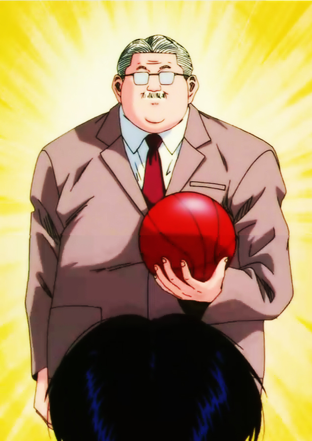
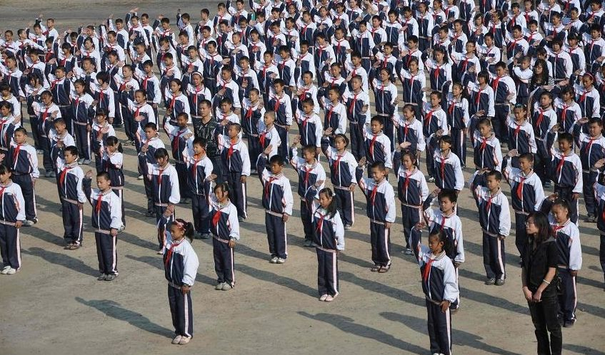
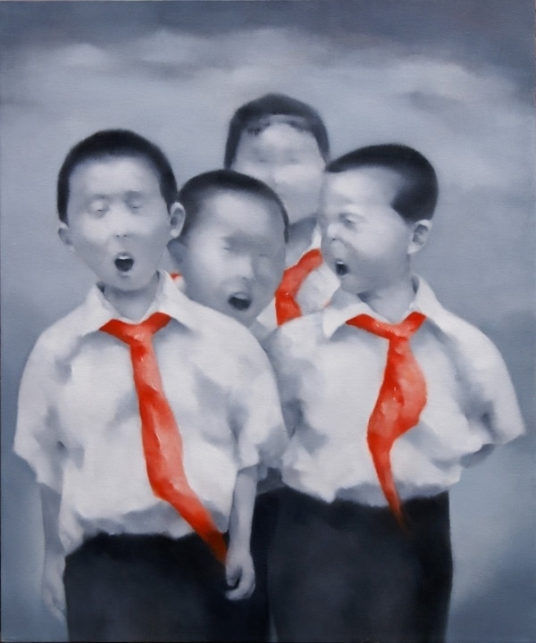

# ＜摇光＞为啥老子要欺负黄艺博，因为我想到了小学的时光

**老师问我对这篇课文有什么感想。我仔细想了想，回答说：共产党绝对死了不少人。老师听了勃然大怒，怒斥不对，说应该想到了大无 畏的革命精神。之后痛斥我上课走神，问题胡乱回答。之后，我被罚站都下课。我觉得，在那个时候，我已经开始分是非黑白了，14岁的黄同学，也应该分。**  

# 为啥老子要欺负黄艺博，因为我想到了小学的时光

## 文 / 王斐弘（北京电影学院）

  一看黄艺博的新闻，我不禁大骂一声：我操，傻逼的雷锋又出来了！不是么？把所有的钱捐给老大妈，天天只看ccav的《新闻联播》，上网从来不想着玩游戏，只想着关心民生，整天意淫中国称霸世界，对了，还跟雷锋一样，喜欢到处拍照留念。 我就爱欺负这个小混蛋。为啥？因为这种老师眼里的乖宝宝，共产主义旗帜下的花朵太装腔作势，太官僚主义，太2，从小看见这种2货就烦。 记得是小学那会儿，我在家吃着妙脆角，含着钻石糖，在那里玩《合金弹头2》，我母亲开完家长会，回到家，对这本人各种责备：你看人家###，人家大队委，次次考双百，你看人家努力学习，再看看你天天玩电脑 balabalabal~ 一顿唠叨，然后把电脑的电源线拔下来，带走了。悲剧呀！我的合金2已经final mission了，马上就通了TT 从此以后，我特别怕我妈去开家长会，我也特别怕周围某个小朋友去综艺类节目，每次回来以后，我妈总是跟我说，你看人家谁谁谁的孩子，弹钢琴弹得多好，人家一吃晚饭就弹钢琴，一弹就弹四个小时，再看看你，弹琴弹半个小时，就坐不住了。 也是，我那个时候天生没耐性，弹钢琴最多坐半个小时，空闲时间，要么去看闲书，要么去玩电脑，要么就骑着自行车在经济学院里乱晃悠，当时流行《四驱小子》，我们几个兄弟都给自己的自行车命名，他的叫三角剑，我的叫急速眼镜蛇。看电视看什么？专说假话的《新闻联播》？那是扯淡，那个时候，《灌篮高手》可比《新闻联播》的收视率高。 

 扯远了。接着说。 在小学那会儿，我总有一个敌人，叫“人家那孩子”，人家那孩子天天考双百，人家那孩子从来不玩游戏，人家那孩子就只知道学习，人家那孩子从来不要零花钱，人家那孩子有了压岁钱从来都交给家长，人家那孩子有三道杠。 我刚好相反，我天生不爱上数学，数学课上就看闲书；我就喜欢玩游戏，玩红警玩英雄无敌玩古墓丽影，顺便打个生化危机；我就想要零花钱，因为妙脆角 钻石糖 无花果神马的，真的很好吃；有了压岁钱我绝对不会交给家长，因为给了他们，就再也要不回来了，我还想要雷速登，想要奥迪双钻，想要火眼金睛呢。 一句话，违背“快乐原则”的事情，人家那孩子都喜欢干。怎么自虐，人家那孩子就喜欢怎么干。怎么能获得乐趣，人家那孩子偏偏不这么干。 记着《8 9点钟的太阳》里有一个桥段：一个红卫兵，说自己就喜欢看国民党反动派跳舞，因为觉得女特务身材好。当时觉得思想肮脏，后来才知道，这叫性压抑。 我们的童年，何尝不是一个“性压抑”的年代呢？受到的教育，都是压抑人性的教育，都是违背快乐原则的教育。原本应该属于自己的快乐原则，就好像电影里的“肮脏思想”一样，被压抑着。 不错，你有受虐的自由，你也有从4岁开始，听《新闻联播》，听到14岁的自由。你也有当那种压抑人性的好学生的自由，你有听新闻联播撒谎的自由，也有装官老爷，摆威风的自由，同样，我也有欺负你，围观你的自由。 有人说，这是教育的错，是集体主义，是共产党，是刻板教条的教育思想的错，没错，很对。 中国的小学就好像是一个监狱，一个诺大的机器在不停地制度化别人。而被制度化的同学，也帮着在制度化别人。那些思想改造好的同学，还给你升官进爵，给你杠子，给你队长，让你君临天下。那些改造不好的异端分子，就天天被人批判，成为反面典型。 

 为啥要围观呢？我相信，不少人围观，是出于对小时候，班干部的反感。我也挺反感，没带红领巾，告老师；没写作业，他比老师还凶；留下来干值日，他趾高气 扬，从不劳动；偷偷在学校里带了几张水浒卡，他报告老师，给你没收了，顺便还黑你几张金卡银卡。儿时的反感，就留在人的潜意识中，哪怕你本我压抑的再好， 也走有爆发的一天。 不错，集体主义，共产党，刻板的教育思想共同造就了中国教育这个大监狱，每个学生都在里面接受制度化的教育，这固然该骂。但在监狱里，积极改造，同时在积极改造别人的犯人该不该骂呢？这里无所谓孩子不孩子，因为你自己固然是孩子，但你制度化以后，去改造的，同样也是孩子。 一个14岁的少年，已经有足够的善恶判断标准，他应该知道什么是好，什么是坏。一个14岁的少年，满身的官僚习气，如果再不批判，纠正，将来会成了什么样子呢？ 别说14岁的人没有世界观。 小学那会儿，我们学过一篇课文，讲的是三年戡乱战争，刘邓跟国军在大别山对峙的事情。名字叫《千里挺进大别山》，一句名言是“狭路相逢勇者胜”，有这种 话，那场仗应该打的很惨烈。老师问我对这篇课文有什么感想。我仔细想了想，回答说：共产党绝对死了不少人。老师听了勃然大怒，怒斥不对，说应该想到了大无 畏的革命精神。之后痛斥我上课走神，问题胡乱回答。之后，我被罚站都下课。我觉得，在那个时候，我已经开始分是非黑白了，14岁的黄同学，也应该分。 为什么要围观呢？因为我喜欢欺负小朋友？说对了，我还真就喜欢欺负这种装好孩子的小朋友。恨不得揉他的脸。但目的绝不只是这个，围观他，其实是给诸 位望子成龙的家长一个样子，看看他们眼中的“人家孩子”是怎样因为泯灭人性的教育，被人围观的。他们就会反思，我们要不要用这种泯灭人性的教育方式，来强 迫我们的孩子————因为，各种泯灭人性的教育，苛求，换来的只是一场围观和无数人的嘲笑。 

 也许因为这场围观，他们会反思自己以前的教育方式，少一点泯灭人性的教条，给自己的孩子多一点宽松，休闲，娱乐的空间。 谨以此文，纪念逝去的童年 

——民国百年，写于北京电影学院。

原文链接：http://blog.renren.com/blog/294401558/724899836

 

（采编：陈轩 责编：陈轩）

 
