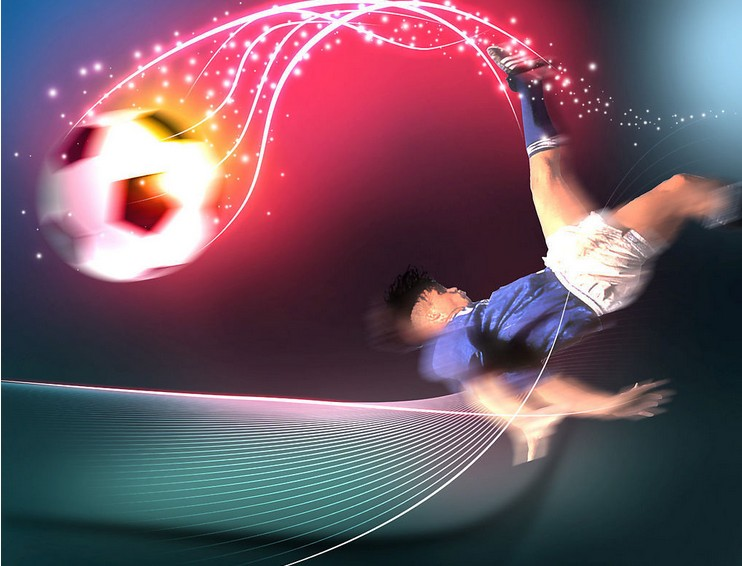

# ＜摇光＞也算个标题——也为足球而正名

**什么是美丽的足球？水银泻地的进攻就是美丽，铜墙铁壁的防守就不好看了吗？你去踢一场球试试，面对合理组织的进攻，如果你的防守有片刻的松懈，立马就可能被破门。你有什么理由说，进攻就是投入的，美丽的，认真的，纯粹的，而防守就是枯燥的，乏味的，肮脏的，功利的？难道你认为没有想象力的防守，可以遏制那些充满想象力的进攻么？**  

# 也算个标题——也为足球而正名

## 文/张苏樊（星联士官学院）

嘛，我不是个球迷。但是我看球，所以为足球正名这种事情，我也来喵一声。嘛，足球又不是球迷的足球。

**真性情=流氓？**

作为一只喵星人，我的人类身份潜伏在一所体育大学，这所学校有个武术学院，这个学院很多男生，他们有支足球队，他们很喜欢踢球，经常和其他学院、专业甚至校外的人联系着踢球。

但是呢，很多球队只跟他们踢一两次，之后就再也不应了。

如果换你，估计你也不会跟他们踢。当然，他们的足球热情当然是非常值得钦佩的，足球也是他们的朋友，我经常看见摔跤专业的一个外国交换生在操场上和同学们一起踢球，他有两米高，真的是虎背熊腰。你会觉得足球真美好，让不同种族、不同语言、不同文化、不同的人汇聚到一起，享受快乐。

啊咧，“汇聚到一起”没问题，“享受快乐”，要具体讨论了。

喏，如果一个高空球过来，你会选择用头顶或者胸部停或者干脆落地再接吧，但是武术学院的球员，会用“高压腿”从距离你头部或者胸部或者脚踝20公分的地方，直接截下。这其实没什么的，院联赛的时候，边裁比赛结束了还大赞对方动作漂亮舒展呢！

不过扫堂腿什么的招呼到你身上，那可真是敢怒不敢言，裁判连黄宝石战神卡都不敢给，而且他们会摆摆手笑着拉你起来，说：“没事儿吧？我没用劲啊。”

“我还没用力，你就倒下啦！”

如果你不小心踩了他、踢了他，他会告诉你如何克服地心引力，然后在地上滚个麦田圈出来，一脸痛苦让你都想跪地求主祈福。

倘若要是被他们领先，那可真是万幸，你可以稍微自在点儿踢踢；倘若要是搬平了比分甚至领先了他们，那比赛的70-80分钟就要小心了，这些可爱的真性情的孩子们，会各种问候你和裁判的娘亲、爹地，你可不要还口，更不要妄想用什么火箭头槌，你不是杰尼龟，也不是齐达内，更何况别人不是马特拉齐。

等的就是你还口！

啊咧，你问为什么最后十分钟不用提防？

因为你捱不到最后十分钟的，小可爱~

嘛，其实这种人很多的。就好像看见不爽的人不去骂一句、打一架，输了不掀盘子，就不是真性情；就好像如果别人给你使了个绊子，你不上去一脚爆头然后潇洒拿着红宝石战神卡怒踢水杯，就不是真性情；好像比赛里不把对方的腿拼断，不铲废一两个地球人，就不是真性情；好像自己约炮纪录不公布出来，就不是真性情；好像自己不告诉曾经上了多少少女，就不是真性情。

啊咧，别把无耻当可爱，别把流氓当个性。

帕萨雷拉有没有真的废过谁，我可没查过，但是倘若真的别人把他过了，就要追上去一脚端了别人饭碗，那真是比佩佩那一脚更让人风中凛冽了。你若非要把这个也当真性情，也无可厚非，你要非说这很可爱，那就散了吧。

你这一脚真性情，让人家儿子无比骄傲的球员老爹变成个残废，让人家老婆无比健硕的运动员老公变成个不能自理，真真是可爱啊！

巴洛特利确实有很多可爱的地方，因为他年龄确实也小很多，生活经历也特殊。但要是非把超速狂飙当可爱，就有点儿不可爱了。

超速？

会死人的喔！地球人只有一条命喔！豪车的救生系统很好的喔，一般被撞的人才会死喔！

拿飞镖从窗户里丢出去？好萌啊！好真性情啊！

醒醒吧！地球人。如果你没有安全感，就把安全帽戴上。

**真足球=简单粗暴？**

嘛，其实每个人喜欢什么样的足球，完全是个人自由嘛，无所谓的。

谁喜欢马尔蒂尼，谁喜欢帕萨雷拉，谁喜欢哈维，谁喜欢德容。这完全是个人的事情。但你不能说，那踢得直接快意的，就是足球，那踢得含蓄实用的，就不是足球，或者，不是什么纯粹的足球、美丽的足球。你喜欢高中生味道的少女，不能说人家成熟妩媚的女人就不是雌性地球人吧。

什么是美丽的足球？水银泻地的进攻就是美丽，铜墙铁壁的防守就不好看了吗？你去踢一场球试试，面对合理组织的进攻，如果你的防守有片刻的松懈，立马就可能被破门。你有什么理由说，进攻就是投入的，美丽的，认真的，纯粹的，而防守就是枯燥的，乏味的，肮脏的，功利的？

难道你认为没有想象力的防守，可以遏制那些充满想象力的进攻么？

什么是纯粹的足球？三比零领先以后换下主力，为下场联赛蓄积体力，这样就不纯粹了？为了最大程度上实现比赛利益，尽可能地做好防守，并在此基础上达到了许多一比零的胜利，这样就不纯粹了？就功利了？

为了奖杯就功利？为了最后的胜利就功利？为了不停地进球就不功利？

那你进球是为了啥。

足球要是不功利了，还踢什么踢，回家当纯粹的球迷吧。你小时候玩个弹珠还要争个胜吧，我没见过哪个孩子玩游戏输了精光还一脸幸福的，太没心没肺了。我小时候跟小伙伴在院子里踢野球都还为了赢对手把膝盖摔破无数次呢，你说说看，什么是纯粹的足球？

今年夏天博斯克把带着西班牙一路打到现在，被人称作控球型意大利，被当做“太老实太实在太合算的现代足球”的典型，被当做眼里只盘算如何拿奖杯的典型。

其实我特想知道的是，以前西班牙两翼齐飞，小组赛各种虐菜的时候，是不是冲着奖杯去的。打得漂亮是某种角度的程序正义，夺得奖杯则就是对应的结果正义，这两者之间并非绝对对立，但要想统一在一起很难。

打得漂亮拿不到杯子，你说人花拳绣腿；打得算计拿到杯子，你说人功利足球。这是你的自由，因为每个人喜欢的足球形式不同，对于大多数球迷来讲，比赛少点儿平局少点零比零当然要开心得多。

你当然可以喜欢大开大阖的打法，但你非要说人家保守的打法就不是纯粹的足球，就散了吧。

另外，有洁癖别看球，看心理医生。

 

（采编：何凌昊；责编：黄理罡）

 
