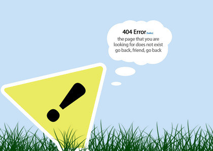
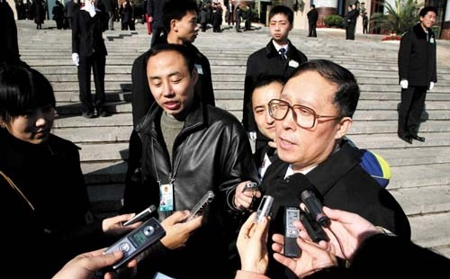

# ＜摇光＞也说说我在学校遭遇的“被”谈话：一篇校园新闻审查的台前幕后

**自我审查虽然表现形式各异，程度不同，而且说到底也是极端个体化的思量和体验。但在大陆新闻界，它的存在是绝对的，并不以个人意志为转移。个体面对自我审查时，只能够去克服它，而永远无法消除它。（所以类似于“是否存在个人审查”和“是否应该进行自我审查”的问题，根本上来说都只能是伪命题）**  

# 也说说我在学校遭遇的“被”谈话：

# 一篇校园新闻审查的台前幕后

## 文/苗硕（华南理工大学）

 

#### （一）

去年的这个时候，我在这个系列的第一篇文章里写到，“由于我过去两年半一直在校学生会从事校园报道的相关工作，所以遇到的几个麻烦在某种程度上可以说是职务性而不是个人性的。但毕竟这只是一份学生工作，针对职务或个人行为的批评教育并未被严格划分，并且在这些经历中，我也看到了其他学生个人利益收到损害的情况，所以我觉得有必要在这里做一个简单的记录，也算是一份对我过去两年有限抗争实验和一点点新闻实践的备忘。”

做过校媒或在大学期间接触过校园新闻的朋友可能都知道，除了少数学校的少数半独立或独立的编辑部以外，大多数隶属于党团委的校媒做出来的报道基本都是赞美好大全的宣传类文章，没有什么可读性。特别是在理工类院校中，由于缺少老牌的新闻学院的学生资源和知识背景这个必要的依托，且不说什么新闻自由与深度报道，连新闻基本的热点性和丰富的信息量都做不到，大量的报道沦为千篇一律的会议记录与活动记录，根本吸引不了其他学生的阅读兴趣。本来，校媒缺少专业性并不是什么大不了的事情，但他们的产品若都变成像所报道的活动那样鸡肋的文字流水账，变成党报机关报上那样乏味的文章，则令人难以原谅。究其原因，主要是团委组织僵化的宣传性指导，与校媒自身长期在这种指导下形成了固化的报道模式，而又鲜有学生记者个人能不落窠臼，尝试不同于宣传传统的新闻实践。

那时是大二下学期，我刚担任新闻部部长，雄心勃勃地想干出一番事业，改变学校的新闻报道生态。那段时间我四处宣传新闻理念，鼓励其他记者做同学关心、有可读性的报道。简单地讲，就是做大家喜闻乐见的新闻。

但是这样的改革很不容易，一是平淡的校园生活确实没有太多可以报道的事件，二是各学院各专业的大多数学生记者没有兴趣，也没有能力琢磨什么才是有价值的新闻。我只能从自己做起，指导我的记者做人物访谈不要问蠢问题的同时，挖空心思去寻找校园焦点。

能称得上焦点的事情意外地到来。开完第一次新闻系统会议回去的路上，电信学院的一位朋友和我的搭档（同来自电信学院）在讨论他们学院团委新出台的一项政策：为了提高本学院学生会举办的活动的参与人数，他们将学生参加活动的次数列入素质拓展考核，数量不达标的个人有可能被剥夺每年的奖学金评定资格。于是他们全学院的人都拿着“素拓卡”到处赶场盖章，生怕会缺席某次无趣的活动。整项政策显得滑稽而专制，也绝对可以达到“焦点”的程度。虽然我比较敏感，想到这篇新闻可能会惹一些无法预料的麻烦，但还是向他们提出我可以去采写这篇报道，发在校学生会网站的主页上。做新闻一向比较保守的搭档这次没有反对，于是我向他索要了素拓卡的照片，完成了这篇《谁动了我的评优资格？——一张素拓卡引发的争议》报道，又让我的一位记者写了篇评论，一起贴在了网站。之后我便号召部门成员在各Q群发布新闻链接，争取让更多的人读到它们。

在这篇报道为我们和整个事件挣得足够的关注度之前，我就接到了负责校学生会工作的团委A老师的电话。

电话接通后，他直接问：“苗硕，那篇新闻是怎么回事？”我说，“什么新闻？”心里咯噔咯噔响。

他说，“就是电信学院那篇，你赶紧给我撤下来！撤完给我回电话。”全然是教训的口吻。

挂掉电话我愣了半晌，这样的麻烦毕竟还是躲不掉。不情愿地登陆网站后台，撤下了这篇新闻和那篇评论，拨通A老师的电话，他让我第二天去办公室跟他面谈。

没想到之后又接到一位师姐——主管我们部门的学生会副主席的电话，我还未来得及说什么，她就开始劈头盖脸地训斥，责怪我事先不跟她说，擅自主张做这样冒进的报道，给我们都会带来很大的麻烦。我当然不以为然，同时也觉得她把团委老师的脸色看得过于严重。但对这位之前就熟识的师姐，我并不想惹她不快，便尽量安抚，约好次日和她一同去团委办公室。

第二天到了团委，A老师先问，那篇新闻怎么还没有删掉？我说，撤下来了啊。他说撤下来网页上是看不到，但是通过之前那个链接还是可以打开，你上后台把文章直接删掉，现在马上在我的电脑上删。

无奈我只能马上登陆后台抹去了那篇新闻。删完A老师开始语重心长地教育我，“你怎么能报道这样的新闻呢？”我不知道说什么好，便实话实说，“我就是试着报道一下。”没出问题最好，出问题了也没有办法，这后半句自然只是在心里想想。他又说，电信学院那边这次意见很大，你这文章里用词也不恰当，什么“流氓条款”，这样的说法非常难听。并且你听到的都是一面之辞，你也没有去问问学院老师那边的看法，报道不够客观。我心想，你没说我报道里有不实的地方我就满足了，若当初自报家门找了电信学院老师，这篇报道能不能出现还是未知数，我当然不会去找他们。末了，A老师讲了讲回去好好反思、下次注意之类的话，打发我们回去了。

出了办公室，师姐又开始数落我，说我怎么能在A老师面前说“试着报道一下”这样的话，太不合适，太不会说话了。我不由哑然失笑，从小到大还没被谁责备过不会说话，做一份学生工作而已，不至于还得掌握“和领导沟通的艺术”把？我的话能让某些人满意，或不能让某些人满意，又有什么关系？不免对师姐这个样子感到有些失望，但因为大家原是朋友，我仍不想和她争论，所以也没说什么。

回到宿舍试着点击之前留存的新闻链接，出现了熟悉的“该页无法显示”的界面。想到我也终于成了有作品直接被党毙掉的人，一种病态的满足感竟然盖过了此前的种种不快。

#### （二）

如果事情到这里结束，就能避免后来我本认为不应该发生的纠结和麻烦。

删掉网站上的新闻后我还是有点不甘心，于是在我的人人上发布了这篇报道，并号召朋友们助我传播。相较之前的学生会网站，人人上的评论提供给我许多反馈。一位建筑学院的辅导员也在文章下评论，留下自己的意见和建议。我觉得这样很好，且不说我认不认同那些评论，一个学生之间和师生之间交换意见的平台，或者说新闻作者与读者间直接交流的平台，以前确实不容易出现。

没想到过了几天，我又接到师姐的电话。她在那头愤怒地质问我人人上的文章是怎么回事，并责令我删掉它。这时我也忍不住了，跟她吵了起来，说你简直开玩笑，这是我的私人空间，我以私人的名义发布，跟学校和学生会官方没有一点关系，你这样的命令才是不恰当的。但她不管什么个人权利与官方身份的区分，一个劲地跟我说担心A老师看到后会不高兴，会给部门和她自己都带来不好的影响。简直与她无法沟通，我很愤怒，说大不了不干了，反正我们部门还有三个部长，缺了我也不是过不下去，气急挂了电话。

后来我冷静了一点，觉得就这样撂下未免有些不负责任，对部门一定会有影响不说，我自己也会失去继续经历与体验的机会。学生个体权利被官方侵犯的感觉很不好受，但最后我权衡一二，还是做出让步，删去了日志的内容，只留下标题和那些评论。

会发生这场争论，我真的感到很遗憾。因为我认为做学生工作没有必要完全按照上面的脸色行事，更没有必要在所谓上级没有觉察或制止之前，你为了避免各种麻烦，甚至因为担心自己那说不清，道不明的前途（学生干部能获得的利益远没有外界传言的那样多，有时间会另外详述），积极主动地干涉所管理学生的行事方法，甚至延伸到其私人生活。而这种现象不只这位师姐一个个例，而是普遍的状况。学生组织官僚化和这种官僚化对普通学生的异化，可见一斑，根本用不着长篇大论去描述。学校团委工作者保守和官僚的作风培养了一批官僚的学生干部，这些学生干部又倾向于维护现有体系，鼓励不越雷池的行为，提拔“听话”的学生工作者。这样恶性循环，竟慢慢无解。什么时候能结束这种循环，只能等什么时候党团委从学校消失，所以这变成了与什么时候能结束党的领导一样没有答案的问题。

#### （三）

我本来不知道具体A老师为什么要让我删掉新闻，简单地以为是他看到文章后觉得影响不好，不想让他管理的学生会工作出纰漏。但后来电信学院的朋友告诉我，原来是他们学院的党委某副书记看到了这篇报道，非常不高兴，于是致电校团委的头头B书记，拜托他问查一下这件事。B书记就找到下属A老师，让他负责处理这篇新闻。从另一个角度看，这倒挺像一次典型的地方政府应对危机报道的处理方式。

中国大陆的新闻界，各种形式的审查自然屡见不鲜，按形式又可以分为事前审查和事后追查两种。事后追查就是报道可以发出，若捅了篓子则追究你的责任，有时记者个人承担责任，有时是签版的编辑，有时领导也会扛下处罚。我这次显然属于事后追查这种情况。

事前审查又可以细分成多种形式。在内容呈交至审查员之前，就已经包括记者采稿时的自我审查，编辑做版时签版前对记者稿件内容的审查。而很多杂志、报纸都有上级党委派驻的审查员，或是出版集团为了避免子报惹出问题，返聘一些已退休的老编辑对某些子报进行审查，依靠他们对内容的政治敏感度守住最后一道关卡。我和师姐被团委老师批评后，师姐要我以后写类似的报道先给她过目，也算是要求一种事前审查的权力。

再来谈记者的自我审查。这件事发生后，在很长一段时间内，我在选题和追踪热点方面都小心了许多。有次学校便利店集体更换早餐面包的品牌，每个品种都有不同程度的涨价。我本想让我的记者去报道此事，但某次A老师在大家面前戏谑地谈论某些学生对面包涨价的意见之后，我便没有将这个选题贯彻下去。虽然我不情愿这样，但内心深处对未知麻烦的担忧和恐惧，很多时候会强迫我的新闻理想退居其次。

所以我深深感到自我审查是大陆媒体人心中无法根除的魔障，没有任何一位记者在触碰敏感话题时能够不被此影响。只要一位记者的报道出过一次麻烦，他将来在选题或写稿时不可能不担忧会再一次惹麻烦。若他的报道从来没出过事，只说明他从来没有停止过自我审查或从未触碰过敏感话题。若他声称自己没有受到自我审查这个过程的困扰，那就是自我审查的幽魂已经渗入骨髓，同他的工作方式融为一体，使自我审查变成近似生物性的本能而不是理性有意识的思考。若你看到一位记者三番五次闯禁区，报道屡揭黑幕，个人频受打压，那时因为他对自己内心的深重考量和旁人所不具备的勇气，而不意味着他从来不进行自我审查。

自我审查虽然表现形式各异，程度不同，而且说到底也是极端个体化的思量和体验。但在大陆新闻界，它的存在是绝对的，并不以个人意志为转移。个体面对自我审查时，只能够去克服它，而永远无法消除它。（所以类似于“是否存在个人审查”和“是否应该进行自我审查”的问题，根本上来说都只能是伪命题）

回想此事，我竟能在“简单、幼稚、无趣”的工科院校的校媒环境中，体验到如此具备中国特色的新闻生态。这些宝贵的经历和它们带给我的思考和感受，也算是我两年半的学生会生涯中，最重要的收获之一。

 

（采编：麦静；责编：麦静）

 
