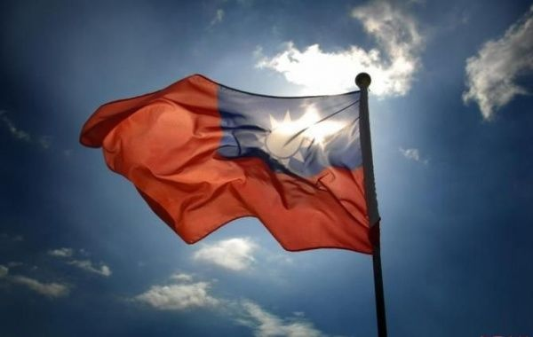
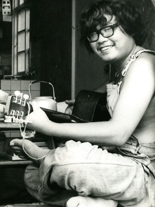
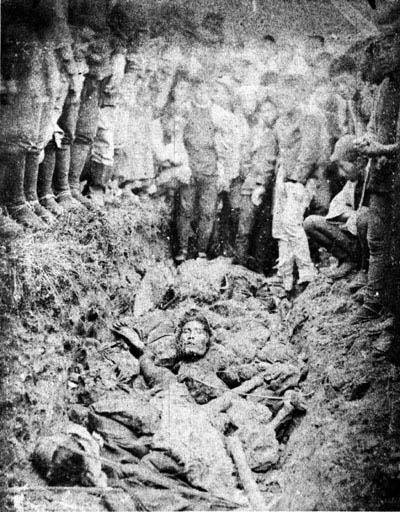

# ＜摇光＞亚细亚的孤儿，不如自己做主去

**你看胡德夫的演唱会上，三十年后与老人一起高歌“我的家乡美丽岛”的人中，有历经两易其主的耄耋长者，有成长于戡乱时代的花甲老翁，有亲历开放解禁的中年人，还有见证政党轮替的新新青年们，无论是外省人客家人原住民都是在油然地为他们自己的文化为自己的民族为自己的国家歌唱。这与海峡这边的这个老大帝国有半毛钱的关系？这里哪里是中华的一省啊，这明明就是斯土斯民的国家啊！**  

# 亚细亚的孤儿，不如自己做主去

## 文/王文嘉（北京化工大学）

 

一个伪果粉，很难不对台湾产生偏爱以上的正面情感。这是钟山风雨后仓皇南撤的国府的行在所在。台北的意义，在这大陆上有时会让人产生这是临安或者重庆的错觉。我漫步于山城和金陵的街头凭吊前朝的遗迹，我交游闽粤江浙的新朋谈笑“北迎王师”的段子。金门岛上的胡琏将军，在滩头潮尾迎接西北风送来大陆上革鼎的腥风血雨，创业维艰，台澎金马，不是民国，又是民国。这迁台的六十年里，我看到这二千三百万人在围堵和炮击里站稳了脚跟，守成百年辛亥的梦想，在中日美苏的角力里艰难成长为一个民主富强的国家。爱这里，同心同德贯彻始终，青天白日满地红。

一个假文人，若是对于远东的文化稍有兴趣的话，就一定会爱上台湾。朱天文龙应台席慕容齐邦媛叶嘉莹，我随手拈起今日读到的大家名讳，就为台湾的文人列出一个长长的名单。就是论器物的完美，我愿意举荐台北故宫和诚品书店对于我的神圣与庄重的意义。感动于美丽岛和野百合中那种在奋力抗争时仍不是冷静理智克制和忍让。何况，越是研读旧日的典籍，越是关注今天的世情，就会越发地对这礼义廉耻犹存，仁信勇义尚在的社会倾注一份热爱。赤毒不尽肆炎夏，海东犹有小中华。

可是当你真真地关注这个地方，完全抛弃先入为主的国共情节，无关这大岛周边的风云变换时，一个观察者，当他去试着了解这个东海上的岛屿的时候，我宁愿抛弃她瀛洲、台澎或台湾的名号，这些大陆史官记录下的名字毕竟太中华了，这大陆上的中华帝国的名字赋予这土地太多霸道了。窃以为最美好最贴切的名字无非就是400年前泰西水手的赞叹：福尔摩沙，我爱这名字“美丽岛”。

你重复播放李双泽的美丽岛，这首台湾人自己的歌曲时，那里面吟咏的是“水牛，稻米，香蕉，玉兰花”，那个高贵冷艳的世界上数一数二的天朝如何能有这么朴素的美好。你看胡德夫的演唱会上，三十年后与老人一起高歌“我的家乡美丽岛”的人中，有历经两易其主的耄耋长者，有成长于戡乱时代的花甲老翁，有亲历开放解禁的中年人，还有见证政党轮替的新新青年们，无论是外省人客家人原住民都是在油然地为他们自己的文化为自己的民族为自己的国家歌唱。这与海峡这边的这个老大帝国有半毛钱的关系？这里哪里是中华的一省啊，这明明就是斯土斯民的国家啊！

你揣摩异类这个词，是那样的熟悉。这岛上的岛民何其悲摧地被归为另类。曾经不见容于任何群体里的另类，才更熟识这令人颓唐的痛楚。我读吴浊流先生的小说，我读李总统的演说，才明了那个台湾人的伤痛。亚细亚的孤儿在风中哭泣的时候，可曾有人为你拭去眼角的泪珠？

你孤悬海外守着炎汉的最后一点血脉，你无援苦战抵抗吞并好苦好苦。你高祖曾祖父辈辛苦耕耘的辛劳付出，这岁赋亿兆的沃土，终究被视若敝屣弃如他土。那个我大清可以为安南输掉一支水师，可以为高丽葬送十年经营。吐蕃的荒原值得兴师动众劳民伤财，回疆的沙丘需要大军奔驰靡费巨多。唯有这化外之地海垂孤岛值不得耗费千里之外养心殿里的半点心思，割便割去，化外蛮荒之地，这才是中国对你的定位。他放弃你如此决绝，哪里视你为中国？

你钦慕教化甘愿成为皇民，内外一体日台同心奉献自己的富庶。那海上来者即便是要把这里建设为桃源乡聚乐第，也是从不是为你而作。你甘愿使用新主人的名讳和语言，你自愿和他们一起建设家乡，你把自己当做这个国家的一分子去为之浴血奋战，只待到东亚共荣的时候做一个获得认可的公民。可当日轮为星条摧毁的时候，你才发现他们只是把你视为可以下金蛋的母鸡，如果必要的话，杀鸡取卵有何不可？你们是台湾人，不是皇民。

你的命运，你想若是自己做主就能主宰自己的命运。可高鼻碧眼的西洋人又把你作为从东邻那里夺得的战利品“还送”给西邻。那就看他们先是把这里做成清国的台湾，一个税赋的来源，在这就把这里当成日本的台湾，作为反攻的基地。你们是谁？是中国人？可是大陆从不当你是一份子。是日本人？那么怎么解释对你的压制。那么你是台湾人？你看周围的两个国家同时把大棒砸来，台独分子。呵呵，每个人都想要你心爱的玩具，没有人想跟你玩平等的游戏。

你每一次斗争去获得的，都是原本就从你这里夺去的。你为什么要感恩于强盗给予的残羹冷炙，你为什么不去把自己的东西要回来？

我看到的福尔摩沙，就是如此。即便是困难重重危险多多都不能抵挡这理性的愤怒。他们把自己的东西要回去，把妄图回来的吸血恶魔驱逐走。这有什么错？

若是有人排斥你打击你欺压你打击你的话，你会怎么做？

你会恬着脸凑上去对他奴颜婢膝甘为犬马奔驰为奴为婢嚒？

他贪婪你的甜美肥沃的时候展露出的丑恶嘴脸你能够忍受么？

亚细亚的孤儿，你何去何从？

这样的孩子，又如何不疯？

那贪婪的魔手，请你回收！

 

（采编：应鹏华；责编：麦静）

 
