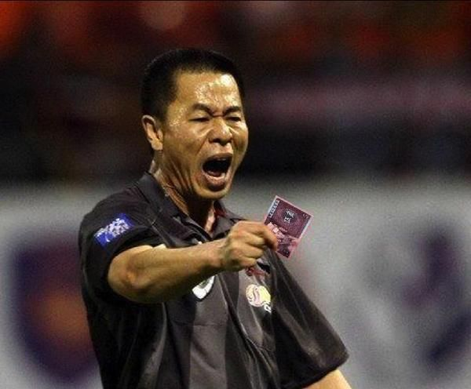
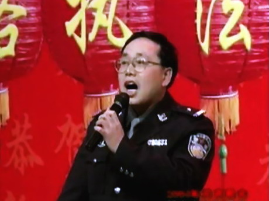
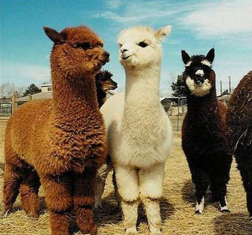
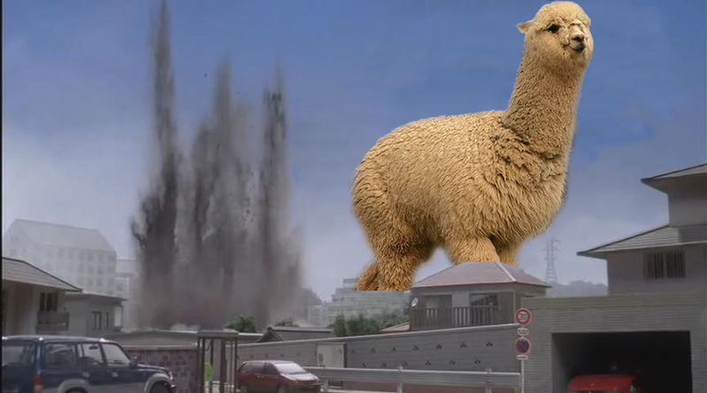

# ＜摇光＞人人政治动物

**支那虽然奉行看上去很美的集体主义制度，可绝大部分支那人骨子里彻彻底底是个自利主义者（这个就无需我多加解释了）。支那伪善的礼义廉耻如同褴褛衣裳，终归遮挡不住支那人丑陋的内心。自从有了自由主义这么一个避风港，加之极权中没有下限的不要脸，一帮子支那犬儒主义自私鬼纷纷褪去身上的破唐服换上劣质洋装摇身一变成了自由个人主义者，还妄称自私是种理智，不仅可笑，简直可恶！**  

# 人人政治动物

## 文 / 周诗霞（北京服装学院）

 

存在主义哲学家阿尔伯特·加缪（Albert Camus）曾说：人类是一种一生都在努力使自己确信自身的存在不是一种荒谬的动物。心理学家如此翻译：人们都会对自己的行为、信念和感受加以辩护。当人们去做某件事情的时候，只要有任何可能，都会尽力让自己（或者他人）相信所做的事情是合乎逻辑的、合理的。用我们平日里的大白话讲就是自欺、欺人、被人欺。

本文将立于此点对于从网上的政治控们略加分析，找茬者请自觉绕道。

 

#### 一、五毛

毫无疑问五毛是从网上最大的政治团体，同时五毛的种类也是多种多样，比较突出的有以下两种：

 **（一）男默女泪型五毛**

一般来说，男默女泪的童鞋跟政治的交集并不大，风花雪月是他们上校内的主要目的。这类人群以不学无术的无脑无知少女为主，在熏陶下她们沉浸于韩剧而流连忘返但并不影响她们茁壮成长，对于洗脑不以为耻反而感恩戴德，显著特点有：热爱长相俊美的周丞相，追捧面目慈祥的温奶奶。平日里，她们上人人传个人嘟嘴露腿露胸照和艹泥马们也相处得其乐融融，但是，一旦发现她们的偶像被艹尼玛攻击便母性大发露护犊之势，脑残言论层出不穷。

此类人最为单纯傻逼便于分析：一个见多识广的人是乐于了解一些相反的观点的。反之，一个见识不多不怎么看书的人则不太容易了解相反观点的存在，如果不谈相反的观点，那些见识不多的男默女泪党们是极易被说服的，一旦提出了相反的观点，则必然会引起他们的困惑甚至恼怒。

杰出人物徐小小则是典型中的典型，除了蠢之外，这类人倒是有一个很明显的优点：善良。

参照徐小小某天状态： 这个餐馆好贴心啊，老板的儿子看起来像个智障。看见我米饭快没了，菜还很多，主动问我要不我再给我加些米饭。。。感动死了。。。正纠结会吃不饱。。。

所以此类人注定是被人欺、自欺，智商不足欺骗不了别人。

**（二）体制内卢瑟五毛**

有位叫亚瑟·科恩（Arthur R. Corn)的社会学家曾做过一项实验：在一次学生骚乱之后（骚乱中纽黑文市警察做出了出格的反应，野蛮地对待学生），要求耶鲁大学的学生们写一篇短文对警察的行为表示强有力的支持，而这些学生强烈地认为警察的行为一直很恶劣。在撰写短文前，一组学生得到了十美元，另一组学生得到了五美元，还有一组得到了一美元，而第四组学生得到了五十美分。每个学生在短文完成后，都被要求表示各自对警察行为的态度。结果呈现明显的线性关系：获得的奖赏越少，学生们态度变化越大。即：得到可怜的五十美分的人对警察的行为最为赞同，而得到十美元的人，对警察的行为支持度最低。

以上行为在心理学中被称之为认知失调（cognitive dissonance）：一种紧张冲突的状态，无论何时只要某个人同时拥有心理上不一致的认知，如想法、态度、信念、意见，就会出现这种状态。

而这种现象则被称之为“讲过为真”：人们会开始相信自己的谎言，但只是在没有充分理由对那些与自己原有的观点进行辩护时才会如此。需要强调的是，假如一个人所表达的看法难以从外部加以辩护（没有足够的物质诱惑），这种人则会试图从内部进行辩护，努力使自己的态度与所表达的看法更加一致。

此类失调五毛常见为军校出身，或者在政府机构里当个上不了台面拿着微薄工资的小公务员。这个案例同时也解释了为什么在体制里当大官的都向往美帝且心照不宣地把孩子往国外送。

代表人物状态后，用拉尔夫·怀特（Ralph White）的一句话来概括就是：当行动与观念不一致时，人便倾向于按照行动来调整他们的观念。所以，状态后被打脸打到鼻青脸肿，死不悔改——一旦人陷入自我辩护的滑坡，就会越来越感到难以放弃自己的行为。简言之，被人欺兼自欺欺人到不能自拔。

GCD应该很为这种强有力的底层建筑感到自豪。

#### 二、草泥马

能与五毛党分庭抗礼的则是大名鼎鼎的草泥马军团。总体而言，草泥马的姿势水平完爆五毛党好几条街，但其良莠不齐的局面也不容忽视。以下言论只论现象，不针对个人。

 **（一）自我陶醉的草泥马**

草泥马相对于五毛党的优越感来源于草泥马相对于五毛党的“见多”（识广倒不完全谈得上），常见于他们套用先帝的名言：你们啊，图僧破，拿衣服！

他们自我陶醉式的自尊是不容侵犯的，一旦有人对他们提出质疑，他们便会强力反击，不管到底错没错，先给对方扣上五毛的帽子再说。所以，我们常常会看到草泥马内部互相打斗的场面——而且此类草泥马的攻击性也比常人强，少则状态互骂，重则檄文讨伐，好不热闹，堪称为校内一大奇观。

而这种自我陶醉式的高自尊，根本不是真实的高自尊，它是建立在不安全感上的脆弱的自我吹捧，一旦这种自尊受到批评，草泥马便会攻击批判者以尽力获得平衡并修复收到威胁的自我形象。

**（二）伪装成自由主义者的犬儒式草泥马**

有一类草泥马，看了点哈耶克，读了些奥威尔，知道点安·兰德，懂得人终究是自私的动物，便以自由主义里的个人主义者自称（鄙人自毙），对支那的集体主义制度深恶痛绝。

乍一看方佛参透世事，自私悲观冷漠，颇有二次元腹黑美少年风范，实则软弱无力，面目可憎。刘瑜在某篇文章提到有些人是理性的无知，我在这号人这儿倒是见识到了什么叫做无知的理性。

要知道，支那虽然奉行看上去很美的集体主义制度，可绝大部分支那人骨子里彻彻底底是个自利主义者（这个就无需我多加解释了）。支那伪善的礼义廉耻如同褴褛衣裳，终归遮挡不住支那人丑陋的内心。自从有了自由主义这么一个避风港，加之极权中没有下限的不要脸，一帮子支那犬儒主义自私鬼纷纷褪去身上的破唐服换上劣质洋装摇身一变成了自由个人主义者，还妄称自私是种理智，不仅可笑，简直可恶！

套用校内一位名叫王啸天同学的文章《其实施特劳斯相当不错的》里的例子：

譬如大家住在一个小区里面，它是自治的。政治学更愿意看到大家在一起很快乐，大家在花园里嬉戏游闹，下棋跳舞，某家有困难了，大家你一件我一件帮助他。而自由主义更愿意看到的是，我的家里会不会有人偷东西，是不是会有人唱歌打扰我睡眠，我付了物业费，只要某些地方不好了，我便会跑到物业质疑：“你们都干什么了，拿我的钱想吃白饭呀？”为什么政治学更看重奉献呢，假设有一个贫富差距比较大的小区，搞某个工程却平均凑不齐那么多钱，自由主义的有钱人交了一份子，剩下的他要财产权的保护，而另一个比较注重公共集体的有钱人，慷慨一声：“没事，剩下的钱我掏了。我有钱，应该的。”很多自由主义者会否认这种美德的存在：装什么逼，有钱显摆是吧。他们觉得人都是自私自利的。他想，这个人肯定有意图，是不是为了图个好名声以后好卖大家什么东西呢。 自由主义最烦的是人家跟它讲美德，有时觉得那是一种道德压迫，政治比较看重美德。政治不希望人们为了权利你争我吵，没完没了，而希望大家能够互相谦让，甚至在某时候忍让自己的权利来达到群体的和谐。

我不能说所有，但是大部分的自由个人主义右棍已然自私得令人发指了，他们非得把人互助互利的社会性需要当成是一种伪善，个人主义没学好倒是在唯我主义（我在此的唯我主义意为唯我独尊主义而非英文为Solipsism的哲学上的唯我主义）道路上越走越远。

有些人的思想还停留在不推行集体主义就一定要完全推行个人主义的水平上，要知道，世界上大多数事物和问题并非绝对白色或者绝对黑色的，还存在着相当多的灰色地带。自称为自由主义者却缺乏自由主义的精髓——质疑精神，那还谈什么自由主义！

毛姆的自传型小说《人生的枷锁》以及《月亮与六便士》里给出不少自由个人主义者的例子，典型的有诗人克朗肖和画家思特里克兰德，下面抄送一段克朗肖与《人生的枷锁》男主角菲利普的对话：

 克朗肖：“我只替自己说话，只有当我的活动受到别人限制时，我才感觉到他们的存在。就他们来说，每个人的周围，也就有一个世界在不停转动着。个人就其自身来说，也都是宇宙的中心。我个人的能力大小，划定了我对世人的权限范围。只要是在力所能及的范围内，我尽可以为所欲为。我们爱群居交际，所以才生活在社会之中，而社会是靠力，也就是靠武力和舆论力量来维系的。于是你面前就出现了以社会为一方，而以个人为另一方的阵势：双方都是致力于自我保存的有机体。彼此进行着力的较量。我孑然一身，只得接受社会现实。不过也谈不上过分勉强，因为我作为一个弱者，纳了税，就可换得社会的保护，免受强者的欺凌。不过我是迫于无奈才屈服于它的法律的。我不承认法律的正义性：我不懂得何谓正义，只知道什么是权利。譬如说：我生活在一个征兵制的国家里，我为获得警察的保护而纳了税，还在军队里服过兵役（这个军队必须使我的房屋田产免受侵犯），这样我就不再欠社会什么了。接下来，我就凭借自己的老谋深算来同社会的力量巧妙周旋。社会为了保全自身而制定了法律，如果我犯了法，社会就会把我投入监狱，甚至将我处死。它有力量这么做，所以也就拥有了这份权力。假如我犯了法，我甘愿接受国家的报复，但是我绝不会把这看作是对我的惩罚，也不会觉得自己真的犯了什么罪。社会用名誉、财富以及同胞们的褒奖作诱饵，想诱使我为它效劳，可是同胞们的褒奖，我不稀罕，名誉，我也不放在眼里。我虽无万贯家产，日子不也过得挺好。” 菲利普：“如果人人都像你这么想，社会岂不立即分崩离析了！” 克朗肖：“别人和我有何相干？我只关心我自己。反正人类中的大多数都是为了捞名获利才干事的，而他们干的事总会直接或间接地给我带来方便，我乐得坐享其成呢。” 菲利普：“我觉得你这么看问题，未免太自私了吧。” 克朗肖：“难道你以为世人做事竟有不出于利己动机的？” 菲利普：“是的。” 克朗肖：“我看不可能有。等你年事稍长，就会发现，要使世界成为一个尚可容忍的生活场所，首先得承认人类的自私是不可避免的。” 

其实画家诗人学术分子等作为个人主义者是不错的，因为只想着自己才能成事（典型的自私鬼），但是终其一生结局都不会好到哪里去，像克朗肖和思特里克兰德孑然一身，最后远离家乡死于病患（当然不能否认他们的成就）。但是，不是人人都能当上大学者诗人画家的。既然要民主，是要承认人是自私的，但是也要认识到，人除了自私还有仁爱等等特质存在。

《自由钟与美国精神》里有段话很到位：从社会角度讲，自由无法至上，因为它脱离不了社会对传统的“Virtue”的尊重，而“Virtue”的核心又是“Faith，Hope，Charity”。

提自由主义不得不说到两位俄罗斯作家：纳博科夫和安·兰德。他被称为自由主义反讽者，她则是上个世纪的美国引导思想革命的自由主义先知，二人都标榜自己为“美国公民”。为何？因为只有象征着“Faith，Hope，Charity”的美国足够宽厚去包容自由主义和自由主义者们。可如果人人都提倡个人主义，那还哪里来的“Faith，Hope，Charity”？

还有人说：自由意志主义的毛病在是人类自身的局限性造成的永久悖论所造成的。我不禁哑然，人类自身的局限性是个多么万能的句式啊，无政府主义、功利主义、共产主义都能往里装了！既然能看到人自身的局限性，那怎么不去看到任何一种主义都有其局限性呢？

话说得文雅点：你们这是贪爱新奇胜于追求真理。说得难听点不就是跟屎吃屁吗？

可想而知，大部分的自由主义草泥马也是意淫爱好者。

最后套用杨溪同学的一段话作为结尾：

列宁同志说过：聪明的唯心主义，比愚蠢的唯物主义，更接近聪明的唯物主义。所以主义是唬人的，聪明和笨才是区分人群的分界线。

 写于2011年8月22日晚  

（采编：黄理罡；责编：黄理罡）

 
