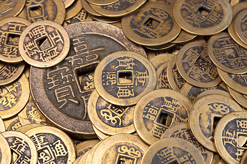

# ＜摇光＞人，历史

**伟大人物对历史的影响还是需要通过人民群众方能发挥作用，离开了群众他们再聪明能干也不过是孤家寡人，如果他们的想法，才华转化不了实践行动影响现实世界，伟人自己也会意难平。斯巴达克斯揭竿而起，后面需有奴隶弟兄们的拼死相应；马丁•路德•金说“我有一个梦想”，黑人兄弟们觉得自己也要一个梦想，于是有了美国那场轰轰烈烈的民权运动；天平天国的东王杨秀清接受采访时说，尽管和天王洪秀全早已同床异梦，可跟随洪秀全到底能实现自己的政治想法和生平抱负。说到底，伟大人物之所以伟大，正因为他能团结自己所能团结的力量，成为一种社会力量的代表。**  

# 人，历史

## 文/张明明（清华大学）

 

你问我历史是什么？

请给我一支笔：

历史是无情的娼妓，她冲你一笑，你却无论如何，捉摸她不透；

历史是冷漠的路人，他看见你，打个招呼停留片刻，然后走了；

历史是咆哮的怪兽，你穷追它不舍，却早已被它甩在了身后；

多年前，我会喜欢自己灵光一闪写下的这些个似是而非的漂亮句子。而此时此刻，我却更想把这些句子统统丢进垃圾桶：

去丫的，历史是她，他，它；

去丫的，文艺的忧伤的令人添堵的历史观；

去丫的，什么历史把握不住，捉摸不透；

阿基米德说：给我一个支点，我能撬起地球；

笛卡尔说：给我一个“我思”，我能推演出整个“我在”；

列宁说：给我一个革命家组织，我能翻转动整个俄国；

其实，给一个切入点，人也可以真正了解，把握，并影响历史的。

什么是人？等在忒拜城外悬崖峭壁上的斯芬克斯，吞食着过客，心中得意洋洋。直到有一天，年轻的俄狄浦斯猜中他的谜语，斯芬克斯羞愧万分，当场跳崖身亡。

人的历史之谜终于有了答案。

从此后，关于人的本质的争论闪亮登场了：

孟子认为人性善；荀子认为人性恶；王充和稀泥认为有善有恶；董仲舒来个量化分析，人性分三品：圣人中民与斗筲；休谟主张利己心是王道，霍布斯大呼人对人是狼，宅男康德说人的本质是理性，处女座的黑格尔很龟毛：人的本质是绝对精神的异化，好不好？费尔巴哈抽象出人的本质是理性、平等和爱；启蒙学者则高呼天赋人权自由平等博爱，可惜人人虽平等，但总有人比你更平等，自由平等博爱不过是上街喊个口号。

哲学清谈很过瘾，语言游戏真补脑，但现实终归是现实，它残酷诡变易躁恼。关于人的本质，还是马克思大爷讲得最好：

“人的本质并不是单个人所固有的抽象物，在其现实性上，是一切社会关系的总和。”

说白了性本善以及人性自私论根本站不住脚，脱离了人的社会关系和人的实践活动，妄图谈人性，永远很傻很天真，这样得出的人性结论也总是抽象，武断不走脑。要谈论人，请先明确目标：人是现实的个体的人。隔壁老王死抠门；对门大婶心肠好；七舅老爷活雷锋；居委会大妈八卦党；奴隶主也学习五讲四美气质好，但拥有的奴隶还是越多越好；地主不总是周扒皮，长工也不用总学鸡叫，但只要有了占有土地所有权，不劳动也可以站着收钱；资本家儒雅文质彬彬讲礼貌，但只要他开门做生意，就必须剥削剩余价值赚利润，挣得少就养养老婆孩子，挣得多再兼济天下搞搞慈善。尽管工人阶级中也不乏流氓无产者，但工人阶级不出卖劳动力商品可能连地沟油都买不起。我们每一个人都是社会的人，人在社会生产社会交往中，规定了自己的本质。

明白了人，我们才可以明白历史，人类历史的第一个前提就是有生命的个人的存在。尽管你我上了这么多年政治课，一句“人民群众是历史的创造者”早已朗朗上口耳熟能详，但这一简单命题的背后却是人类思想史多少风雨的冲刷时光的雕刻。时间回到中世纪，人不过是神卑微的奴仆，历史的主体看不到人；于是一场文艺复兴扫尽阴霾，独立完整有个性的人被凸显出来，人小心翼翼地成为历史第一主角，可那时的他们依旧左顾右盼心中惶惶然，保不齐第二天剧情就会发生改变。还好，他们坚强结实地走了下去，从此，历史的推动力量开始和人有关：尼采同学反理性地喜欢奥特曼，超人意志是历史发展的根本动因；弗洛伊德喜欢泛性主义，人类的性冲动才是支配人创造的内驱力，人类历史的本质是性欲的表现；社会学开山掌门之一的马克思•韦伯，认为人类进行政治活动的狂热来自于理性无法控制的一种“破坏内驱力”。众哲学家思想家的学说都能自圆其说，都能解释世界，但我还是最喜欢咱们马克思大爷。马大胡子再次犀利地一针见肉：

“历史的发源地不在天上的云雾中，而在尘世的粗糙的物质生产中。”

说白了，人类的物质生产活动推动了历史的不断向前发展。人是全部历史活动的承担者，历史通过人的物质实践活动存在发展着，考察历史不要再从人性、理性、人道主义出发，而是着眼于现实的物质生产生活条件。

当然，总有人对“英雄史观”执迷不悟，这种观点的确那么地深入人心，连梁启超都感叹“历史者英雄之舞台也，舍英雄几无历史”。英雄们总是在历史惊心动魄的一刹那要么推波助澜要么力挽狂澜，他们翻手为云覆手为雨，貌似历史总被他们玩弄于鼓掌之中，其实不然。偶然性总是为必然性开辟道路，英雄的出现当然是一种偶然，但英雄之为英雄则是历史的必然。伟大人物之所以伟大是一个时代的需要，是社会条件的必然产物，历史的必然性总是通过某个具体英雄的偶然性表现出来。拿破仑这个科西嘉矮个子，因为赶上了法国大革命的狂热浪潮，因为法兰西共和国被战争折磨地筋疲力尽，于是赶上历史的好时光成为一个强硬的帝国军事独裁者。不然，他也只不过能凭借军事才华早点混个军衔成为波拿巴将军；毛泽东要是生在今天保不齐也就混个北大成考班，闲时上人人网骂个娘，泡豆瓣写两首豪迈诗，自嘲为湘潭屌丝。英雄们总是一个时代的英雄。尽管英雄豪杰、帝王将相、天才伟人拥有普通人所不能企及的魄力、意志、品格、智商，尽管他们看起来总是龙章凤姿飒爽英姿地骑在马背上驰骋全世界，俾倪万物，但历史进程的持久和伟大并非来源于他们短暂的才华爆发和转瞬即逝的火花，历史活动的显赫一时却恰恰来源于经济条件和社会制度的缓慢运动。

另外，伟大人物对历史的影响还是需要通过人民群众方能发挥作用，离开了群众他们再聪明能干也不过是孤家寡人，如果他们的想法，才华转化不了实践行动影响现实世界，伟人自己也会意难平。斯巴达克斯揭竿而起，后面需有奴隶弟兄们的拼死相应；马丁•路德•金说：“我有一个梦想”，黑人兄弟们觉得自己也要一个梦想，于是有了美国那场轰轰烈烈的民权运动；天平天国的东王杨秀清接受采访时说，尽管和天王洪秀全早已同床异梦，可跟随洪秀全到底能实现自己的政治想法和生平抱负。说到底，伟大人物之所以伟大，正因为他能团结自己所能团结的力量，成为一种社会力量的代表。

当然，有人会提问：“既然你刚才说历史现象是必然，那我的活动还有什么意义？我于历史又有何用？我做不做事都无关紧要，反正历史都要按照它的既定轨道运行了呗”。好问题！因为这个问题正是我写这篇文章的良苦用心：人与历史到底是个啥子关系？

有人削尖脑袋想当英雄，每天看名人传记，似乎粘贴复制下英雄的路线自己就是英雄；

有人对历史不感冒，做好自己最重要，于是手捧一本《成功学》，幻想着下一刻会发财致富妹纸回眸笑；

有人懂历史，知现实，可就是无动于衷，每天想着怎么在知网上发个水文，早点混毕业评个职称；

第一种人如路易•波拿巴，趾高气扬地整天就觉得自个就是拿破仑•波拿巴的继承人，于是他模仿拿破仑，东施效颦，结果演出了一场历史的闹剧，自己被嗤笑为历史的小丑；

第二种人在社会中占大多数，他们不关心历史，厌倦政治，他们是历史虚无主义者，管它东风西风，管它白猫黑猫加菲猫，我只要能干强大，房子车子票子妹子早晚会到手；不料一场经济危机一场社会变动，一切化为乌有，他们总是任随意历史偶然性摆布；

第三种人恰似我，每天泡图书馆，自以为真理在握，殊不知懂真理，无行动，再多的理论也无用；

那人在历史面前怎么办呢？列宁大叔在懂理论，剖析现实后发了个日志叫《怎么办？》。就是告诉人们人在历史中该怎么办。人在历史规律面前不是无能无力的，人可以利用历史规律达到自己的目的。一个人总是单枪匹马，一群人才会力量强大，一个人只有认清自己的历史地位，联系自己的集团力量，形成一股具有统一意志，统一行动的力量流，才能在历史中发出自己的声音，改变历史的走向。群众——阶级（集团）——政党——领袖，在这每一层递进中，人们的意愿和想法在历史中得到表达。直白地说，就是单个人要在历史中找到自己的阶级归属，形成集团力量，集团的代表是政党，每个政党又有自己的领袖，当政党的主张得以实施，单个人的意愿才可以表达出来。

君不见，法国大革命浩浩荡荡，资产阶级领导人民群众斗地主：君主立宪派、吉伦特派、雅各宾派等各方力量集团你方唱罢我登场，尽管现象乱花渐欲迷人眼，但其本质不过是大资产阶级、工商业资产阶级、中小资产阶级为了自己的利益上演的角逐和博弈，最后，还是拿破仑同志悟出了门道，他发动了法国的农民阶级，制定《拿破仑法典》为农民分得的土地给予法律保障，农民爱戴拿破仑，拿破仑最终胜出，建立了历史上牛逼哄哄的法兰西第一帝国。放眼今天的中国，房地产商，城市中小业主，普通白领，农民工……，每个集团有自己的利益要求，有人希望房价高，就有人希望房价低，有人反对私有化，就有人支持私有化，每个人不同观点的背后，其实更多的都是自己的利益要求，你想实现自己的要求，就必须找到自己的组织，发出自己的声音，通过一个集团的政治参与去影响一条政策路线的制定和实施。只有这样，个人才与历史完美地融为一体。

最后，关于人与历史，马克思说：

人既是历史的剧中人，又是历史的剧作者，历史不过是追求着自己目的的人的活动而已；

好基友恩格斯补充道：无数个单个人意志的相互冲突，无数分散力量的相互交错，形成无数个力的平行四边形，产生出历史最后的合力。

 

（采编：何凌昊；责编：麦静）

 
