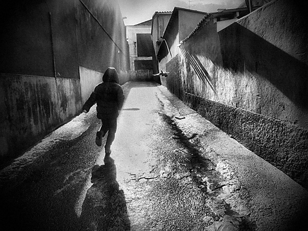
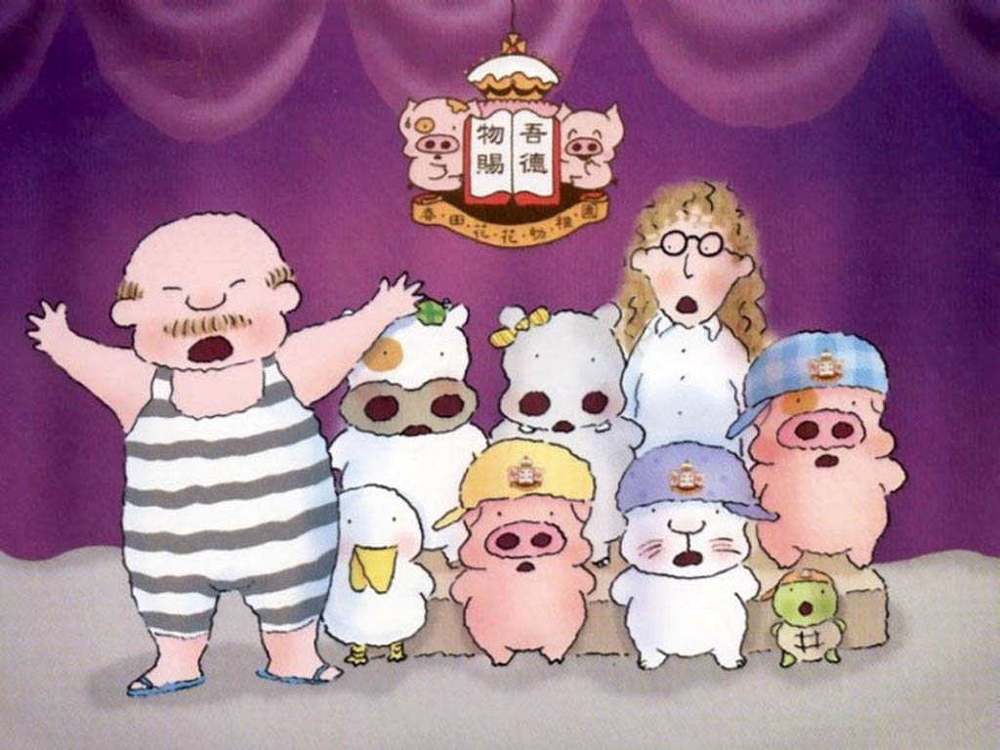

# ＜摇光＞人，生而好赌

**人一生当中路口太多，每步都是一场赌博；路从来不能回头，记忆也从不能磨灭。无论是服从；还是问“为什么”，都是赌 —— 全盘托赖信祖宗是赌；孤僻自傲信自己是赌，一赌，赌一生。**

### 

### 

# 人，生而好赌

## 文/一笑(University of St Andrews)

### 

小时候顽皮，不爱听话。每次被父母叫去做些什么，无论是洗澡，喝汤还是写作业，都喜欢问为什么。记得一次是哪个客人来了，父亲叫我回房间看书还是什么，我非但不知趣，还一往直前的问“为什么为什么？”。当时父亲把我拉到一边，说：“我叫你去做的事情，你必须先去做，做完再问理由！” 

### 

### 

这事也让我纠结了很多年，到底为什么父母叫你去做的事情，就要去做，若是问为什么，倒会显得是自己“不成熟”。 后来翻过几本最原始的所谓文学巨著，什么荷马史诗到埃涅伊德；讲的阿喀琉斯怎么惨死，奥德赛怎么逛荡十年才会得了家，埃涅伊德怎么千辛万苦才建成罗马。 回头看来，里面竟都有一个盲的还是瘸的老人角色，苦口婆心告诉主人公：如果你这样这样那肯定会悲剧，结果他傻傻的还是这样这样做，结果不就悲剧了，千篇一律，如出一辙 —— 仿佛命运从不显有情无情，一切只因人类的愚蠢和迟钝，化身沙滩上的水母，再倔强的挣扎也百无一用，辛苦缔造出五花八门的惨案。 每每讲到如今盲了瘸了的“中国传统智慧”，人们的潜意识里便似乎无时不萦绕着瞻仰，憧憬和些许自卑 —— “书中自有黄金屋，书中自有颜如玉”，圣贤古书里自有深不可测的道理，有车有房有美女，暗藏在那里，你不懂，找不到，是你无知；你悲剧，是你没读好书，没听进去古圣的教导。 又如我们小学要临帖，写毛笔字。帖子上的是满分标准答案，是圆满。我们该做的，是力求能接近那个高度，达不到顶，若能到个珠峰大本营，也都可以一览众山小了。 这个中的道理尽是不可说不可说，自然也没有问“为什么”的余地。如那句阴魂不散的“熟读唐诗三百首，不会吟诗也会偷”。小生不才，到现在也熟读不出三五首，心生懒惰，好求捷径，总爱问“什么叫偷诗”、“怎么才能偷诗”。而每次人们都神神秘秘的回答，“喏，等你熟读过了三百首，不就懂了？” 于是这两千多年来，市面上浮现出很多类似的教条，诸如“孝敬父母”、“百善孝为先”云云，以致今天诸如脑白金还是新盖中盖云云的能有如此之大的市场。 倘若谁敢问“哎，咱为什么要孝顺父母？”……话说不完就是一句威力十足的“你个不肖子！”，或是麦兜妈妈的“不孝啊你！”，瞬间便有如泰山压顶，压得你不敢喊顶，顶得你就像被塑料袋罩头了一样，再没有反驳之言。 

### 

### 

### 

那些许许多多老祖宗的教训……如那残破的帖碑一般，似乎阴雨中古有一个大同，千年后我们颓废堕落，弃祖忘宗，操守尽散，实已沦为藏污纳垢的一口大桶。 于是这负罪感在当今乱世，鼓吹了不少人去或是背诵执行那《弟子规》，抑或将那《易经》往什么商场金融上套。多少像是孩子去喝汤写作业，期望得到父母嘉许时的心态。叫好的人捧着“浪子回头”的金牌，不叫好的人也被冠上“逆世代”的名号，或是直接被一个“愧对祖宗”的匾额一面拍倒。 问题问得太多会被叫作问题青年。那么好，姑且算祖宗的教条都是确凿无误的。姑且算孝子都能升大官发大财，桃花菊花朵朵开。姑且算卜卦求签面相手相又都能预示未来，揭露前程。 可就算是这样，对一般人而言，《易经》乃至《弟子规》作为非开源软件，我们无法知晓为什么古圣先贤会那样训导后世，只好一味接受，没什么思索可加。 细细想来，除非文王还是伏羲以至夫子能发个慈悲，给世人托托梦，不然我们也不过像一群山间野人找到部gameboy一样，就算贴了膜配了套，等到哪时电池一旦用完，势必要变得连顽石不如。 因为世间偏见被模制，因为价值观念被洗脑，因为要塑造形象，塑造有原则有道德有传承有文化的形象，而去遵守古圣教导的人；和在参透了圣贤书后，如被古哲托过梦，在做每一个行为时真正明瞭“为的什么”而去做的人；就有如机器程序和造物主之间的区别 —— 愚私以为，若能明白祖宗为何说出那样的道理，便无需再苦苦追问“为什么”，兴许就能立于一切造物主的尽善之巅，自然随心所欲，不逾矩。 可惜人生从来就是成王败寇的事。祖宗很忙，没空托梦，也就无证可查。最后“圣贤”的帽子在世人手里，谁终究升大官发大财了才有人们把这名堂冠给谁。兴许如求神拜佛般孝孝父母、祭祭祖坟、背背古诗那正正就是捷径，自作聪明的也不过庸人自扰。 人一生当中路口太多，每步都是一场赌博；路从来不能回头，记忆也从不能磨灭。无论是服从；还是问“为什么”，都是赌 —— 全盘托赖信祖宗是赌；孤僻自傲信自己是赌，一赌，赌一生。 

### 

 俺也好赌，赌过迷信，迷信这个世界的浪漫，迷信这个世界真有童话里的原则，有美好的主宰。只不过吃狗屎了。注意俺没摔过，没摔过狗吃屎。只是现实中大风刮来一坨狗屎糊我脸上，我失惊失措，吸口凉气时不小心吃到一点点了而已。 但话说狗屎不坏，传说狗屎能驱鬼。 人也只有狗屎过了，那些腐烂在那条叫无知的水沟里的尸蜕，才能够化为滩滩血水，在野兽般的阳光里向上升腾……而终化成天上耀眼的白云。 所以俺说别怕赌，赌输了没什么。自称齐天大圣那孙猴子，其实就算赌自己一个筋斗云实飞不出佛祖手心，最后也会被压在五指山下。 却皆因他硬赌赌输了，才能有气魄在山底莞尔独笑五百年，念着“兴许哪天有没有个狗屁道士或者秃头和尚经过，俺老孙，也算有个好故事给人家讲！” 

### 

### 

（采编自北斗投稿邮箱 责编：陈锴）

### 

### 
