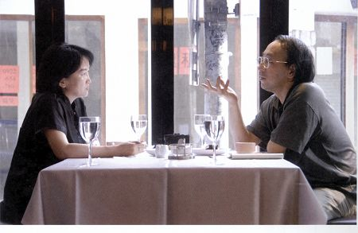

# ＜摇光＞从唐诺说起

**在看小说的时候，我们不常怀有这种期待吗？这种细软如丝般的不安是我着迷之处，我要的是精确的细节描写，不炫耀任何技巧地平易近人，来吧来吧，进来做客，给你端好椅子，放好饭菜，给你扇风，你开始觉得很舒服，很享受，可是越到后面心里不安就在累积，也没有什么明显的征兆，你犹疑地左顾右盼，一切安好，此时有一种轻微地似乎听得到又听不到的笑声在不知方位的所在响起。这个时候，你再也出不了那个门了。这种微妙的感觉难以捕捉，我只能等待，怀着像是唐诺说的“在时间里某种不懈的、追究的、心里始终有事的态度”。**  

# 从唐诺说起

## 文/邓安庆(写字者兼编书者）

 

几天前在INK杂志上看了其中唐诺的一篇《小说家》，他说道：“年轻小说书写者难能一步登天的，是足够的经验材料，这需要多一点时间，以及在时间里某种不懈的、追究的、心里始终有事的态度，由此一点一点获取对世界、对生命本身的丰硕解读能力。这当然是小说书写里比较苦、比较无聊而且最缓慢不耐的部分，日复一日，光采尽去；也往往是小说书写里最悲伤，最容易瓦解年轻书写心志和信念、不断发生自我怀疑的所在。”

我几乎要抱着唐诺高喊：就是这样的！就是这样的！从我自己来讲，曾经有一段时间是幸福的，整个儿人像是章鱼一般伸出无数触角，随时都能从身处其中的时空中攫取到写作的灵感。走在我前面的小孩子，刚理完发，他低头踢着路边的石子；风从杨树林那边穿过来，抚在脸上，带着运河的水腥味；修车铺的师傅早早地坐在马路牙边，在他身边是黑色胶桶，里面盛满了水……大脑会像是充满了电，被这些日常生活的细节促动，文字一个个在心中啪嗒啪嗒地出来，怎么表达都是力量充盈的。那段时间，就是写东西的高峰期，每天都沉浸在创作的兴奋之中，仿佛是神在助你，借着你的手在书写，根本不用担心枯竭的时候。

往往就是这样，一段创作的高峰期后就是长长的一段一个字都写不出来的低潮，大脑中盘旋着我要写我要写的欲念，就好像是一个石磨在转着，然而磨子下面没有可供碾磨的食粮，只有空空刺耳的石面碰撞声。无力的沮丧感，简直是连废话都写不出来。脑中堵塞钝化，我要说，我要写，我要表达，然而那位神粗暴地把我手中的笔给夺走了，我连说话的能力都没有。

小说灵感的“可遇不可求”，是常听人听到的论点。不排除灵感的大驾光临，然而如果它真来了，你慌手慌脚地找各种能记录下来的东西，它往往悠忽而过，只留下片言残痕。这真可谓是需要有一种对于写作生长点的捕捉能力，即一个小说写作人能够有一种能力去在日常浩瀚散漫的细节中捕捉到可以生发成长的小说来。这取决很多因素，比如生活经验阅历、写作技法、情感等，这都需要平日的积累。如果你是创作的，你会特别能理解唐诺说的“在时间里某种不懈的、追究的、心里始终有事的态度”，“心里始终有事”非常到位的说出一个立志于写小说人的日常状态，他在生活中又跳了出来，他在捕捉这种你说的“可遇不可求”，机缘与日常积累都不可少。

这里又碰到一个问题，常常跟朋友说到的，大家都在把自己的那点生活阅历反反复复地写，从童年时期开始追溯，一直到现在，所有的能想到的，能变异的，能组合的，都穷尽了能做到的可能性，然而好比是自身的矿产，终于一天在不断的书写中给挖干净了，接下来该如何前行？经验写作的困境也许就在这里吧。曾经碰到的情况是，我很兴奋找了写作的点，开始去写，却突然发现越来同样的想法、同样的事情我早就在某一年写过。

那好吧，那不要以“我”为中心，去搜刮外界的，像是一个人拎着蛇皮袋去路边拾捡丢弃垃圾一样，眼睛放光，大脑处于警备状态。跟朋友一起出去玩，也是有点神经质，朋友随口一句话，仿佛是一个开关一样，啪的一下打中了心中一个点，那点哗啦哗啦生长成一种情绪，一种氛围，甚至是一段完整的故事。接下来的几天，就一直会放不下这个，在反复琢磨，怎么我才能一个点儿发展出一个功能齐备的小说来呢？

起初看到的小说，一般都不喜欢写太正常的人，而是要去写一些边缘化的人，不正常的人。因为在这些人的身上才会有故事。以前我写过一段话：小说家要想他们笔下的人物活生生的站在你面前，就必须让他真实的内心世界袒露在你的面前才行。什么时候，人物的真实一面才会展现出来呢？什么时候，人物的内心世界才最大程度的打开呢？在我们每天的正常生活中，不可能，因为大家都戴着面罩，都在正常的扮演着各自社会赋予的角色，有各种道德法律纪律约束着你在正常的规定生活。你发现每个人的生活都差不多，上课学习，上班工作，都是平淡乏味的。你不可能一下子对一个陌生人知根知底的了解。因为大家太正常了。可是小说家就是要发现在这个正常的地壳下面你的内心世界是什么样子的，去倾听你内心里的声音。

可是我越来越发现日常生活的所谓的日常人生，更有意思。在这日常生活中我总觉得有隐隐的不安。这不安像是一条细细的裂缝，在生活光滑的质地上分外触目。好比是端上一碗热腾腾的米饭放在你面前，你却总觉得吃的不踏实，要么是这米饭散发出来的不是米香，却是肉香；或者是端饭的人那一抹轻俏的微笑，让你惴惴不安。总要发生点什么吧。在看小说的时候，我们不常怀有这种期待吗？这种细软如丝般的不安是我着迷之处，我要的是精确的细节描写，不炫耀任何技巧地平易近人，来吧来吧，进来做客，给你端好椅子，放好饭菜，给你扇风，你开始觉得很舒服，很享受，可是越到后面心里不安就在累积，也没有什么明显的征兆，你犹疑地左顾右盼，一切安好，此时有一种轻微地似乎听得到又听不到的笑声在不知方位的所在响起。这个时候，你再也出不了那个门了。这种微妙的感觉难以捕捉，我只能等待，怀着像是唐诺说的“在时间里某种不懈的、追究的、心里始终有事的态度”。

（2012.8.20）

 原文链接：http://www.douban.com/note/232124106/  

（采编：佛冉，责编：佛冉）

 
